elf~~~ Group 技术丛书


# 阿里巴巴数据接7lt 厦严昂部

定位于阿里集团数据中台,为阿里生态内外的业 用户 中小企业提供全链蹈 全渠道的数据 服务 作为阿里大数据战略的核心践行者 致力

经过多年的实践,数据技术及产晶部已经构建了 从底层的数据采集、数据处理,到挖掘算法 数据体系 通过这个体系,超过EB级别的海量数 据能够高效融合,并以秒级的晌应速度 服务并驱 动阿里巴巴自身的业务和外部干万用户的发展

现在 阿里巴巴数据技术及产吕部正通过技术和 产晶上的创新,探索全域数据的价值,将阿里在 大数据上沉淀的能力对外分享,为各行各业的发 展带来更多可能性


El ~~:~~ Group 技术丛书

# 阿里巴巴大数据实践

II 阿里巴巴数据技术及产晶部着 II

穹手工营出版社· Publishing House of Electronics Industry •BEIJING

在阿里巴巴集团内,数据人员面临的现实情况是:集团数据存储已经达到 EB 级别,部分单 张表每天的数据记录数高达儿千亿条;在 <sup>20</sup> 年"双 购物狂欢节"的 <sup>24</sup> 小时中,支付金额达 到了 亿元人民币,支付峰值高达 万笔/秒,下单峰值达 17.5 万笔/秒,媒体直播大屏处理 的总数据量高达百亿级别且所有数据都需要做到实时、准确地对外披露 巨大的信息量给数据 采集、存{谐和计算都带来了极大的挑战

《大数据之路一一阿里巴巴大数据实践》就是在此背景下完成的 本书中讲到的阿里巴巴大数 据系统架构,就是为了满足不断变化的业务市求,同时实现系统的高度扩展性、灵活性以及数据 展现的高性能而设计的。

本书由阿里巴巴数据技术及产品部组织并完成写作,是阿里巴巴分享对大数据的认知,与生 态伙伴共创数据智能的重要基石。相信本书中的实践和思考对同行会有很欠的启发和借鉴意义

本书著作权归淘宝(中国〉软件有限公司所有,未经许可,不得以任何方式复制成抄袭本书之部

大数据之路 阿里巴巴大数据实践 阿里巴巴数据技术及产品部著.一北京:电子 业出版社, 20 17.7

ISBN 978-7-1 2 1-3 1438-4

l ①大 II. ①阿 Ill. ①企业管理一数据管理 N. ( F272.7

中国版本图书馆 IP 数据核字( <sup>20</sup> )第 <sup>094934</sup>

策划 编辑:张彦红

- 刷: 河市双峰印刷装订有限公司
- 订: 河市双峰印刷装订有限公司
- 出版发行:电子工业出版社

北京市海淀区万寿路 <sup>73</sup> 信箱 邮编: <sup>100036</sup>

本: <sup>720</sup> <sup>000</sup> 1116 印张: 字数: <sup>338</sup>

- 次: <sup>20</sup> 月第
- 次: <sup>2017</sup> 月第 次印刷
- 印数: <sup>4000</sup> 册定价: 79.00

凡所购买电子工业出版社图书有缺损问题,请向购买书店调换 tf 书店倍缺,请与本社发行 自节联系,联系及邮购电话: <0 88254888, 88258888 .

质盘投诉诸发邮件至 lt s@ph ei.com.c ,资版侵权举报请发邮件至 dbqq ei.com.cn 本书咨询联系方式: (0 I 0) 51260888-819, faq@phei.com.cn .

# 本书编委会

编委会主任: 朋新宇

王赛、王永伟

编委会成员 排名不分先后

罗金鹏、王静、王赛、王永伟、张磊、赵唯行

本书内容撰写人员 排名不分先后

> 总体架构 王俊华、王永伟 日志来集:李涛、殷霞 数据同步 陈永俊、王俊华 离线数据开发 陈永俊、王永伟 实时技术 黄晓锋 数据服务 方建江、郭才样、江岚、徐锐 数据挖掘 何罩、王鹏、王中要、徐萧萧、应倩岚、 郑苏杭

大数据领域建模综述 王赛 阿里巴巴数据整合及管理体系 张子良、王永伟 维度设计 王永伟

事实表设计 陈永俊、方彬、王永伟、张子良 元数据 魏海、王永伟 计算管理 陈中强、贾元乔、孔令娟、袁杰 存储和成本管理:潘曼、王伟 数据质量 方彬 数据应用 肖美丽、郑育杰

特别感谢 排名不分先后

陈同杰、邓中华、丁燕、何露莎 黄荣、金高平 、李炉阳、刘健男、林鸣晖、李启平、邱坤东、 梅婿婷、孙伟光、苏艳、王政、王子凌、向师富 姚滨晖、杨红霞、张启、张伟、阮城锋、谢丹丹 商渭清 裴逸钧、罗鸣、王鹏、冯敏敏、曾文秋 对本书出版工作的支持!

大数据是什么?在过去的 年里,恐怕没有另外一个词比大数据更 高频:也没有另外一个概念如大数据 样,被纷繁解读,著书立说。有 趣的是,作为距离大数据最近的公司之一一一尽管我们的初心或许和大 数据没有直接关系一一在关于大数据的理论和概念的争论中,阿里巴巴 却鲜有高谈阔论。

因为自知而敬畏,因为敬畏而谦逊。甚至在大数据这个概念出现很 之前,阿里巴巴就不得不直面、认知、探索,并架构和大数据有关的 切。数据作为 个生态级的平台企业最直接的沉淀,亦是最基本的再 生产资料。如果没有基于大数据的人工智能的应用,淘宝根本不可能面 对每天亿级的用户访问数量。因此,仅仅因为本能,阿里巴巴一开始就 自然生长在这样一个数据的黑洞中,并且被越来越多、越来越密集的数 据风暴裹挟。阿里巴巴在大数据方面所做的各种艰苦努力,其实就是力 图对抗这种无序和复杂的情增,从中梳理结构,提炼价值。

这是 个历经磨炼、也卓有成效的长期过程。如书中所提到的,阿 里巴巴不仅数据量超宇宙级,而且更是因为业务场景的复杂和多元化, 其面对着甚至超过 Google 的更复杂的难题。大部分时候, 阿里巴巴都是在无人区艰难跋涉。每 组功能和逻辑,每-套架构与系 统,都与业务和场景息息相关。这个黑洞膨胀之快,以至于大部分时候 都是在出现痛点从而剌激了架构升级。换言之,大数据系统一一如果我 们非要用一个系统去描述的话一一其复杂度之高,是几乎不可能在一开 始就完整和完美地进行自上而下定义和设计的。从需求→设计→迭代→

升华为理论,在无数次的迭代进化中,我们对大数据的理解才逐渐成形, 慢慢能够在将数据黑洞为我所用的抗争中扳回一局。

这个系统生长和进化的过程实际上已经暗暗揭示了阿里巴巴对大 数据真髓的理解。大、快、多样性只是表象,大数据的真正价值在于生 命性和生态性。阿里巴巴称之为"活数据"。活数据是全本记录、实时 驱动决策和迭代,其价值是随着使用场景和方式动态变化的 。简单地把 数据定义为正/负资产都太简单。数据也不是会枯竭的能源。数据可以 被重复使用,并在使用中升值;数据与数据链接可能会像核反应 样产 生价值的聚变。数据使用和数据聚变又产生新的数据。活数据的基础设 施就需要来承载、管理和促进这个生态体的最大价值实现(以及相应的 成本最小化)。丰富的数据形式、多样化的参与角色和动机,以及迥异 的计算场景都使得这个系统的复杂度无限升级。阿里巴巴的大数据之路 就是在深刻理解这种复杂性的基础上,摸索到了 些重要的秩序和原 理,并通过技术架构来验证和劳实。

如果说互联网实现了人人互联和通信,并没有深度地协同计算,那 么这样的一个大数据平台和架构就是一张升级的、智能的互联网。这 人类自己设计出来的复杂的信息处理系统,同时也将是真正意义上人 智力大联合的基础设施。这是一个伟大的蓝图,我们敬畏其复杂度和潜 能。《大数据之路一一阿里巴巴大数据实践》便是阿里巴巴分享对大数 据的认知、与世界共创数据智能的重要基石。数据技术及产品部作为 阿里巴巴集团的数据中台,一直致力为阿里巴巴集团内、外提供 数据方面的系统服务,承载了阿里巴巴集团大数据梦想至关重要的 数据平台建设。相信他们的实践和思考对同行会有很大的启发和借 鉴意义。

曾鸣教授

阿里巴巴集团学术委员会主席

湖畔大学教务长

|         |                                   | 目录                                                                                                      |  |
|---------|-----------------------------------|---------------------------------------------------------------------------------------------------------|--|
|         |                                   |                                                                                                         |  |
|         |                                   |                                                                                                         |  |
|         | 章总述··                             | ··<br>········<br>··<br>·····<br>··<br>··<br>··<br>…·                                                   |  |
|         |                                   | 篇数据技术篇                                                                                                  |  |
|         |                                   |                                                                                                         |  |
|         |                                   | 采集<br>…<br>                                                                                             |  |
| 2.1     |                                   | 浏览器的页面日志采集………….<br><br>…………<br>………<br>····                                                              |  |
|         | 2.1. 1                            | 页面浏览日志来集流程…………………<br>……………………<br>·9                                                                     |  |
|         | 2.1.2                             | 页面交互日志来集<br>…··-<br>………………………………………………………………<br>··                                                      |  |
|         |                                   | ……··· 15<br>页面<br>志的服务器端清洗和预处理………………………                                                                 |  |
| 2.2     |                                   | 无线客户端的日志采集…··--………………·<br>…<br><br>.…<br>…··                                                            |  |
|         | 2.2. 1                            | 17<br>页面事件…<br><br><br>.…<br><br><br><br><br>.……<br><br><br>…·<br>··<br>·········<br>····<br>·········· |  |
|         | 2.2.2                             | 控件点击及其<br>事件<br>……………………………………………<br>··                                                                 |  |
|         | 2.2.3                             | 特殊场景…<br>……………………………………………<br>··                                                                        |  |
|         | 2.2.4                             | HS & Native<br>日志统<br>…….<br><br><br>.……<br>……….<br><br>.…<br>··<br>···………<br><br>……<br>20              |  |
|         | 2.2.5                             | 设备标识…………<br>……………………………….<br><br>…………<br>22                                                             |  |
|         | 2.2.6                             | 日志传输<br>……………………………………………………23                                                                          |  |
| 2.3     |                                   | 日志采集的挑战………………………………·…………··24                                                                            |  |
|         | 2.3.1                             | ………………… 24<br>典型场景………………………<br>                                                                         |  |
|         | 2.3.2                             | 大促保障<br>………………………………<br>…………………………………………                                                                |  |
|         |                                   | … ·······……………·29<br>同步<br><br><br><br><br>.…………….<br>                                                  |  |
| 3.<br>1 | 数据同步基础…………………<br>………………………………··29 |                                                                                                         |  |
|         | 3.1.1                             | 直连同步.<br><br><br><br><br><br><br>…………………………………………………<br>··30                                            |  |

|      | 3.1.2  | 数据文件同步……                                    |                    |
|------|--------|---------------------------------------------|--------------------|
|      | 3.1.3  | 数据库日志解析同步…·                                 |                    |
| 3.2  |        | 阿里数据仓库的同步方式……………………………………35                 |                    |
|      | 3.2.1  | 批量数据同步……… ………  …··                          |                    |
|      | 3.2.2  | 实时数据同步…                                     |                    |
| 3.3  |        | 数据同步遇到的问题与解决方案…                             |                    |
|      | 3.3.1  | 分库分表的处理…………………………………………… …………………………         | 39                 |
|      | 3.3.2  | 高效同步和批量同步……… ………… ………………………………·········… 41 |                    |
|      | 3.3.3  | 增量与全量同步的合并………………………………·-42                  |                    |
|      | 3.3.4  | 同步性能的处理……   … ············ ··········43     |                    |
|      | 3.3.5  | 数据漂移的处理 ……………………………. …………………………………···45     |                    |
|      |        | 章离线数据开发  …………………………………………                   | .……………………………… ·-48 |
| 4    | . 1    | …………………·· ·· ·· ….<br>数据开发平台…               | ··-48              |
|      | 4.1.1  | 计算平台…··…………………………………………………………………………49       |                    |
|      | 4.1.2  | 开发平台··                                      |                    |
| 4.2  |        | 任务调度系统…………………………………………… ·· 58               |                    |
|      | 4.2.I  | 背景…… .………<br>…··                            |                    |
|      | 4.2.2  | 介绍…· ·- ……………………………………………… 59               |                    |
|      | 4.2.3  | 特点及应用…·                                     |                    |
|      |        | 章实时技术 ……………                                 |                    |
| 5.1  |        | 简介………………·…………………………………………… 69               |                    |
| 5 .2 |        | 流式技术架构.  …………                               |                    |
|      |        |                                             |                    |
|      | 5.2.2  | 数据处理 … ………·……… ······· 74                   |                    |
|      | 5.2.3  | 数据存储………………·….                               |                    |
|      | 5.2.4  | 数据服务…                                       |                    |
| 5.3  |        | 流式数据模型……………………………………………·四                   |                    |
|      | 5.3.1  | …<br>数据分层… .……                              |                    |
|      | 5.3 .2 | 多流关联…                                       |                    |
|      | 5.3.3  | 维表使用……………………………………………                       | ·84                |
|      | 5.4    | 大促挑战&保障                                     |                    |

| 5.4.1<br>……………………  ……     .… 86<br>大促特征…                                        |       |  |
|---------------------------------------------------------------------------------|-------|--|
| 大促保障…    … …………………… ············· ··· 88<br>5 4.2                               |       |  |
| ………………… ….<br>··· ·· ······· ··· ··· ···· ···<br>章数据服务   ……                     | ·91   |  |
| 服务架构演进· ·· ··…………………… … ……… ··········91                                        |       |  |
| 6. l.l<br>………………·92<br>DWSOA ·········………<br>………                                |       |  |
| ………… ……. ·93<br>6.1.2<br>OpenAPI                                                |       |  |
| · ·……………… …………··94<br>6.1.3<br>SmartDQ                                          |       |  |
| 6.1.4<br>………   .… ········96<br>统一的数据服务层…………<br>                                |       |  |
| … …   ………. ·97<br>技术架构…………                                                      |       |  |
| …………………………·························……··97<br>6.2.1<br>SmartDQ                   |       |  |
| iPush · ·…………………··· ···· ···· ·········· ·················· 100<br>6.2.2        |       |  |
| Lego·· ……………………………·…·············································· IOI<br>6.2.3 |       |  |
| uT1ming<br>………………·…………………………………………………………· 102<br>6.2.4                          |       |  |
| 最佳实践 …………………………………………………………………                                                  | ·103  |  |
| 6 3 I<br>性能…  .……… ………  ….<br><br>                                              | · 103 |  |
| 6.3.2<br>…………… ··…………………………………………… ·· Ill<br>稳定性…….                             |       |  |
| ·· ·················· 116<br>….   ………· …… ···· ····<br>章数据挖掘……………………            |       |  |
| ………… ……………………………………….<br>数据挖掘概述.                                                | · 116 |  |
| 数据挖掘算法平台……………………………  ………………·· 117                                               |       |  |
| …………………<br>数据挖掘中台体系    ……………                                                    | 119   |  |
| 7.3 I<br>.….<br>挖掘数据中台…····· ……………………                                           | 120   |  |
| ……………………<br>… … ……<br>.3.2<br>挖掘算法中台.                                           | ··122 |  |
| 7.4<br>数据挖掘案例…… ……                                                              |       |  |
| 7.4.1<br>用户画像<br>… … ……                                                         |       |  |
| 7.4.2<br>互联网反作弊 ……                                                              |       |  |
| 7.2                                                                             |       |  |

| 章大数据领域建模综述     |     |
|----------------|-----|
| 为什么需要数据建模·     | 8.1 |
| 关系数据库系统和数据仓库…… | 8.2 |

|      | 8.3  | OLAP 系统的区别看模型方法论的选择………···· 132<br>OLTP |                                                              |             |  |
|------|------|----------------------------------------|--------------------------------------------------------------|-------------|--|
|      | 8.4  |                                        | 典型的数据仓库建模方法论………·………………… ……………………………·                         | 132         |  |
|      |      | 8.4.1                                  | ER 模型……………….<br>…<br>…···<br>········<br>····<br>··········· | ······ 132  |  |
|      |      | 8.4.2                                  | ………………………………………………………… 133<br>维度模型.. ..                      |             |  |
|      |      | 8 4.3                                  | Data Vault 模型………………………………………·……· 134                         |             |  |
|      |      | 8 4.4                                  | .………………………······· 135<br>nchor 模型………                         |             |  |
|      | 8.5  |                                        | 阿里巴巴数据模型实践综述………………………………··136                                |             |  |
|      |      |                                        | 阿里巴巴数据整合及管理体系 ……… ……………… 138                                 |             |  |
|      |      |                                        |                                                              |             |  |
|      |      | 9. 1 1                                 | 定位及价值…···<br>··<br>·……<br>……………………….                         | 139         |  |
|      |      | 9.1.2                                  | ………………………………………· 139<br>体系架构……                               |             |  |
|      | 9.2  |                                        | 规范定义…   ……………………………………………………··时                              |             |  |
|      |      | 9.2. 1                                 | 名词术语…………….<br>………………………………                                   | 141         |  |
|      |      | 9.2.2                                  | 指标体系……………………………………………                                        | ······141   |  |
|      |      |                                        |                                                              |             |  |
|      |      | 9.3. 1                                 | 指导理论…  …………  ………·… …                                         | 148<br>…    |  |
|      |      | 9.3.2                                  | 模型层次………………………………………………… 148                                  |             |  |
|      |      | 9.3.3                                  | 基本原则…………………………<br><br>…<br>……··                              | ··· 150     |  |
|      | 9 .4 | 模型实施……………………………………………<br>…             |                                                              | · 152<br>…. |  |
|      |      | 9.4. 1                                 | 业界常用的模型实施过程 ………………………… … 152                                 |             |  |
|      |      | 9.4.2                                  | On<br>实施过程…··……………… ………… ………………………………                        | 154         |  |
|      |      |                                        | 10 章维度设计…….   .… ……………  …………………… ……                          | 159         |  |
| 10.1 |      |                                        | 维度设计基础…. ………   …………………………………·· 159                           |             |  |
|      |      | 10.1. l                                | 维度的基本概念<br><br>……  …  ……………··… ·159                          |             |  |
|      |      | 10.1.2                                 | 维度的基本设计方法<br><br><br><br><br>………….<br>………                    | ……… 160     |  |
|      |      | 10                                     | ……………. ………………………………………· 162<br>口维度的层次结构… …                   |             |  |
|      |      | 10. 1 4                                | 规范化和反规范化……………………………………                                       | 163         |  |
|      |      | 10.1.5                                 | 致性维度和交叉探查……··…………………<br>…………………………                           |             |  |
|      | 10.2 |                                        | 维度设计高级主题……  …  .……………··.. .... .. ...... ..."                |             |  |
|      |      | 10.2 I                                 | ………………………………… ·166<br>维度整合<br>…<br>                          |             |  |
|      |      |                                        |                                                              |             |  |

|       | 10.2.3    | ……………… 170<br>垂直拆分……………………………                                                      |       |
|-------|-----------|------------------------------------------------------------------------------------|-------|
|       | 10.2.4    | 历史归档………………………………… ……………………………………………·· 17 1                                         |       |
| 10.3  |           | …………  …………<br><br>维度变化…… …                                                         | 172   |
|       | 10.3. 1   | 缓慢变化维……………… ························ ·· ··· ··· ·· ··· ···· 17                     |       |
|       | 10.3.2    | …·… …………… 174<br>快照维表…                                                             |       |
|       | 10.3.3    | 极限存储…… ………. ……. ……………………………………………<br>175                                           |       |
|       | 10.3.4    | 微型维度…………………………………………………………………<br>17                                                |       |
| 10 .4 |           | …… ············ ····· ·· ··<br>特殊维度…… .…                                           | 80    |
|       | 10.4. 1   | 边归层次…··- ………… ……………………………………………………………··                                            |       |
|       | 10.4.2    | 行为维度…… .… …… …                                                                     | 84    |
|       | 10.4.3    | 多值维度…… …… ························ ·········· ····· ·······                        | 85    |
|       | I 0.4.4   | ……………………………………… 187<br>多值属性……··……                                                  |       |
|       | 10.4.5    | 杂项维度 …··.,....................,...............................................………… | 88    |
| 11    |           | ………··· ···········…… 190<br>章事实表设计…………………………                                       |       |
| 11 l  |           | ……………….<br>事实表基础 …………………………                                                        | · 190 |
|       | I I. I. I | 事实表特性…………………………………………. 190                                                         |       |
|       | 1.2       | 事实表设计原则  …… …………………                                                                | 191   |
|       | .1.3      | 事实表设计方法……………………………… .…… 193                                                        |       |
| 11.2  |           | ……········· ···· ··…… … …<br>事务事实表…<br>……                                          | 196   |
|       | 11.2.1    | ·· 196<br>设计过程………………………………·…………………………………                                           |       |
|       | 11 .2.2   | 单事务事实表……………………………………………·200                                                        |       |
|       | .2 .3     | …… 202<br>…………………………<br>多事务事实表…                                                    |       |
|       | 11.2.4    | 两种事实表对比 ……………  ………………………… 206                                                      |       |
|       | 11 .2.5   | …………………………… 208<br>父子事实的处理方式……··                                                   |       |
|       | .2.       | 事实的设计准则…………………………… ···············…… ·············209                              |       |
| 11.3  |           | 周期快照事实表………………………………………………. 2 10                                                    |       |
|       | 3.1       | 特性……………·川…·川…………………………… 21 l                                                       |       |
|       | I 1.3 2   | 实例 ………………………………………………………………………………………··2                                            |       |
|       | 3.3       | ·· ···………………··……  …….<br>注意事项·                                                     | 2 17  |
| l l.4 |           | 累积快照事实表………………………………………                                                             |       |
|       |           |                                                                                    |       |
|       | 4.2       | 点 …·………. … ……………………                                                                | ·22 1 |

|      | 11.4 3  | 223<br>特殊处理………<br>…<br>……·…<br><br>………… ……              |
|------|---------|---------------------------------------------------------|
|      | 11.4.4  | 物理实现…………………<br>………….<br>…….<br>…<br>225                 |
| 11.5 |         | 事实表的比较<br>……………………………<br>227                            |
| 11.6 |         | 无事实的事实表<br>……··. ... .……<br>…………………………………………………"<br>228 |
| 11.7 |         | 聚集型事实表………………………………………<br>.………" 228                      |
|      | 11.7.1  | ……. 229<br>聚集<br>基本原<br>………………………………<br>…<br>           |
|      | 11.7.2  | 聚集的基本步骤<br><br><br>.………………………………………………"<br>229          |
|      | 11 .7.3 | 阿里公共汇总层………………………………<br><br>………<br>23                    |
|      | 11.7.4  | 聚集补充说明…<br>……<br>……………………<br>………………234                  |

| 12    | 章元数据       | <br>…<br><br><br>………………………………………………………… ·236                       |  |  |
|-------|------------|--------------------------------------------------------------------|--|--|
| 12.1  | 元数据概述… ……· |                                                                    |  |  |
|       | 12.1.1     | 元数据定义<br><br><br>.………………·<br>….<br><br>…··….<br><br>.…<br>… 236    |  |  |
|       | 12.1.2     | 元数据价值                                                              |  |  |
|       | 12.1.3     | 一元数据体系建设<br><br>                                                   |  |  |
| 12.2  |            | 元数据应用……<br>                                                        |  |  |
|       | 12.2.1     | Data Profile ………………………………………<br>·239                               |  |  |
|       | 12.2.2     | 元数据<br>………………· ·… ………………………………………………………… 241                       |  |  |
|       | 12 2 3     | 应用链路分析<br>……<br><br><br>…<br><br>.……<br><br><br><br>………"<br>241    |  |  |
|       | 12.2.4     | 数据建模<br><br><br>….<br>…<br><br><br>…<br><br>…………<br><br><br>…… 242 |  |  |
|       | 12.2 5     | 驱动<br>TL<br>开发…………………………………………………………………243                         |  |  |
|       |            |                                                                    |  |  |
| 13.1  |            | 系统优化<br><br><br>…<br>…………………………<br>245                             |  |  |
|       | 13 1.1     | HBO ………·…………………………………………………………246                                  |  |  |
|       | 13.1.2     | CBO ………………………………………………249                                          |  |  |
| 13 .2 |            | 任务优化…<br><br><br><br><br>…<br><br><br>.…<br>……………<br>…………<br>·256  |  |  |
|       | 13.2.1     | ……… 257<br>Map<br>倾斜….<br><br>.……<br>                              |  |  |
|       | 13.2.2     | Jom 倾斜………….<br>…·…………………………………261                                  |  |  |
|       | 13 .2.3    | 269<br>educe<br>倾斜…<br>……<br><br>……………………·……….                     |  |  |

|      | 14 章存储和成本管理……  ………··……………………………………………… η5 |                                                                                           |              |
|------|-------------------------------------------|-------------------------------------------------------------------------------------------|--------------|
| 14.1 |                                           | 数据压缩…………<br>…<br>.… ……·· ··· ·· ·····················                                     | ·· ····· 275 |
| 14.2 |                                           | 数据重分布………………  … …··…<br>… ····· ··· ··· ····· ·276                                         |              |
| 14.3 |                                           | 存储治理项优化………··················· ····· ···<br>···<br>···<br>·· ··<br>·· ··· ········……·… 277 |              |
| 14.4 |                                           | 生命周期管理……··                                                                                |              |
|      | 144 I                                     | 生命周期管理策略……………………     … ········278                                                        |              |
|      | 14.4.2                                    | 通用的生命周期管理矩阵………··                                                                          |              |
| 14.5 |                                           | 数据成本计量                                                                                    |              |
| 14.6 |                                           | …·…···············284<br><br>数据使用计费……······ ··· …<br>… …·········                         |              |
|      | 15 章数据质量…·                                |                                                                                           |              |
| 15.1 |                                           | 数据质量保障原则…. ……… ……………·…… … ······· 285                                                     |              |
| 15.2 | 数据质量方法概述…………… ……··…   … ··287             |                                                                                           |              |
|      | 15.2 I                                    | …………………………………………… ··2 89<br>消费场景知晓…………                                                    |              |
|      | 15 .2.2                                   | 数据加工过程卡点校验…<br>……<br>……………… ·… ·292                                                       |              |
|      | 15.2.3                                    | 风险点监控………·……………………<br>……………………………………… 295                                                  |              |
|      | 15 .2.4                                   | ………··… ·········································299<br>质量衡量……                             |              |

|       |      | 304<br>16 章数据应用 …………………<br><br>……<br>…. |                                                                      |                       |
|-------|------|-----------------------------------------|----------------------------------------------------------------------|-----------------------|
| 16. l |      |                                         | 生意参谋…………… .… ……·………………………………………………305                                |                       |
|       |      | 16.1.l                                  | 背景概述…… ……<br><br>….    ….                                            | ……305                 |
|       |      | 16.l.2                                  | 功能架构与技术能力……………………………                                                 | ··307                 |
|       |      | 16.1.3                                  | .… …… …    .…………·310<br>商家应用实践…                                      |                       |
|       | 16.2 |                                         | 对内数据产品平台…………<br>…  …· ··········· ···                                | ··· ····· ··· ··… 313 |
|       |      | 16.2.l                                  | ……  … …<br>定位.  ….  ….                                               | ………………<br>313         |
|       |      | 16.2.2                                  | 品建设历程………………………·…………………………                                            | ·· ············ 314   |
|       |      | 16 2 3                                  | 整体架构介绍………………… ……································ ···· ··· ······ 317 |                       |
| 附录    |      |                                         | 本书插图索引 …………………………………  … ······ ·· 320                                |                       |

轻松注册成为博文视点社区用户( ),扫码 直达本书页面。

- 提交勘误: 您对书中内容的修改意见可在提交勘误处提交,若 被采纳,将获赠博文视点社区积分(在您购买电子书时,积分可 用来抵扣相应金额)。
- 在页面下方主主主主处留下您的疑问或观点,与我 们和其他读者 同学习交流。

页面人口 http://www.broadview.com.cn


,.:a:.

<sup>2014</sup> 年,马云提出,"人类正从 IT 时代走向 DT 时代\如果说在 盯时代是以自我控制、自我管理为主,那么到了 DT (Data Technology) 时代,则是以服务大众、激发生产力为主。以互联网(或者物联网)、 云计算、大数据和人工智能为代表的新技术革命正在渗透至各行各业, 悄悄地改变着我们的生活。

总述

DT 时代,人们比以往任何时候更能收集到更丰富的数据。 JDC 的报告显示:预计到 <sup>2020</sup> 年,全球数据总量将超过 40ZB (相当于 <sup>40</sup> 万亿 GB ),这一数据量是 <sup>201</sup> 年的 <sup>22</sup> 倍!正在呈"爆炸式"增长的数 据,其潜在的巨大价值有待发掘。数据作为一种新的能源,正在发生聚 变,变革着我们的生产和生活 ,催生了当下大数据行业发展热火朝天的 盛景。

但是如果不能对这些数据进行有序、有结构地分类组织和存储,如 果不能有效利用并发掘它,继而产生价值,那么它同时也成为一场"灾 难"。无序、无结构的数据犹如堆积如山的垃圾,给企业带来的是令人 咋舌的高额成本。

在阿里巴巴集团内,我们面临的现实情况是:集团数据存储达到

级别,部分单张表每天的数据记录数高达几千亿条:在 年" 1 购物狂欢节"的 小时中,支付金额达到了 亿元人民币, 付峰值高达 万笔/秒,下单峰值达 万笔/秒,媒体直播大屏处理 的总数据量高达百亿且所有数据都需要做到实时、准确地对外披露…… 这些给数据采集、存储和计算都带来了极大的挑战。

在阿里内部,数据工程师每天要面对百万级规模的离线数据处理 作。阿里大数据井喷式的爆发,加大了数据模型、数据研发、数据质 和运维保障工作的难度。

同时,日益丰富的业态,也带来了各种各样、纷繁复杂的数据需求。 如何有效地满足来自员工、商家、合作伙伴等多样化的需求 ,提高他们 对数据使用的满意度,是数据服务和数据产品需要面对的挑战

如何建设高效的数据模型和体系,使数据易用,避免重复建设和数 据不一致性,保证数据的规范性;如何提供高效易用的数据开发工 如何做好数据质量保障;如何有效管理和控制日益增长的存储和计算消 如何保证数据服务的稳定,保证其性能 如何设计有效的数据产品 高效赋能于外部客户和内部员工……这些都给大数据系统的建设提出 了更多复杂的要求。

本书介绍的阿里巴巴大数据系统架构,就是为了满足不断变化的业 务需求,同时实现系统的高度扩展性、灵活性以及数据展现的高性能而 设计的。

如图 所示是间里巴巴大数据系统体系架构图,从图中可以清晰 地看到数据体系主要分为数据采集、数据计算、数据服务和数据应用四 大层次。

章总述 寸一

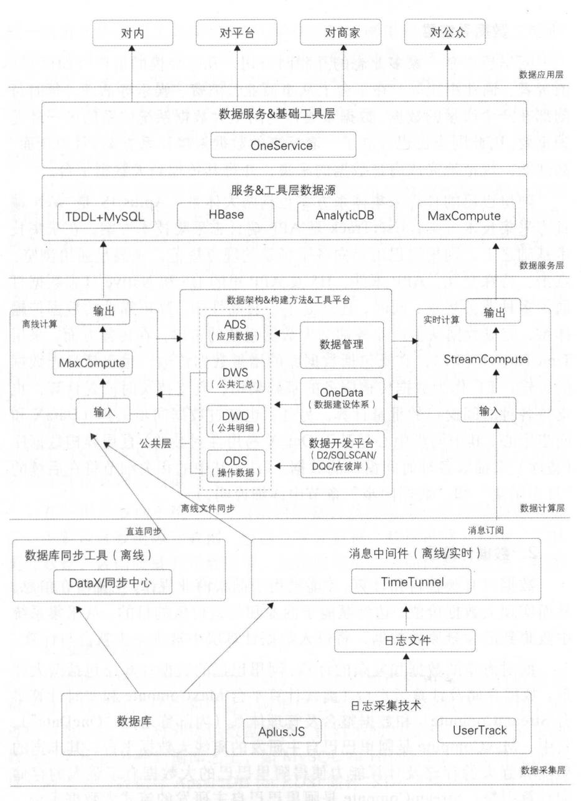

I 阿里巴巴大 据系 架构图

# 1 .数据采集层

阿里巴巴是一家多业态的互联网公司,几亿规模的用户(如商家、 消费者、商业组织等)在平台上从事商业、消费、娱乐等活动,每时每 刻都在产生海量的数据,数据采集作为阿里大数据系统体系的第 环尤 为重要。因此阿里巴巴建立了一套标准的数据采集体系方案,致力全面、 高性能、规范地完成海量数据的采集,并将其传输到大数据平台。

阿里巴巴的日志采集体系方案包括两大体系: Aplus.JS 日志采集技术方案; 端日志采集技术方案。在采集技 术基础之上,阿里巴巴用面向各个场景的埋点规范,来满足通用浏览、 点击、特殊交互、 事件、 里的 日志数据打 通等多种业务场景。同时,还建立了一套高性能、高可靠性的数据传输 体系,完成数据从生产业务端到大数据系统的传输。在传输方面,采用 TimeTunnel (TT ),它既包括数据库的增量数据传输,也包括日志数据 的传输; 作为数据传输服务的基础架构,既支持实时流式计算,也 支持各种时间窗口的批量计算。另外,也通过数据同步工具( DataX 同步中心,其中同步中心是基于 易用性封装的)直连异构数据库 (备库)来抽取各种时间窗口的数据。(注:其中的相关细节将在后续的 "日志采集"和"数据同步"章节中详细说明 。)

# 据计算层

数据只有被整合和计算,才能被用于洞察商业规律,挖掘潜在信息, 从而实现大数据价值,达到赋能于商业和创造价值的目的。从采集系统 中收集到的大量原始数据,将进入数据计算层中被进 步整合与计算。

面对海量的数据和复杂的计算,网里巴巴的数据计算层包括两大体 系:数据存储及计算云平台(离线计算平台 MaxCompute 和实时计算 Compute )和数据整合及管理体系(内部称之为"OneData ") 其中, Max Compute 是阿里巴巴自主研发的离线大数据平台 ,其丰富的 功能和强大的存储及计算能力使得阿里巴巴的大数据有了强大的存储 和计算引擎; StreamCompute 是网里巴巴自主研发的流式大数据平台, 在内部较好地支持了阿里巴巴流式计算需求: 是数据整合及管 理的方法体系和工具(注 为方便内部工作及沟通,在阿里内部将这

llii. 4

章总述丁一

统一的方法体系和工具简称为" OneData "),阿里巴巴的大数据工程 在这一体系下,构建统一、规范、可共享的全域数据体系 ,避免数据的 冗余和重复建设 ,规避数据烟囱和不一致性,充分发挥间里巴巴在大数 据海量、多样性方面的独特优势。借助这一统一化数据整合及管理的方 法体系 ,我们构建了阿里巴巴的数据公共层,并可以帮助相似大数据项 目快速落地实现。

从数据计算频率角度来看,阿里数据仓库可以分为离线数据仓库和 实时数据仓库。离线数据仓库主要是指传统的数据仓库概念,数据计算 频率主要以天(包含小时、周和月)为单位 ;如下 ,则每天凌晨处理 上一天的数据。但是随着业务的发展特别是交易过程的缩短,用户对数 据产出的实时性要求逐渐提高,所以阿里的实时数据仓库应运而生。"双 1 "实时数据直播大屏,就是实时数据仓库的一种典型应用。

间里数据仓库的数据加工链路也是遵循业界的分层理念,包括操作 数据层( Operational Data Store, ODS 、明细数据层( Data Warehouse Detail , DWD )、汇总数据层( Data Warehouse Summary, DWS )和 用数据层( Application Data Store, ADS )。通过数据仓库不同层次之 的加工过程实现从数据资产向信息资产的转化,并且对整个过程进行有 效的元数据管理及数据质量处理。

在阿里大数据系统中,元数据模型整合及应用是一个重要的组成部 分,主要包含数据源元数据、数据仓库元数据 、数据链路元数据、工 类元数据 数据质量类元数据等。元数据应 主要面向数据发现、数据 管理等 ,如用于存储、计算和成本管理等。

# 数据服务层

当数据已被整合和计算好之后, 需要提供给产品和应用进行数据消 费。为了有更好的性能和体验,阿里巴巴构建了自己的数据服务层,通 过接口服务化方式对外提供数据服务。针对不同的需求,数据服务层的 数据源架构在多种数据库之上,如 MySQL HBase 等。后续将逐渐迁 移至阿里云云数据库 ApsaraDB for RDS (简称" RDS ")和表格存储( Table Store )等。

数据服务可以使应用对底层数据存储透明,将海量数据方便高效地

开放给集团内部各应用使用。现在,数据服务每天拥有几十亿的数据调 用量,如何在性能、稳定性、扩展性等方面更好地服务于用户:如何满 足应用各种复杂的数据服务需求:如何保证"双 <sup>11</sup> "媒体大屏数据服 务接口的高可用……随着业务的发展,需求越来越复杂,因此数据服务 也在不断地前进。

数据服务层对外提供数据服务主要是通过统 的数据服务平台( 方便阅读,简称为"OneService ")。 以数据仓库整合计算好 的数据作为数据源,对外通过接口的方式提供数据服务,主要提供简单 数据查询服务、复杂数据查询服务(承接集团用户识别、用户画像等复 杂数据查询服务)和实时数据推送服务 大特色数据服务。

# 数据应用层

数据已经准备好,需要通过合适的应用提供给用户,让数据最大化 地发挥价值。阿里对数据的应用表现在各个方面,如搜索、推荐、广告、 金融、信用、保险、文娱、物流等。商家 ,阿里内部的搜索、推荐、广 告、金融等平台 ,阿里内部的运营和管理人员等,都是数据应用方; ISV 研究机构和社会组织等也可以利用阿里开放的数据能力和技术。

间里巴巴基于数据的应用 产品有很多,本书选择了服务于阿里内部 员工的阿里数据平台和服务于商家的对外数据产品一一生意参谋进行 基础性介绍。其他数据应用不再赘述。对内,阿里数据平台产品主要有 实时数据监控、自助式的数据网站或产品构建的数据小站、宏观决策分 析支撑平台、对象分析工具、行业数据分析门户、流量分析平台等。

我们相信,数据作为新能源,为产业注人的变革是显而易见的。我 们对数据新能源的探索也不仅仅停留在狭义的技术、服务和应用上。我 们正在挖掘大数据更深层次的价值,为社会经济和民生基础建设等提供 创新方法。

注:本书中出现的专有名词 专业术语 产品名称、软件项目名称 名称等,是沟宝(中国)软件有限公司内部项目的惯用词语,如与第三方名 雷同,实属巧合


# 数据技术篇

- ·第 日志来集
- ·第 章数据同步
- ·第 章离线数据开发
- ·第 章实时技术
- ·第 章数据服务
- ·第 章数据挖掘

=垂巳

# 日志采集

数据采集作为阿里大数据系统体系的第 环尤为重要。因此阿里巴 巴建立了一套标准的数据采集体系方案,致力全面、高性能、规范地 成海量数据的采集,并将其传输到大数据平台。本章主要介绍数据来 中的日志采集部分。

阿里巴巴的日志采集体系方案包括两大体系: Ap us.JS Web (基于浏览器)日志采集技术方案: UserTrack APP 端(无线客户端 日志采集技术方案。

本章从浏览器的页面日志采集、无线客户端的日志采集以及我们遇 到的日志采集挑战三块内容来阐述间里巴巴的日志采集经验。

# 2.1 浏览器的页画日志采集

浏览器的页面型产品/服务的日志采集可分为如下两大类。

( 1 )页面浏览(展现)日志采集。顾名思义,页面浏览日志是指 个页面被浏览器加载呈现时采集的日志。此类日志是最基础的互联网

# 章日志采集寸一

日志, 也是目前所有互联网产品的两大基本指标:页面浏览量( Page View, PY )和访客数( Unique Visitors, UV )的统计基础。页面浏览日 志是目前成熟度和完备度最高 ,同时也是最具挑战性的日志来集任务, 我们将重点讲述 类日志 的采集。

(2 )页面交互日志采集。当页面加载和渲染完成之后,用户可以在 页面上执行各类操作。随着互联 网前端技术的不断发展,用户可在浏览 器内与网页进行的互动已经丰富到只有想不到没有做不到的程度,互动 设计都要求采集用户的互动行为数据 ,以便通过 化获知用户的兴趣点 或者体验优化点。交互日志采集就是为此类业务场景而生的。

除此之外 还有 些专门针对某些特定统计场合的日志采集需求, 如专门采集特定媒体在页面被曝光状态的曝光日志、用户在线状态的实 时监测等,但在基本原理上都脱胎于上述两大类。限于篇幅,此内容在 本书中就不予展开介绍了。

# 2.1.1 页面浏览日志采集流程

网站页面是互联网服务的基本载体,即使在如今传统互联网形态逐 渐让位于移动互联网 的背景下 HTML 页面依旧是最普遍的业务形态, 对于以网页为基本展现形式 互联网产品和服务,衡量其业务水平的基 本指标是网页浏览量 PV )和访客数( UV )。为此,我们需要采集页 面被浏览器加载展现的记录,这是最原始的互联网日志采集需求,也是 切互联网数据分析得以展开的基础和前提。

目前典型的网页访问过程是以浏览器请求、服务器响应并返回所请 求的内容 (大 多以 HTML 文档的形式)这种模式进行的,浏览器和服 务器之间的通信普遍遵守 HTTP 协议(超文本传输协议,目前以 HTTP 1.1 为主,逐渐向最新的 HTTP 2.0 过渡)。浏览器发起的请求被称为 HTTP 请求( HTTP Request ),服务器的返回则被称为 HTTP 响应( HTTP Response

我们以用户访问向宝首页( www.taobao.com )为例, 次典型的页 面访问过程描述如图 2.1 示。

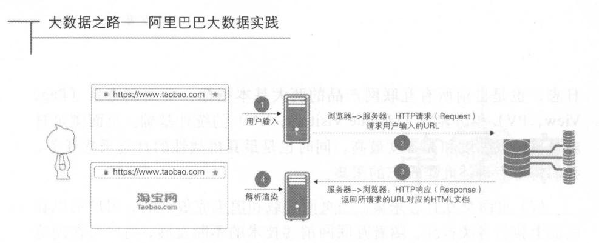

2.1 一次典型的互联网页面请求-响应过程

( 1 )用户在浏览器内点击淘宝首页链接(或在地址栏中输人 www.taobao.com 并回车)。

(2 )浏览器向淘宝服务器发起 HTTP 请求。在本例子中,用户可以 看见的内容只是显示于浏览器地址栏内的 http://www.taobao.com ,而浏 览器在执行时,会解析用户请求并按照 HTTP 协议中约定的格式将其转 化为 HTTP 请求发送出去。

按照 HTTP 协议, 一个标准 HTTP 请求由如下三部分构成。

- 请求行( HTTP Request Line )。请求行内有 个要素,分别是请 求方法、所请求资源的 URL 以及 HTTP 协议版本号。在本例子 中,这 个要素分别是 GET http: //www.taobao.com /以及 HTTP 1.1 ,对于我们所讨论的话题,记住请求行内最重要的信息是这 URL 就可以了。
- 请求报头( HTTP Message Header )。请求报头是浏览器在请求时 向服务器提交的附加信息,请求报头一般会附加很 容项(每 项内容被称为一个头域( Header Field ),在不引起混 的情况下, 往往将 Header Field 简称为 Header 。需要注意的是,如果用户 在本次页面访问之前已经到访过网站或者已经登录,则一般都会 在请求头中附加一个或多个被称为 Cookie 的数据项,其中记录 了用户上一次访问时的状态或者身份信息,我们只需理解浏览器 在发起请求时会带上一个标明用户身份的 Cookie 即可。
- 请求正文( HTTP Message Body )。这 部分是可选的, 般而言, HTTP 请求的正文都是 的,可以忽略

(3 )服务器接收并解析请求。服务器端的业务处理模块按业务逻辑 处理本次请求并按照 HTT 协议规定的格式,将处理结果以 HTTP 形式发回浏览器。

HTTP 请求相对应,一个标准的 HTTP 应也由三部分构成。

- ·状态行。状态行标识了服务器对于此次 HTTP 请求的处理结果 状态行内的主要内容是一个由三位数字构成的状态码,我们最熟 知的两个状态码分别是代表成功响应的 <sup>200</sup> (OK )和代表所请 求的资源在服务器端没有被找到的 <sup>404</sup> (Not Found )。
- 响应报头。服务器在执行响应时,同样可以附加 些数据项,这 些数据项将在浏览器端被读取和使用。事实上,在大多数页面和 应用中,响应报头内的内容在确保页面正确显示和业务正常进行 方面都发挥着至关重要的作用。其中最重要的一类 Header 即上 面所提到的 Cookie ,浏览器所记录的 Cookie ,其实是由服务器 在响应报头内指令浏览器记录的。举个例子 ,如果用 户在页面登 录,则服务器会在登录请求的响应报头内指示浏览器新增一个名 use rid Cookie 项, 其中记录了登录用户的 id 。如 一来 当用户随后再次访问该网站时,浏览器将自动在请求报头内附加 这个 Cookie ,服务器由此即可得知本次请求对应的用户到底是 谁:如果服务器发现浏览器在请求时传递过来的 Cookie 有缺失、 错误或者需要更新,则会在响应报头内指令浏览器增加或更新对 应的 Cookie
- ·响应正文。和请求正文一样,这一部分在协议中 也被定义为可选 部分,但对于大多数 HTTP 响应而言,这一部分都是非空的,浏 览器请求的文档、图片、脚本等,其实就是被包装在正文内返回 浏览器的。在本例子中,服务器会将淘宝首页对应的 HTML 档封装在正文内。

(4 )浏览器接收到服务器的响应内容,并将其按照文档规范展现给 用户,从而完成一次请求。在本例子中,浏览器请求淘宝首页,服务器 返回对应的 HTML 文档,浏览器即按照 HTML 文档规范解析文档并将 整个页面渲染在屏幕上。

上面描述了一次典型的网页浏览过程,如果需要记录这次浏览行 为,则采集日志的动作必然是附加在上述四个步骤中的某 环节内完成 的。在第一步和第二步,用户的请求尚未抵达服务器 而直到第三步完 成,我们也只能认为服务器处理了请求,不能保证浏览器能够正确地解 析和渲染页面,尚不能确保用户已确实打开页面,因此在前 步是无法 采集用户的浏览日志的。那么采集日志的动作,需要在第四步,也就是 浏览器开始解析文档时才能进行。根据前文所述,可以很自然地得出在 这一模式下最直接的日志采集思路:在 文档内的适当位置增加 一个日志采集节点,当浏览器解析到这个节点时,将自动触发 个特定 请求到日志采集服务器。如此一来,当日志采集服务器接收到 这个请求时,就可以确定浏览器已经成功地接收和打开了页面。这就是 目前几乎所有互联网网站页面浏览日志采集的基本原理,而业界的各 网页日志采集的解决方案只是在实施的细节、自动采集内容的广度以及 部署的便利性上有所不同。

目前阿里巴巴采用的页面浏览日志采集方案的流程框架如图 示。在图 所示的页面浏览日志采集过程中,所涉及的日志相关的几 个主要过程简单介绍如下:

( 1 )客户端日志采集。日志采集工作 般由 小段被植人页面 文档内的 ript 脚本来执行。采集脚本被浏览器加载解析后 执行,在执行时采集当前页面参数、浏览行为的上下文信息(如读取用 户访问当前页面时的上 步页面)以及 些运行环境信息(如当前的浏 览器和分辨率等)。在 文档内植入日志采集脚本的动作可以由业 务服务器在响应业务请求时动态执行,也可以在开发页面时由开发人员 手动植人。在阿里巴巴,这两种方式均有采用,其中前 种方式的占比 较高,这 点与业界的普遍状况有所不同。图 中的第 、四步描述 了阿里业务服务器端植人日志采集脚本的过程。

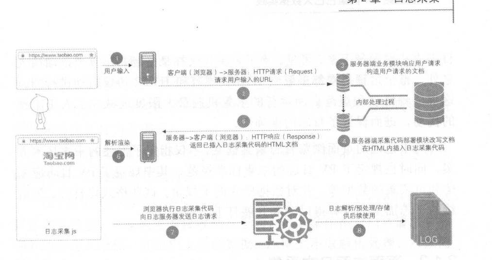

2.2 阿里巴巴页面浏览日志采集方案流程框架

(2 )客户端日志发送。采集脚本执行时,会向日志服务器发起 请求,以将采集到的数据发送到日志服务器。在大多数情况下,采 完成之后会立即执行发送;但在个别场景下,日志采集之后可能会经 段时间的延迟才被发出。日志采集和发送模块 般会集成在同 JavaScript 脚本文件内,且通过互联网浏览器必然支持的 HTTP 协议与 日志服务器通信,采集到的日志信息 般以 URL 参数形式放在 HTTP 日志请求的请求行内。

( )服务器端日志收集。日志服务器接收到客户端发来的日志请求 后, 般会立即向浏览器发回 个请求成功的响应,以免对页面的正常 加载造成影响;同时,日志服务器的日志收集模块会将日志请求内容写 个日志缓冲区内,完成此条浏览日志的收集。

(4 )服务器端日志解析存档。服务器接收到的浏览日志进人缓冲区 后,会被 段专门的日志处理程序顺序读出并按照约定的日志处理逻辑 解析。由日志采集脚本记录在日志请求行内的参数,将在这个环节被解 析(有时候伴随着转义和解码)出来,转存人标准的日志文件中并注人 实时消息通道内供其他后端程序读取和进 步加工处理。

经过来集 发送 收集 解析存档四个步骤,我们将 次页面浏览

巴大数据实践

日志成功地记录下来。可见 除了采集代码在某些场合下需要手动植入 之外,整个过程基本都是依照 规范和 协议自动进行的, 这种依赖协议和规范自动运行的采集机制最大限度地减少了人工干预 的扰动,进而保证了日志的准确性。

阿里巴巴的页面浏览日志采集框架,不仅指定了上述的采集技术方 案,同时也规定了 日志的采集标准规范,其中规定了 日志应采 集和可采集的数据项,并对数据格式做了规定。这些格式化日志,为后 续的日志加工和计算得以顺利开展打下了基础。

### 2.1.2 页面交互日志采集

日志的采集解决了页面流量和流量来源统计的问题,但随着互 联网业务的发展,仅了解用户到访过的页面和访问路径,已经远远不能 满足用户细分研究的需求。在很多场合下,需要了解用户在访问某个页 面时具体的互动行为特征,比如鼠标或输入焦点的移动变化(代表用户 关注内容的变化)、对某些页面交互的反应(可借此判断用户是否对某 些页面元素发生认知困难)等。因为这些行为往往并不触发浏览器加载 新页面,所以无法通过常规的 日志采集方法来收集。在阿里巴巴, 通过一套名为"黄金令箭"的采集方案来解决交互日志的采集问题。

因为终端类型 页面内容、交互方式和用户实际行为的千变万化不 可预估,交互日志的采集和 日志的采集不同,无法规定统 的采集 内容(例如,活动页面的游戏交互和淘宝购物车页面的功能交互两者相 比,所需记录的行为类型、行为数据以及数据的结构化程度都截然不 同),呈现出高度自定义的业务特征。与之相适应,在阿里巴巴的日志 采集实践中,交互日志的采集(即"黄金令箭")是以技术服务的形式 呈现的。

具体而言,"黄金令箭"是一个开放的基于 协议的日志服务, 需要采集交互日志的业务(下文简称"业务方"),经过如下步骤即可将 自助采集的交互日志发送到日志服务器。

( l )业务方在"黄金令箭"的元数据管理界面依次注册需要采集交

14

日志的业务、具体的业务场景以及场景下的具体交互采集点,在注册 成之后,系统将生成与之对应的交互日志来集代码模板。

(2 )业务方将交互日志采集代码植入目标页面,并将采集代码与需 监测的交互行为做绑定。

(3 )当用户在页面上产生指定行为时,采集代码和正常的业务互动 代码 起被触发和执行。

(4 )采 代码在采集动作完成后将对应的日志通过 HTTP 协议发送 到日志服务器,日志服务器接收到日志后,对于保存在 HTTP 请求参数 部分的自定义数据,即用户上传的数据,原则上不做解析处理,只做简 的转储。

经过上述步骤采集到日志服务器的业务随后可被业务方按 自行 解析处理,并可与正常的 PV 日志做关联运算。

# 2.1.3 页面日志的服务器端清洗和预处理

上面介绍了阿里巴巴的两类浏览器页面日志的采集方案,并粗略介 绍了日志到达日志服务器之后的解析处理。但在大部分场合下,经过上 述解析处理之后的日志并不直接提供给下游使用。基于如下几个原因, 对时效要求较宽松的应用场合下,一般还需要进行相应的离线预处理。

( 1 )识别流量攻击、网络爬虫和流量作弊(虚假流量)。页面日志 互联网分析和大数据应用的基础源数据,在实际应用中,往往存在占 定比例的虚假或者恶意流量日志,导致日志相关指标的统计发生偏差 或明显谬误。为此,需要对所采集的日志进行合法性校验,依托算法识 别非正常的流量并归纳出对应的过滤规则集加以滤除。这是 个长期而 艰苦的对抗过程。

(2 )数据缺项补正。为了便利后续的日志应用和保证基本的数据统 口径 致,在大多数情况下,需要对日志中的 些公用且重要的数据 项做取值归 、标准化处理或反向补正。反向补正,即根据新日志对稍 收集的日志中的个别数据项做回补或修订(例如,在用户登录后,对 登录前页面日志做身份信息的回补)。

)无效数据剔除。在某些情况下,因业务变更或配置不当,在采 集到的日志中会存在一些无意义、已经失效或者冗余的数据项。这些数 据项不仅消耗存储空间和运算能力,而且在偶然的情况下还可能干扰正 常计算的进行。为了避免此类异常的发生,需要定时检查配置并依照配 置将此类数据项剔除。

)日志隔离分发。基于数据安全或者业务特性的考虑,某些日志 在进入公共数据环境之前需要做隔离。

原始日志经过上述的清洗、修正,并结构化变形处理之后, 页面日志的采集流程就算完成了。此时的日志已经具备了结构化或者半 结构化的特征,可以方便地被关系型数据库装载和使用。

# 2.2 无线客户端的日志采集

众所周知,日志来集多是为了进行后续的数据分析。移动端的数据 采集,一是为了服务于开发者,协助开发者分析各类设备信息;二是为 了帮助各 更好地了解自己的用户,了解用户在 上的各类行为 帮助各应用不断进行优化,提升用户体验。

无线客户端的日志采集采用采集 来完成,在阿里巴巴内部, 多使用名为 来进行无线客户端的日志采集。无线客 户端的日志采集和浏览器的日志采集方式有所不同,移动端的日志采集 根据不同的用户行为分成不同的事件,"事件"为无线客户端日志行为 的最小单位。基于常规的分析, serTrack (UT )把事件分成了几类, 常用的包括页面事件(同前述的页面浏览)和控件点击事件(同前述的 页面交互)等。

对事件进行分类的原因,除了不同事件的日志触发时机、日志内容 和实现方式有差异之外,另 方面是为了更好地完成数据分析。在常见 的业务分析中,往往较多地涉及某类事件,而非全部事件:故为了降低

16

章曰志采集丁一

后续处理的复杂性,对事件进行分类尤为重要。要更好地进行日志数据 分析,涉及很多方面的内容,如需要处理 br 应用,实现 H5 ti ve 日志的统一;又如识别设备,保证同一设备上各应用获取到的设备信息 是唯一的。除此之外,对于采集到的数据如何上传,以及后续又如何合 理处理等,每个过程都值得我们进行深入的研究和探索。

# 2.2.1 页面事件

从实现方法上说,日志采集 对于不同事件的实现 大致是类 似的:只是对于通用的用户行为,抽象出来一些通用的接口方法。我们 把常用的行为类别单独列出来,作为单独的事件来处理,如本节要讲的 页面事件(页面浏览行为)。每条页面事件日志记录三类信息 ①设备 及用户的基本信息:②被访问页面的信息,这里主要是一些业务参数(如 商品详情页的商品 ID 、所属的店铺等) ; ③访问基本路径(如页面来源、 来源的来源 ),用于还原用户完整的访问行为。

对于页面事件,不同的 有不同的实现,有些采集 SD 选择在 页面创建时即发送日 志。结合业务分析, 提供了页面事件的无痕埋 点, 即无须开发者进行任何编码即可实现。限于篇幅,本处主要讲 手动模式的埋点。 UT 提供了两个接口,分别在页面展现和页面退出时 调用。以进入手机淘宝的某店铺详情页来举例,当进入该店铺详情页时, 调用页面展现的接口,该接口 记录页面进人时的 些状态信息,但此 时不发送日志;当从该店铺详情页离开时(可能是在店铺详情页上点击 某个商品到了对应的商品详情页,也可能是退出了手机淘宝,抑或是点 击返 回,返回到了之前的一个页面),调用页面退出的接口,该接口 发送 日志 。除了基础的两个接口外,还提供了添加页面扩展信息的接口 在页面离开前,使用该接口提供的方法给页面添加相关 数,比如给店 铺详情页添加店铺 ID 、店铺类别(天猫店铺或淘宝店铺) 等。

显然 上述三个接口方法必须配合使用,即页面展现和页面退出方 法必须成对使用,而页面扩展信息的接口必须在使用页面展现和页面退 出方法的前 下使用。再来说说,为什么不在页面进人时就发送日志, 而是在页面离开时才发送日志呢?可以思考 基于浏览器的日志来 集,在每次页面进人时就实现采集日志的发送,每个页面停留时长的计 算一直困扰着分析师;而无线客户端的日志采集,在页面离开时发送日 志,此时页面停留时长就是天然自带的准确值了。还可以进一步思考, 还有什么其他的优势呢?

上述三个方法是采集 SDK 提供的页面事件采集的基础方法 除此 之外,为了平衡采集、计算和分析的成本,在部分场景下我们选择采集 更多的信息来减少计算及分析的成本。于是, UT 提供了透传参数功能。 所谓透传参数,即把当前页面的某些信息,传递到下一个页面甚至下下 一个页面的日志中。举个例子,在手机淘宝首页搜索"连衣裙",进 搜索 list 页面,然后点击某个商晶进入商品 详情页。如果需要分析"连 衣裙"这个关键词,或者商品 的来源搜索词,此时就需要把"连衣 裙"这个关键词带人到搜索 list 页面日志、商品 详情页日志中,这样 一来,分析搜索词的效果就显而易见了。在阿里系内,使用 SPM (Super Position Model ,超级位置模型)进行来源去向的追踪,在无线客户端 也同样使用 SPM 信息就可以通过透传机制带人到下一步甚至下 下一步的浏览页面,这样整个用户行为路径还原就轻松实现了。

# 2.2.2 控件点击及其他事件

为了和基于浏览器客户端的日志采集做比较,我们暂且把除了页面 事件外的各类事件放到一起来讲。

和浏览器客户端的日志采集一样 ,交互日志的采集无法规定统一的 采集内容,交互类的行为呈现出高度自定义的业务特征。与之相适应, 在网里巴巴的无线客户端日志采集实践中,将交互日志采集从页面事件 采集中剥离出来,这就是控件点击事件和其他事件。

先来说说控件点击事件。控件点击事件比页面事件要简单得多,首 先,它和页面事件一样,记录了基本的设备信息、用户信息:其次,它 记录了控件所在页面名称、控件名称、控件的业务参数等。由于控件点 击事件的逻辑简单得多,就是操作页面上的某个控件,因此只需把相关 基础信息告诉采集 即可。

... 18

章日志采集丁一

再来说说其他事件。所谓其他事件,就是用户可以根据业务场景需 求,使用自定义事件来采集相关信息。从某种程度上说,它几乎能满足 用户的所有需求,包括页面事件和控件点击事件,只是若采用通用的页 面事件埋点方法, 会帮助实现一些额外的功能(如上个页面的信息)。 提供了一个自定义埋点类,其包括:①事件名称:②事件时长 ③事 件所携带的属性:④事件对应的页面。当然,具体实现什么功能,需要 带哪些内容,各个采集 可以自行决定。

除了上述这些需要应用开发者触发的日志采集接口方法外, 提供了一些默认的日 志采集方法 ,比如可以自动捕获应用崩溃,并且产 生一条 日志记录崩溃相关信息。类似的日志采集方法还有很多,比如应 用的退出 的前后台切换等。诸如 些和业务信息不是非常相关, 但又对分析起很大作用的日志采集 ,就完全没有必要让应用开发者去触 发埋点了。

# 2.2.3 特殊场景

上述场景均为一个行为产生一条日志,如一次浏览、一次点击等。 如此用来处理普通的业务是足够的,但对于阿里巴巴巨大的业务体量来 说,为了平衡日志大小,减小流量消耗、采集服务器压力、网络传输压 力等,采集 提供了聚合功能,对某些场景如曝光或一些性能技术 ,我们提倡在客户端对这类日志进行适当聚合,以减少对日志采 集服务器端的请求 ,适当减小日志大小。总体思路就是每个曝光的元素 般都属于一个页面,利用页面的生命周期来实现适当的聚合及确定发 送时 。拿曝光 日志来举例,若 个商品的一次曝光就对应一条日志的 话,那么在搜索结果页的一次滚屏浏览过程中将产生几十条甚至上百条 日志,从下游使用及分析的角度来说,其实只是想知道哪些内容被曝光, 此时为了平衡业务需求及减少全链路资源消耗,采集 提供了本地 聚合功能,在客户端对这类日志进行聚合,上传聚合后的日志到采集服 务器即可。同时对于一些只需要计数,而不需要知道具体内容的场景, 如需要分析某些接口的调用次数,此功能就更加凸显出其作用了。

区别于浏览器的页面访问,在无线客户端用户的访问行为路径存在

19 *A* 

明显的回退行为(如点击回退按钮、各种滑屏等),在进行业务分析时, 回退同样作为特殊场景而存在。例如,"双 <sup>11</sup> "主会场页 女装分会 →女装店铺 →回退到女装分会场→女装店铺 ,在这个访问路径中, 若只是按照普通的路径来处理,则会认为第 次浏览的女装分会场来源 为店铺 ,就会把女装分会场的 次浏览效果记为女装店铺 带来的 倘若这样处理,就会发现类似的活动承接页其来源有 大部分均为各 详情页(店铺详情页/商品详情页),这必然干扰到分析。所以针对这种 场景,我们做了特殊的设计,利用页面的生命周期,识别页面的复用 配合校的深度来识别是否是回退行为。

如上列举了两个比较典型的特殊场景,随着业务的不断发展,业务 的复杂性不断提高,采集需要处理的特殊场景也层出不穷,限于篇幅, 此处不再 一展开介绍。

# 2.2.4 H5 & Native 日志统一

简单来说, APP 分为两种: 种是纯 Native APP; 种是既有 Native 又有 H5 页面嵌入的 APP ,即 Hybrid APP 。当前,纯 Native APP 经非 常少了,一般都是 Hybrid APP Native 页面采用采集 SDK 进行日 志采 集, H5 页面 般采用基于浏览器的页面日志采集方式进行采集。在 前的实践中,由于采集方式的不同,采集到的内容及采集服务器均分 开。若需要进行完整的数据分析,就需要将两类日 在数据处理时进 关联,而就算不考虑处理成本,在很多情况下, Native H5 互跳,即 使关联也无法还原用户路径,数据丢失严重。对于 理以及运营、 管理、数据分析人员而言,在不同的终端采用不同的方案采集日志, 不同的算法来做日志统计,忍受多端之间的数据隔离,并对由此导 多样数据口径进行整理分析和解释,已经是越来越不能容忍的切身之 痛。考虑到后续日志数据处理的便捷性、计算成本、数据的合理性及 确性,我们需要对 Native H5 日志进行统 处理(见囹 )。

些可

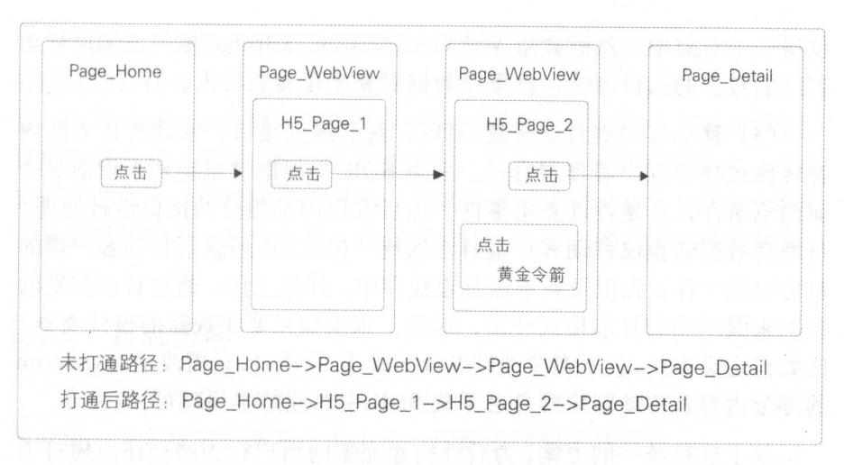

日志桥接示意图

HS <sup>日</sup> 的统 处理,就需要对 Hybrid 日志有 统一 方案。 的思路就 首先将两 日志进行归 。用什么方式把 两类 呢? 日志归,还是把 日志归到 呢? 其实 路均可以 现,没有绝对的答案。选择时可以 自行斟酌,在阿 团,分别考虑两条路的优缺点,考虑到两种日 志来集方式的特点以及关注点,我们选择 部署采集 的方式。

有二 一是采 可以采集到更 的设备相关数据, 这在移动端的数据分析中尤为 要; 是采集 处理日志,会先在 存,而后借机上传,在网络状况不佳时延迟上报,保证数据不丢 失。基于这两点,我们选择将 日志归到 日志。

体的流 如下:

( 1) HS 页面浏览和页面交互的数据,在执行时通过加载日志采集 JavaScript 脚本,采集当前页面参数,包括浏览行为的上下文信息以 及一 行环境信息。在 中打开 页面和在浏览器中的处理完全 一样 ,在前端 面的开发中无须做任何特殊的处理,只需在页面开发时 手动植入日 JavaScript 脚本即可

(2 )在浏览器日 JavaScript 脚本中实现将所采 的数据打 一寸大数据之路一一阿里巴巴大数据实践

包到一个对象中,然后调用 WebView 框架的 JSBridge 接口,调用移动 客户端对应的接口方法,将埋点数据对象当作参数传人。

(3 )移动客户端日志采集 SDK ,封装提供接口,实现将传人的内 容转换成移动客户端日志格式。采集 SDK 会根据日志类别来识别是页 面浏览事件,还是控件点击事件,然后调用内部相应的接口进行处理, 将埋点数据转换成移动客户端日志的统一格式。而后就同移动客户端的 日志处理一样,先记录到本地日志缓存中,择机上传。通过日志类别的 识别来做不同的日志格式转换,这样,未来如果要实现新的事件类别, 比如自定义事件,就不需要改动 WebView 层的接口,只 需改动 JavaScript 的部分内容及移动客户端日志采集 SDK 中对应的实现即可。

基于这种统一的方案,为后续构建完整的用户行为路径还原树打下 了基础。当然,此方案也有其局限性,必须要浏览器采集 JavaScript Web View 、客户端采集 SDK 的配合。而往往很多时候业务并不希望做任 何调整,更多的是希望减少依赖,所以在这方面我们也在寻求新的突破。

# 2.2.5 设备标识

正如本章开头所说的,所有互联网产品的两大基本指标是页面浏览 量( Page View, PY )和访客数( Unique Visitors, UV )。 关于 UV 于登录用户,可以使用用户 ID 来进行唯 标识,但是很多日志行为并 不要求用户登录,这就导致在很多情况下采集上来的日志都没有用户 ID PC 般使用 Cookie 信息来作为设备的唯一信息,对于 APP 说,我们就要想办法获取到能够唯一标识设备的信息。

历史上, MEI IMSI MAC 、苹果禁用之前的 UDID ,曾经都可 用,如果它们之中有一个是靠谱的话,那么设备唯一标识就简单了。但 事实上,随着用户的自我保护意识加强以及各系统升级,很多基本的设 备信息获取都不再那么容易。苹果 UDID 禁用, IDFA IMEI IMSI 了权限控制, Android 新系统也对设备信息的获取做了权限控制。

对于只有单 APP 的公司来说,设备唯一标识不是需要攻克的难题, 但对于像阿里巴巴这样拥有众多 APP 的公司来说,设备唯 标识就显 得尤为重要。阿里巴巴集团无线设备唯一标识使用 ,它 当然有 很清晰的责任和目标,就是每台设备一个 作为唯 标识。 系统对权限控制的不断升级,对方案做了多次调整, 包括存储方式、存储位置、共享方式等,以及和服务器端的配合,其生 成方式也使用一套较完备的算法。但就目前的进展来说, 还未 现其使命。在这方面,欢迎有思路、有想法的读者和我们联系。

# 2.2.6 日志传输

在上面的章节中大概讲述了如何从无线客户端来集日志,本节将简 单介绍一下无线客户端 日志的上传、压缩及传输的特殊性。

无线客户端日志的上传,不是产生一条日志上传一条,而是无线客 户端产生 日志后,先存储在客户端本地,然后再伺机上传。所谓伺机, 就需要有数据分析的支持,如在启动后、使用过程中、切换到后台时这 些场景下分别多久触发一次上传动作。当然单纯地靠间隔时间来决定上 传动作是不够的,还需要考虑日志的大小及合理性(如单条日志超大, 可能就是错误日志)。另外,还需要考虑上传时网络的耗时,来决定 是否要调整上传机制。

客户端数据上传时是向服务器发送 请求,服务器端处理上传 请求 ,对请求进行相关校验 ,将数据追加到本地文件中进行存储,存储 方式使用 Nginx access\_log, access\_log 的切分维度为天,即当天接 收的日志存储到当天的日志文件中。考虑到后续的数据处理,以及特殊 时期不同日志的保障级别,还对日志进行了分流。 比如阿里巴巴集团的 Adash (无线日志服务器端处理程序),根据应用及事件类型对每日高达 数千亿的日志进行了分流。分流的好处显而易见,如"双 <sup>1</sup> <sup>1</sup> "时,日 常数千亿的日志可能冲高到万亿,此时服务器及后续的数据计算压力就 非常大了 :而对于重要的数据计算来说 ,很可能只需要页面事件及控件 点击事件即可,此时就可以适当地释放其他类型日志的资源来处理更重 要的页面事件及控件点击事件。

从客户端用户行为,到日志采集服务器的日志,整个日志采集的过

大数据之路一一阿里巴巴大数据实践

程就算结束了。那么日志采集服务器的日志怎么给到下游呢?方法有很 多,阿里巴巴集团主要使用消息队列( TimeTunel, TT )来实现从日 采集服务器到数据计算的 MaxCompute 。简单来讲,就是 TT 将消息 集功能部署到日志采集服务器上进行消息的收集,而后续的应用可以是 实时的应用实时来订阅 TT 收集到的消息,进行实时计算,也可以是离 线的应用定时来获取消息,完成离线的计算。有关消息队列,以及日志 数据的统计计算等细节内容,将在后续章节中进行详细讲述。

# 2.3 日志采集的挑战

对于目前的互联网行业而言,互联网日志早已跨越初级的饥饿阶段 (大型互联网企业的日均日志收集量均以亿为单位计量),反而面临海量 日志的淹没风险。各类采集方案提供者所面临的主要挑战已不是日志采 集技术本身,而是如何实现日志数据的结构化和规范化组织,实现更为 高效的下游统计计算,提供符合业务特性的数据展现,以及为算法提供 更便捷、灵活的支持等方面。

# 2.3.1 典型场景

这里介绍两个最典型的场景和阿里巴巴所采用的解决方案。

# 1. 日志分流与定制处理

大型互联网网站的日志类型和日志规模都呈现出高速增长的态势, 而且往往会出现短时间的流量热点爆发。这一特点,使得在日志服务器 端采用集中统一的解析处理方案变得不可能,其要求在日志解析和处理 过程中必须考虑业务分流(相互之间不应存在明显的影响,爆发热点不 应干扰定常业务日志的处理)、日志优先级控制,以及根据业务特点实 现定制处理。例如,对于电商网站而言,数据分析人员对位于点击流前

## 章曰志采集丁一

端的促销页面和位于后端的商品页面的关注点是不一样的,而这两类页 面的流量又往往同等重要且庞大 ,如果采用统 的解析处理方案,则往 往需要在资源浪费(尽可能多地进行预处理)和需求覆盖不全(仅对最 重要的内容进行预处理)两个选择之 间进行取舍。这种取舍的结果一般 不是最优的。

考虑到阿里日志体量的规模和复杂度,分治策略从一开始便是阿里 互联网日志采集体系的基本原则。这里以 日志采集领域 个最浅显 的例子来说明,与业界通用 的第日志采集方案的日志请求路径几乎 不同,阿里 日志的请求位置( )是随着页面所在业务类型 的不同而变化的。通过尽可能靠前地布置路由差异,就可以尽可能早地 进行分流,降低日志处理过程中 的分支判断消耗,并作为后续的计算资 源调配的前提,提高资源利用效率。与业界方案的普遍情况相比,阿里 的客户端日志采集代码的一个突 出特点是实现了非常高的更新频次(业 界大多以季度乃至年为单位更新代码,阿里则是以周/月为单位),并实 现了更新的配置 。我们不仅考虑诸如日志分流处理之类的日志服务器 端分布计算方案,而且将分类任务前置到客户端(从某种程度上讲,这 才是真正的"分布式" !)以实现整个系统的效能最大化。最后可以在计 算后端几乎无感知的情况下,承载更大的业务量并保证处理质量和效率。

# 采集与计算一体化设计

志为例,页面 志采集之后 个基础性操作是日志的 归类与汇总。在早期的互联网日志分析实践中,是以 路径,继而 (正则)规则集为依托来进行日志分类的。在网站规模较小时, 策略还可以基本顺利地运转下去 ,但随着网站的大型化和开发人员 的增加 规则 的维护和使用成本会很快增长到不现实的程度, 同时失控的大规模正则适配甚至会将日志计算硬件集

状况要求日志采集方案必须将来集与计算作为一个系统来考 量,进行 体化设计。阿里日志采集针对这一问题给出的答案是两套日 规范和与之对应的元数据中 。其中,对应于 日志的解决方案是 目前用户可直观感知的 规范(例如,在页面的 内可以看见

spm

群彻底榨干。

参数)和 SPM 元数据中心。通过 SPM 的注册和简单部署(仅需要在页 面文件内声明一个或多个标签),用户即可将任意的页面流量进行聚类, 不需要进行任 多余的配置就可以在相应的内部数据产品内查询聚合 统计得到的流量、转化漏斗、引导交易等数据,以及页面各元素点击数 据的可视化视图。对应于自定义日志的解决方案则是黄金令箭 ( Goldlog) APP 端的点击或其他日志规范及其配置中心。通过注册 个与所在页面完全独立的令箭实体/控件实体,用户可以一键获得对应 的埋点代码,并自动获得实时统计数据和与之对应的可视化视图。通过 简单的扩展配置,用户还可以自动获得自定义统计维度下的分量数据。

在当前的互联网环境下,互联网日志的规模化采集方案必须具备 个与终端设备的技术特点无关,具有高度扩展弹性和适应性,同时深入 契合应用需求的业务逻辑模型,并基于此制定对应的采集规范交由产品 开发人员执行。若非如此,则不足以保障采集 解析一处理 应用整个 流程的通畅。目前阿里已成功实现规范制定 元数据注册 日志采集 自动化计算 可视化展现全流程的贯通。通过 体化设计,用户甚至可 以在不理解规范的前提下,通过操作向导式界面,实现日志来集规范的 自动落地和统计应用。日志本身不是日志采集的目的,服务于基于日 的后续应用,才是日志采集正确的着眼点。

# 2.3.2 大促保障

日志数据在阿里系乃至整个电商系应该都是体量最大的 类数据, 在"双 "期间,日志必然会暴涨,近万亿的数据量对日志全链路 说,无疑是不小的挑战(见图 2.4 )。

从端上埋点采集,到日志服务器收集,经过数据传输,再到日志 时解析、实时分析,任何一个环节出现问题,全链路保障就是失败的 考虑到服务器的收集能力(如峰值 等)、数据传输能力( TT 的搬 运速度)、实时解析的吞吐量、实时业务分析的处理能力,我们在各环 节都做了不少的工作。

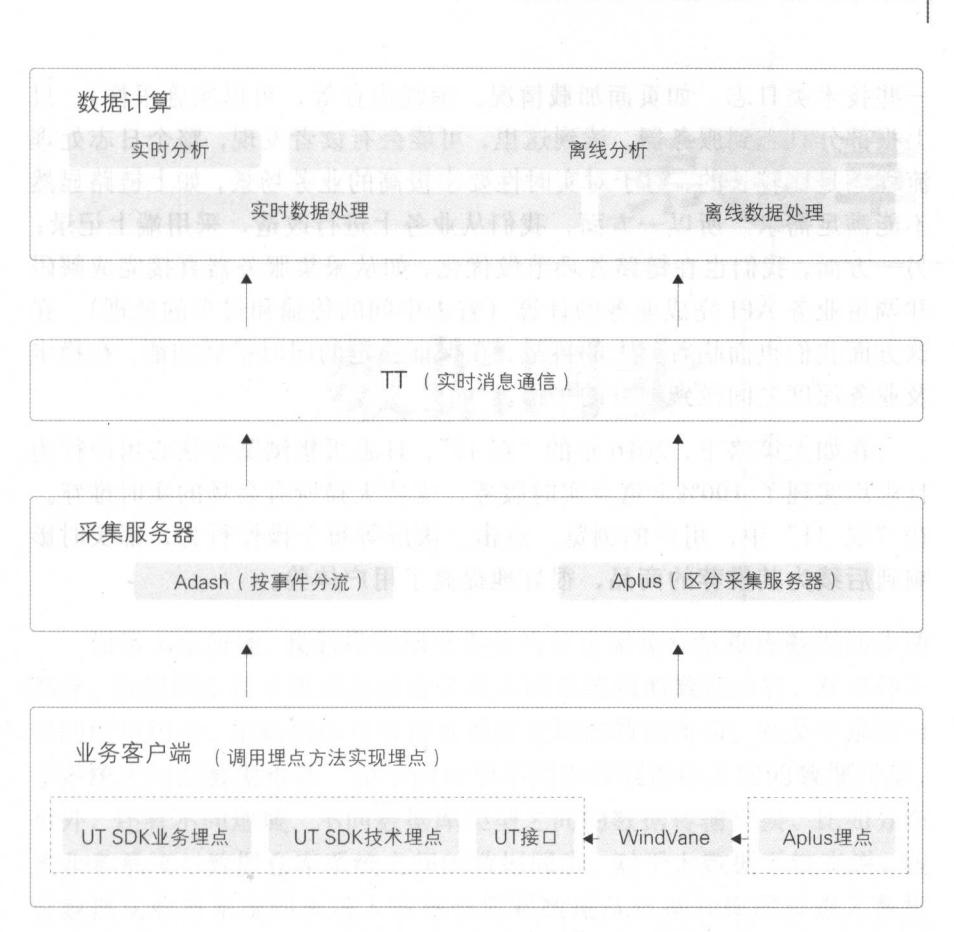

2.4 数据处理全链珞

首先,端上实现了服务器端推送配置到客户端,且做到高到达率 其次 ,对日志做了分流,结合日志的重要程度及各类日志的大小,实现 了日志服务器端的拆分;最后,在实时处理方面,也做了不少的优化以 提高应用的吞吐量。在上面几项的基础上,结合实时处理能力,评估峰 值数据量 ,在高峰期通过服务器端推送配置的方式对非重要日志进行适 当限流 ,错峰后逐步恢复。此处说的服务器端推送配置包含较多的内容, 首先是作用范围,可以针对应用、平台、事件、事件中的某个场景:其 次是具体实施,包括延迟上报、部分采样等。所谓延迟上报,即配置生 效后 ,满足条件的日志将被暂时存在客户端,待配置恢复后再上传到服 务器 ;所谓 采样 ,即配置生效后,满足条件的日志将被实施采样(对于

27 ..

章日志采集丁一

些技术类日志,如页面加载情况、消耗内存等,可以实施采样), 上报部分日志到服务器。读到这里,可能会有读者发现,整个日 志处理 流程还是比较长的,对于对实时性要求极高的业务场景,如上链路显然 不能满足需求。所以 方面,我们从业务上进行改造,采用端上记 一方面,我们也在链路各环节做优化,如从采集服务器直接完成解码 并调用业务 完成业务的计算(省去中间的传输和过 的处理) 。在 这方面我们也面临着巨大的挑战,在保证稳定的同时扩展功能, 在稳定 及业务深度之间做到很好的平衡。

在如上策略下, <sup>2016</sup> 年的"双 <sup>11</sup> ",日 志采集浏览等核心用 户行为 日志均实现了 100% 及实时服务,支持天猫所有会场的实时推荐。 在"双 <sup>11</sup> "中,用户的浏览、点击、滚屏等每个操作行为,都实时 响到后续为其推荐的商品,很好地提高了用 户体验。

,.:::C::.

# 数据同步

如第 章所述,我们将数据采集分为日志采集和数据库数据同步两 部分。数据同步技术更通用的含义是不同系统间的数据流转,有多种不 同的应用场景。主数据库与备份数据库之间的数据备份,以及主系统与 子系统之间的数据更新,属于同类型不同集群数据库之间的数据同步。 另外,还有不同地域、不同数据库类型之间的数据传输交换,比如分布 式业务系统与数据仓库系统之间的数据同步。对于大数据系统来说,包 含数据从业务系统同步进入数据仓库和数据从数据仓库同步进入数据 服务或数据应用两个方面。本章侧重讲解数据从业务系统同步进入数据 仓库这个环节,但其适用性并不仅限于此。

# 3.1 数据同步基础

源业务系统的数据类型多种多样,有来源于关系型数据库的结构化 数据,如 MySQL Orac le DB2, SQL Server :也有来源于非关系型 数据库的非结构化数据,如 Ocean Base HBase Mongo DB 等,这类数 据通常存储在数据库表中:还有来源于文件系统的结构化或非结构化 据,如阿里云对象存储 oss 、文件存储 NAS 等,这类数据通常以文件 形式进行存储。数据同步需要针对不同的数据类型及业务场景选择不同 的同步方式。总的来说,同步方式可以分为三种 直连同步 、数据文件 同步和数据库日志解析同步。

# 3.1.1 直连同步

直连同步是指通过定义好的规范接口 API 和基于动态链接库的方 式直接连接业务库,如 BC/JD BC 等规定了统一规范的标准接口,不 同的数据库基于这套标准接口提供规范的驱动,支持完全相同的函数 用和 SQL 实现(见图 .1 )。

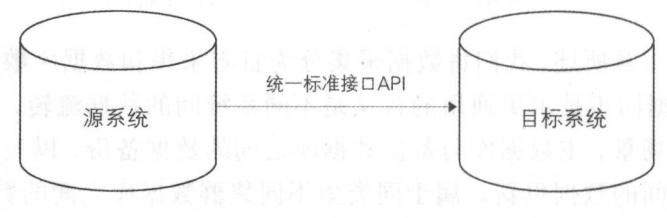

3.1 直连同步示意图

这种方式配置简单,实现容易,比较适合操作型业务系统的数据同 步。但是业务库直连的方式对源系统的性能影响较大,当执行大批量数 据同步时会降低甚至拖垮业务系统的性能。如果业务库采取主备策略, 则可以从备库抽取数据,避免对业务系统产生性能影响。但是当数据量 较大时,采取此种抽取方式性能较差,不太适合从业务系统到数据仓库 系统的同步。

# 3.1.2 数据文件同步

数据文件同步通过约定好的文件编码、大小、格式等,直接从源系 统生成数据的文本文件,由专门的文件服务器,如 FTP 服务器传输到 目标系统后,加载到目标数据库系统中。当数据源包含多个异构的数据 库系统(如 MyS QL Oracle QL Server DB2 等)时,用这种方式比 较简单、实用。另外,互联网的日志类数据,通常是以文本文件形式存 在的,也适合使用数据文件同步方式(见图 3.2

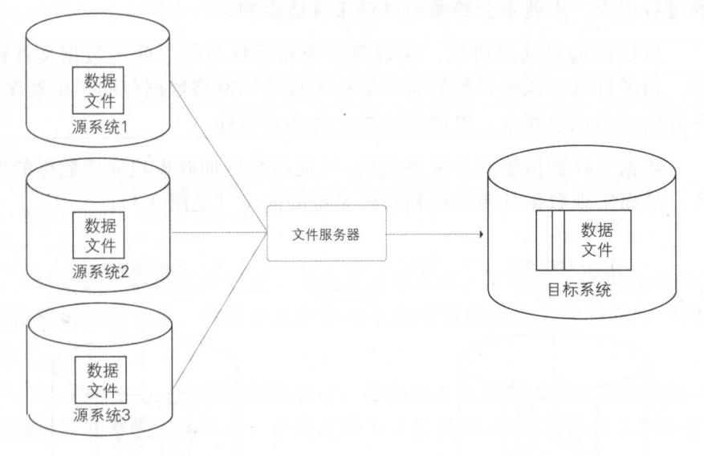

3.2 数据丈件同步示意图

由于通过文件服务器上传、下载可能会造成丢包或错误,为了确保 数据文件同步的完整性,通常除了上传数据文件本身以外,还会上传一 个校验文件,该校验文件记录了数据文件的数据量以及文件大小等校验 信息,以供下游目标系统验证数据同步的准确性。

另外,在从源系统生成数据文件的过程中,可以增加压缩和加密功 能,传输到目标系统以后,再对数据进行解压缩和解密 这样可以大大 提高文件的传输效率和安全性。

# 3.1.3 数据库日志解析同步

目前,大多数主流数据库都已经实现了使用日志文件进行系统恢 ,因为日 文件信息足够丰富,而且数据格式也很稳定,完全可以通 过解析日志文件获取发生变更的数据,从而满足增量数据同步的需求。

一寸大数据之路一一阿里巴巴大数据实践

Oracle 为例,可以通过源系统的进程,读取归档日志文件用以 收集变化的数据信息,并判断日志中的变更是否属于被收集对象,将其 解析到目标数据文件中。这种读操作是在操作系统层面完成的,不需要 通过数据库,因此不会给源系统带来性能影响。

然后可通过网络协议,实现源系统和目标系统之间的数据文件传 输。相关进程可以确保数据文件的正确接收和网络数据包的正确顺序, 并提供网络传输冗余,以确保数据文件的完整性。

数据文件被传输到目标系统后,可通过数据加载模块完成数据的 人,从而实现数据从源系统到目标系统的同步(见图 3.3 )。


3.3 数据库日志解析同步示意图

数据库日志解析同步方式实现了实时与准实时同步的能力,延迟 以控制在毫秒级别,并且对业务系统的性能影响也比较小,目前广泛应 用于从业务系统到数据仓库系统的增量数据同步应用之中。

由于数据库日志抽取 般是获取所有的数据记录的变更(增、删、 改),落地到目标表时我们需要根据主键去重按照日志时间倒排序获取 最后状态的变化情况。对于删除数据这种变更情况,针对不同的业务场 景可以采用一些不同的落地手法。

我们以具体的实例进行说明。如表 3.1 所示为源业务系统中某表变 更日志流水表。其含义是:存在 条变更日志,其中主键为 的记录有 条变更日志,主键为 的记录有 条变更日志

| 流水号 | 主键<br>PK | 变更类型 | 数据内容      |
|-----|----------|------|-----------|
|     |          |      | a= l, b=2 |
| 2   | 2        | u    | a=7, b=6  |
| 3   |          | u    | a=4, b=O  |
| 4   | 2        | D    | NULL      |
| 5   |          | u    | a=4, b=7  |

(I )变更类型巾的 表示新增( INSERT) 表示更新( UP ATE 表示删除( ETE

( )数据内容巾的 为此表的字段

针对删除数据这种变更,主要有三种方式,下面以实例 行说明。 假设根据主键去重,按照流水倒序获取记录最后状态生成的表为 delta

种方式,不过滤删除流水。不管是否是 除操作, 都获 同一 键最后变更的那条流水。采用 种方式生成的 delta 所示。

3.2 用第一种方式生成的 delta

| 水号 | PK | 变更类型 | 字段   | 字段   |
|----|----|------|------|------|
| 4  | 2  | D    | NULL | NULL |
| 5  |    | u    | 4    | 7    |

种方式,过滤最后 除流 一主键最后变更 条流水是

删除操作,就获取倒数第 条流水。采用此种方式生成 delta 如表 所示。

| 水号 | PK | 变更类型 | 字段 | 字段 |
|----|----|------|----|----|
| 2  | 2  | u    | 7  | 6  |
| 5  |    | u    | 4  | 7  |

采用第二种方式生成的 delta

一寸大数据之路一一阿里巴巴大数据实践

第三种方式,过滤删除流水和之前的流水。如果在同一主键变更的 过程中有删除操作,则根据操作时间将该删除操作对应的流水和之前的 流水都过滤掉。采用 此种方式生成的 表如表 所示。

采用第三种方式生成的

| 流水号 | 主键<br>PK | 变更类型 | 字段 | 字段 |
|-----|----------|------|----|----|
| 5   |          | u    | 4  | 7  |

对于采用哪种方式处理删除数据,要看前端是如何删除无效数 的。前端业务系统删除数据的方式一般有两种 :正常业务数据删除和 工批量删除。手工批量删除通常针对类似的场景,业务系统只做逻辑删 除,不做物理删除, 定期将部分历史数据直接删除或者备份到备

一般情况下,可以采用不过滤的方式来处理,下游通过是否删除记 录的标识来判断记录是否有效。如果明确业务数据不存在业务上的删 除,但是存在批量手工删除或备份数据删除,例如淘宝商品、会员等, 则可以采用只过滤最后一条删除流水的方式,通过状态字段来标识删除 记录是否有效。

通过数据库日志解析进行同步的方式性能好、效率高,对业务系统 的影响较小。但是它也存在如下一些问题

- ·数据延迟。例如,业务系统做批量补录可能会使数据更新量超出 系统处理峰值,导致数据延迟。
- ·投人较大。采用数据库日 抽取的方式投入较大,需要在源数据 库与目标数据库之间部署 个系统实时抽取数据。
- ·数据漂移和遗漏。数据漂移, 般是对增量表而言的,通常是指 该表的同一个业务日期数据中包含前一天或后一天凌晨 附近的 数据或者丢失当天的变更数据。这个问题我们将在"数据漂移的 处理"一节中详细论述。

# 3.2 阿里数据仓库的同步万式

数据仓库的特性之一是集成,将不同的数据来源、不同形式的数据 整合在一起,所以从不同业务系统将各类数据源同步到数据仓库是一切 的开始。那么阿里数据仓库的数据同步有什么特别之处呢?

阿里数据仓库的数据同步的特点之一是数据来源的多样性。在传统 的数据仓库系统中,一般数据来源于各种类型的关系型数据库系统,比 MySQL SQL Server Oracle DB2 等,这类数据的共同特点便是高 度结构化,易于被计算机系统处理。而在大数据时代 ,除了结构化数据, 还有大量非结构化数据,比如 Web 服务器产生的日志、各类图片、视 频等。特别是日志数据,记录了用户对网站的访问情况,这类数据通常 直接以文本文件形式记录在文件系统中,对于数据的分析、统计、挖掘 等各类数据应用有极大的价值。以淘宝网为例,我们可以从用户浏览、 点击页面的日志数据分析出用户的偏好和习惯,进而推荐适合的产品以 提高成交率。

阿里数据仓库的数据同步的特点之 则体现在数据量上。传统的数 据仓库系统每天同步的数据量一般在几百 GB 甚至更少,而一些大型互 联网企业的大数据系统每天同步的数据量则达到 PB 级别。目前间里巴 巴的大数据处理系统 MaxCompute 的数据存储达到 EB 级别,每天需要 同步的数据量达到 PB 级别,这种量级上的差距是巨大的。

数据源的类型是多样的,需要同步的数据是海量的,那该如何准确、 高效地完成数据同步呢?这里就需要针对不同的数据源类型和数据应 用的时效性要求而采取不同的策略。

# 3.2.1 批量数据同步

对于离线类型的数据仓库应用,需要将不同的数据源批量同步到数 据仓库,以及将经过数据仓库处理的结果数据定时同步到业务系统。

当前市场上的数据库系统种类很多 ,有行存储的和列存储的,有开 源的和非开源的,每一种数据库的数据类型都略有不同,而数据仓库系

统则是集成各类数据源的地方,所以数据类型是统一的。要实现各类数 据库系统与数据仓库系统之间的批量双向数据同步,就需要先将数据转 换为中间状态,统一数据格式。由于这类数据都是结构化的,且均支持 标准的 SQL 语言查询,所以所有的数据类型都可以转换为字符串类型。 因此,我们可以通过将各类源数据库系统的数据类型统 转换为字符串 类型的方式,实现数据格式的统一。

阿里巴巴的 就是这样 个能满足多方向高自由度的异构数 据交换服务产品。对于不同的数据源, 通过插件的形式提供支持, 将数据从数据源读出并转换为中间状态,同时维护好数据的传输、缓存 等工作。数据在 中以中间状态存在, 并在目标数据系统中将中间 状态的数据转换为对应的数据格式后写人。目前 每天都需要处理 左右的批量数据同步任务,通过分布式模式,同步完所有的数据 所需要的时间一般在 小时以内,有力保障了大数据同步的准确性及 高效性(见图 3.4 )。

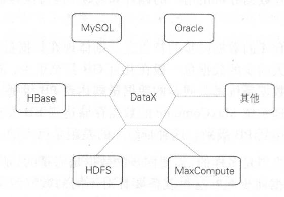

可接入的数据源

采用 Framework+Plugin 的开放式框架实现, 处理 缓冲、流程控制、并发、上下文加载等高速数据交换的大部分技术问题, 并提供简单的接口与插件接人(见图 )。插件仅需实现对数据处理系 统的访问,编写方便,开发者可以在极短的时间内开发 个插件以快速 支持新的数据库或文件系统。数据传输在单进程(单机模式)/多进程 (分布式模式)下完成,传输过程全内存操作,不读写磁盘,也没有进

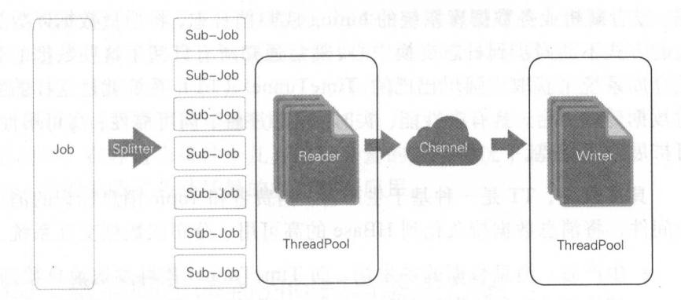

间通信,实现了在异构数据库或文件系统之间的高速数据交换。

3.5 DataX 架构设计图

- Job :数据同步作业
- Splitter :作业切分模块,将 个大任务分解成多个可以并发行的 小任务
- Sub-Job :数据同步作业切分后的小任务,或称之为 Task
- Read er :数据读人模块,负 运行切分后的小任务,将数据从源 系统 载到 DataX
- Channel: eader Writer 通过 hannel 交换数据。
- Writer :数据 出模块,负责将数据从 DataX 导人目标数据系统。

# 3.2.2 实时数据同步

对于日 志类数据来说,由于每天的日志是源源不断 生的,并且分 布在不同的服务器中,有些大型互联网公司的服务器集群有成千上万台 机器,所以所产生的日志需要尽快以数据流的方式不间断地同步到数据 仓库。 另外,还有 些数据应用,需要对业务系统产生的数据进行实时 处理,比如 猫"双 "的数据大屏,对所产生的交易数据需要实时 汇总,实现秒级的数据刷新。这类数据是通过解析 MySQL binlog (相当于 Orac le 的归档日志)来实时获得增量的数据更新,并通过 消息订阅模式来实现数据的实时同步的。具体来说 ,就是建立 个日志

数据交换中心,通过专门的模块从每台服务器源源不断地读取日志数 据,或者解析业务数据库系统的 binlog 或归档日志,将增量数据以数据 流的方式不断同步到日志交换中心,然后通知所有订阅了这些数据的数 据仓库系统来获取。阿里巴巴的 (TT )系统就是这样的实 时数据传输平台,具有高性能、实时性、顺序性、高可靠性、高可用性、 可扩展性等特点。

具体来说, 是一种基于生产者、消费者和 Topic 消息标识的消息 中间件,将消息数据持久化到 的高可用、分布式数据交互系统。

- ·生产者 :消息数据的产生端,向 集群发送消息数据, 就是图 中的生产
- ·消费者:消息数据的接收端,从 集群中获取数据进 行业务处理。
- Topic :消息类型的标识,如淘 志的 Topic 生产 和消费 需要知道对应的 Topic 字。
- 模块 负责处理客户端收发消息数据的请求,然后往 取发数据

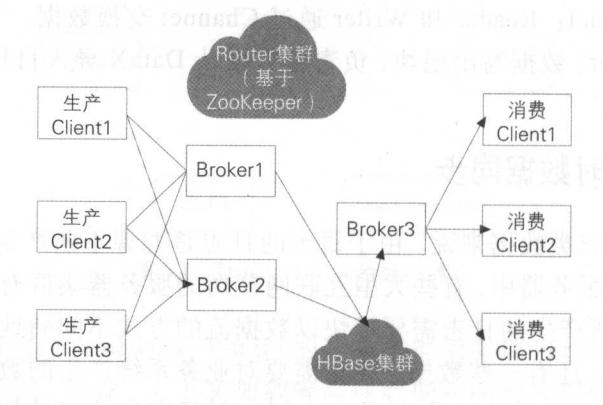

实时数据传输示意图

Time Tunnel 支持主动、被动等多种数据订阅机制,订阅端自动负载 均衡,消费者自己把握消费策略。对于读写比例很高的 Topic ,能够做 到读写分离,使消费不影响发送。同时支持订阅历史数据,可以随意设 置订阅位置,方便用户回补数据。另外,针对订阅有强大的属性过滤功 能,用户只需关心自己需要的数据即可。 Ti Tu nn 高效 稳定地支持 阿里巴巴实时数据的同步,每天处理的日志类数据多达几百 ,数据 bin og 解析的实时增量数据同步也有几百 ,在天猫"双 <sup>l</sup> <sup>l</sup> "大促 活动中,在峰值为每秒十几万笔交易量的极端情况下延迟控制在 3s 内,有效保障了各种场景的实时数据应用。

# 3.3 数据同步遇到的问题与解决万案

在实际的大数据同步应用中会遇到各种各样的挑战,处理方法也是 不断变化的,下面就针对常见的问题一起讨论一下解决方案。

# 3.3.1 分库分表的处理

随着业务的不断增长,业务系统处理的数据量也在飞速增加,需要 系统具备灵活的扩展能力和高并发大数据量的处理能力,目前一些主流 数据库系统都提供了分布式分库分表方案来解决这个问题(见图 3. )。 但是对于数据同步来说,这种分库分表的设计无疑 大了同步处理的复 杂度。试想 下,如果有一个中间表,具备将分布在不同数据库中的不 同表集成为 个表的能力,就能让下游应用像访问单库单表一样方便。

阿里巴巴的 TDDL ( Taobao Distributed Data ayer )就是这样一个 分布式数据库的访问引擎,通过建立中间状态的逻辑表来整合统一分库 分表的访问(见图 3.8 )。

TD 是在持久层框架之下、 DB 驱动之上的中间件,它与 DB 规范保持一致,有效解决了分库分表的规则引擎问题,实现了 QL 析、规则计算、表名替换、选择执行单元并合并结果集的功能,同时解 决了数据库表的读写分离、高性能主备切换的问题,实现了数据库配置 信息的统 管理。

大数据之路一一间里巴巴大数据实践

一寸

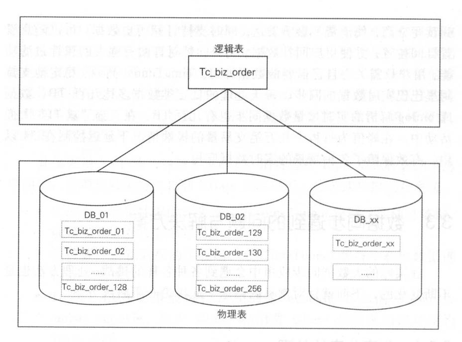

分库分表处理

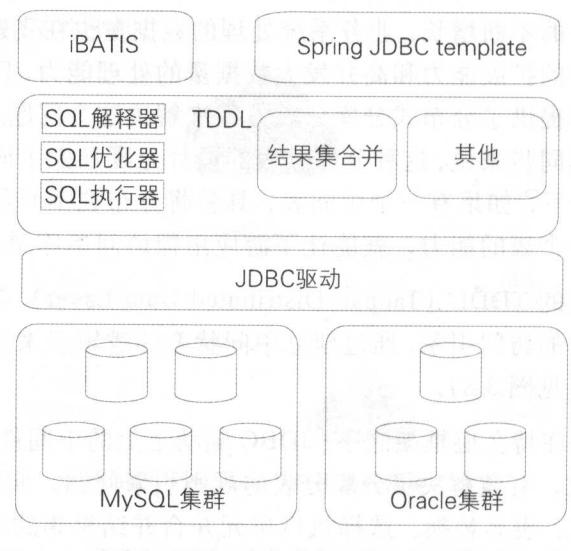

分布式数据库访问引擎

# 3.3.2 高效同步和批量同步

数据同步的方法通常是先创建目标表 ,再通过同步工具的填写数据 库连接、表 段等各种配置信息后测试完成数据同步。这也是 DataX 任务的配置过程,同步中心对 DataX 进行进 步封装,通过源系统元数 据降低了数据库连接、表和字段等信息的配置复杂度,但在实际生产过 中我们仍然会遇到 些问题。

- ·随着业务的发展和变化,会新增大批量的数据同步,使用传统方 式每天去完成成百上千的数据同步工作,一方面,工作量会特别 方面,相似并且重复的操作会降低开发人员的工作热情。
- .数据仓库 的数据源种类特别丰富,遇到不同类型的数据源同步就 要求开发人员去了解其特殊配置。
- ·部分真正 的数据需求方,如 Java 开发和业务运营,由于存在相 关数据同步的专业技能门槛,往往需要将需求提交给数据开发方 来完成,额外增加了沟通和流程成本。

为了解决上述问题,网里巴巴数据仓库研发了 OneC lick 产品:

- 对不同数据源的数据同步配置透明化,可以通过库名和表名唯 定位,通过 IDB 接口获取元数据信息自动生成配置信息。
- ·简化了数据同步的操作步骤,实现了与数据同步相关的建表、配 置任务、发布、测试操作一键化处理,并且封装成 Web 接口进 步达到批量化的效果。
- 降低了数据同步的技能门槛,让数据需求方更加方便地获取和使

通过 OneClick 产品,真正实现了数据的一键化和批量化同步,一 键完成 DDL DML 生成、数据的冒烟测试以及在生产环境中测试 等。因 此,阿里巴巴通过极少的人力投入,实现了数据同步的集中化建 设和管理:改变了之前各数据开发人员自行同步带来的效率低、重复同 和同步配置质量低下等问题,大大降低了数据同步成本。

注: IDB 是阿里巴巴集团用于统一管理 MySQL Ocean Base PostgreSQL acle SQL Se ver 等关系型数据库的平台,它是一种集数据管理、结构 一寸大数据之路一-阿里巴巴大数据实践

管理、诊断优化、实时监控和系统管理于一休的数据管理服务;在对集 团数据库表的统一管理服务过程中, 产出了数据库、在、宇段各个 级别元数据信息,并且提供了元数据接口服务。

# 3.3.3 增量与全量同步的合并

在批量数据同步中,有些表的数据量随着业务的发展越来越大,如 果按周期全量同步的方式会影响处理效率。在这种情况下,可以选择每 次只同步新变更的增量数据,然后与上一个同步周期获得的全量数据进 行合井,从而获得最新版本的全量数据。

在传统的数据整合方案中,合并技术大多采用 merge 方式 ( update+insert ):当前流行的大数据平台基本都不支持 update 操作 ,现 在我们比较推荐的方式是全外连接( full outer join) +数据全量覆盖 重新加载( ),即如日调度,则将当天的增量数据和前一 天的全量数据做全外连接,重新加载最新的全量数据。在大数据量规模 下,全量更新的性能比 update 要高得多。此外,如果担心数据更新错 误问题,可以采用分区方式,每天保持 个最新的全量版本,保留较短 的时间周期(如 天)

另外,当业务系统的表有物理删除数据的操作,而数据仓库需要保 留所有历史数据时,也可以选择这种方式,在数据仓库中永久保留最新 全量数据快照 下面我们以淘宝订单表的具体实例来说明。

淘宝交易订单表,每天新增、变更的增量数据多达几亿条,历史累 计至今的全量数据则有几百亿条,面对如此庞大的数据量,如果每天从 业务系统全量同步显然是不可能的 可行的方式是同步当天的增量数 据,并与数据仓库中的前一天全量数据合并,获得截至当天的最新全量 数据(见图 )。

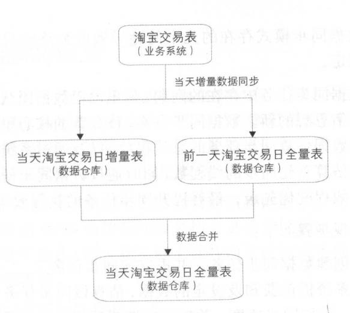

3.9 沟宝交易订单同步示意图

# 3.3.4 同步性能的处理

数据同步任务是针对不同数据库系统之间的数据同步问题而创建 系列周期调度的任务。在大型的数据调度工作台上,每天会运行大 量的数据同步任务。针对数据同步任务 一般首先需要设定首轮同步的 线程数,然后运行同步任务。

这样的数据同步模式存在以下几个问题:

- ·有些数据同步任务的总线程数达不到用户设置的首轮同步的线 程数时,如果同步控制器将这些同步线程分发到 PU 较繁忙 的机器上,将导致这些同步任务的平均同步速度非常低,数据同 步速度非常慢。
- ·用户不清楚该如何设置首轮同步的线程数,基本都会设置成一个 固定的值,导致同步任务因得不到合理的 PU 资源而影响同步 效率。
- ·不同的数据同步任务的重要程度是不一样的,但是同步控制器平 等对待接收到的同步线程,导致重要的同步线程因得不 CPU 资源而无法同步。

章数据同步丁一

上述数据同步模式存在的几个问题导致的最终结果是数据同步任 务运行不稳定。

针对数据同步任务中存在的问题,阿里巴巴数据团队实践出了一套 基于负载均衡思想的新型数据同步方案。该方案的核心思想是通过目标 数据库的元数据估算同步任务的总线程数,以及通过系统预先定义的期 望同步速度估算首轮同步的线程数,同时通过数据同步任务的业务优先 级决定同步线程的优先级,最终提升同步任务的执行效率和稳定性。

具体实现步骤如下

- ·用户创建数据同步任务,并提交该同步任务。
- 根据系统提前获知及设定的数据,估算该同步任务需要同步的数 据量、平均同步速度、首轮运行期望的线程数、需要同步的总线 程数。
- ·根据需要同步的总线程数将待同步的数据拆分成相 等数量的数 据块,一个线程处理 个数据块,并将该任务对应的所有线程提 交至同步控制器。
- 同步控制器判断需要同步的总线程数是否大于首轮运行期望的 线程数,若大于,则跳转至 若不大于,则跳转至。
- 同步控制器采用多机多线程的数据同步模式,准备该任务第一轮 线程的调度,优先发送等待时间最长、优先级最高且同 任务的 线程。
- 同步控制器准备一定数据量(期望首轮线程数-总线程数)的虚 拟线程,采用单机多线程的数据同步模式 ,准备该任务相应实体 线程和虚拟线程的调度,优先发送等待时间最长、优先级最高且 单机 剩余资源可以支持首轮所有线程数且同 任务的线 程,如果没有满足条件的机器,则选择 剩余资源最多的机 器进行首轮发送。
- 数据任务开始同步,并等待完成。
- 数据任务同步结束。

# 3.3.5 数据漂移的处理

通常我们把从源系统同步进人数据仓库的第一层数据称为 ODS stag ing 层数据,阿里巴巴统称为 ODS 。数据漂移是 ODS 数据的一个 顽疾,通常是指 ODS 表的同一个业务日期数据中包含前一天或后 凌晨附近的数据或者丢失当天的变更数据。

由于 ODS 需要承接面向历史的细节数据查询需求,这就需要物理 落地到数据仓库的 ODS 表按时间段来切分进行分区存储 ,通常的做法 是按某些时间戳字段来切分,而实际上往往由于时间戳字段的准确性问 题导致发生数据漂移。

通常,时间戳字段分为四类:

- 数据库表中用来标识数据记录更新时间的时间戳字段(假设这类 字段叫 modified time )。
- 数据库日志中用来标识数据记录更新时间的时间戳字段·(假设这 类宇段叫 log\_time
- 数据库表中用来记录具体业务过程发生时间的时间戳字段 (假设 这类字段叫 proc\_time
- 标识数据记录被抽取到时间的时间戳字段(假设这类字段 extract time

理论上,这几个时间应该是 致的,但是在实际生产中,这几个时 间往往会出现差异,可能的原因有以下几点

- 由于数据抽取是需要时间的, extract\_ti me 往往会晚于前三个时 间。
- ·前台业务系统手工订正数据时未更新 modified\_time
- 由于网络或者系统压力问题, log\_time 或者 modified\_time 会晚 proc time

通常的做法是根据其中的某 个字段来切分 ODS 表,这就导致产 生数据漂移。下面我们来具体看下数据漂移的几种场景。

- 根据 extract\_ti me 来获取数据。这种情况数据漂移的问题最明显
- 根据 modified\_time 限制。在实际生产中这种情况最常见,但是 往往会发生不更新 modified time 而导致的数据遗漏,或者凌晨

时间产生的数据记录漂移到后

- 根据 log\_time 限制。由于网络或者系统压力问题, log 会晚 proc\_time ,从而导致凌晨时间产生的数据记录漂移到后一天。 例如,在淘宝"双 <sup>l</sup> <sup>l</sup> "大促期间凌晨时间产生的数据量非常大, 用户支付需要调用多个接口,从而导致 log 晚于实际的支付 时间。
- 根据 proc\_time 限制。仅仅根据 proc\_time 限制,我们所获取的 表只是包含一个业务过程所产生的记 ,会遗漏很多其他过 程的变化记录,这违背了 和业务系统保持 致的设计原则

处理方法主要有以下两种:

( l )多获取后 天的数据

既然很难解决数据漂移的问题,那么就在 每个时间分区中向 前、向后多冗余 些数据,保障数据只会多不会少,而具体的数据切分 让下游根据自身不同的业务场景用不同的业务时间 proc 来限制 但是这种方式会有一些数据误差,例如 个订单是当天支付的,但是第 天凌晨申请退款关闭了该订单,那么这条记录的订单状态会被更新, 下游在统计支付订单状态时会出现错误。

(2 )通过多个时间戳字段限制时间来获取相对准确的数据

- 首先根据 log\_time 分别冗余前一天最后 分钟的数据和后一天 凌晨开始 分钟的数据,并用 过滤非当天数据, 确保数据不会因为系统问题而遗漏。
- 然后根据 log\_time 获取后一天 分钟的数据 针对此数据,按 照主键根据 log\_time 做升序排列去重。因为我们需要获取的是最 接近当天记录变化的数据(数据库日志将保留所有变化的数据, 但是落地到 表的是根据主键去重获取最后状态变化的数 据)。
- 最后将前两步的结果数据做全外连接,通过限制业务时间 proc\_time 来获取我们所需要的数据。

下面来看处理淘宝交易订单的数据漂移的实际案例。

我们在处理"双 "交易订单时发现,有 大批在

月川日

23:59:59 左右支付的交易订单漂移到了 <sup>12</sup> 。主要原因是用户下单支 付后系统需要调用支付宝的接口而有所延迟,从而导致这些订单最终生 成的时间跨天了。即 modified time log\_time 都晚于 proc\_time

如果订单只有一个支付业务过程,则可以用支付时间来限制就能获 取到正确的数据。但是往往实际订单有多个业务过程 下单、支付、成 功,每个业务过程都有相应的时间戳字段,并不只有支付数据会漂移。

如果直接通过多获取后 天的数据,然后限制这些时间,则可以获 取到相关数据,但是后 天的数据可能已经更新多次,我们直接获取到 的那条记录已经是更新多次后的状态,数据的准确性存在 定的问题。

因此,我们可以根据实际情况获取后 <sup>15</sup> 分钟的数据,并限制 个业务过程的时间戳字段(下单、支付、成功)都是"双 "当天 的,然后对这些数据按照订单的 modified time 升序排列,获取每个 订单首次数据变更的那条记录。

此外,我们可以根据 log\_time 分别冗余前 天最后 <sup>15</sup> 分钟的数据 和后 天凌晨开始 <sup>15</sup> 分钟的数据,并用 modified time 过滤非当天数据, 针对每个订单按照 log time 进行降序排列 ,取每个订单当天最后一次数 据变更的那条记录。

最后将两份数据根据订单做全外连接,将漂移数据回补到当天数据中。

# 离线数据开发

从采集系统中收集了大量的原始数据后,数据只有被整合和计算, 才能被用于洞察商业规律,挖掘潜在信息,从而实现大数据价值,达到 赋能于商业和创造价值的目的。面对海 的数据和复杂的计算,阿里巴 巴的数据计算层包括两大体系:数据存储及计算平台 (离线计算平 MaxCompute 实时计算平台 StreamCompute 、数据整合及管理体系 ( OneData

本章主要介绍 Compute 和阿里巴巴内部基于 Compute 数据开发套件,并对在数据开发过程中经常遇到的问题和相关解决方案 进行介绍。

### 4.1 数据开发平台

阿里数据研发岗位的工作大致可以概括为:了解需求→模型设计→ 开发→测试→发布上线→日常运维→任务下线。与传统的数据仓库 开发( ETL )相比,阿里数据研发有如下几个特点:

- ·业务变更频繁一一业务发展非常快 ,业务需求多且变更频繁。
- .需要快速交付一一业务驱动 ,需要快速给出结果。
- 频繁发布上线一一迭代周期以天为单位,每天需要发布数次。
- 运维任务多一一在集团公共层平均每个开发人员负责 <sup>500</sup> 多个任
- 系统环境复杂一一阿里平台系统多为自研,且为了保证业务的发 展,平台系统的迭代速度较快,平台的稳定性压力较大。

通过统 的计算平台( MaxCompute )、统 的开发平台( D2 等相 关平 台和工具)、统 的数据模型规范和统一的数据研发规范,可以在 定程度上解决数据研发的痛点。

# 4.1.1 统一计算平台

阿里离线数据仓库的存储和计算都是在阿里云大数据计算服务 Max Com put 上完成的。

大数据计算服务 MaxCompute 是由阿里云自主研发的海量数据处 理平台,主要服务于海量数据的存储和计算 ,提供完善的数据导人方案, 以及多种经典的分布式计算模型,提供海量数据仓库 的解决方案,能够 更快速地解决用户的海量数据计算问题,有效降低企业成本,并保障数 据安全。

Max Compute 采用抽象的作业处理框架 ,将不同场景的各种计算任 务统一在同一个平台之上,共享安全、存储 、数据管理和资源调度,为 自不同用户需求的各种数据处理任务提供统 的编程接口和界面。它 提供数据上传/下载通道、 SQL MapReduce 、机器学习算法 图编程模 和流式计算模型多种计算分析服务,并且提供完善的安全解决方案。

# 1 . MaxCompute 的体系架构

Max Compute 的体系架构如图 4.1 所示。

| 一寸        | 大数据之路-一阿里巴巴大数据实践                                      |                                           |
|-----------|-------------------------------------------------------|-------------------------------------------|
|           |                                                       | L<br>nm盟mm<br>墨噩噩姐·                       |
|           | 牛<br>也                                                | 商用跚跚栩栩帽现黯理                                |
| ~υ .<br>L | 吃:·~<br>~~<br>二二二,<br>吧"'<br>饪⑥吧。                     | 二同<br>I<br>一一一_.),<br>回国画<br>噩噩瞌噩噩<br>CJ. |
|           | • MaxCompute<br>存储八十算层<br>(MRTob)<br>s~J~<br>一〉<br>ux | 才;同<br>J<br>'<br>L<br>盟国噩噩噩噩              |

MaxCompute 体系架构图

MaxCompute 由四部分组成,分别是客户端( MaxCompute )、 接人层( MaxCompute Front End )、逻辑层( MaxCompt )及存 储与计算层( Apsara Core )。

Max Compute 户端有以下几种形式。

- Web :以 的方式提供离线数据处理服务。
- :对 的封装,目前有 等版本的实现。
- CLT (Command Line Tool ): 运行在 下的客户 端工具,通过 可以提交命令完成 Project 管理、 等操作。
- :上层可视化 工具, 即阿里内部名称是在云端( 02 ) , 用户可以基于在云端完成数据同步、任务调度、报表生成等常见 操作。

接人层提供 服务、 、负载均衡,实现用户认证和服务 层面的访问控制。

逻辑层又称作控制层,是 MaxCompute 的核心部分,实现用户空间 和对象的管理、命令的解析与执行逻辑、数据对象的访问控制与授权等 功能。在逻辑层有 Worker Sc heduler Executor 三个角色

- Worker 处理所有的阻STful 请求,包括用户空间( Project )管 理操作、资源( Resource 管理操作、作业管理等,对于 SQLDML MR 等需要启动 MapReduce 的作业,会生成 MaxCompute Instance (类似于 Hive 中的 Jo ,提交给 cheduler 一步处理。
- Scheduler MaxCompute Instance 的调度和拆解,并向计算层 的计算集群询问资源占用情况以进行流控。
- Executor 负责 MaxCompute Instance 的执行,向计算层的计算集 群提交真正的计算任务。

计算层就是飞天内核( Apsara Core ),运行在和控制层相互独 计算集群上 ,它包括 Pangu (分布式文件系统)、 uxi (资源调度系统) Nuwa/ZK Jamespace 务) Shennong (监控模块)等。 MaxCompute 中的元数据存储在阿里云计算 的另 个开放服务 OTS (Open Table Se rvice ,开放结构化数据服务) 中,元数据内容主要包括用户空间元数 据、 Table Partition Schema ACL Job 元数据、安全体系等。

# 2 . MaxCompute 的特点

(1 )计算性能高且更加普惠

<sup>2016</sup> IO 日, Sort Benchmark 在官方网站公布了 <sup>016</sup> 年排 序竞赛 loud Sort 项目的最终成绩。阿里云以 1.44 TB 的成绩获得 Indy (专用目的 序)和 Daytona (通用目的排序)两个子项的世界冠军,打 破了 WS <sup>2014</sup> 年保持的纪录\$4.51 TB 。这意味着阿里云将世界顶级 的计算能力,变成普惠科技 云产品。 CloudSort 又被称为"云计算效 率之争",这项目赛 比拼的是完成 IOOTB 数据排序谁的花费更少,也是 Sort Benchmark 的各项比赛当 中最具现实意义的项目之一。

(2 )集群规模大且稳定性高

Max Compute 平台共有几万台机器、存储近 IOOOPB ,支撑着阿里 巴巴的很多业务系统,包括数据仓库、 BI 分析和决策支持、信用评 和无担保贷款风险控制、广告业务、每天几十亿流 的搜索和推荐相关 性分析等,系统运行非常稳定。同时, MaxCompute 能保证数据的正确 性,如对数据的准确性要求非常高的蚂蚁金服小额贷款业务,就运行于 Max Compute 平台之上

(3 )功能组件非常强大

- MaxCompute SQL :标准 SQL 的语法,提供各类操作和函数来处
- MaxCompute MapReduce :提供 Java MapReduce 编程模型,通 过接口编写 MR 程序处理 MaxCompute 中的数据。还提供基于 MapReduce 的扩展模型 MR2 ,在该模型下, Ma 函数后可 以接人连续多个 Reduce 函数,执行效率比普通的 MapReduce
- MaxCompute Graph :面向迭代的 图计算处理框架,典型应用有 PageRank 、单源最短距离算法、 ,均 值聚类算法。
- Spark :使用 Spark 接口编程处理存储在 Max Compute 中的数据
- RMaxCompute :使用 处理 MaxCompute 中的数据。
- Volume: MaxCompute Vo lume 形式支持文件,管理非二维 表数据。

(4 )安全性高

Max Compute 提供功能强大的安全服务,为用户的数据安全提供保 护。 MaxCompute 采用多租户数据安全体系,实现用户认证、项目 的用户与授权管理、跨项目空间的资源分享,以及项目 间的数据保护 如支付宝数据,符合银行监管的安全性要求,支持各种授权鉴权审 "最小访问权限"原则,确保数据安全。

### 4.1.2 统一开发平台

阿里数据开发平台集成了 个子系统来解决实际生产中的各种痛 点。围 Max Comp 计算平台,从任务开发、调试、测试、发布、监 控、 到运维管理,形成了整套工具和产品,既提高了开发效率,又 保证了数据质量,并且在确保数据产出时效的同时,能对数据进行有效

数据研发人员完成需求了解和模型设计之后,进入开发环节,开发 工作流如图 所示。

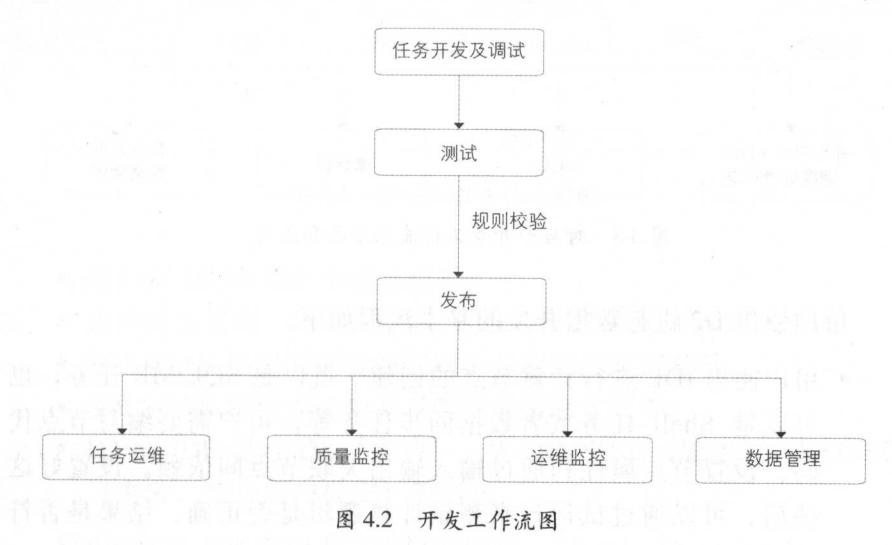

对应于开发工作流的产品和工具 ,我们 其功能进 行简要介绍。

在云端( 02)

是集成任务开发、调试及发布,生产任务调度及大数据运维 数据权限申请及管理等功能的一站式数据开发平台 并能承担数据分析 工作台 的功能。

一寸大数据之路一一阿里巴巴大数据实践


4.3 对应于开发工作流的产品和工具

用户使用 D2 进行数据开发的基本流程如下:

- 用户使用 IDE 行计算节点的创建,可以是 SQL/MR 任务,也 可以是 hell 务或者数据同步任务等,用户需要编写节点代 码、设置节点属性和通过输入输出关联节点间依赖。设置好这 些后,可以通过试运行来测试计算逻辑是否正确、结果是否 合预期。
- 用户点击提交,节点进入开发环境中,并成为某个工作流的其中 个节点。整个工作流可以被触发调度,这种触发可以是人为的 (称之为"临时工作流"),也可以是系统自动的(称之为"日 常工作流")。当某个节点满足所有触发条件后,会被下发到 度系统的执行引擎 lisa 中, 完成资源分配和执行的整个过程
- 如果节点在开发环境中运行无误,用户可以点击发布,将该节 正式提交到生产环境中,成为线上生产链路的 个环节

# 2. SQLSCAN

SQLSCAN 将在任务开发中遇到的各种问题,如用户编写的 质量差、性能低、不遵守规范等,总结后形成规则,并通过系统及研发 流程保障,事前解决故障隐患,避免事后处理。

SQLSCAN D2 进行结合,嵌入到开发流程中,用户在提交代码 时会触发 SQLS CAN 检查。 SQLSCAN 工作流程如图 4.4 所示。

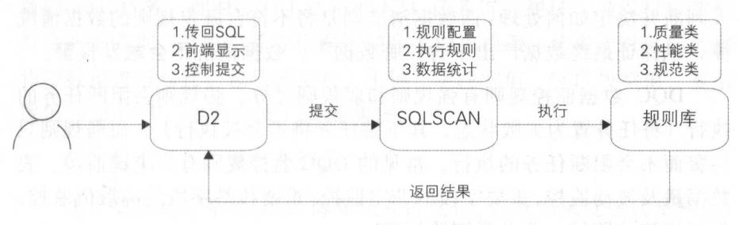

4.4 SQLSCAN 工作流程图

- 用户在 D2 IDE 中编写代码。
- 用户提交代码, D2 将代码、调度等信息传到 CAN
- SQLSCAN 根据所配置的规则执行相应的规则校验。
- SQLSCAN 将检查成功或者失败的信息传回 <sup>20</sup>
- D2 IDE 显示 OK (成功)、 WARNNING (警告)、 FAILE (失败,禁止用户提交)等消息。

SQLSCAN 主要有如下三类规则校验:

- 代码规范类规则,如表命名规范、生命周期设置、表注释等。
- 代码质量类规则,如调度参数使用检查、分母为 提醒、 NULL 值参与计算影响结果提醒、插入字段顺序错误等。
- 代码性能类规则,如分区裁剪失效、扫描大表提醒、重复计算检 测等。

SQLSCAN 规则有强规则和弱规则两类。触发强规则后,任务的提 交会被阻断,必须修复代码后才能再次提交 而触发弱规则,则只会显 示违反规则的提示,用户可以继续提交任务。

# 3. DQC

DQC (Data Quality Center ,数据质量中心)主要关注数据质量, 通过配置数据质量校验规则,自动在数据处理任务过程中进行数据质量

DQC 主要有数据监控和数据清洗两大功能。数据监控,顾名思义, 能监控数据质量并报警,其本身不对数据产出进行处理,需要报警接收 人判断并决定如何处理;而数据清洗则是将不符合既定规则的数据清洗 掉,以保证最终数据产出不含"脏数据",数据清洗不会触发报警。

DQC 数据监控规则有强规则和弱规则之分,强规则会阻断任务的 执行(将任务置为失败状态,其下游任务将不会被执行);而弱规则只 告警而不会阻断任务的执行。常见的 DQC 监控规则有:主键监控、表 数据量及波动监控、重要字段的非空监控、重要枚举宇段的离散值监控、 指标值波动监控、业务规则监控等。

阿里数据仓库的数据清洗采用非侵人式的清洗策略,在数据同步过 程中不进行数据清洗,避免影响数据同步的效率,其过程在数据进入 ODS 层之后执行。对于需要清洗的表,首先在 DQC 置清洗规则;对 于离线任务,每隔固定的时间间隔,数据人仓之后,启动清洗任务,调 DQC 配置的清洗规则,将符合清洗规则的数据清洗掉,并保存至 DIRTY 表归档。如果清洗掉的数据量大于预设的阐值,则阻断任务的 执行 否则不会阻断。

DQC 工作流程如图 4.5 所示。

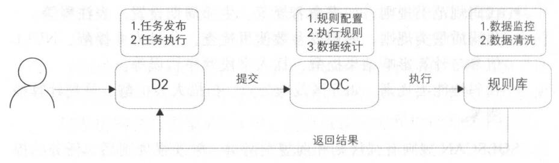

4.5 DQC 工作流程图

# 在彼岸

数据测试的典型测试方法是功能测试,主要验证目标数据是否符合 预期。其主要有如下场景

(1 )新增业务需求

新增产品经理、运营、 等的报表、应用或产品需求 需要开发 新的 务,此时应对上线前的 任务进行测试,确保目标数据 符合业务预期,避免业务方根据错误数据做出决策。其主要对目标数据 和源数据进行对比,包括数据量、主键、字段空值 、字段枚举值、复杂 逻辑(如 UDF 、多路分支)等的测试。

(2 )数据迁移、重构和修改

由于数据仓库系统迁移、源系统业务变化、业务需求变更或重构等, 需要对现有的代码逻辑进行修改 ,为保证数据质量需要对修改前后的数 据进行对比,包括数据量差异、宇段值差异对比等,保证逻辑变更正确。 为了严格保证数据质量,对于优先级(优先级的定义见"数据质量"章 节)大于某个阔值的任务,强制要求必须使用在彼岸进行回归测试,在 彼岸回归测试通过之后,才允许进入发布流程。

在彼岸则是用于解决上述测试问题而开发的大数据系统的自动化 测试平台,将通用的、重复性的操作沉淀在测试平台中,避免被"人肉", 提高测试效率。

在彼岸主要包含如下组件,除满足数据测试的数据对比组件之外, 还有数据分布和数据脱敏组件。

- 数据对比 支持不同集群、异构数据库的表做数据对比。表级对 比规则主要包括数据量和全文对比;字段级对比规则主要包括字 段的统计值(如 等)、枚举值、空值、 去重数、长度值等。
- 数据分布:提取表和字段的 些特征值 ,并将这些特征值与预期 值进行比对。表级数据特征提取主要包括数据量、主键等;字段

级数据特征提取主要包括字段枚举值分布、空值分布、统计值(如 SUM AVG MAX MIN 等)、去重数、长度值等。

.数据脱敏:将敏感数据模糊化。在数据安全的大前提下,实现线 上数据脱敏,在保证数据安全的同时又保持数据形态的分布,以 便业务联调、数据调研和数据交换。

使用在彼岸进行回归测试的流程如图 4.6 所示。

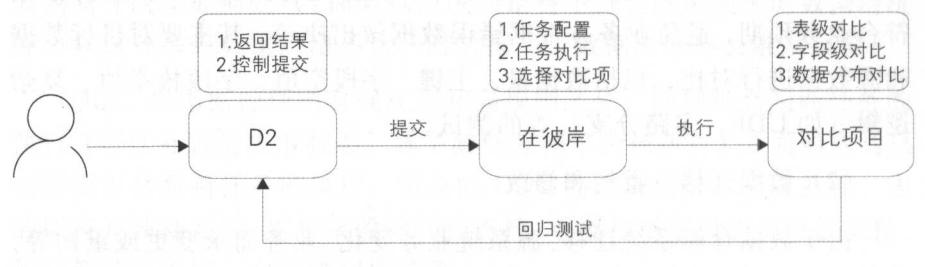

4.6 使用在彼岸进行回归测试流程图

# 4.2 任务调度系统

### 4.2.1 背景

现代信息化条件下的战争,从太空的卫星到空中的各类作战飞机, 从地面的导弹到坦克火炮,从水面的大小舰艇到水下的潜艇,还有诸如 网络、电磁环境等多种方式、多种维度的作战空间,各种武器装备、人 员、作战环境纷繁复杂,如何能够准确、合理地调配这些资源,组织有 序、高效的攻防体系赢得胜利,最关键的是需要有 个强大的指挥系统。 在云计算大数据时代,调度系统无疑是整个大数据体系的指挥中枢。

如图 4.7 所示,调度系统中的各类任务互相依赖,形成 个典型的 有向无环图。在传统的数据仓库系统中,很多是依靠 Cron tab 定时任务 功能进行任务调度处理的。这种方式有很多弊端:①各任务之间的依赖 基于执行时间实现,容易造成前面的任务未结束或失败而后面的任务已

运行;②任务难以并发执行,增加了整体的处理时间:③无法设置任务 优先级;④任务的管理维护很不方便,无法进行执行效果分析等。

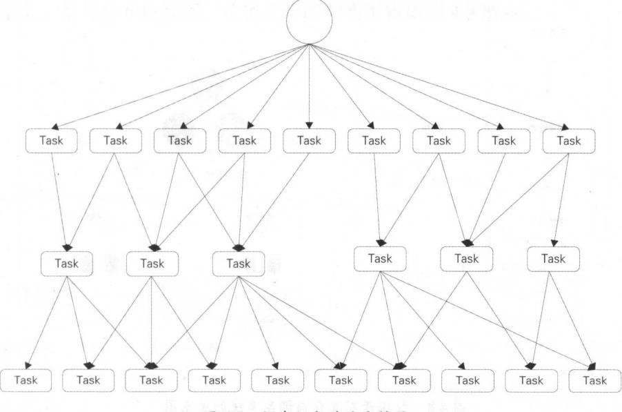

4.7 调度任务关系依赖图

而在大数据环境下,每天需要处理海量的任务,多的可以达到几 十上百万。另外,任务的类型也很繁杂,有 MapReduce Hive SQL Spark Java Shell Python Perl 、虚拟节点等,任务之间互相依赖且 要不同的运行环境。为了解决以上问题,阿里巴巴的大数据调度系统 运而生。

### 4 .2.2 介绍

# 1 数据开发流程与调度系统的关系

数据开发流程与调度系统的关系如图 .8 所示。

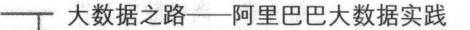

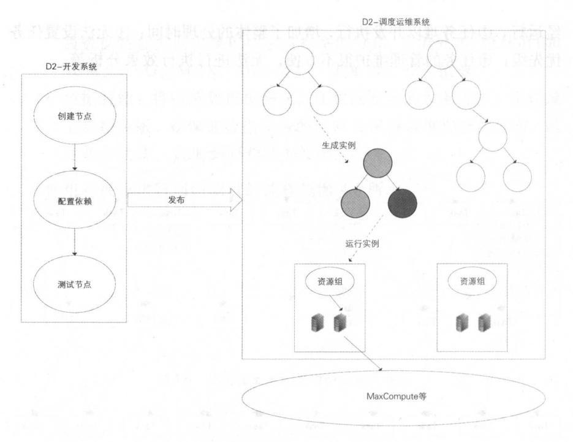

4.8 数据开发流程与调度系统的关系图

用户通过 平台提交、发布的任务节点,需要通过调度系统,按 照任务的运行顺序调度运行。

# 调度系统的核心设计模型

整个调度系统共有两个核心模块:调度引擎( Phoenix Engine )和 执行引擎 li )。简单来说,调度引擎的作用是根据任务节点属性 及依赖关系进行实例化, 生成各类参数的实值,并生成调度树 执行引 擎的作用是根据调度引擎生成的具体任务实例和配置信息,分配 CPU 内存、运行节点等资源 在任务对应的执行环境中运行节点代码

在介绍调度引擎设计之前 我们先来了解两个模型:任务状态机 型和工作流状态机模型。

# 任务状态机模型

任务状态机模型是针对数据任务节点在整个运行生命周期的状态 定义 ,总共有 种状态,状态之间的转换逻辑如图 4.9 所示。

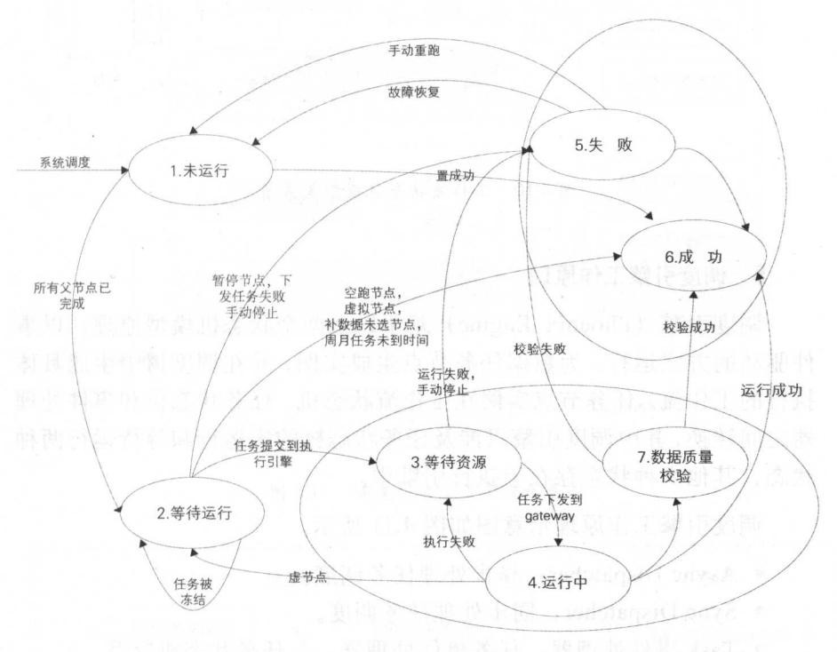

4.9 任务状态机模型关系图

# 4. 工作流状态机模型

工作流状态机模型是针对数据任务节点在调度树中生成的工作流 运行的不同状态定义,共有 种状态,其关系如图 4.10 所示。

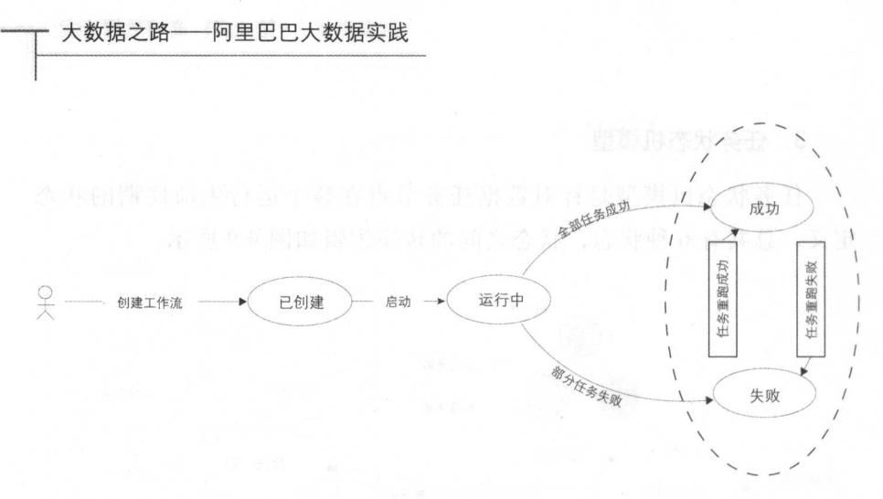

工作流状态机模型关系图

# 5. 调度引擎工作原理

调度引擎( Phoenix Engine )基于以上两个状态机模型原理,以 件驱动的方式运行,为数据任务节点生成实例,并在调度树中生成具体 执行的工作流。任务节点实例在工作流状态机、任务状态机和事件处 器之间转换,其中调度引擎只涉及任务状态机的未运行和 待运行两 状态,其他 种状态存在于执行引擎中。

调度引擎工作原理示意图如图 4.1 所示。

- Async Dispatcher :异步处理任务调度。
- Sync Dispatcher :同步处理任务调度。
- Task 事件处理器:任务事件处理器,与任务状态机
- DAG 事件处理器:工作流事件处理器,与工作流状态机交互。 DAG 事件处理器包含若干个 Task 件处理器

# 6. 执行引擎工作原理

首先来看看执行引擎( Alisa )的逻辑架构,如图 4.12 示。

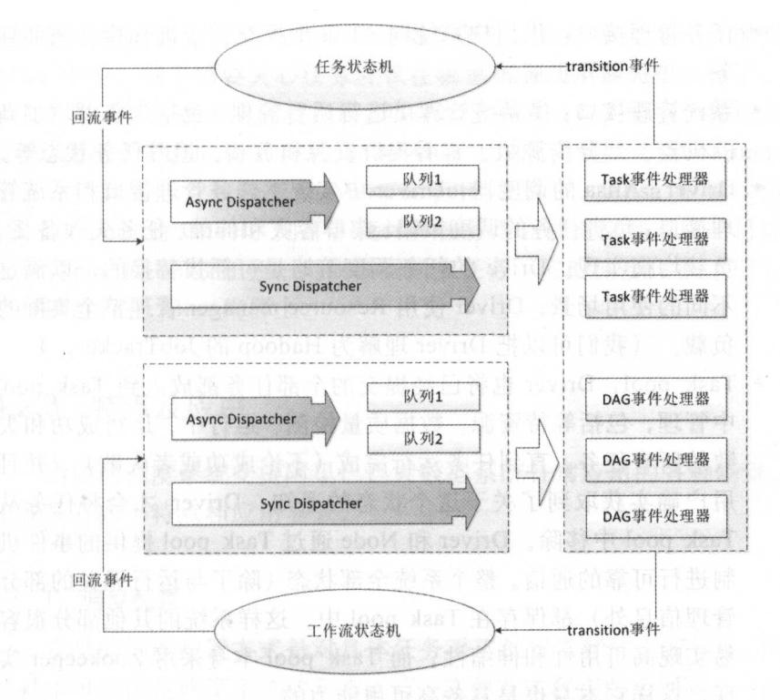

4.11 调度引擎工作原理示意图

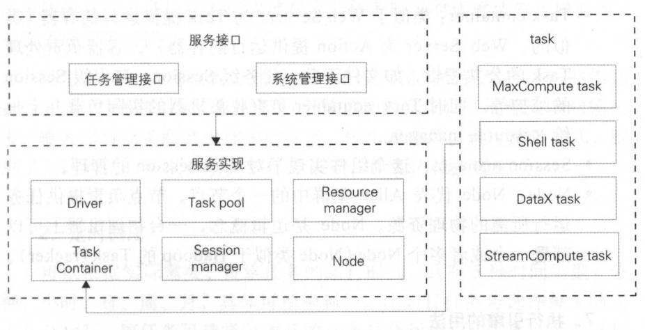

4.12 执行引擎逻辑架构图

- 任务管理接口:供用户系统向 Alisa 中提交、查询和操作离线任 务,并获得异步通知。
- 系统管理接口 供系统管理员进行后台管理,包括为集群增加新 的机器、划分资源组、查看集群资源和负载、追踪任务状态等。
- Driver: Alisa 的调度器, Driver 中实现了任务管理接口和系统 理接口;负责任务的调度策略、集群容灾和伸缩、任务失效备援、 负载均衡实现。 的任务调度策略是可插拔替换的,以满 不同的使用场景。 Driver 使用 Resource manager 管理整个集群的 负载。 (我们可以把 Driver 理解为 Hadoop Job Tracker 。)
- Task pool: Driver 也将已经提交的全部任务都放入到 Task pool 中管理,包括等待资源、数据质量检测、运行中、运行成功和 败的所有任务。直到任务运行完成(不论成功或者失败),并 用户确实获取到了关于这个状态的通知, 将任务从 Task pool 中移除。 Node 通过 Task pool 提供的事件机 制进行可靠的通信。整个系统全部状态(除了与运行无关的部分 管理信息外)都保存在 Task pool 中,这样系统的其他部分很 易实现高可用性和伸缩性。而 Task pool 本身采用 Zoo keeper 现,这样它本身也是具备高可用能力的。
- Resource manager :这个组件专注于集群整体资源的管理。
- Task container :类似于 Web Server ,为 Task 提供运行的容器( 似的, Action 提供运行的容器)。容器负责处理 Task 的公共逻辑,如文件下载,任务级 Session 、流程级 Session 的维护等。同时 Task container 负责收集机器的实际负载并上报 Resource manager
- Session manager :这个组件实现了对 Task session 的管理。
- Node: Node 代表 集群中的 个节点。节点负责提供任 运行所需的物理资源。 是逻辑概念, 台物理机器上可 部署一个或者多个 Node (Node 类似于 Hadoop

# 执行引擎的用法

的用户系统包括上文的工作流服务、数据同步服务,以及调

# 章离线数据开发丁一

度引擎生成的各类数据处理任务的调度服务。这样系统将任务提交到 Alisa 中后,就不需要关心任务应该在哪里执行以及如何被执行了,于 是大大降低了系统本身的复杂度。同时其任务可以共享同一个物理集群 资源,提高了资源的利用效率。如果 Alisa 中的任务是一个 MaxCompute 任务,计算实际会被提交到 MaxCompute 集群中, Alisa 中仅仅运行 Max Compute Client ;同样,流计算任务等会被提交到对应的目标系 统中运行;而 hell 任务、离线数据同步任务、实时同步任务( TT )等 将直接运行在 lisa 集群上。

# 4.2.3 特点及应用

当前的调度系统支持阿里巴巴大数据系统日常应用的各种场景,其 主要具有如下特点和应用场景。

# 1 调度配置

常见的调度配置方式是对具体任务手工配置依赖的上游任务,此方 式基本可以满足调度系统的正常运行。这种方式存在两个问题 一是配 置上较麻烦,需要知道上游依赖表的产出任务 二是上游任务修改不再 产出依赖表或本身任务不再依赖某上游任务时,对调度依赖不做修改, 导致依赖配置错误。

阿里巴巴的调度配置方式采用的是输入输出配置和自动识别相结 合的方式。任务提交时, SQL 解析引擎自动识别此任务的输入表和输出 表,输入表自动关联产出此表的任务 ,输出表亦然。通过此种方式,解 决了上述问题,可以自动调整任务依赖,避免依赖配置错误。

# 定时调度

可以根据实际需要,设定任务的运行时间,共有 种时间类型:分 钟、小时、日、周、月,具体可精确到秒。 比如日任务可选择每天的几 点几分运行,周任务可选择每周几的几点几分运行,月任务也可选择每 月第几天的几点几分运行。对于周任务和月任务 ,通常选择定时调度的

# 一寸大数 一一阿里巴巴大数据实践

方式。

# 周期调度

可按照小时、日等时间周期运行任务,与定时调度的区别是无须指 定具体的开始运行时间。比如离线数据处理的大多数日任务就是这种类 型,任务根据依赖关系,按照调度树的顺序从上依次向下运行,每个周 期的具体运行时间随着每天资源和上游依赖任务运行的总体情况会有 所不同。

# 手动运行

当生产环境需要做一些数据修复或其他一次性的临时数据操作时, 可以选择手动运行的任务类型,在开发环境( IDE )中写好脚本后发布 到生产环境,再通过手动触发运行。

# 补数据

在完成数据开发的发布以后,有些表需要进行数据初始化,比如有 些日增量表要补齐最近三年的历史数据,这时就需要用到补数据任务 了。可以设定需要补的时间区间,并圈定需要运行的任务节点,从而生 成一个补数据的工作流,同时还能选择并行的运行方式以节约时间。

# 6. 基线管理

基于充分利用计算资源,保证重点业务数据优先产出,合理安排各 类优先级任务的运行,调度系统引人了按优先级分类管理的方法。优先 级分类从 ,数字越大代表优先级越高,系统会先保障高优先级任务 的运行资源。对于同一类优先级的任务,放到同 条基线中,这样可以 实现按优先级不同进行分层的统一管理,并可对基线的运行时间进行预 测估计,以监控是否能在规定的时间内完成。基线运行监控如表 刁亏。

| 序号 | 基线名称 | 完成状态                                                            | 基线时间<br>预警及承诺                          | 最晚任务信息<br>及运行状态                    |  |  |
|----|------|-----------------------------------------------------------------|----------------------------------------|------------------------------------|--|--|
|    | 基线   | 已完成<br>07 -25 04:40<br>完成<br>80 分钟<br>时间余盐<br>状态<br>安全          | 07-25 06:00<br>预警<br>07-25 07:00<br>承诺 | 、任务名称 I,<br>ID<br>执行状<br>完成<br>任人  |  |  |
| 2  | 基线   | 已完成<br>完成<br>-b<br>时间余£1<br>破线<br>状态                            | 预警<br>承诺                               | 任务 ID<br>、任务名称 2,<br>完成<br>任人      |  |  |
| 3  | 基线   | 未完成<br>预计完成时间<br>-y (表示超<br>时间余£]::<br>时长)<br>出承诺时间<br>破线<br>状态 | 预警<br>承诺                               | ID3 、任务名称 3,<br>运行中,<br>行状态<br>责任人 |  |  |
|    |      |                                                                 | ·                                      | ·                                  |  |  |

基线运行监控

# 监控报警

调度系统有 套完整的监控报警体系,包括针对出错的节点、运行 超时未完成的节点,以及可能超时的基线等,设置电话、短信、邮件等 不同的告警方式,实现了日常数据运维的自动化。具体产品介绍请参考 "数据质量"章节。

阿里巴巴的大数据调度系统经过几年的迭代研发和实际运行,目前 已经很好地支撑阿里系各个数据团队各类数据处理任务的日常运行和 维护,每天在系统上运行的各类数据处理任务多达数十万个,日处理数 据量达 级,在性能、成本控制、稳定性等方面取得了良好的效果。

.::a:.

# 实时技术

在大数据系统中,离线批处理技术可以满足非常多的数据使用场景 需求,但在 时代, 每天面对的信息是瞬息万变的,越来越多的应用 场景对数据的时效性提出了更高的要求。数据价值是具有时效性的,在 一条数据产生的时候,如果不能及时处理并在业务系统中使用,就不能 让数据保持最高的"新鲜度"和价值最大化。

如图 所示是 年"双 "全球狂欢节当天,面向媒体开发 的数据直播大屏在 点时定格的成交数据: 亿。在前台实时直播 的数据,实际上是阿里实时计算系统在承载。直播大屏对数据有着非常 高的精度要求,同时面临着高吞吐量、低延时、零差错、高稳定等多方 面的挑战。在"双门"的 小时中,支付峰值高达 万笔/秒,下单峰 值达 万笔/秒,处理的总数据量高达百亿,并且所有数据是实时对 外披露的,所以数据的实时计算不能出现任何差错。除此之外,所有的 代码和计算逻辑都需要封存,并随时准备面对监管机构的问询和检查

除面向媒体的数据大屏外,还有面向商家端的数据大屏、面向阿里 巴巴内部业务运营的数据大屏。整个大屏直播功能需要实时处理的数据 量非常庞大,每秒的总数据量更是高达亿级别,这就对实时计算架构提 出了非常高的要求。面对如此庞大的数据量,阿里巴巴的实时处理是如


何做到高精度、高吞吐量、低延时、强保障的呢?

5. 数据直播大屏

# 5. 1 简介

相对于离线批处理技术,流式实时处理技术作为一个非常重要的技 术补充,在阿里巴巴集团内被广泛使用。在大数据业界中,流计算技术 的研究是近年来非常热门的课题。

业务诉求是希望能在第一时间拿到经过加工后的数据,以便实时监 控当前业务状态并做出运营决策,引导业务往好的方向发展。比如网站 上一个访问量很高的广告位,需要实时监控广告位的引流效果,如果转 化率非常低的话,运营人员就需要及时更换为其 广告 以避免流量资 源的浪费。在这个例子中,就需要实时统计广告位的曝光和点击等指标 作为运营决策的参考。

按照数据的延迟情况,数据时效性一般分为三种(离线、准实时、

·离线:在今天( )处理 天前 N, N <sup>&</sup>gt; I )的数据,延迟时

间粒度为天。

- ·准实时 :在当前小时( )处理 小时前 ,如 小时、 小时等)的数据,延迟时间粒度为小时。
- ·实时 :在当前时刻处理当前的数据,延迟时间粒度为秒;

离线和准实时都可以在批处理系统中实现(比如 Hadoop Max Compute Spark 等系统),只是调度周期不一样而己,而实时数据 则需要在流式处理系统中完成。简单来说,流式数据处理技术是指业务 系统每产生一条数据,就会立刻被采集并实时发送到流式任务中进行处 理,不需要定时调度任务来处理数据。

整体来看 ,流式数据处理一般具有以下特征。

时效性高

数据实时采集、实时处理,延时粒度在秒级甚至毫秒级,业务方能 够在第一时间拿到经过加工处理后的数据。

# 常驻任务

区别于离线任务的周期调度,流式任务属于常驻进程任务, 动后就会一直运行,直到人为地终止,因此计算成本会相对比较高。这 一特点也预示着流式任务的数据源是无界的,而离线任务的数据源是有 界的。这也是实时处理和离线处理最主要的差别,这个特性会导致实时 任务在数据处理上有一定的局限性。

# 性能要求高

实时计算对数据处理的性能要求非常严格,如果处理吞吐量眼不 采集吞吐量,计算出来的数据就失去了实时的特性。比如实时任务 钟只能处理 秒采集的数据,那么产出的数据的延时会越来越长,不 能代表当前时刻的业务状态,有可能导致业务方做出错误的运营决策 在互联网行业中,需要处理的数据是海量的,如何在数据量快速膨胀的 情况下也能保持高吞吐量和低延时,是当前面临的重要挑战。因此,

时处理的性能优化占了任务开发的很大一部分工作。

# 4. 应用局限性

实时数据处理不能替代离线处理,除了计算成本较大这个因素外, 对于业务逻辑复杂的场景(比如双流关联或者需要数据回滚的情况), 其局限性导致支持不足。另外,由于数据源是流式的 在数据具有上下 文关系的情况下,数据到达时间的不确定性导致实时处理眼离线处理得 出来的结果会有一定的差异。

# 5.2 流式技术架构

在流式计算技术中,需要各个子系统之间相互依赖形成一条数据处 理链路,才能产出结果最终对外提供实时数据服务。在实际技术选型 可选的开源技术方案非常多,但是各个方案的整体架构是类似的 只是 各个子系统的实现原理不太一样。另外,流式技术架构中的系统跟离线 处理是有交叉的,两套技术方案并不是完全独立的,并且在业界中有合 并的趋势。

各个子系统按功能划分的话,主要分为以下几部分。

# 1 数据采集

数据的源头,一般来自于各个业务的日志服务器(例如网站的浏览 行为日志、订单的修改日志等),这些数据被实 采集到数据中间件中, 供下游实时订阅使用。

# 数据处理

数据被采集到中间件中后,需要下游实时订阅数据,并拉取到流式 计算系统的任务中进行加工处理。这里需要提供流计算引擎以支持流式 一寸大数据之路一一阿里巴巴大数据实践

任务的执行。

# 数据存储

数据被实时加工处理(比如聚合、清洗等)后,会写到某个在线服 务的存储系统中,供下游调用方使用。这里的写操作是增量操作,并且 是源源不断的。

# 数据服务

在存储系统上会架设一层统一的数据服务层(比如提供 接口、 服务 ),用于获取实时计算结果。

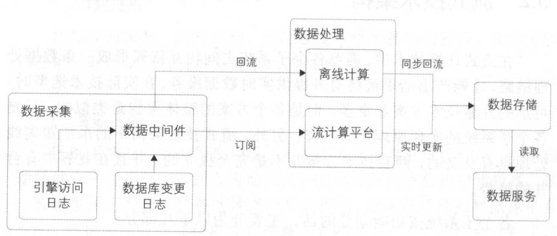

整体技术架构如图 示。

流式技术架构图

从图 可以看出,在数据采集和数据服务部分实时和离线是公用 的,因为在这两层中都不需要关心数据的时效性。这样才能做到数据源 的统一,避免流式处理和离线处理的不一致。

### 5.2.1 数据采集

数据采集是整个数据处理链路的源头,是所有数据处理链路的根节 点,既然需要做到实时计算,那么自然就需要做到实时采集了。所采集

'72

的数据都来自于业务服务器,从所采集的数据种类来看,主要可以划分 为两种:

- ·数据库变更日志,比如 MySQL binlog 志、 HBase hlog 志、 Ocean Base 的变更日志、 Oracle 的变更日志等。
- 引擎访问日志,比如用户访问网站产生的 pache 擎日志、搜 索引擎的接口查询日志等。

不管是数据库变更日志还是引擎访问日志,都会在业务服务器上落 地成文件,所以只要监控文件的内容发生变化,采集工具就可以把最新 的数据采集下来 。一般情况下,出于吞吐量以及系统压力上的考虑,并 是新增一条↓己录就采集 次,而是基于下面的原则,按批次对数据进

- 数据大小限制:当达到限制条件时,把目前采集到的新数据作为 批(例如 512KB 批)。
- 时间阐值限制:当时间达到 定条件时,也会把目前采集到的新 数据作为 批,避免在数据量少的情况下一直不采集(例如 <sup>30</sup>

只要上面的其中 个条件达到了,就会被作为 批新数据采集到数 据中间件中 这两个条件的参数需要根据业务的需求来设定,当批次采 频繁时,可以降低延时,但必然会导致吞吐量下降。

秒写 批)。

对于采集到的数据需要 个数据交换平台分发给下游,这个平台就 数据中间件。数据中间件系统有很多实现方式,比如开源的系统有 Kafka ,而阿里巴巴集团内部用得比较多的是 TimeTunnel (原理和 Kafka 似),还有 MetaQ Notify 等消息系统。

从图 .3 可以看出,消息系统是数据库变更节点的上游,所以它的 时比数据中间件低很多,但是其支持的吞吐量有限。因此,消息系统 般会用作业务数据库变更的消息中转,比如订单下单、支付等消息。 对于其他较大的业务数据(每天几十 容量), 般会通过数据中 间件系统来中转,虽然它的延时在秒级,但是其支持的吞吐量高。消息 统和数据中间件的性能对比如表 5.1 所示。

一寸大数据之路一一间里巴巴大数据实践

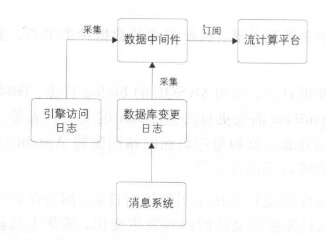

消息系统与数据中间仲、数据库之间的关系

消息系统和数据中间件的性能对比

|       | 时效性 | 吞吐量 |
|-------|-----|-----|
| 消息系统  |     |     |
| 数据中间件 |     |     |

另外,在一些情况下,有些业务并没有通过消息系统来对数据库进 行更新(比如有些子业务的订单数据是通过同步方式导人 MySQL 的) 也就是说,从消息系统中获取的数据并不是最全的,而通过数据库变 日志拿到的业务变更过程数据肯定是全的。因此,为了和离线数据源 致, 般都是通过数据中间件来采集数据库变更数据这种形式来获 取实时数据的(这需要在数据处理层对业务主键进行 merge 处理,比如 一笔订单可能会被变更多次,会有多条变更记录 ,这时就需要进行 merge 拿到最新的数据)。

时效性和吞吐量是数据处理中的两个矛盾体 ,很多时候需要从业务 的角度来权衡使用什么样的系统来做数据中转

### 5.2.2 数据处理

实时计算任务部署在流式计算系统上,通过数据中间件获取到实时 源数据后进行实时加工处理。在各大互联网公司中,有各种开源的和非 开源的流计算引擎系统在使用。在业界使用比较广泛的是 开源

Storm 系统、雅虎开源的 S4 系统、 Apache park Streaming ,以及 最近几年兴起的 Flink 。这些系统的整体架构大同小异,但是很多细节 上的实现方式不太一样,适用于不同的应用场景。

在阿里巴巴集团内使用比较多的是 阿里云提供的 StreamCompute 系统,作为业界首创的全链路流计算开发平台,涵盖了从数据采集到数 据生产各个环节,力保流计算开发严谨、可靠。其提供的 SQL 语义的 流式数据分析能力( StreamSQL ),让流数据分析门槛不再存在。它在 Storm 的基础上包装了一层 SQL 语义,方便开发人员通过写 SQL 就可 以实现实时计算,不需要关心其中的计算状态细节,大大提高了开发效 ,降低了流计算的门槛。当然,它也支持传统模式的开发,就像 Hadoop 中的 Hive MapReduce 关系一样,根据不同的应用场景选择不同的 方式。另 StreamCompute 还提供了流计算开发平台,在这个平台上 就可以完成应用的相关运维工作,不需要登录服务器操作 ,极大地提 了运维效率。

下面以 Stor 为例,简单讲一下流数据处理的原理。实时应用的整 个拓扑结构是 个有向无环图(详情可参考 Apache Storm 的官网: http :// storm.apache.org index.html ),如图 5.4 所示。

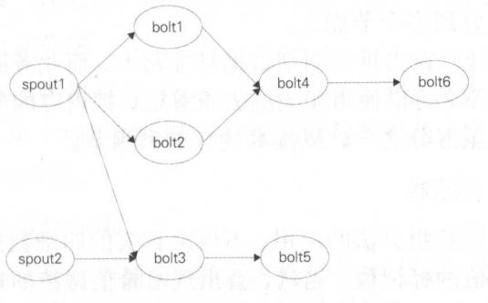

实时应用的整个拓扑结构图

- pou :拓扑的输人,从数据中间件中读取数据,并且根据自定 义的分发规则发送给下游的 bolt ,可以有多个输人源。
- bolt :业务处理单元,可以根据处理逻辑分为多个步骤,其相互 之间的数据分发规则也是自定义的。

应用出于性能考虑,计算任务往往是多线程的。 会根据业务主键进行分桶处理,并且大部分计算过程需要的数据都会放 在内存中,这样会大大提高应用的吞吐量。当然,为了避免内存溢出, 内存中过期的数据需要定时清理,可以按照 (最近最少使用)算 法或者业务时间集合归类清理(比如业务时间属于 的,会在今天凌 晨进行清理

下面就实时任务遇到的几个典型问题进行讲解。

巴巴大数据实践

# 1 .去重指标

(商业智能)统计类实时任务中 ,对于资源的消耗有一类指 标是非常高的,那就是去重指标。由于实时任务为了追求处理性能,计 算逻辑一般都是在内存中完成的,中间结果数据也会缓存在内存中,这 就带来了内存消耗过多的问题。在计算去重时,势必要把去重的明细数 据保存下来,当去重的明细数据达到上亿甚至几十亿时,内存中放不下 了,怎么办?这时需要分两种情况去看

- 精确去重。在这种情况下,明细数据是必须要保存下来的,当遇 到内存问题时,可以通过数据倾斜来进行处理,把一个节点的内 存压力分到多个节点上。
- ·模糊去重。在去重的明细数据量非常大,而业务的精度要求不 的情况下,可以使用相关的去重算法,把内存的使用 量降到千分 之一甚至万分之一 ,以提高内存的利用率。

( I )布隆过滤器

该算法是位数组算法的应用 不保存真实的明细数据,只保存明细 数据对应哈希值的标记位。当然,会出现哈希值碰撞的情况,但是误差 率可以控制,计算出来的去重值比真实值小。采用这个算法存储 亿条 数据只需要 空间。

适用场景 统计精度要求不高,统计维度值非常多的情况。比如统 计全网各个商家的 数据,结果记录数达到上千万条。因为在各个维 度之间,布隆过滤器是可以共用的。

(2 )基数估计

该算法也是利用哈希的原理,按照数据的分散程度来估算现有数集 的边界,从而得出大概的去重值总和。这里估算的去重值可能比真实值 大,也可能比真实值小。采用这个算法存储 亿条数据只需要几 KB

适用场景:统计精度要求不高,统计维度非常粗的情况。比如整个 大盘的 UV 数据,每天的结果只有一条记录。基数估计在各个维度值之 间不能共用,比如统计全天小时的 UV 数据,就需要有 个基数估计 对象,因此不适合细粒度统计的场景。

这两个算法可以在网上搜索到具体的实现细节,这里就不细讲了。

# 数据倾斜

数据倾斜是 ETL 中经常遇到的问题,比如计算一天中全网访客数 或者成交额时,最终的结果只有一个,通常应该是在一个节点上完成相 关的计算任务。在数据量非常大的时候,单个节点的处理能力是有限的, 必然会遇到性能瓶颈。这时就需要对数据进行分桶处理 分桶处理和离 线处理的思路是一样的。

( 1 )去重指标分桶

通过对去重值进行分桶 Has ,相同 值一定会被放在同一个桶 去重,最后再把每个桶里面的值进行加和就得到总值,这里 用了每个 桶的 PU 和内存资源。

(2 )非去重指标分桶

数据随机分发到每个桶中,最后再把每个桶的值汇总,主要利用的 是各个桶的 能力。

# 事务处理

由于实时计算是分布式处理的,系统的不稳定性必然会导致数据的 处理有可能出现失败的情况。比如网络的抖动导致数据发送不成功、机 器重启导致数据丢失等。在这些情况下,怎么做到数据的精确处理呢? 上面提到的几个流计算系统几乎都提供了数据自动 、失败重发以 及事务信息等机制。

- 超时时间 由于数据处理是按照批次来进行的,当 批数据处理 超时时,会从拓扑的 端重发数据。另外,批次处理的数据 量不宜过大,应该增加一个限流的功能(限定一批数据的记录数 或者容量等),避免数据处理超时。
- 事务信息 每批数据都会附带 个事务 的信息,在重发的情 况下,让开发者自己根据事务信息去判断数据第一次到达和重发 时不同的处理逻辑。
- 备份机制 开发人员需要保证内存数据可以通过外部存储恢复, 因此在计算中用到的中间结果数据需要备份到外部存储中。

上面的这些机制都是为了保证数据的幕等性。

# 5.2.3 数据存储

实时任务在运行过程中,会计算很多维度和指标,这些数据需要放 在一个存储系统中作为恢复或者关联使用。其中会涉及三种类型的数据:

- ·中间计算结果一一在实时应用处理过程中,会有一些状态的保存 (比如去重指标的明细数据),用于在发生故障时,使用数据库 中的数据恢复内存现场。
- ·最终结果数据一一指的是通过 处理后的实时结果数据,这些 数据是实时更新的,写的频率非常高,可以被下游直接使用。
- 维表数据一一在离线计算系统中,通过同步工具导人到在线存储 系统中,供实时任务来关联实时流数据。后面章节中会讲到维表 的使用方式。

数据库分为很多种类型,比如关系型数据库、列式数据库、文档数 据库等 那么在选择实时任务所使用的数据库时应该注意哪些特征呢?

前面提到实时任务是多线程处理的,这就意味着数据存储系统必须 能够比较好地支持多并发读写,并且延时需要在毫秒级才能满足实时的

78

性能要求。在实践中,一般使用 Base Tair MongoDB 等列式存储系 统。由于这些系统在写数据时是先写内存再落磁盘,因此写延时在毫秒 级:读请求也有缓存机制,重要的是多并发读时也可以达到毫秒级延时。

但是这些系统的缺点也是比较明显的,以 HBase 为例, 一张表 须要有 row key ,而 rowkey 是按照 ASCII 码来排序的,这就像关系型数 据库的索引一样, row key 的规则限制了读取数据的方式。如果业务方 需要使用另一种读取数据的方式,就必须重新输出 row key 。从这个角 度来看, HBase 没有关系型数据库方便。但是 Base 张表能够存储 TB 甚至几十 TB 的数据,而关系型数据库必须要分库分表才能实现 这个量级的数据存储。因此,对于海量数据的实时计算,一般会采用非 关系型数据库,以应对大量的多并发读写。

下面介绍在数据统计中表名设计和 rowkey 设计的 些实践经验。

# 表名设计

设计规则:汇总层标识+数据域+主维度+时间维度 例如: dws trd \_s lr dtr ,表示汇总层交易数据,根据卖家( sir )主维度 +O 点截至当日( dtr 进行统计汇总。

这样做的好处是,所有主维度相同的数据都放在一张物理表中,避 免表数量过多,难以维护。另外,可以从表名上直观地看到存储的是什 么数据内容,方便排查问题。

# owkey 设计

设计规则: MD5 +主维度+维度标识+子维度 +时间维度+ 子维度

例如:卖家 ID MD5 前四位+卖家 ID+ app 级类目 ID+ ddd +二级类目 ID

D5 前四位作为 row key 的第 部分,可以把数据散列,让服 务器整体负载是均衡的,避免热点问题。在上面的例子中,卖家 ID 于主维度 ,在查数据时是必传的。每个统计维度都会生成一个维度标识,

一一「大数据之路 阿里巴巴大数据实践

以便在 key 上做区分。

### 5.2.4 数据服务

实时数据落地到存储系统中后,使用方就可以通过统一的数据服务 获取到实时数据。比如下一章将要讲到的

不需要直连数据库,数据源等信息在数据服务层维护,这样当存 储系统迁移时,对下游是透明的。

OneService

,其好处是:

个方面来详细说明。

- 调用方只需要使用服务层暴露的接口,不需要关心底层取数逻辑 的实现。
- 屏蔽存储系统间的差异,统一的调用日志输出,便于分析和监控 下游使用情况。

### 5.3 流式数据模型

数据模型设计是贯通数据处理过程的,流式数据处理也 样,需要 对数据流建模分层。实时建模跟离线建模非常类似,数据模型整体上分 为五层( DWS

)。

由于实时计算的局限性,每一层中并没有像离线做得那么宽,维度 和指标也没有那么多,特别是涉及回溯状态的指标,在实时数据模型 几乎没有。

整体来看,实时数据模型是离线数据模型的 个子集,在实时数据 处理过程中,很多模型设计就是参考离线数据模型实现的。

下面从数据分层、多流关联、维表使用这

### 5.3.1 数据分层

在流式数据模型中,数据模型整体上分为五层。

# 1. ODS

眼离线系统的定义一样, 层属于操作数据层,是直接从业务 系统采集过来的最原始数据,包含了所有业务的变更过程,数据粒度也 是最细的。在这一层,实时和离线在源头上是统一的 份数据加工出来的指标,口径基本是统一的,可以更方便进行实时 和离线间数据比对。例如:原始的订单变更记录数据 问日志。

# 2 . DWD

WD 层是在 层基础上,根据业务过程建模出来的实时事实明 细层,对于访问日志这种数据(没有上下文关系,并且不需要等待过程 的记录),会回流到离线系统供下游使用,最大程度地保证实时和离线 数据在 层和 DWD 层是一致的。例如 明细表、用户的访问日志明细表。

# 3. DWS

订阅明细层的数据后,会在实时任务中计算各个维度的汇总指标。 如果维度是各个垂直业务线通用的,则会放在实时通用汇总层,作为通 用的数据模型使用。比如电商网站的卖家粒度,只要涉及交易过程,就 跟这个维度相关,所以卖家维度是各个垂直业务的通用维度,其中的 总指标也是各个业务线共用的。例如:电商数据的几大维度的汇总表 家、商品、买家)。

# 4.

个性化维度汇总层,对于不是特别通用的统计维度数据会放在这 中,这里计算只有自身业务才会关注的维度和指标,眼其他业务线 般没有 集,常用于 些垂直创新业务中。例如:手机淘宝下面的某个 逛街、微淘等垂直业务。

# 5. DIM

实时维表层的数据基本上都是从离线维表层导出来的,抽取到在线 系统中供实时应用调用。这一层对实时应用来说是静态的,所有的 处理工作会在离线系统中完成。维表在实时应用的使用中跟离线稍有区 别,后面章节中会详细说明。例如:商品维表、卖家维表、买家维表、 类目维表。

下面通过简单的例子来说明每一层存储的数据。

- 层:订单粒度的变更过程, 一笔订单有多条记录。
- 层:订单粒度的支付记录,一笔订单只有一条记录。
- 卖家的实时成交金额,一个卖家只有一条记录,并且 指标在实时刷新。
- 外卖地区的实时成交金额,只有外卖业务使用。
- 层:订单商品类目和行业的对应关系维表。

整体的数据流向如图 所示。

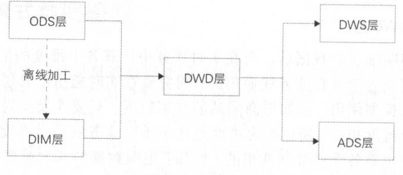

数据流向

其中, 层到 层的 处理是在离线系统中进行的,处理 完成后会同步到实时计算所使用的存储系统。 层和 层会放在 数据中间件中,供下游订阅使用。而 层和 层会落地到在线 存储系统中,下游通过接口调用的形式使用。

在每一层中,按照重要性划分为 等级, 属于最 高优先级保障。根据不同的优先级给实时任务分配不同的计算和存储资 源,力求重要的任务可以得到最好的保障。

~ 82

里牛

另外,字段命名、表命名、指标命名是按照 OneData 规范来定义的, 以便更好地维护和管理。具体 On Data 的说明见后续章节。

# 5.3.2 多流关联

在流式计算中常常需要把两个实时流进行主键关联,以得到对应的 时明细表。在离线系统中两个表关联是非常简单的,因为离线计算在 任务启动时已经可以获得两张表的全量数据,只要根据关联键进行分桶 关联就可以了。但流式计算不一样,数据的到达是一个增量的过程,并 且数据到达的时间是不确定的和无序的,因 在数据处理过程中会涉及 中间状态的保存和恢复机制等细节问题。

比如 表和 表使用 ID 进行实时关联,由于无法知道两个表的到 达顺序,因此在两个数据流的每条新数据到来时,都需要到另外一张表 中进行查找。如 表的某条数据到达,到 表的全量数据中查找,如 果能查找到,说明可以关联上,拼接成一条记录直接输出到下游 但是 如果关联不上,则需要放在内存或外部存储中等待,直到 表的记录 也到达。多流关联的一个关键点就是需要相互等待,只有双方都到达了, 才能关联成功。

下面通过例子(订单信息表和支付信息表关联)来说明,如图 所示。

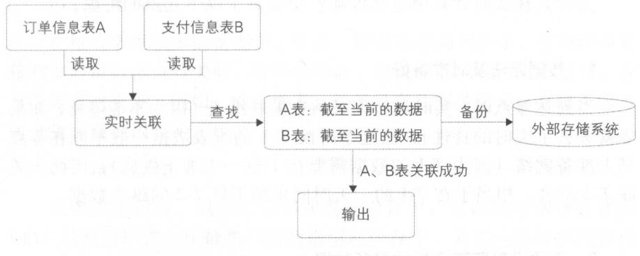

# 5.6 多流关联

在上面的例子中,实时采集两张表的数据,每到来一条新数据时都 在内存中的对方表截至当前的全量数据中查找,如果能查找到,则说明 关联成功,直接输出 :如果没查找到 ,则把数据放在内存中的自己表数 据集合中等待。另外,不管是否关联成功,内存中的数据都需要备份到 外部存储系统中,在任务重启时,可以从外部存储系统中恢复内存数据 这样才能保证数据不丢失。因为在重启时,任务是续跑的,不会重新跑 之前的数据。

另外,订单记录的变更有可能发生多次(比如订单的多个字段多次 更新),在这种情况下 需要根据订单 去重,避免 表和 表多次关 联成功;否 输出到下游就会有多条记录,这样得到的数据是有重复的。

以上是整体的双流关联流程,在实际处理时,考虑到查找数据的性 能,实时关联这个步骤一般会把数据按照关联主键进行分桶处理,并且 在故障恢复时也根据分桶来进行,以降低查找数据量和提高吞吐量。

# 5.3.3 维表使用

在离线系统中,一般是根据业务分区来关联事实表和维表的,因为 在关联之前维表的数据就已经就绪了。而在实时计算中,关联维表一般 会使用当前的实时数据( )去关联 的维表数据,相当于在 的数 据到达之前需要把维表数据准备好,并且 般是 份静态的数据。

为什么在实时计算中这么做呢?主要基于以下几点的考虑。

### 1 数据无法及时准备好

当到达零点时,实时流数据必须去关联维表(因为不能等待,如果 等就失去了实时的特性),而这个时候 的维表数据 般不能在零点 马上准备就绪(因为 的数据需要在 一天加工生成),因此去 联巨 维表,相当于在 一天时间里加工好 的维表数据。

# 无法准确获取全量的最新数据

维表 般是全量的数据,如果需要实时获取到当天的最新维表数 据,则需要 -1 的数据+当天变更才能获取到完整的维表数据。也就是 说,维表也作为一个实时流输入,这就需要使用多流实时关联来实现。 但是由于实时数据是无序的并且到达时间不确定,因此在维表关联上有

# 数据的无序性

如果维表作为实时流输入的话,获取维表数据将存在困难。比如 10:00 点的业务数据成功关联维表,得到了相关的维表字段信息,这个 时候是否就已经拿到最新的维表数据了呢?其实这只代表拿到截至 10:00 点的最新状态数据(实时应用永远也不知道什么时候才是最新状 态,因为不知道维表后面是否会发生变更)。

因此在实时计算中维表关联一般都统一使用 T-2 的数据,这样对于 业务来说,起码关联到的维表数据是确定的(虽然维表数据有一定的延 时,但是许多业务的维表在两天之间变化是很少的)。

在有些业务场景下,可以关联 T-1 的数据,但 T-1 的数据是不全的。 比如在 斗的晚上 22:00 点开始对维表进行加工处理,在零点到达之前, 有两个小时可以把数据准备好,这样就可以在 的时候关.!{# T-1 的数据 了,但是会缺失两个小时的维表变更过程。

另外,由于实时任务是常驻进程的,因此维表的使用分为两种形式。

( I )全量加载

在维表数据较少的情况下,可以一次性加载到内存中,在内存中直 接和实时流数据进行关联,效率非常高。但缺点是内存一直占用着,并 且需要定时更新。例如:类目维表,每天只有几万条记录,在每天零点 时全量加载到内存中。

(2 )增量加载

维表数据很多,没办法全部加载到内存中,可以使用增量查找和 LRU 过期的形式,让最热门的数据留在内存中。其优点是可以控制内 存的使用量;缺点是需要查找外部存储系统,运行效率会降低。例如 会员维表,有上亿条记录,每次实时数据到达时,去外部数据库中查询,

并且把查询结果放在内存中,然后每隔一段时间清理一次最近最少使用 的数据,以避免内存溢出。

在实际应用中,这两种形式根据维表数据量和实时性能要求综合考 虑来选择使用。

# 5.4 大促挑战&保障

大促是电商行业的狂欢节,在这期间,各个业务系统面临的峰值都 会达到最高点,每年大促的海量数据处理给实时计算的性能和保障提出 了很大的挑战。

# 5.4.1 大促特征

大促和日常比较,在数据量以及要求上有非常大的区别,日常不怎 么关注的点,在大促的时候会被放大,并且 天中的峰值特别明显,数 据量是其他时间点的几倍甚至数十倍,这对系统的抗压能力要求非常 高,不能因为洪流的到来而把系统压垮。

# 1 .毫秒级延时

大促期间,业务方和用户都会对实时数据非常关注,特别是在跨过 零点的时候,第一个实时数字的跳动对业务方来说意义重大,预示着大 促狂欢节真正开始。其他的产品,例如全球媒体直播大屏,更是要求延 时达到毫秒级。这种要求吞吐量和延时兼得的情况,必须要做一些有针 对性的优化工作才能满足要求。

# 洪峰明显

大促就是全国乃至全世界的狂欢节,零点开售时的峰值陡峰是非常 明显的,一般是日常峰值的几十倍,这对数据处理链路的每个系统都是 巨大 的挑战。因此,在大促前会进行多次全链路压测和预案梳理,确保 统能够承载住洪峰的冲击

# 3. 高保障性

由于关注的人非常 ,只要出现数据延迟或者数据质量的问题,业 务方的反弹就比较大,并且会第 时间感知到数据异常。因此,在大促 般都要求高保障 性, 些特殊的情况甚至需要做到强保障。

对于强保障的数据,需要做多链路冗余(从来集、处理到数据服务 个数据链路都需要做物理隔离)(见图 5.7 )。当任何 条链路出现问 时,都能够 键切换到备链路,并且需要对业务方透明,让下游感知 到有链路上的切换(由于各个链路计算的速度有 定的差异,会导致 数据在切换时出现短时间下跌的情况,使用方需要做指标大小的判断, 避免指标下跌对用户造成困扰)。


5.7 强保障数据多链路冗余示意图

# 4. 公关特性

大促期间,数据及时对公众披露是一项重要的工作,这时候要求实 时计算的数据质量非常高。这里面涉及主键的过滤、去重的精准和口径 一一「大数据之路一一阿里巴巴大数据实践

的统一等一系列问题,只有把每一个环节都做好才能保障和离线的数据

大促是 场对数据计算的高吞吐量、低延时、高保障性、高准确性 的挑战。

# 5.4.2 大促保障

# 如何进行实时任务优化

大促前的优化工作在实时计算中显得尤为重要,如果吞吐量跟不上 的话,也就失去了实时的特性。吞吐量不佳原因非常多,有些眼系统资 源有关,有些眼实现方式有关 以下几点是实时任务优化中经常需要考 虑的要素。

( 1 )独占资源和共享资源的策略

在一台机器中,共享资源池可以被多个实时任务抢占,如果 务在运行时 以上的时间都需要去抢资源,这时候就需要考虑给它分 配更多的独占资源,避免抢不到 资源导致吞吐量急剧下降。

(2 )合理选择缓存机制,尽量降低读写库次数

内存读写性能是最好的,根据业务的特性选择不同的缓存机制,让 最热和最可能使用的数据留在内存中,读写库次数降低后,吞吐量自 就上升了。

(3 )计算单元合并,降低拓扑层级

拓扑结构层级越深 性能越差,因为数据在每个节点间传输时, 部分是需要经过序列化和反序列化的,而这个过程非常消耗 CPU 和时间

(4 )内存对象共享,避免字符拷贝

在海量数据处理中,大部分对象都是以字符串形式存在的,在不同 线程间合理共享对象,可以大幅降低字符拷贝带来的性能消耗,不过 注意不合理使用带来的内存溢出问题。

(5 )在高吞吐量和低延时间取平衡

高吞吐量和低延时这两个特性是一对矛盾体,当把多个读写库操作 或者 ACK 操作合并成一个时,可以大幅降低因为网络请求带来的消耗, 不过也会导致延时高一些,在业务上衡量进行取舍。

# 如何进行数据链路保障

时数据的处理链路非常长(数据同步→数据计算→数据存储→数 据服务),每一个环节出现问题,都会导致实时数据停止更新。实时计 算属于分布式计算的 种,而单个节点故障是常态的,这种情况在直播 大屏中表现特别明显,因为数据不再更新,所有的用户都会发现数据出 现了问题。因此,为了保障实时数据的可用性,需要对整条计算链路都 进行多链路搭建,做到多机房容灾,甚至异地容灾(见图 5.8 )。

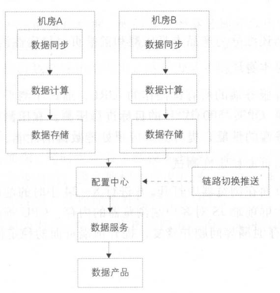

多机房客灾示意图

由于造成链路问题的情况比较多,并且一般不能在秒级定位到原 因,因 会通过工具 比对多条链路计算 的结果数据,当某条链路出现问 题时,它一定会比其他链路计算的值小 ,并且差异会越来越大。这时候 会一键切换到备链路,并且通过推送配置的形式让其秒级生效,所有的 接口调用会立刻切换到备链路,对直播大屏完全透明,并且用户也感知 不到故障的发生。

# 3. 如何进行压测

在大促备战中,会对实时链路进行多次压测,主要是模拟"双 的峰值情况,验证系统是否能够正常运行。压测都是在线上环境中进 的,分为数据压测和产品压测。

数据压测主要是蓄洪压测,就是把几个小时甚至几天的数据积累下 来,并在某个时刻全部放开,模拟"双 <sup>11</sup> "洪峰流量的情况,这里面 的数据是真实的。比如通过把实时作业的订阅数据点位调到几个小时或 者几天前,这时候每一批读到的数据都是最多的,对实时计算的压力也 最大。

产品压测还细分为产品本身压测和前端页面稳定性测试。

(1 )产品本身压测

收集大屏服务端的所有读操作的 URL ,通过压测平台进行压测流 量回放,按照 QPS: <sup>500</sup> /秒的目标进行压测。在压测过程中不断地 迭代优化服务端的性能,提升大屏应用处理数据的性能。

(2 )前端页面稳定性测试

将大屏页面在浏览器中打开,并进行 <sup>24</sup> 小时的前端页面稳定性 测试。监控大屏前端 JS 对客户端浏览器的内存、 CPU 等的消耗,检测 出前端 JS 内存泄漏等问题并修复,提升前端页面的稳定性。

童·

# 数据服务

数据部门产出的海量数据,如何能方便高效地开放出去,是我们一 直想要解决的难题。在没有数据服务的年代,数据开放的方式简单、粗 暴,一般是直接将数据导出给对方。这种方式不仅低效,还带来了安全 隐患等诸多问题。

为此,我们在数据服务这个方向上不断探索和实践。最早的数据服 务雏形诞生于 <sup>2010</sup> 年,至今已有 个年头。在这期间,随着我们对业 务的理解不断加深,同时也得益于新技术的持续涌现,对数据服务架构 也进行了多次升级改造。服务架构的每次升级,均在性能、稳定性、扩 展性等方面有所提升,从而能更好地服务于用户。

本章接下来的内容,将为大家揭示服务架构的演进过程以及详细的 技术细节。

# 6. 1 服务架构演进

阿里数据服务架构演进过程如图 6.1 所示。基于性能、扩展性和稳

定性等方面的要求,我们不断升级数据服务的架构,依次经历了内部代 号为 DWSOA OpenAPI SmartDQ OneService 的四个阶段,下面将 详细介绍各个阶段的特点及问题。


阿里数据服务架构演进过程

# 6.1.1 DWSOA

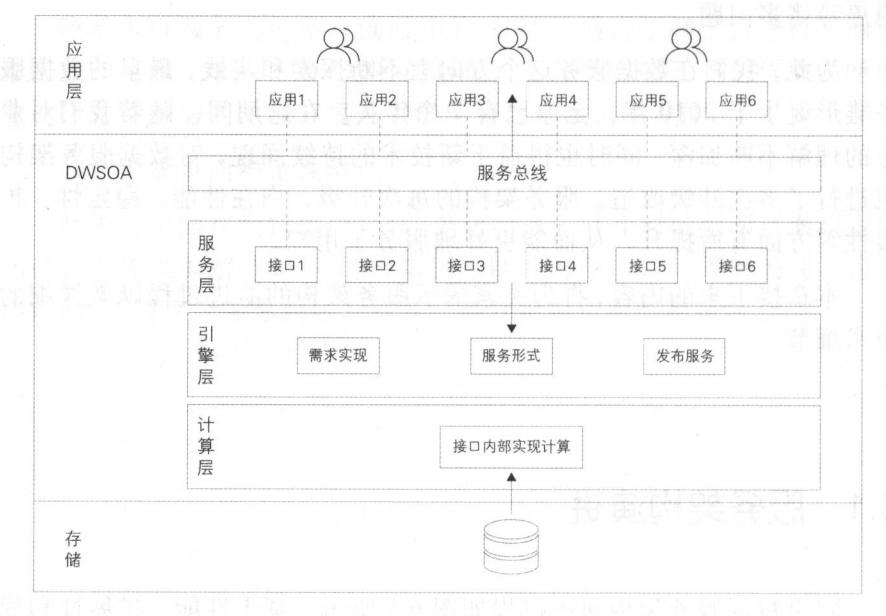

DWSOA 架构示意图

DWSOA 是数据服务的第 个阶段,也就是将业务方对数据的需求 通过 SOA 服务的方式暴露出去。由需求驱动,一个需求开发一个或者 几个接口,编写接口文档,开放给业务方调用。

这种架构实现起来比较简单,但是其缺陷也是特别明显的。一方面, 接口粒度比较粗,灵活性不高,扩展性差,复用率低。随着业务方对数 据服务的需求增加,接口的数量也会很快从一位数增加到两位数,从两 位数增加到三位数,其维护成本可想而知。另一方面 开发效率不高 无法快速响应业务。一个接口从需求开发、测试到最终的上线,整个流 程走完至少需要 天的时间,即使有时候仅仅是增加一、两个返回字段, 也要走一整套流程,所以开发效率比较低,投入的人力成本较高。

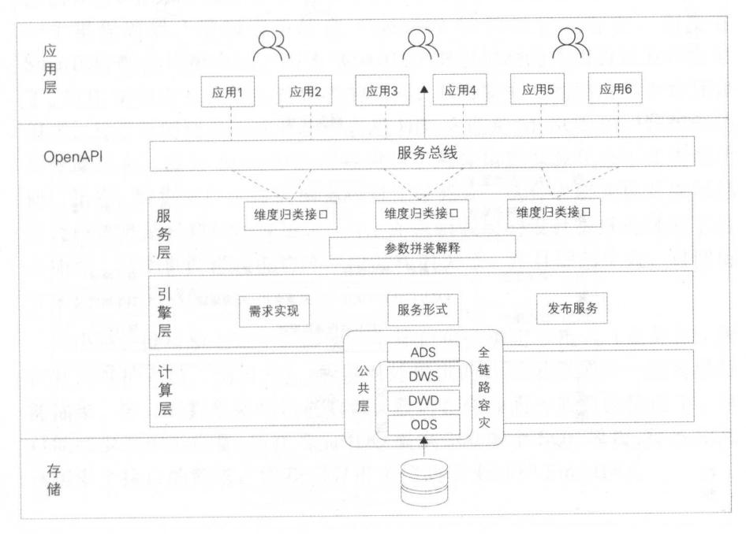

# 6.1.2 OpenAPI

6.3 OpenAPI 架构示意图

一寸大数据之路一一阿里巴巴大数据实践

阶段存在的明显问题,就是烟囱式开发,导致接口众多不 好维护,因此需要想办法降低接口的数量。当时我们对这些需求做了调 研分析,发现实现逻辑基本上就是从 取数,然后封装结果暴露服务, 并且很多接口其实是可以合并的。

OpenAPI 就是数据服务的第 个阶段。具体的做法就是将数据按照 其统计粒度进行聚合,同样维度的数据,形成 张逻辑表,采用同样的 接口描述。以会员维度为例 把所有以会员为中心的数据做成 张逻 宽表,只要是查询会员粒度的数据,仅需要调用会员接口即可。通过 段时间的实施,结果表明这种方式有效地收敛了接口数量。

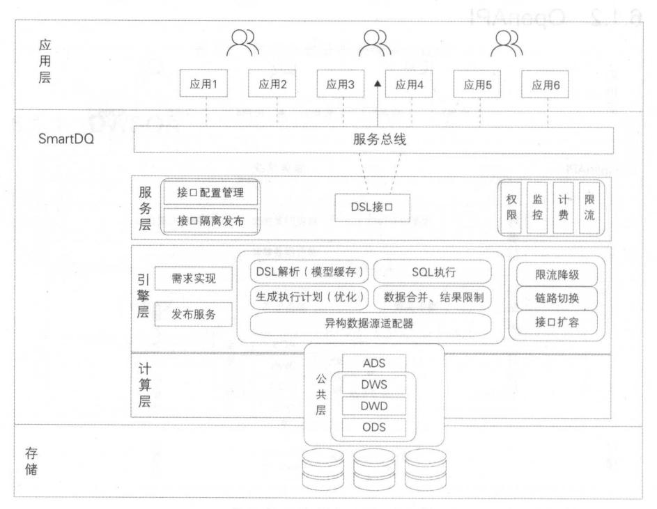

# 6.1.3 SmartDQ

SmartDQ 架构示意图

然而,数据的维度并没有我们想象的那么可控,随着时间的推移, 大家对数据的深度使用,分析数据的维度也越来越多,当时 OpenAPI 生产已有近 <sup>100</sup> 个接口:同时也带来大量对象关系映射的维护工作量。

于是,在 OpenAPI 的基础上,再抽象一层,用 DSL (Domain Specific Language ,领域专用语言)来描述取数需求。新做一套 DSL 然有一 定的学习成本 ,因此采用标准的 SQL 语法,在此基础上做了一些 限制 和特殊增强 ,以降低学习成本。同时也封装了标准 DataSource ,可以使 ORM (Object Relation Mapping ,对象关系映射)框架(目前比较主 流的框架有 Hibernate MyBatis 等)来解决对象关系映射问题。至此, 所有的简单查询服务减少到只有一个接口 ,这大大降低了数据服务的维 护成本。传统的方式查问题需要翻源码,确认逻辑:而 SmartDQ 只需 要检查 SQL 的工作量,并且可以开放给业务方通过写 SQL 的方式对外 提供服务 ,由服务提供者自己来维护 SQL ,也算是服务走向 DevOps 个里程碑吧。逻辑表虽然在 Ope nAPI 阶段就已 经存在,但是在 SmartDQ 阶段讲更合适,因为 SmartDQ 把逻辑表的作用真正发挥出来 了。 QL 提供者只需关心逻辑表的结构,不需要关心底层由多少物理表 组成,甚至不需要关心这些物理表是 HBase 还是 MySQL 的,是单表还 是分库分表,因为 SmartDQ 已经封装了跨异构数据源和分布式查询功 能。 此外,数据部门字段的变更相对比较频繁,这种底层变更对应用层 来说应该算是最糟糕的变更之一了。 而逻辑表层的设计很好地规避了这 个痛点,只变更逻辑表中物理字段的映射关系,并且即刻生效,对调用 方来说完全无感知。

小结:接口易上难下,即使一个接口 也会绑定-批人(业务方、接 口开发维护人员、调用方)。所以对外提供的数据服务接口 定要尽可 能抽象,接口的数量要尽可能收敛,最后在保障服务质量的情况下,尽 可能减少维护工作量。现在 SmartDQ 提供 <sup>300</sup> 多个 SQL 模板,每条 SQL 承担多个接口 的需求,而我们只用 位同学来维护 SmartDQ

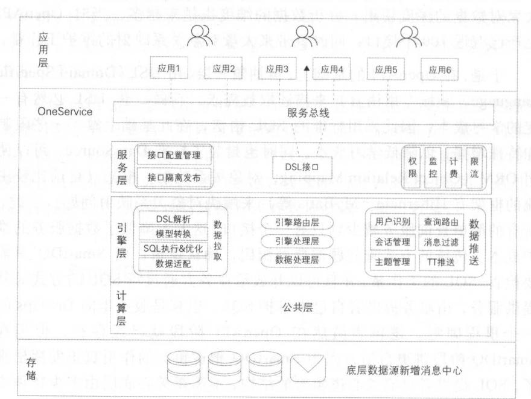

# 6.1.4 统一的数据服务层

统一的数据服务层(OneS

)架构示意图

第四个阶段是统一的数据服务层(即 )。大家心里可能 会有疑问: SQL 并不能解决复杂的业务逻辑啊。确实, SmartDQ 只满足了简单的查询服务需求。我们遇到的场景还有这么几类:个性化 的垂直业务场景、实时数据推送服务、定时任务服务。所以 主要是提供多种服务类型来满足用户需求,分别是 OneService-SmartDQ OneService-Lego OneService-iPush OneService-uTiming

上面提到过, SmartDQ 不能满足个性化的取数业务场 ,可以使用 Lego Lego 采用插件化方式开发服务, 类需求开发 个插件,目 共生产 个插件。为了避免插件之间相互影响,我们将插件做成微服 务,使用 做隔离。

实时数据服务 主要提供 long polling 两种方式, 其应用场景主要是商家端实时直播。在"双 当天 ,商家会 不及

96

待地去刷新页面,在这种情况下 long polling 会给服务器带来成倍的压 力。而 WebSocket 方式,可以在这种场景下,有效地缓解服务器的压力, 用户带来最实时的体验。

uTimi 主要提供即时任务和定时任务两种模式,其主要应用场景 是满足用户运行大数据量任务的需求。

OneService 阶段,开始真正走向平台化。我们提供数据服务的核 心引擎、开发配置平台以及门户网站。数据生产者将数据人库之后,服务 提供者可以根据标准规范快速创建服务、发布服务、监控服务、下线服务, 服务调用者可以在门户网站中快速检索服务,申请权限和调用服务。

# 6.2 技术架构

# 6.2.1 SmartDQ

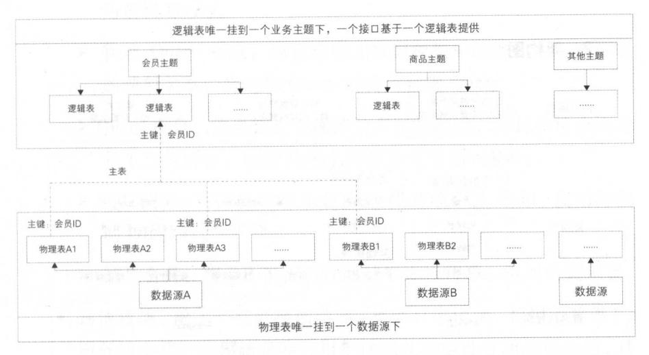

6.6 SmartDQ 的元数据模型架构示意图

# 元数据模型

SmartDQ 的元数据模型,简单来说,就是逻辑表到物理表的映射。

# 一寸大数据之路一一阿里巴巴大数据实践

自底向上分别是:

( 1 )数据源

SmartDQ 支持跨数据源查询,底层支持接人多种数据源,比如 MySQL Open 等。

(2 )物理表

物理表是具体某个数据源中的 张表。每张物理表都需要指明主键 由哪些列组成,主键确定后即可得知该表的统计粒度。

(3 )逻辑表

逻辑表可以理解为数据库中的视图,是 张虚拟表,也可以看作 由若干主键相同的物理表构成的大宽表。 SmartDQ 对用户展现的只辑表,从而屏蔽了底层物理表的存储细节。

(4 )主题

逻辑表 般会挂载在某个主题下,以便进行 理与查找。

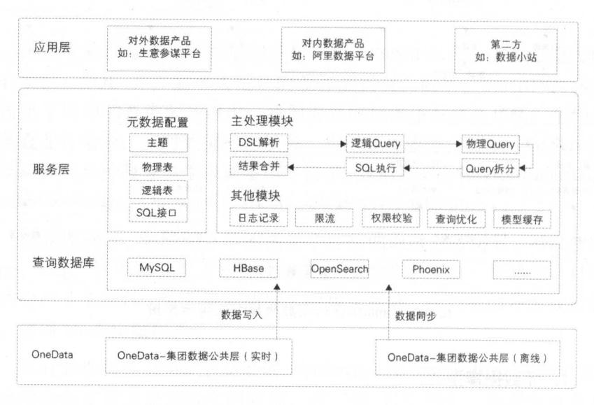

# 架构图

SmartDQ 架构示意图

章数据服务寸一

( I )查询数据库

SmartDQ 底层支持 种数据源,数据的来源主要有两种:①实时公 共层的计算作业直接将计算结果写人 HBase ;②通过同步作业将公共层 的离线数据同步到对应的查询库。

(2 )服务层

- 元数据配置。数据发布者需要到元数据中心进行元数据配置,建 好物理表与逻辑表的映射关系,服务层会将元数据加载到本地 缓存中,以便进行后续的模型解析。
- ·主处理模块。 次查询从开始到结果返回, 般会经过如下几步。
  - ~ DSL 解析:对用户的查询 DSL 进行语法解析,构建完整的查
  - 〉逻辑 Query 构建:遍历查询树,通过查找元数据模型,转变 为逻辑 Query
  - 》物理 Query 构建:通过查找元数据模型中的逻辑表与物理表 的映射关系,将逻辑 Query 转变为物理 Query
  - Query 拆分:如果该次查询涉及多张物理表,并且在该查询场 景下允许拆分,则将 Query 拆分为多个 SubQuery
  - SQL 执行:将拆分后的 SubQuery 组装成 SQL 语句,交给对应 DB 执行。
  - 》结果合并:将 DB 执行的返回结果进行合井,返回给调用者。
- 其他模块。除了 些必要的功能(比如日志记录、权限校验等), 服务 中的 些模块是专门用于性能及稳定性方面的优化的,具 体介绍请见 6.3 节的内容

一寸大数据之路一一阿里巴巴大数据实践

# 6.2.2 iPush

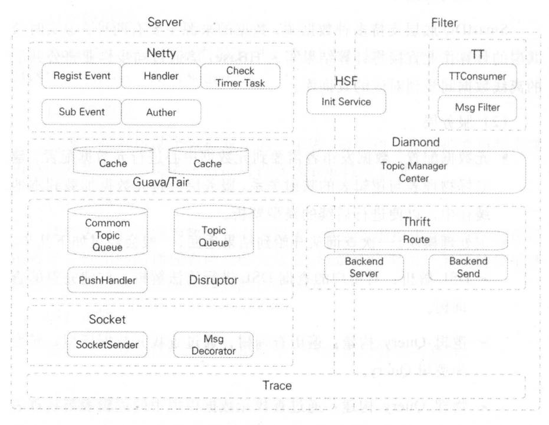

iPush 应用架构示意图

iPush 应用产品是一个面向 TT MetaQ 等不同消息源,通过定制 滤规则,向 Web 、无线等终端推送消息的中间件平台。 iPush 核心服务 器端基于高性能异步事件驱动模型的网络通信框架 Netty 实现,结合 使用 Guava 缓存实现本地注册信息的存储, Server 之间的通信 采用 Thrift 异步调用高效服务实现,消息基于 Disruptor 高性能的异步 处理框架(可以认为是最快的消息框架)的消息队列,在服务器运行中 Zookeeper 实时监控服务器状态,以及通过 Diamond 作为统一的控制触 发中心。

哩旦于一

### Lego 6.2.3

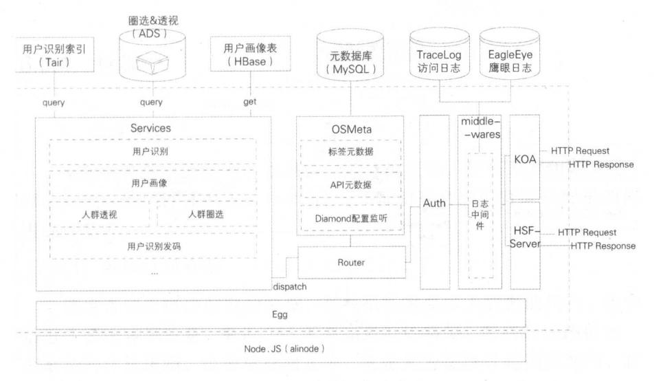

6.9 Lego 应用架构示意图

Lego 被设计成 个面向中度和高度定制化数据查询需求、支持插 件机制的服务容器。它本身只提供日志 、服务注册、 Diamond 配置监听、 鉴权、数据源管理等一系列基础设施,具体 的数据服务则由服务插件提 供。基于 Lego 的插件框架可以快速实现个性化需求并发布上线。

Lego 采用轻量级的 Node.JS 技术核实现,适合处理高并发、低延 迟的 IO 集型场景 ,目前主要支撑用户识别发码、用户识别、用户画 像、人群透视和人群圈选等在线服务。底层根据需求特点分别选用 Tair HBase ADS 存储数据。

# 6.2.4 uTiming

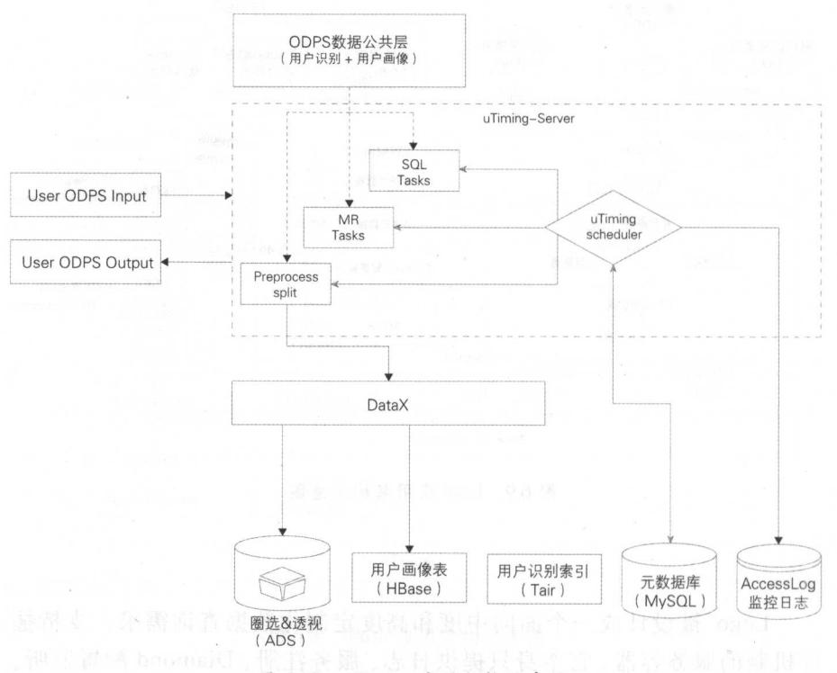

uTiming 应用架构示意图

uTiming 是基于在云端的任务调度应用,提供批量数据处理服务, 支撑用户识别、用户画像、人群圈选三类服务的离线计算,以及用户识 别、用户画像、人群透视的服务数据预处理、人库。

uTiming-scheduler 负责调度执行 SQL 或特定配置的离线任务,但 并不直接对用户暴露任务调度接口。用户使用数据超市工具或 Lego API 建立任务。

## 章数据服务丁一

# 6.3 最佳实践

# 6.3. 1 性能

系统的资源是有限的,如果能合理分配资源,使资源利用最大化, 那么系统的整体性能就会上一个台阶。下面讲述合理的资源分配是如何 提高性能的。

( 1 )剥离计算资源

调用者调用接口获取的数据,有些指标需要多天数据的聚合,比如 最近 天访客浏览量、最近 <sup>365</sup> 天商品最低价格等;有些指标还包含一 些复杂的计算逻辑,比如成交回头率,其定义为在统计时间周期内,有 两笔及以上成交父订单的买家数除以有成交父订单的买家数。

如此复杂的计算逻辑,如果放在每次调用接口时进行处理,其成本 是非常高 的。因此剥离复杂的计算统计逻辑,将其全部交由底层的数据 公共层进行处理,只保留核心的业务处理逻辑。详细内容请参见第 章。

(2 )查询资源分配

查询接口分为两种: Get 接口,只返回一条数据; Lis 接口,会返 回多条数据。一般来说, Get 查询基本都转换为 查询,响应时间比 较短,或者说查询代价比较小。而 List 查询的响应时间相对较长,且返 回记录数比较多,这就增加了序列化以及网络传输的成本,查询代价肯 定会更高一些。

假如将 Get List 请求都放在同一个线程池中进行查询,那么查询 效率会怎么样?想象一下如图 6.11 所示的场景,在高速公路上,行车 道以及超车道全部都有大卡车在慢速行驶,后面的小轿车只能慢慢等 待,并祈祷前方路段能少一些大卡车。这样整个路段的行车速度就降了 下来,车流量也会下降许多。同理,虽然 et 请求的真正查询耗时很短, 但是会在队列等待上消耗大量的时间,这样整体的 QP 会很不理想。

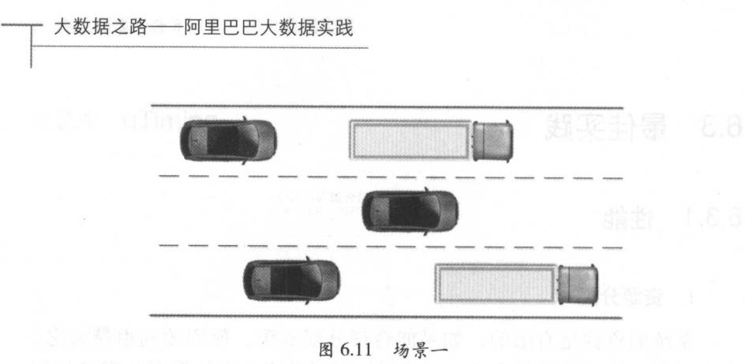

为此,我们设计了两个独立的线程池: 线程池和 线程池, 分别处理 请求和 请求,这样就不会因为某些 慢查询,而影 响到 快查询。系统的 QPS 比之前提升许多。回到上文的类比中, 在高速公路上大卡车只行驶在最右车道上,小轿车行驶在其他车道上 这样整个路段也会畅通许多,如图 所示。

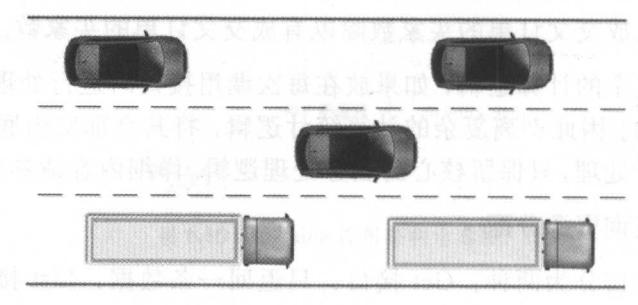

场景二

查询的响应时间相对较长,所以 线程池设置的最大运行任 务数就稍微多一些。另外,由于超时的限制, 线程池的等待队列不 宜过长。具体的参数设置,可以根据压力测试的结果评估出来。后期, 也可以根据线上调用日志的统计,比如 请求与 请求的比例来进 行优化调整。

(3 )执行计划优化

①查询拆分。举个例子,顾客去肯德基点餐,需要 个汉堡、 薯条,再加一杯饮料。他可以先点个汉堡,拿到后再点包薯条,最后再

104

点杯饮料 ,是不是很浪费时间?为了节约时间,他可以叫上朋友来帮忙, 每个人负责一样,同时去点餐。这样是快了很多 ,但是需要顾客付出额 外的成本。那么现实中应该是怎么样的呢?顾客直接眼服务员说需要这 些,服务员可以分工协作 ,最后统

查询接口同样如此,接口暴露给调用者的指标都是逻辑宇段,调用 者不用关注这些逻辑字段对应的是哪张物理表的哪个物理宇段。比如调 用者调用了 A, B,C 个指标,这些指标分别在三张物理表中,引擎层会 调用者的请求拆分成 个独立的查询,分别去三张物理表中查询,且 这些查询是并发执行的。查询结束后 ,引擎层会将 lj 起返回给调用者,这样最大程度地降低了调用者的调用成本,并能 保证查询性能(见图 6.13 )。

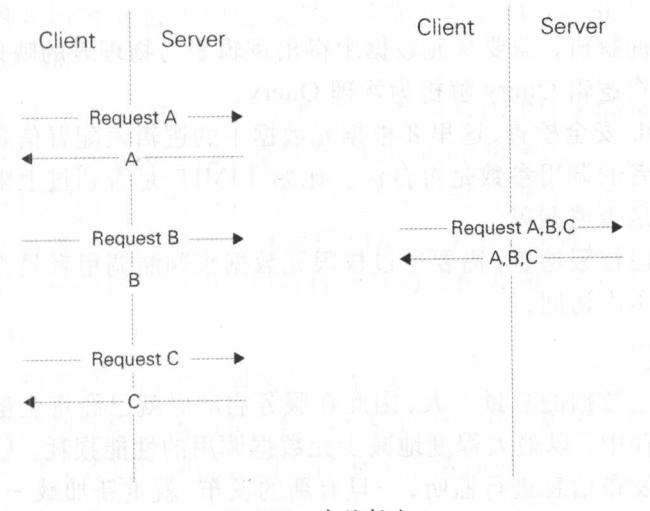

查询拆分

②查询优化。上文提到 Get 请求与 List 请求分别有独立的线程池进 行查询,但是一个请求具体是 Get 还是 List ,则依赖调用者具体调用哪 个方法。在很多情况下,调用者调用的方法不一定是最合适的。比如, 为了使代码更简洁,所有的调用全用 List 方法,这样就会造成很多本可 以快速返 回的查询,也在 List 线程池中进行排队。

查询优化,就是分析用户请求中的 SQL 语句,将符合条件的 一寸大数据之路-一阿里巴巴大数据实践

查询转换为 查询,从而提高性能。具体的步骤是:

- ·解析 SQL 语句中的 子句,提取出筛选字段以及筛选
- ·假如筛选字段中包含了该逻辑表的所有主键,且筛选条件都为 equal ,则说明主键都已经确定为固定值,返回记录数肯定为 条。在这种场景中, 查询就转换为 查询。

# 缓存优化

( 1 )元数据缓存

在接口查询的过程中,查询引擎需要频繁地调用元数据信息。举例 来说:

- ·查询解析 ,需要从元数据中得出逻辑表与物理表的映射关系,从 而将逻辑 Query 解析为物理 Query
- SQL 安全检查,这里要根据元数据中的逻辑表配置信息来检查调 用者的调用参数是否合法。比如 是否超过上限、必传 段是否遗漏等。
- ·宇段权限检查,需要通过权限元数据来判断调用者是否有权限进 行本次访问。

. ......

这些元数据的总量不大,因此在服务启动时就已经将全量数据加载 到本地缓存中,以最大程度地减少元数据调用的性能损耗。后台对数据 生产者的发布信息进行监听,一旦有新的发布,就重新加载 次元数据。 不过,这时候的加载与初始化时不同,是一次增量更新,只会加载刚刚 修改的元数据。

(2 )模型缓存

接口查询的输入其实是 ,而最终提交给 执行的是物理 SQL 在从 到物理 SQL 的转换过程中,经过了多步解析处理,如图 所示是 SmartDQ 架构图(见图 )的一部分,展示了主处理模块的处 理步骤。

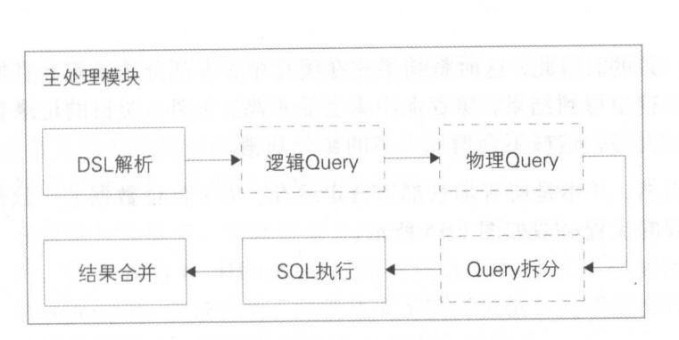

6.14 主处理模块处理步骤

模型缓存,就是将解析后的模型(包括逻辑模型、物理模型)缓存 在本地。下次再遇到相似的 SQL 时,直接从缓存中得到解析结果,直 接省略了图 <sup>14</sup> 中虚线框中的步骤,因而节省了 DSL- SQL 的解析时 间。具体做法如下:

- ·对 DSL 进行语法、词法分析,并替换 WHERE 中的常量。比如 where user\_id <sup>=</sup><sup>123</sup> 替换为 where user\_id =?。
- ·以替换后的语句做 key ,去本地缓存中进行查找。如果命中,则 提取出缓存中的模型,直接将 SQL 提交给 查询。
- 如果上一步没有命中, 则进行正常的解析处理,并缓存解析后的

需要注意的是,由于模型缓存在本地,为了避免占用太多的内存, 需要定期将过期 的模型淘汰掉。假如元数据有变更,则缓存中的模型有 可能已经失效或者是错误的,因此需要全部清理掉。

(3 )结果缓存

结果。

在某些场景下,会对查询结果进行缓存,以提高查询性能。例如

- .某些查询可能比较复杂,直接查询 DB 响应时间较长。这时可以 将结果进行缓存,下次执行相同的查询时,即可直接从缓存中获 取结果,省去了 DB 查询这一步耗时操作。
- ·还有一种场景,比如获取某个卖家所属类目的统计指标, 个类 目下可能会有十几万个卖家,这些卖家请求的结果肯定是完全一

章数据服务寸一

一寸

将结果放在缓存中,大部分请求都会直接从缓 结果 缓存命中率会非常高。另外,类目的记录数不会 太多 这样不会增 太多 额外开销。

当然 并不是 有场景 适合走缓存。为了保证数据的 用缓存 流程一般如 所示。

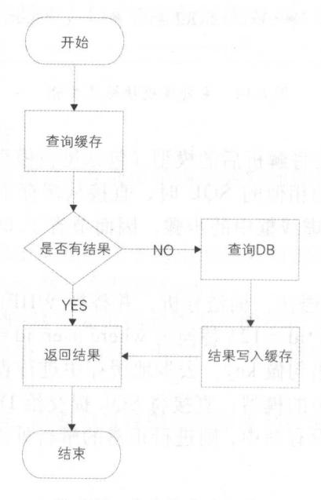

缓存流程图

假设有这样的场景 获取某个卖家对应的指标。由于每个卖家只能 请求自己的指标,因 就会导致绝大部分请求都需要从 查询 再写 人缓存中。这样不仅使得单次请求的成本会提升,而且缓存的记录数 非常大 ,利 用率 非常低。所以,这种场景其实是不太适合走缓存的 直接走 查询是 较合适的。

# 查询能力

( 1 )合并查询

数据产品的有些场景,虽然表面上看只是展现几个数字而己 ,但 后台的处理逻辑其实并不简单。举例来说,展现某一日卖家的支付金额, 有个日期选择框可以任意选择日期。日期为今天时,展现的是实时数据 (从 点截至当前的成交金额) :日期为昨天时 ,展现的就是离线数据(最 的成交金额)。其背后的复杂性在于:

- 在数据公共层中,实时数据是在流计算平台 Galaxy 上进行计 的,结果保存在 中;而离线数据的计算和存储都是在 Max Compute 中进行的。这就造成了实时数据与离线数据存储在 两个数据调、中,调用者的查询方式完全不同。
- 离线数据的产出时间,取决于上游任务的执行时间,以及当前平 台的资源情况。所以其产出时间是无法估算的,有可能 出,也有可能延迟到 6: <sup>00</sup> 。在昨天的离线任务产出之前,其前 台展现的数字只能来源于实时数据。
- 出于对性能和成本的考虑,实时作业做了 情况可能使用 些不精准的去重算法,这就导致实时数据的计算 结果与离线数据存在

综上所述,离线数据最准确,需要优先使用离线数据。如果离线数 据还未产出,则改用实时数据。所以在简单的数字背后,需要使用者清 晰地了解上述

为了降低这种场景的复杂性,我们设计了 REPLACE ,如图 6.16 所示。

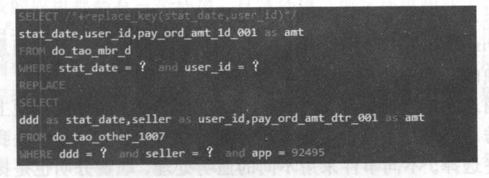

6. 16 REPLACE 吾法

REPLACE 的效果就 用上边 SQL 的结果,根据 replace\_key 去替 下边 SQL 的结果。比如上述 SQ ,上边的查询是取离线数据,下边 一寸'大数据之路一一阿里巴巴大数据实践

的查询是取实时数据,那么结果就是优先取离线数据,如果没有再去取 实时数据。

调用者使用这样的语法,就可以实现离线数据替换实时数据的功 能,不再需要考虑离线数据未产出等问题。

(2 )推送服务

有些数据产品需要展现实时指标,为了追求数据的实时性,都是轮 询请求最新数据。轮询的间隔时间设置很重要,如果设置间隔时间较长, 用户体验会不太好;如果设置很短,对服务器的请求压力会非常大,从 而影响整体性能。另外,这种轮询请求的方式,其实很大部分时间是在 浪费资源,因为有可能后台的数据根本没有更新,而前端却 直在请求。 那能不能换种方式呢?监昕数据提供者,新数据产生时能够及时知道, 并且告知用户,为此"推送"应运而生。推送服务很好地解决了数据更 新的实时性问题,同时也减少了对服务器的请求压力。其 要从网络、 内存、资源等方面做了如下设计:

- ·对消息生产者进行监听。比如监听消息源 天的消息量可 能有几百亿,但实际在线用户关心的可能就几亿甚至更少,所以 并不是所有的消息都需要关心,做好消息过滤是非常必要的。
- ·过滤后的消息量也是可观的,推送服务无法满足高效的响应 求,这就需要考虑将符合条件的消息放置在临时队列中,但对于 有锁的队列,存在竞争则意味着性能或多或少会有些下降,所以 采用无锁的队列 Disruptor 来存放消息是最佳的选择。在采用 Disruptor 的情况下,推送应用也考虑到可以对重要的消息配置单 独的队列单线程运转,以提高性能。
- ·消息 的推送必须基于 来实现, Netty 在性能表现上比较优 秀,采用基于高性能异步事件的网络通信框架 Netty 是我们的最 终选择。不同事件采用不同的监昕处理,职责分明也是提高性能 的基础。
- ·推送应用是典型的 集型系统,在采用多线程解决性能问题 的同时,也带来了上下文切换的损耗。在注册消息向 广播 时,采用协程方式可以大大减少上下文切换,为性能的提高做出

章数据服务丁一

相应的贡献。

- 从业务角度出发,主题也会存在重要级别或者优先级,适当地控 制线程数以及流量,为某些重要的业务消息节约服务器资源也是 备选方案。
- ·缓存的利用在推送应用中多处体现。例如对注册的在线用户信息 做本地缓存,可以极大地提高读性能。
- ·对突发事件的推送也有针对性地做了很多工作 比如过滤服务器 异常重启时,在线用户信息需要重新向该过滤服务器投递,但每 条用户信息才几百字节,如果逐条投递,则会造成高流量带宽的 浪费,所以批量投递甚至打包投递会大大降低网络开销。

# 6.3.2 稳定性

# 1. 发布系统

上文中提到,服务启动时会将元数据全量加载到本地缓存中。数据 生产者会对元数据做 些修改,并发布到线上。那么,如何保证用户的 变更是安全的,不会导致线上故障昵?如何保证不同用户发布的变更不 相互影响呢?下面将会阐述发布系统在稳定性保障方面的作用。

( l )元数据隔离

般的应用都会有 个环境:日常环境、预发环境和线上环境。日 常环境用于线下开发测试。预发环境隔离了外部用户的访问,用于在正 式发布前校验即将上线的代码。为了保障系统的稳定性,根据应用环境 设计了三套元数据 :日常元数据、预发元数据和线上元数据,如图 6.17 所示。

由图 6.17 可知, 三套元数据分别对应着 个应用环境,每个环境 的应用只会访问对应的元数据。从用户修改元数据到最终正式上线,经 过如下以下几步:

用户在元数据管理平台上进行操作,修改元数据。此时, DB 的预发元数据发生了变更,但是还没有加载到本地缓存中。

一寸大数据之路一-阿里

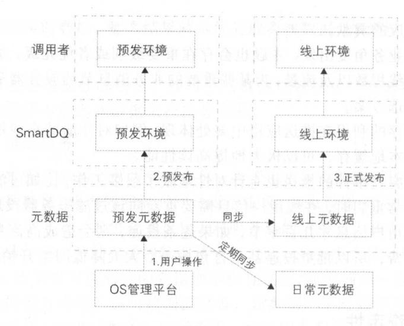

不同应用环境下的三套元数据

- 用户点击"预发布",此时预发元数据就会被加载到引 的本地 缓存中,在预发环境中就可以看到用户的最新修改了。此时,可 以验证用户的修改是否会影响线上已有的功能。
- 如果验证通过,则表明此次用户的修改是安全的。用户点击" 式发布",预发元数据会将变更同步到线上元数据,并加载到引 擎的本地缓存中。此时,在线上环境中也可以看到用户的变更。 至此,发布的整个流程就结束了。

此外,会有 个定时任务,定期将预发元数据同步到日 常环境。

通过元数据的隔离,使得用户的变更可以在预发环境中进行充分的 验证,验证通过后再发布到线上环境中,避免了因用户误操作而导致线 上故障,保障了系统的稳定性。

(2 )隔离发布

发布系统还需要考虑到一点,就是隔离发布,即不同用户的发布不 会相互影响。要实现这一点,需要做到

·资源、划分。为了做到隔离发布, 首先需要确定隔离的最小单元。 由于调用者的查询请求最终都会转换成对某张逻辑表的查询,因 此我们决定将隔离的粒度控制在逻辑表层面上。

- ·资源独占。当用户开始修改的时候,系统会锁定其正在修改的逻 辑表及其下挂的物理表等资源,禁止其他用 户修改。当用户正式 发布变更后,就会释放锁定的资源 ,这时 元数据进行修改。
- 增量更新。用户每次只会修改某张逻辑表的对应元数据,因 布时引擎是不需要重新加载全量元数据的,只需要加载所发布的 逻辑表元数据即可。同理,预发元数据与线上元数据之间的数据 同步,也仅仅需要同步用户修改的部分

# 隔离

隔离的 个作用是将系统划分为若干个独立模块,当某个模块出现 问题时,整体功能仍然能保证可用。隔离的另一个作用是可以对系统资 源进行有效的管理,从而提高系统的可用性。

( I )机房隔离

将服务器部署在两个机房中,每个机房独立部署 数量尽量保持均衡,以实现双机房容灾。当一个机房发生故障时, 个机房中 的应用仍然可以对外服务。同时,需要保障内部调用优先,服 务调用同机房优先,最大程度地减少双机房部署带来的网络开销。

(2 )分组隔离

不同调用者的优先级不尽相同,且查询场景也存在 以,可以根据某些条件将调用者进行分层 ,然后将服务端的机器划分为 干个分组,每个分组都有明确的服务对象和保障等级。即使某个分组 出现性能较差的查询,或者有突发大流量涌入,也不会影响其 正常使用。另外 ,可以动态地调整分组规则,以重新分配每个分组的机 器数量 ,在总体机器数量不变的情况下 ,实现资源的最大化利用。

# 安全限制

对调用者的调用做了诸多安全限制,以防止查询消耗大量的资源,

# 一寸大数据之路-一间里巴巴大数据实践

或者返回太多的记录。主要体现在以下几点:

- ·最大返 回记录数。数据库的查询强制带上 限制,具体 数值以用户配置为准。
- ·必传字段。每张逻辑表都会配置主键,并标识哪些字段是调用者 必须传人的。这样最终的 SQL 肯定会带上这些字段的限制条件, 防止对表做全表扫描。
- ·超时时间。设置合适的超时时间,以使得超时的查询能及时终止 并释放资源,保障系统不会被偶发的超时拖垮。

# 监控

( 1 )调用日志采集

如果要对调用做监控,首先要保证调用日志的完整性。对于每次调 用都进行了采集,采集的信息包括:

- ·基础信息 ,包括调用时间、接口名、 方法名、返回记录数等。
- .调用者信息,包括调用者应用名、来源 地址等。
- .调用信息,包括调用指标、查询筛选条件等。
- ·性能指标,包括响应时间、是否走缓存等。
- ·错误信息,包括出错原因、错误类型、数据源、错误堆械等。

(2 )调用监控

有了调用日志,就可以监控系统的健康状况,及时发现问题。监控 可以从以下几个方面展开:

- ·性能趋势。总体 QPS 趋势图、 趋势图、响应时长区间分布。 分组性能统计、单机 QPS 统计,以对当前系统容量做评估。
- ·零调用统计。找出最近 天无调用的表,进行下线处理,节约 成本。
- ·慢 SQL 查找。找出响应时间较长的 SQL ,及时进行优化。
- ·错误排查。当系统的调用错误数突增时,能从错误日志中及时发 现出错原因、出错的数据源等。

章数据服务丁一

# 流、

系统的总体容量,主要是根据平日的性能监控,以及定期的全链路 压测评估得 出,但是难免会遇到突发流量涌入的情况。此时,系统需要 有合适的方式来应对突增流量,以免系统被压垮。

( I )限流

限流有很多种方法,我们采用的是应用内的 QP 保护。针对调用 者以及数据源等关键角色做了 QPS 阔值控制。也就是说,如果某个调 用者的调用量突增 ,或者对某个数据源的查询流量突增,超过了预设的 QPS 阑值,则后续的请求立即失败返回,不再继续处理。通过快速失败, 将超出系统处理能力的流量直接过滤掉,保障了系统的可用性。

(2 )降级

查询引擎底层是支持多种数据源接人的,但是接人的数据源越多, 系统就越复杂,出 问题的概率也就越大。假设某个数据源突然出现问题, 或者某个数据源中 的某张表访问超时,那么该如何处理才能保障整体的 可用性呢?

理想的做法肯定是将这些数据源、表全部隔离成独立的模块,单个 模块的故障不会引起整体不可用。但是 ,实际中隔离带来的成本也是比 较大的,且有可能造成资源的浪费。假如没有隔离措施,所有数据源共 享资源,这时候就需要通过降级将故障影响降到最低。

降级主要有两种做法:

- ·通过限流措施,将 QPS 置为 ,则对应的所有访问全部立即失败, 防止了故障的扩散。
- .通过修改元数据,将存在问题的资源置为失效状态,则重新加载 元数据后,对应的访问就全部失败了,不会再消耗系统资源。

.::a:.

# 数据挖掘

# 7.1 数据挖掘概述

进人 DT 时代,阿里巴巴作为全球最大的零售电子商务平台,正推 动着大规模数据采集、计算、挖掘和产品化服务的生态圈构建。 <sup>2016</sup> 年财报显示,阿里巴巴集团平台成交额突破 万亿元,年度活跃买家达 4.23 亿,已成为全球最大的移动经济实体。与 Google Face book Amazon 等世界上其他先进的互联网公司一样,高速增长的业务必然催 生大数据挖掘应用的蓬勃发展。当我们从业务系统中能够轻松采集到海 量数据时,往往会发现里面的有效数据信息却越来越稀疏,有效数据和 无效数据的增长率是不成比例的。因此,如何从海量数据中挖掘出有效 信息形成真正的生产力,是所有大数据公司需要面对的共同课题。

数据挖掘技术与数据仓储及计算技术的发展是相辅相成的,没有数 据基础设施的发展与分布式并行计算技术,就不会有深度学习,更不会 见证 AlphaGo 的神奇。同样在阿里巴巴集团,得益于阿里云 MaxCompute 云计算平台的发展,海量、高速、多变化、多终端的结构与非结构化数

据得以存储并高效地计算。近年来,阿里巴巴数据挖掘应用也呈现出井 喷式的增长态势。面向海量会员和商品的全局画像、基于自然人的全域 ID 非人流量与恶意设备的识别、商业竞争情报的自动化挖掘系统……这些 或传统或新兴的大数据挖掘应用已深入阿里巴巴业务的各个环节,"无 数据不智能,无智能不商业",大数据与 AI/机器学习融合后的新商业革 命己然到来。

基于大数据的企业级数据挖掘需要包含两个要素 ①面向机器学习 算法 的并行计算框架与算法平台;②面向企业级数据挖掘的算法资产管 理体系。基于此,在接下来的章节中,我们会首先介绍阿里巴巴算法平 台的发展历史,以及当下正在使用的算法计算框架和平台。然后阐述阿 里巴巴的算法资产管理体系,领略企业级数据挖掘服务的标准、规范及 资产管理艺术。最后将展示阿里巴巴当下最热门的一些数据挖掘应用案 例,如消费者画像和互联网反作弊等,希望通过这些典型的应用案例, 能让你更深层次地感知大数据、机器学习、人工智能融合后所产生的巨 大能量及其在商业中发挥的巨大价值。

### 7.2 数据挖掘算法平台

年以前,由于数据的规模还不是特别庞大,大部分挖掘应用 所需处理的样本量在百万以内,而处理的特征一般也少于 维,那时 业界有许多成熟的商业挖掘软件如 等,这些 单机版运行的软件已经能满足绝大部分挖掘应用的需求 ,因此早几年阿 里巴巴尚没有研发面向海量数据的高性能并行计算的算法平台。然而, 随着数据量爆炸式的增长,以及分布式计算 Hadoop Spark 技术的引人,阿里巴巴的商业挖掘应用 也步入大数据时代,和早几年不 同,如今的挖掘算法需要面对的训练数据量动辄上亿,特征维度动辄百 ,因此,近两、 年来,阿里巴巴集团也在大力发展自己的机器学习 算法平台,并已取得阶段性成果。 如今,阿里巴巴已建成

套稳定、高

效的算法平台,该平台架构于阿里云 MaxCompute GPU 等计算集群之 上,汇集了阿里巴巴集团大量优质的分布式算法,包括数据处理、特征 工程、机器学习算法、文本算法等,可高效地完成海量、亿级维度数据 的复杂计算。除此之外,平台还提供了一套极易操作的可视化编辑页面, 大大降低了数据挖掘的门槛,提高了建模效率。未来还将面向外部客 开放,配合阿里云的其他基础数据设施,为外部企业提供数据挖掘应用 的基础能力。

下面简单介绍阿里巴巴算法平台的框架和原理。

支持海量样本的高维特征训练是算法平台的必备要素,因此计算框 架的选择非常重要。近几年来,业界主流的并行计算框架主要有 Map Reduce MPI Spark 等。在阿里巴巴集团内部,基于 MapReduce Hive 的计算己经能解决公司业务 90% 以上的离线数据分析任务。而 对于需要频繁进行网络通信、内存消耗高、计算要求快速迭代的算法任 务, MPI 无疑是最佳选择。 MPI 种基于消息传递的并行计算框架, 由于没有 IO 操作,性能优于 MapReduce 。因此,阿里巴巴的算法平台 选用 MPI 作为基础计算框架,其核心机器学习算法的开发都是基于阿 里云 MaxCompute MPI 实现的。

MaxCompute MPI 的处理流程如图 .1 所示,与分布式计算系统的 原理类似,不再赘述。其中伏裴为阿里云飞天系统的分布式调度系统, 女娟为阿里云飞天系统的分布式一致性协同服务系统,盘古为阿里云飞 天系统的分布式文件存储系统。

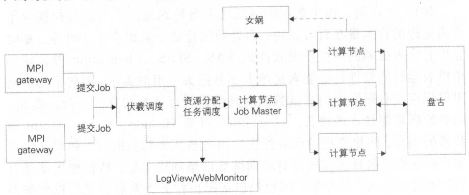

7.1 MaxCompute MPI 处理流程图

基于 MaxCompute ,目前阿里巴巴的算法平台已经集成了绝大 部分业界主流的机器学习算法(见表 ),从传统的分类、聚类算法, 到互联网应用中非常流行的协同过滤、 PageRank 算法,再到当前最火 热的深度学 习算法,这些算法基本可以满足企业级数据挖掘应用的需 要。配合阿里巴巴的大数据计算平台 MaxCompute ,工程师们可以通过 简易 的命 式调用或拖拽式的可视化界面操作,将这些算法应用于自己 的实际业务当中,体验机器学习算法与大数据结合后的强大功能与魅力。

|  | 基于 | MaxCompute | MPI |  | 的机器学习算法 |  |  |
|--|----|------------|-----|--|---------|--|--|
|--|----|------------|-----|--|---------|--|--|

|                                                                                                      | 具体算法                                                                                                                                               |  |  |  |  |
|------------------------------------------------------------------------------------------------------|----------------------------------------------------------------------------------------------------------------------------------------------------|--|--|--|--|
| 分类算法                                                                                                 | LogisticRegressi on<br>kNN<br>GBDT<br>DTC5.0<br>Randomforest<br>linearSVM<br>nonlinearSVM<br>avieBayes<br>Bayes<br>Fisher<br>判别、马氏距离判别、标签传播<br>分裂等 |  |  |  |  |
| 回归算法                                                                                                 | Factorization Machines<br>LinearRegression<br>GBDT<br>LASSO<br>RidgeRegression<br>XO Boost                                                         |  |  |  |  |
| 骂是类算法                                                                                                | Means<br>Canopy<br>PSC<br>普聚类、标签传播聚类、<br>EM<br>聚类等                                                                                                 |  |  |  |  |
| 推荐算法                                                                                                 | etrec<br>协同过滤、<br>SYD<br>协同过滤、<br>ALS<br>协同过滤等                                                                                                     |  |  |  |  |
| 深度学习                                                                                                 | Word2Vec<br>Doc2Vec<br>CNN<br>DBN<br>DeepMatchModel                                                                                                |  |  |  |  |
| Page Rank<br>其他<br>LOA<br>pLSA 、关联规则、<br>NMF<br>SYD<br>RankSVM<br>kcore<br>sssp<br>Modularity<br>计算等 |                                                                                                                                                    |  |  |  |  |

是阿里巴巴集团搜索算法团队开发的运行于 MaxCompute 上的基于商品的协同过滤算法

# 7.3 数据挖掘申台体系

在阿里巴巴集团,由于业务场景与商业智能分析需求的多样化,多 个部门、多个商业智能及算法团队针对应用问题所提出的算法解决方案 的,通常 次数据挖掘的过程包括商业理解、数据准备、特 征工程 、模型训练、模型测试、模型部署、线上应用及效果反馈等环节。 如果对于每个应用都完全独立地设计这么一套流程,那么对于阿里巴巴 成千上万的挖掘应用而言无疑将产生巨大的时间与经济成本,带来大量

的重复建设和资源浪费。事实上,早在 <sup>2015</sup> 年,阿里巴巴集团便提出 了中台战略,将一些通用的技术集成起来形成中台技术体系,为各业务 部门提供统 、高效的技术服务,避免各业务部门在各自业务发展的过 程中进行重复的技术建设造成不必要的资源浪费与时间消耗。对于数据 挖掘技术而言,中台发展的思路同样适用,并且从长远来看,构建数据 挖掘中台技术体系也是绝对有必要的。

就数据挖掘的商业场景而 ,可以分为两大类应用:个体挖掘应用 与关系挖掘应用。个体挖掘应用指对单个实体的行为特征进行预测与分 析,如预测某商品的销量、划分某行业的价格区间等; 关系挖掘应用指 研究多个实体间的关系特征,如商品的相似关系、竞争关系等。就数据 挖掘技术而言,其包含两大要素:数据和算法。数据是数据挖掘的起 与挖掘结果最终的承载形式,可以说任何数据挖掘的过程都是从数据里 来,回数据里去,源于数据而高于数据:算法是数据挖掘的神经中枢, 通过算法对原始数据进行加工,得到对业务更有价值的数据。因此, 于数据挖掘中台体系的设计也包含两大块:数据中台与算法中台;结合 数据挖掘的商业场景 对这两大块的设计又分别从个体挖掘应用和关系 挖掘应用两方面进行考虑。

# 7.3.1 挖掘数据中台

在数据挖掘的过程中包含两类数据:特征数据与结果数据。这两 数据很好理解,比如要预测某商品的销量,那么算法需要的特征变量其 实就是特征数据,算法最终输出的商品销量的预测结果就是结果数据。 对于特征数据,相信有 定数据挖掘工作经验的读者都知道,在挖掘 目中 的时间可能都是在处理特征,这些特征的提取、清洗、标准化, 以及基于业务场景的再组合和二次加工往往是我们工作内容的主体部 分。试想,如果有一套标准、规范且索引方便的全局特征库,每个挖掘 工程师只需访问几张物理表就能迅速地搜集到绝大部分自己想要的特 征,是不是 件很酷的事情?同时,通过算法生成的结果数据也需要进 行合理的分层存储。有的结果非常通用和基础化,可以在很多的业务 景中复用,有的结果则相对个性和场景化,只适用于某个具体的业务和

产品,因此需要对结果数据进行合理的分层 ,有效隔离通用性强和个性 化强的结果,这样可以充分发挥通用性强的算法结果的作用,提升它的 复用率,减少不必要的重复建设。

基于以上分析,我们把数据中台分为三层 :特征层( Featural Data Mining Layer, FDM )、中间层和应用层( Application-oriented Data Mining Layer, ADM ),其中中间层包括个体中间层( Individual Data Mining Layer, IDM )和 关系中间层( Relational Data Mining Layer, RDM ),如 所示。

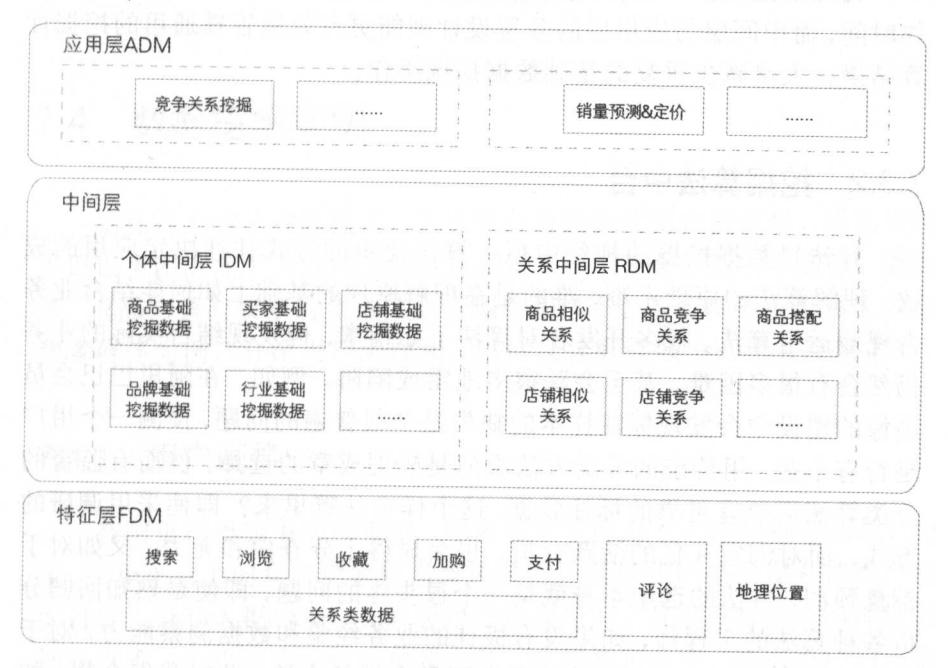

阿里巴巴数据挖掘中台

不同数据层的作用有所区别

- 层:用于存储在模型训练前常用的特征指标,并进行统一 的清洗和去噪处理,提升机器学习特征工程环节的效率。
- :个体挖掘指标中间层,面向个体挖掘场景,用于存储 通用性强的结果数据,主要包含商品、卖家、买家、行业等维度

的个体数据挖掘的相关指标。

- RDM 关系挖掘指标中间层,面向关系挖掘场景,用于存储 通用性强的结果数据,主要包含商品间的相似关系、竞争关系, 店铺间的相似关系、竞争关系等。
- •ADM 层:用来沉淀比较个性偏应用的数据挖掘指标,比如用 偏好的类目、品牌等,这些数据已经过深度的加工处理,满足某 一特点业务或产品的使用。

通过挖掘数据中台的建设,能够大幅度节省数据挖掘特征工程的 作时间,而中间层与应用层的分层设计则能更有效地管理通用的挖掘计 算结果,大量减少重复的基础数据挖掘工作。

# 7.3.2 挖掘算法中台

算法是数据挖掘的神经中枢,算法使用的方式往往决定应用的成 败。理解算法的原理不难,难的是在理解原理的基础上如何能结合业 合理地运用算法。很多开发者对算法了如指掌,但发现结合实际的业 仍然会有很多困难,甚至会踩很多地雷或陷阱。例如,在阿里巴巴会员 画像的建设中会发现标注样本的缺失是个很普遍的问题,预测一个用户 是否有小孩,用传统的分类方法看似是顺理成章的选择,然而有监督的 分类算法需要有可靠的标注数据,这个样本从哪里来?即使采用调研的 方式,面对淘宝 亿的活跃会员,也会显得十分苍白和无力。又如对 销量预测,方法的选型本身就是一个很头疼的问题,即使是熟知回归 析各种算法的工程师,如果没有极佳的业务经验和数据洞察能力,对 这个问题恐怕也没有太好的捷径找到最合适的方法。此时我们会想,如 果能像金融领域的风控一样,有一套类似于评分卡建模的方法论和实操 模板,那么处理业务问题的效率将会大大提升。而阿里巴巴数据挖掘 法中台建设的目的同样在于从各种各样的挖掘场景中抽象出有代表性 的几类场景,并形成相应的方法论和实操模板。

按照个体挖掘应用和关系挖掘应用的分类方式,可以抽象出常见的 几类数据挖掘应用场景一一在个体挖掘应用中,消费者画像与业务指标 预测是两类非常有代表性的场景;而在关系挖掘应用中,相似关系与竞

据挖掘 丁一

争关系是两类非常通用的关系挖掘应用,在 基础上构建 推荐系统与 竞争分析系统,则是电商领域持续关注的两大热 话题。

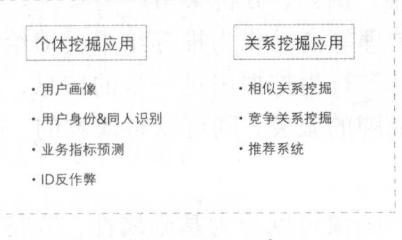

常见的数据挖掘应用

# 7.4 数据挖掘案例

依托强大的云计算技术、算法平台与数据挖掘中台体系,近 里巴巴集团沉淀了大量的电商数据挖掘案例 并逐步形成以商家、消费 者、商品为核心要素的全域数据挖掘应用体系。本节以淘宝市场上的消 费者群体为例,介绍用户画像和互联网反作弊领域中的相关应用案例。

# 7.4. 1 用户画像

在阿里巴巴旗下的淘宝网、虾米音乐上都不乏个性化推荐场景,淘 宝、天猫平台上的众多商家则需要通过用户调研和产品研发来把握产品 的目标人群和人群偏好,从而对用户投其所好。对用户有深刻的理解是 网站推荐、企业经营制胜的重要 环。在传统企业中,获取用户的反馈 信息耗时长、结果缺失,是个难关。然而 随着大数据热潮的兴起,快 速捕捉海量用户行为并精确分析人群偏好等商业信息已经成为可能。作 为个性化技术的重要基础,相比于传统企业的购物篮分析、问卷调查, 在用户 画像的塑造上具备技术的天然优势。

阿里全域数据提供了足够的数据基础,正是基于用户网购、搜索和 娱乐影音等行为的数据洞察,可以利用数据分析辅以算法的视角对用户 进行 <sup>360</sup> 全方位的特征刻画。那么,究竟什么是用户画像?通俗地讲, 用户画像即是为用户打上各种各样的标签,如年龄、性别、职业、商 品牌偏好、商品类别偏好等。这些标签的数目越丰 ,标签越细化,对 用户的刻画就越精准。例如,分析某用户为女性,可能仅仅是将与女 相关的服装、个人护理等商品作为推荐结果反馈给该用 户:但若根据用 户以往的浏览、交易等行为挖掘出进一步的信息,如用户的地理信息为 海南,买过某几类品牌的服装,则可以将薄款的、品牌风格相似的服装 作为推荐结果。

般而言,用户画像可以分为基础属性、购物偏好、 社交关系、财 富属性等几大类。对于刻画淘宝网购用户,则应侧重于他们在网购上的 行为偏好。下面以用户女装风格偏好为例,讲解该用户标签是如何基于 全域数据产出的。

购买过淘宝商品的读者对商品详情页都不会陌生,一件商品的关键 特征除了反映在商品图片和详情页中以外,主要可以采集的信息是商品 的标题以及参数描述。女装有哪些风格?首先需要将女装行业下的商品 标题文本提取出来,对其进行分词,得到庞大的女装描绘词库。然而, 淘宝商品的标题由卖家个人撰写,并不能保证其中的词语都与商品风格 描述相关。因此,对于所得到的女装描绘词库,首先,需要根据词语权 重去除无效的停用词,方法如计算 TF-IDF 值。其次,在女装商品的参 数描述中,如果已经包含了一种商品风格,例如"通勤""韩版"等常 见风格,那么通过计算词库中词语与参数描述中风格词的相似度,可以 过滤得到女装风格词库,利用无监督机器学习如 LDA 等方法可以计算 种风格所包含的词汇及这些词汇的重要性。那么 买家偏好什么风 格昵?在淘宝网上,买家拥有浏览、搜索、点击、收藏、加购物车以 交易等多种行为,针对每种行为赋予不同的行为强度(比如浏览行为强 度弱于交易行为),再考虑该商品的风格元素组成,就能够通过合理的 方式获知买家对该风格的偏好程度了。

对于这样的商品偏好计算,数据挖掘人员需要仔细分析用户偏好的 商品的类型、品牌、风格元素、下单时间,这 系列行为可以构成复杂 的行为模块。同理,利用机器学习算法,可以从用 户行为中推测其身份, 例如男生和女生、老年与青年偏好的商品和行为方式存在 别,根据 定的用户标记,最后能够预测出用户的基础身份信息。

Iii.. 124

# 7.4.2 互联网反作弊

在人们享受互联网带来的便捷和高效时,有一批人将其黑手伸向了 领域,他们利用某些网站的技术和业务漏洞进行作弊,从而满足自 己的灰色利益需求。可以看到,作弊黑产业链的滋生与发展使得人们的 信息安全、资金安全,甚至人身安全面临着严重威胁。从业务上看,反 作弊工作主要体现在以下几个方面:

(1 )账户/资金安全与网络欺诈防控

账户的安全性越来越重要,尤其是购物和理财的网站或 APP ,其账 户以及资金的安全更是维持用户信任的最后一道防线。账户隐私数据的 泄露和非法交易问题不容忽视。

(2 )非人行为和账户识别

大量的非人行为和账户利用自动化程序来模拟人的注册、浏览、点 击等行为,帮助一些商家达到提升商品排名或者攻击竞争对手的目的。

(3 )虚假订单与信用炒作识别

在平台类电商网站中,随着商家之间的竞争升级,虚假订单和信用 炒作逐渐成为许多商家依赖的竞争手段。当下,虚假销量与 GMV 正在 毒害健康的经营环境。

(4 )广告推广与 APP 安装反作弊

正当大量的企业开始投入人力和财力进行公司产品和品牌的宣传 推广时,也有人通过自动化程序或者人工的方式产生虚假的点击和浏览 行为,以此打击竞争对手,或者是从中获取直接的经济利益。同样在无 线端,在 APP PA 主要推广结算方式的情况下,大量的专业刷装 机量的公司为很多 APP 产生虚假的装机量数据,以此达到各方获取不 正当利益的目的。

(5) UGC 恶意信息检测

用户在各类网站上产生的 UGC 信息,本可以帮助网站更好地了解 用户的使用习惯以及潜在需求,帮助优化网站或者产品。但是,很多 却利用文本、图片、声音、视频等内容的复杂性和多样性,恶意传播色 情、诈骗、谣言、暴力等不正当信息,给互联网环境造成了很大的威胁。

随着作弊场景和手法的不断变化,各个维度的安全技术也在不断升 级保护正常用户免受黑色利益链条的侵害,其中包括物理安全、网络安 全、应用安全、数据安全等方面。在数据安全的保障工作中数据挖掘算 法也扮演着十分重要的作用。从所采用的算法技术上说,反作弊方法主 要包括如下几类:

( l )基于业务规则的方法

这类方法主要是根据实际的业务场景,不断地发现总结作弊和获利 手法,通过反作弊规则的不断拓展或产品设计的完善来识别、缓解甚至 消除作弊现象。比如在电商产品的搜索排名中,对刷单的销量采取类似 于降权的处理方式,避免市场秩序受到影响,以此减少商家的刷单行为 带来的不正当利益。或者是在 APP 安装反作弊工作中,通过查看单个 设备的单日出现城市数、登录账号数、设备 id 合法性等建立规则来衡 作弊情况。

这类方法的优点是精度高、可解释性强,能准确识别老的作弊方式; 缺点是人力成本高,而且对新的作弊手法滞后性较强。

(2 )基于有监督学习的方法

将基于有监督学习的方法应用于反作弊工作中,其基本思路是按照 有监督分类算法的流程来建模,通过正负样本标记、特征提取、模型训 练及预测等过程来识别作弊行为。比如在账户反欺诈场景下,以账户的 属性信息和行为数据作为模型特征输人,以历史的欺诈事件作为标记样 本,通过训练分类模型对当前账户的作弊风险进行预测评估。

但在反作弊领域内,此类方法遇到的最大问题是类不平衡现象。因 为绝大多数用户及行为都是正常的,只有少数 些用户及行为是恶意 的。比如相对于正常用户的转账行为,资金欺诈行为数量是极少的,但 是这些极少的行为可能给用户带来无法挽回的经济损失。为了缓解这 问题,我们会在采样或者模型训练过程中进行 些技术处理,以减少类 不平衡给识别结果造成的影响。

这类方法的优点是通用性强,人力成本主要集中在样本的标记和特

征的处理上;缺点是有些算法结果的可解释性不强,容易造成错判,需 要辅以其他指标和方法进行综合判断。

(3 )基于无监督学习的方法

在此类方法中较常见的是异常检测算法,该方法假设作弊行为极其 见且在某些特征维度下和正常行为能够明显地区分开来。所以,假设 检验、统计分析、聚类分析等手段常被用来做异常检测。比如我们发现 账户的网站访问时间段分布有一定的规律,和人们日常的作息时间具有 相关性,如果某个账户长期在凌晨发生大量的访问行为且转化率较低, 那么就需要适当提高对应账户的风险等级。可以采用类似于上述算法, 然后辅以一定的业务知识来综合判断行为的风险情况。

此类方法的优点是不需要标记正负样本,而且检测到的异常行为还 可以沉淀到规则系统中;缺点是特征设计和提取的工作量大,需要在所 有可能 的风险维度下刻画行为特征。

除了上述方法外,类似于多媒体数据处理、图计算模型等方法也逐 渐被用来处理反作弊问题。

此外,在实际应用中,上述几种方法并不是完全割裂的,有可能 个完整的反作弊系统会同时使用所有方法。而且,除了算法理论方面的 工作外,在算法实现方面我们还会遇到很多问题,因此算法的实际应用 工作也是十分重要的。这部分工作主要分为以下两个方面:

( 1 )离线反作弊系统

离线反作弊系统主要包含规则判断、分类识别、异常检测等模块, 通过历史行为和业务规则的沉淀,来判断未来行为的作弊情况。其优点 是准确率较高, 所使用的历史数据越多,判断结果越准确:缺点是时效 性较差,无法及时给出判断结果。

(2 )实时反作弊系统

随着在某些场景下对时效性要求的不断提高,人们逐渐发现实时反 作弊系统的必要性和重要性。所以,将离线中的许多规则和算法进行总 结,在基本满足准确率和覆盖率的前提下抽取出其中计算速度较快的部 分,以此来满足对实时性的要求。但是要求高的实时性可能要以一定

127 ....

准确率为代价,而且由于数据需要进行实时采集和计算,所以对数据存 储和计算系统的性能要求也非常高。

通过对现有的作弊以及反作弊相关内容的介绍,我们可以看到,这 领域的很多问题暂时未得到解决,未来还面临着诸多挑战。比如:

(1 )作弊手段的多样性和多变性

随着黑产公司的规模化和"正规"化,作弊与获利手段的多样性和 多变性越来越明显,而反作弊系统如何能更及时地发现识别出新的手法 和灰色利益链条,这是挖掘算法所面临的 个重要挑战。

(2 )算法的及时性和准确性

由于普通用户的隐私和安全意识越来越强,所以反作弊系统的准确 性和及时性要求越来越高,不仅要尽可能减少误判的情况,还需要及时 发现真正的作弊行为,在给用户造成更大的损失之前对其实施有效的控 制措施。

(3 )数据及作弊手段的沉淀和逆向反馈

随着反作弊系统的升级改造,算法工程师无论在业务还是算法上都 积累了相当多的数据和经验,如何将这些作弊手法以及反作弊手段进行 通用性的沉淀,以及高效地逆向反馈到新的反作弊系统中,保证算法能 紧跟市场脚步,也是反作弊工程师需要考虑的重要问题。

大数据时代为人们带来了丰富的基础数据和应用方式,也对信息安 全提出了更高的要求,相信数据挖掘领域的不断发展能为这 方面的 作带来创新和突破。

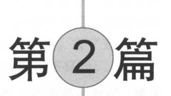

# 数据模型篇

- ·第 大数据领域建模综述
- ·第 阿里巴巴数据整合及管理体系
- ·第 <sup>10</sup> 章维度设计
- ·第 章事实表设计


# 大数据领域 建模综述

# 8.1 为什么需要数据建模

随着 时代互联网、智能设备及其他信息技术的发展,数据爆发 式增长,如何将这些数据进行有序、有结构地分类组织和存储是我们面 临的一个挑战。

如果把数据看作图书馆里的书,我们希望看到它们在书架上分门别 类地放置;如果把数据看作城市的建筑,我们希望城市规划布局合理: 如果把数据看作电脑文件和文件夹,我们希望按照自己的习惯有很好 的文件夹组织方式,而不是糟糕棍乱的桌面,经常为找 个文件而不知

数据模型就是数据组织和存储方法,它强调从业务、数据存取和使

# 章大数据领域建模综述丁一

用角度合理存储数据。 Linux 的创始人 Torva lds 一段关于"什么才是 优秀程序员"的话:"烂程序员关心的是代码,好程序员关心的是数据 结构和它们之间的关系",其阐述了数据模型的重要性。有了适合业务 和基础数据存储环境的模型,那么大数据就能获得以下好处。

- ·性能 :良好的数据模型能帮助我们快速查询所需要的数据,减少 数据的 <sup>110</sup> 吞吐。
- ·成本 良好的数据模型能极大地减少不必要的数据冗余,也能实 现计算结果复用,极大地降低大数据系统中的存储和计算成本。
- .效率 :良好的数据模型能极大地改善用户使用数据的体验,提高 使用数据的效率。
- ·质量 良好的数据模型能改善数据统计口径的不一致性,减少数 据计算错误的可能性。

因此,毋庸置疑,大数据系统需要数据模型方法来帮助更好地组织 和存储数据,以便在性能、成本、效率和质量之间取得最佳平衡。

# 8.2 关系数据库系统和数据仓库

E .F .Codd 是关系数据库的鼻祖,他首次提出了数据库系统的关系 模型 ,开创了数据库关系方法和关系数据理论的研究。随着一大批大型 关系数据库商业软件 (如 Oracle lnformix DB2 等)的兴起,现代企 业信息系统几乎都使用关系数据库来存储、加工和处理数据。数据仓库 系统也不例外,大量的数据仓库系统依托强大的关系数据库能力存储和 处理数据,其采用的数据模型方法也是基于关系数据库理论的。虽然近 年来大数据的存储和计算基础设施在分布式方面有了飞速的发展, NoSQL 技术也曾流行一时,但是不管是 Hadoop Spark 还是阿里巴巴 集团的 MaxCompute 系统,仍然在大规模使用 SQL 进行数据的加工和 处理,仍然在用 Table 存储数据,仍然在使用关系理论描述数据之间的 关系 ,只是在大数据领域,基于其数据存取的特点在关系数据模型的范 式上有了不同 的选择而已。关于范式的详细说明和定义,以及其他一些

### 一寸大数据之路一一阿里巴巴大数据实践

关系数据库的理论是大数据领域建模的基础,有兴趣的读者可以参考相 的经典数据库理论书籍,如《数据库系统概念》

# 8.3 OLTP 系统的区别看模型万法论的 选择

系统通常面向的主要数据操作是随机读写,主要采用满 实体关系模型存储数据,从而在事务处理中解决数据的冗余和 致性 问题:而 系统面向的主要数据操作是批量读写,事务处理 致性不是 关注的,其主要关注数据的整合,以及在 的复杂大数据查询和处理中的性能,因此它需要采用 些不同的数据

# 8.4 典型的数据仓库建模万法论

### 8.4.1 ER 模型

数据仓库之父 提出的建模方法是从全企业的高度设计 模型,用实体关系( Entity Relationship, ER )模型描述企业业 务,在范式理论上符合 。数据仓库中的 系统中的 的区别在于,它是站在企业角度面向主题的抽象,而不是针对某个具体 业务流程的实体对象关系的抽象。其具有以下几个特点:

- 需要全面了解企业业务和数据
- 实施周期非常长。
- 对建模人员的能力要求非常高。

采用 模型建设数据仓库模型的出发点是整合数据,将各个系统

中的数据以整个企业角度按主题进行相似性组合和合并,并进行一致性 处理,为数据分析决策服务,但是并不能直接用于分析决策。

其建模步骤分为三个阶段。

- ·高层模型:一个高度抽象的模型,描述主要的主题以及主题间的 关系,用于描述企业的业务总体概况。
- 中层模型:在高层模型的基础上,细化主题的数据项。
- 物理模型(也叫底层模型):在中层模型的基础上,考虑物理存 储,同时基于性能和平台特点进行物理属性的设计,也可能做一 些表的合并、分区的设计等。

ER 模型在实践中最典型的代表是 Teradata 公司基于金融业务发布 FS-LDM (Financial Services Logical Data Model ),它通过对金融业 务的高度抽象和总结,将金融业务划分为 <sup>10</sup> 主题 ,并以设计面向 融仓库模型的核心为基础,企业基于此模型做适当调整和扩展就能快速 落地实施。

# 8.4.2 维度模型

维度模型是数据仓库领域的 Ralph Kimball 大师所倡导的,他的 The Data rehouse olkit-The *Complete Guide to Dimensional* Modeling 数据仓库工程领域最流行的数据仓库建模的经典。

维度建模从分析决策的需求出发构建模型,为分析需求服务,因此 它重点关注用户如何更快速地完成需求分析,同时具有较好的大规模复 杂查询的响应性能。其典型的代表是星形模型,以及在一些特殊场景下 使用的雪花模型。其设计分为以下几个步骤。

- 选择需要进行分析决策的业务过程。业务过程可以是单个业务事 件,比如交易的支付、退款等;也可以是某个事件的状态,比如 当前的账户余额等;还可以是一系列相关业务事件组成的业务流 程,具体需要看我们分析的是某些事件发生情况,还是当前状态, 或是事件流转效率。
- 选择粒度。在事件分析中,我们要预判所有分析需要细分的程度,

从而决定选择的粒度。粒度是维度的一个组合。

- 识别维表。选择好粒度之后,就需要基于此粒度设计维表,包括 维度属性,用于分析时进行分组和筛选。
- ·选择事实。确定分析需要衡量的指标

# 8.4.3 Data Vault 模型

Data Vault Dan Linstedt 发起创建的一种模型,它是 模型的 生,其设计的出发点也是为了实现数据的整合,但不能直接用于数据分 析决策。它强调建立一个可审计的基础数据层,也就是强调数据的历史 性、可追溯性和原子性,而不要求对数据进行过度的一致性处理和整合 同时它基于主题概念将企业数据进行结构化组织,并引入了更进一步的 范式处理来优化模型,以应对游、系统变更的扩展性。 型由 以下几部分组成。

- Hub :是企业的核心业务实体,由 实体 key 、数据仓库序列代理 键、装载时间、数据来源组成。
- Link :代表 Hub 之间的关系。这里与 模型最大的区别是将关 系作为一个独立的单元抽象,可以提升模型的扩展性。它可以直 接描述 : :n n:n 的关系,而不需要做任何变更。它由 的代理键、装载时间、数据来源组成。
- Satellite :是 Hub 的详细描述内容, 一个 ub 可以有多个 Satellite 它由 的代理键、装载时间、来源类型、详细的 Hub 描述信 息组成。

Data Vault 模型比 ER 模型更容易设计和产出,它的 ETL 加工可实 现配置化。通过 Dan Linstedt 的比喻更能理解 Data Vault 的核心思想: Hub 可以想象成人的骨架,那么 Link 就是连接骨架的韧带,而 Sate II ite 就是骨架上面的血肉。看如下实例(来自 ult *Modeling Guide,*  作者 Hans Hultgren ),如图 所示。

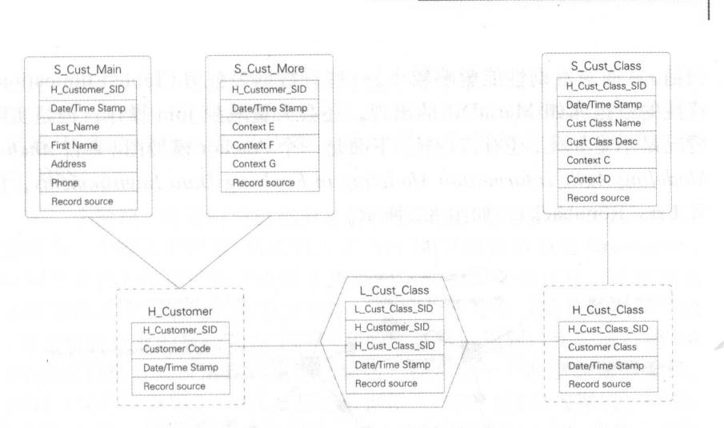

Data Vault 模型实例

# 8.4.4 Anchor 模型

Anchor Data Vault 模型做了进一步规范化处理, Lars. Ri:innback 的初衷是设计 个高度可扩展的模型,其核心思想是所有的扩展只是添 加而不是修改,因此将模型规范到 6NF ,基本变成了 k-v 结构化模型。 们看 Anchor 模型的组成。

- Anchors :类似于 Data Vault Hub ,代表业务实体,且只有主键。
- Attributes :功能类似于 Data Vault Satellite ,但是它更加规范 化,将其全部 k-v 结构化, 个表只有 Anchors 的属性描述。
- Ties :就是 Anchors 之间的关系,单独用表来描述,类似于 Data Vault Link ,可以提升整体模型关系的扩展能力。
- Knots :代表那些可能会在 Anchors 中公用的属性的提炼, 比如性别、状态等这种枚举类型且被公用的属性。

在上述四个基本对象的基础上,又可以细划分为历史的和非历史 的,其中历史的会以时间戳加多条记录的方式记录数据的变迁历史。

Anchor 模型的创建者以此方式来获取极大的可扩展性,但是也会 增加非常多的查询 join 操作。创建者的观点是,数据仓库中的分析查询 只是基于一小部分字段进行的,类似于列存储结构,可以大大减少数据

大数据领域建模综述丁一

扫描,从而对查询性能影响较小。一些有数据表裁剪( Table Elimination) 特性的数据库如 的出现, 还会大量减少 join 操作。但是实际 情况是不是如此,还有待商榷。下面是一个 模型图(来自 *Modeling-Agile* ormation *Modeling in Evolving Data* Environments ,作 Ronnback ),如 所示。

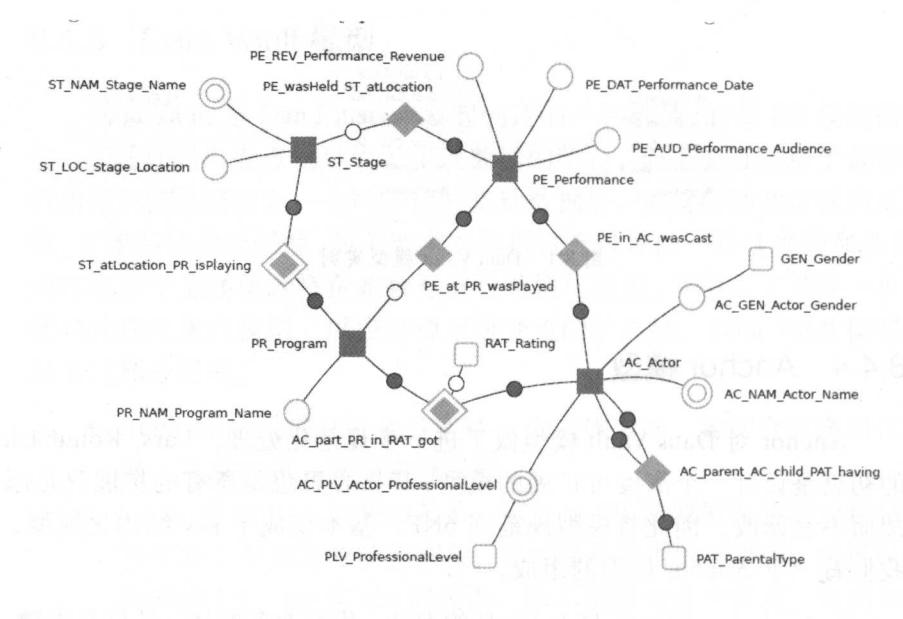

模型图

# 8.5 阿里巴巴数据模型实践综述

阿里巴巴集团很早就已经把大数据作为其战略目标实施,而且其各个 业务也非常依赖数据支撑运营,那么阿里巴巴究竟采取何种方法构建自己 的数据仓库模型呢?阿里巴巴的数据仓库模型建设经历了多个发展阶段。

个阶段 完全应用驱动的时代,阿里巴巴的第 代数据仓库系 统构建在 上,数据完全以满足报表需求为目的,将数据以与源 结构相同的方式同步到 (称作 层),数据工程师基于

136

数据进行统计,基本没有系统化的模型方法体系,完全基于对 Oracle 数据库特性的利用进行数据存储和加工,部分采用 一些维度建模的缓慢 化维方式进行历史数据处理。这时候的数据架构只有两层,即 ODS+DSS

个阶段:随着阿里巴巴业务的快速发展,数据量也在飞速增长, 性能成为一个较大的问题,因 此引入了当时 MPP 架构体系的 Greenplum, 同时阿里巴巴的数据团队也在着手进行一定的数据架构优化,希望通过 些模型技术改变烟囱式的开发模型 ,消除一些冗余 ,提升数据的一致 性。来自传统行业的数据仓库工程师开始尝试将工程领域比较流行的 ER 模型+维度模型方式应用到阿里 巴巴集团,构建出 个四层的模型架构, ODL (操作数据层) +BDL 础数据层) +IDL 接口数据层) +ADL (应用数据层)。 ODL 和源系统保持一致 BDL 希望引人 ER 模型,加强 数据的整合,构建一致的基础数据模型 IDL 基于维度模型方法构建集 市层; DL 完成应用的个性化和基于展现需求的数据组装。在此期间, 我们在构建 模型时遇到了 比较大的困难和挑战,互联网业务的快速 发展、人员的快速变化、业务知识功底 的不够全面,导致 ER 模型设计 迟迟不能产出。至此,我们也得到了 个经验 在不太成熟、快速变化 的业务面前,构建 模型的风险非常大,不太适合去构建 ER 模型。

第三个阶段 :阿里巴巴集团的业务和数据还在飞速发展,这时候迎 来了以 Hadoop 为代表的分布式存储计算平台 的快速发展,同时阿里巴 巴集团自主研发的分布式计算平台 MaxCompute 也在紧锣密鼓地进行 着。 我们在拥抱分布式计算平台的同时,也开始建设自己的第三代模型 架构,这时候需要找到既适合阿里巴巴集团业务发展,又能充分利用分 布式计算平台能力的数据模型方式。我们选择了以 Kimball 的维度建模 为核心理念的模型方法论,同 时对其进行了 定的升级和扩展,构建了 阿里巴巴集团的公共层模型数据架构体系。

数据公共层建设的目的是着力解决数据存储和计算的共享问题。阿 巴巴集团当下已经发展为多个 BU ,各个业务产生庞大的数据,并且 数据每年以近 2. 倍的速度在增长,数据的增长远远超过业务的增长, 带来的成本开销也是非常令人担忧的。

阿里巴巴数据公共层建设的指导方法是一套统一化的集团数据整 合及管理的方法体系(在内部这一体系称为"OneData "),其包括一致 性的指标定义体系 、模型设计方法体系以及配套工具。

=主巳

# 阿里巳巳数据 整合及管理体系

面对爆炸式增长的数据,如何建设高效的数据模型和体系,对这些 数据进行有序和有结构地分类组织和存储,避免重复建设和数据不一致 性,保证数据的规范性, 直是大数据系统建设不断追求的方向。

OneData 即是阿里巴巴内部进行数据整合及管理的方法体系和工 具。阿里巴巴的大数据工程师在这一体系下,构建统 、规范、可共 的全域数据体系,避免数据的冗余和重复建设,规避数据烟囱和不一致 性,充分发挥阿里巴巴在大数据海量、多样性方面的独特优势。借助 统一化数据整合及管理的方法体系,我们构建了阿里巴巴的数据公 层,并可以帮助相似的大数据项目快速落地实现。下面重点介绍 OneData 体系和实施方法论。

# 9.1 概述

阿里巴巴集团大数据建设方法论的核心 :从业务架构设计到模型

设计,从数据研发到数据服务,做到数据可管理 、可追溯、可规避重复 建设。目前,阿里巴巴集团数据公共层团队已把这套方法论沉淀为产品, 以帮助数据 PD 、数据模型师和 ETL 工程师建设阿里的大数据。这一体 系包含方法论以及相关产品。

# 9.1.1 定位及价值

建设统 的、规范化的数据接人层( ODS )和数据中间层( DWD DWS ),通过数据服务和数据产品,完成服务于阿里巴巴的大数据系 统建设 ,即数据公共层建设。提供标准化的( Standard )、共享的( Shared )、 数据服务( Service )能力,降低数据互通成本,释放计算、存储、人力 等资源,以消除业务和技术之痛。

# 9.1.2 体系架构

体系架构图如图 9.1 所示。


9.1 休系架构图

业务板块:由 于阿里巴巴集团业务生态庞大,所以根据业务的属性 划分出几个相对独立的业务板块,业务板块之间的指标或业务重叠性较 小。如电商业务板块涵盖淘系、 系和

规范定义: 阿里数据业务庞大,结合行业的数据仓库建设经验和阿 里数据自身特点,设计出的一套数据规范命名体系,规范定义将会被用 在模型设计中。后面章节将会详细说明。

Exp

系等。

模型设计: 以维度建模理论为基础,基于维度建模总线架构,构建 致性的维度和事实(进行规范定义)。同时,在落地表模型时,基于 阿里自身业务特点 设计出一套表规范命名体系。后面章节将会详细 说明。

### 9.2 规范定义

规范定义指以维度建模作为理论基础 构建总线矩阵,划分和定义 数据域、业务过程、维度、度量 原子指标、修饰类型、修饰词、时间 周期、派生指标。

规范定义实例如图 所示。

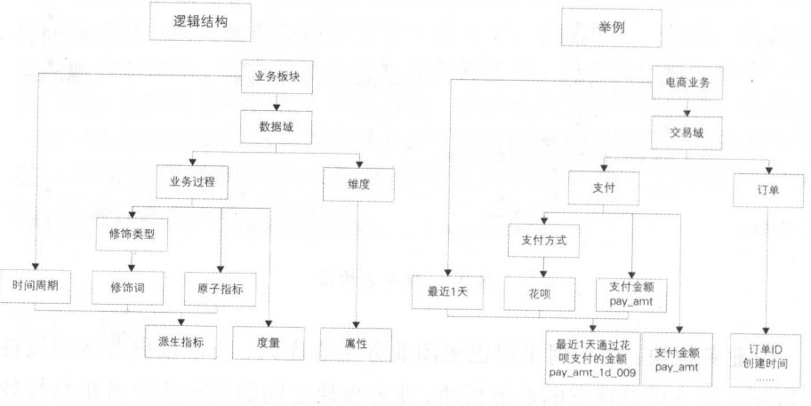

9\_2 规范定义实例

# 9.2.1 名词术语

名词术语解释如表 9.1 示。

## 9.1 名词术语解释

| 名词术语       |                                                                                                                                                                                                                                              |
|------------|----------------------------------------------------------------------------------------------------------------------------------------------------------------------------------------------------------------------------------------------|
| 数据域        | 业务过程可以概<br>其中<br>指面向业务分析,将业务过程或者维度进行抽象的集合<br>维度是指度<br>可以定义指标<br>在业务过程之下<br>个个不可拆分的行为事件<br>肯为<br>数据域是需要<br>为保障整个体系的生命力<br>的环境,如买家下单事件,买家是维度<br>既能涵盖当<br>在划分数据域时<br>但不轻易变动<br>抽象提炼,并且长期维护和更新的<br>前所有的业务需求,又能在新业务进入时无影响地被包含进已有的数据域中和扩展<br>新的数据域 |
| 业务过程       | 请注意,业务过程<br>指企业的业务活动事件,如下单、支付、退款都是业务过程<br>通俗地讲,业务过程就是企业活动中的事件<br>个不可拆分的行为亨,件                                                                                                                                                                 |
| 时间周期       | 用来明确数据统计的时间范用或者时间点,如最近 30 天、自然周、截至当日等                                                                                                                                                                                                        |
| 修饰类型       | 修饰类型从属于某个业务域,如日志域的访问终端<br>是对修饰词的一种抽象划分<br>端等修饰词<br>类型涵盖无线端、                                                                                                                                                                                  |
| 修饰词        | 修饰词隶属于一种修饰类型,如<br>指除了统计维度以外指标的业务场景限定抽象<br>有修饰词 PC 端、无线端等<br>在日志域的访问终端类型下                                                                                                                                                                     |
| fJ:<br>子指标 | 行为下的度盟,是业务定义中不可<br>原子指标和度自含义相同,基于某一业务 jJ<br>再拆分的指标,具有明确业务含义的名词 ,如支付金额                                                                                                                                                                        |
| 维度         | 个维度<br>这类属性的集合构成<br>维度是度盟的环境,用来反映业务的一类属性<br>个数据域,如地理维度(其中包挤罔家、地区、<br>维度属于<br>也可以称为实体对象<br>省以及城市等级别的内容)、时间维度(其中包括年、季、月、周、日等级别的内容)                                                                                                             |
| 维度属性       | ID 、省份名称等<br>如地理维度里面的国家名称、同家<br>维度属性隶属于一个维度<br>都属于维度属性                                                                                                                                                                                       |
| 派生指标       | 可以理解为对原子指<br>个原子指标+多个修饰词(可选)+时间周期<br>派生指标=<br>天海外买家支付金额则为<br>支付金额,最近<br>如原子指标<br>标业务统计范罔的圈定<br>买家作为维度,而不作为修饰词)<br>海外为修饰词<br>天为时间周期<br>派生指标(最近                                                                                                |

# 9.2.2 指标体系

本文在讲述指标时,会涵盖其组成体系(原子指标、派生指标、修 饰类型、修饰词、时间周期),将它们作为一个整体来解读。

# 基本原则

( l )组成体系之间的关系

指标由原子指标、时间周期修饰词、若干其他修饰词组合得 )。


派生指标

- ·原子指标、修饰类型及修饰词,直接归属在业务过程下,其中 饰词继承修饰类型的数据域。
- ·派生指标可以选择多个修饰词,修饰词之间的关系为"或"或者 "且",由具体的派生指标语义决定。
- 指标唯一归属一个原子指标 ,继承原子指标的数据域, 与修 饰词的数据域无关。

而言,事务型指标和存量型指标(见下文定义)只会唯 定位 到一个业务过程,如果遇到同时有两个行为发生、需要多个修饰词、生 成一个派生指标的情况,则选择时间靠后的行为创建原子指标,选择时 间靠前的行为创建修饰词。

·原子指标有确定的英文字段名、数据类型和算法说明:派生指标 要继承原子指标的英文名、数据类型和算法要求。

(2 )命名约定

- 命名所用术语。指标命名,尽量使用英文简写,其次是英文, 指标英文名太长时,可考虑用汉语拼音首字母命名。如中国质造, zgzc 。在 工具中维护着常用的名词术语,以用来进行 命名。
- ·业务过程。英文名:用英文或英文的缩写或者中文拼音简写\$中 文名:具体的业务过程中文即可,如图 所示。

142

## 阿里巴巴数据整合及管理体系寸一

| 业务也程伴情 |                                                                 |             |  |
|--------|-----------------------------------------------------------------|-------------|--|
| 业量'    | 电商业童音                                                           | 幅画          |  |
| 舷量     | E动:t                                                            |             |  |
| 申宜在称   | 内在叮两主进主                                                         |             |  |
| 英叉宦忡   | 军,_rollw                                                        |             |  |
| 赌注     | 剖人道行关注(·吨;哥主Jtλ拍丝到<br>行是主},对内喜』自由尴作订阅(uc 渴草头<br>和童问·手:毗区附京大商)主章 | •<br>,<br>, |  |

9.4 业务过程命名示例

关于存量型指标(见下文定义)对应的业务过程的约定:实体对象 英文名 stock 。如在线会员数、 一星会员数等 ,其对应的业务过程为 mbr\_stock1 在线商品数、商品 SKU 种类小于 的商品数,其对应的业 务过程 itm\_stock

·原子指标。英文名 :动作+度量:中文名:动作+度量。原子指标 必须挂靠在某个业务过程下,如图 9.5 所示。

| 矗拿凰惺    |      |                                           |      |              |   |
|---------|------|-------------------------------------------|------|--------------|---|
|         |      |                                           |      |              |   |
| """"#)< | 主付巢" |                                           | 建交"" | i>,._  rι··' |   |
| :•瘫然    |      |                                           | •o:  | 2            |   |
|         |      | '且上 ,付搓'币,捕;::·.慢拔为 雏金""为盆"为订"变付窒锁,且•ff支付 |      |              |   |
| 配军岖'    |      |                                           |      |              | , |
|         |      |                                           |      |              |   |
|         |      |                                           |      |              |   |
| eaiaa   |      |                                           |      |              |   |
| 笠,Hi    | 电唱监A |                                           |      |              |   |

## 9.5 原子指标详情

修饰词。只有时间周期才会有英文名,且长度为 位,加上"一" 位,例如一。其他修饰词无英文名。

阿里巴巴常用的时间周期修饰词如表 所示。

| 中文名        | 英文名 | 中文名      | 英文名 |
|------------|-----|----------|-----|
| 最近         | Id  | 自然月      | cm  |
| 最近         | 3d  | 自然季度     | cq  |
| 最近         | lw  | 截至当日     | td  |
| 最近<br>14   | 2w  | 年初截至当日   | sd  |
| 最近<br>30   | Im  | 零点截至当前   | "   |
| 最近<br>60   | 2m  | 财年       | fy  |
| 最近<br>90   | 3m  | 最近<br>小时 | lh  |
| 最近<br>180  | 6m  | 准实时      | ts  |
| 180<br>天以前 | bh  | 未来       | flw |
| 自然周        | CW  | 未来       | f4w |

阿里巴巴常用的时间周期修饰词

派生指标。英文名 原子指标英文名+时间周期修饰词( 位, 例如\_Id) +序号( 位,例如一<sup>001</sup> );中文名:时间周期修饰词 +[其他修饰词]+原子指标。

工具中,英文名与中文名都会由 工具自动生成, 如图 所示。

| 际笠<br>酣详镜阳 | 审幢司                   |         |    |     |    |
|------------|-----------------------|---------|----|-----|----|
| 躯属性        |                       |         |    |     |    |
| ,手罚.,,     | 重何"也自富翁               | ,毫也,,空渴 | PC |     |    |
| 町且嘿赐       | ·对01                  |         | l  | 吐时川 | 一- |
| "'又        | 最盐<br>天阿咱直白蜡曹志描JI     |         |    |     |    |
| 卖宫         | _,.,_.,,J<br>_ "-"-"" |         |    |     |    |
| 撞草草        |                       |         |    |     |    |

# 派生指标命名示伽

为了控制派生指标的英文名称过长,在英文名的理解和规范上做了 取舍,所有修饰词的含义都纳入了序号中。序号是根据原子指标+派生 指标自增的。

(3 )算法

原子指标、修饰词、派生指标的算法说明必须让各种使用人员看得 明白,包括

算法概述一一算法对应的用户容易理解的阐述。

举例一一通过具体例子帮助理解指标算法。

• SQL 算法说明一一对于派生指标给出 SQL 的写法或者伪代码。

# 操作细则

( 1 )派生指标的种类

派生指标可以分为 事务型指标、存量型指标和复合型指标。 按照其特性不同,有些必须新建原子指标,有些可以在其他类型原子指 标的基础上增加修饰词形成派生指标。

- 事务型指标 是指对业务活动进行衡量的指标。例如新发商品数、 重发商品数、新增注册会员数、订单支付金额,这类指标需维护 原子指标及修饰词,在此基础上创建派生指标。
- 型指标:是指对实体对象(如商品、会员)某些状态的统计。 例如商品总数、注册会员总数,这类指标需维护原子指标及修饰 词,在此基础上创建派生指标,对应的时间周期 般为"历史截 至当前某个时间"。
- 复合型指标:是在事务型指标和存量型指标的基础上复合而成 的。例如浏览 UV-下单买家数转化率 有些需要 建新原子指标, 有些则可以在事务型或存量型原子指标的基础上增加修饰词得 到派生指标。

(2 )复合型指标的规则

比率型 创建原子指标,如 TR 、浏览 UV 下单买家数转化率、 满意率等。例如,"最近 天店铺首页 TR",原子指标为" CT ", 大数据之路一一阿里巴巴大数据实践

时间周期为"最近 天",修饰类型为"页面类型",修饰词为"店 铺首页"。

- 比例型 创建原子指标,如百分比 比。例如"最近 天无线 支付金额占比",原子指标为"支付金额占比",修饰类型为"终 端类型",修饰词为"无线"。
- ·变化量型:不创建原子指标,增加修饰词,在此基础上创建派 指标。例如,"最近 天订单支付金额上 天变化量",原子指标 为"订单支付金额",时间周期为"最近 天",修饰类型为"统 计方法",修饰词为"上 天变化量"。
- ·变化率型:创建原子指标。例如,"最近 天海外买家支付金额 天变化率",原子指标为"支付金额变化率",修饰类型为" 家地域",修饰词为"海外买家"。
- ·统计型 (均值、分位数等):不创建原子指标,增加修饰词,在 此基础上创建派生指标;在修饰类型 "统计方法"下增加修饰词, 如人均、日均、行业平均、商品平均 分位数 分位数例如,"自然月日均 UV",原子指标为"UV",修饰类型为"统 计方法",修饰词为"日均"。
- 排名型 创建原子指标, 一般为 top\_xxx ,有时会同时选择 top\_xxx \_xxx 组合使用。创建派生指标时选择对应的修饰 词如下:
  - 〉统计方法(如降序、升序)。
  - 》排名名次(如 )。
  - 》排名范围(如行业、省份、一级来源等)。
  - 》根据什么排序(如搜索次数、 )。

示例如图 所示。

对象集合型 主要是指数据产品和应用需要展现数据时,将一些 对象以 对的方式存储在一个字段 中,方便前端展现。比如 势图、 排名对象等。其定义方式是,创建原子指标, 般为 串:创建派生指标时选择对应的修饰词如下:

# 丁一-

〉统计方法(如降序、升序)。

》排名名次(如 TOPIO

〉排名范围(如行业、区域)。

|                                                                                                                                                                                                                                |          |         |                                             | 基本属性   |
|--------------------------------------------------------------------------------------------------------------------------------------------------------------------------------------------------------------------------------|----------|---------|---------------------------------------------|--------|
| THE REPORT OF REPORT OF THE REPORT OF THE REPORT OF THE REPORT OF THE REPORT OF THE REPORT OF THE REPORT OF THE REPORT OF THE REPORT OF THE REPORT OF THE REPORT OF THE REPORT OF THE REPORT OF THE REPORT OF THE REPORT OF TH |          |         |                                             |        |
| .                                                                                                                                                                                                                              | 強席       | 其他修饰词 2 | top_n关键词                                    | 原子指标 ② |
|                                                                                                                                                                                                                                |          |         |                                             |        |
|                                                                                                                                                                                                                                | 排名范围 关键词 |         | 最近60天                                       | 时间周期() |
|                                                                                                                                                                                                                                |          |         |                                             |        |
| considera production and conservation of the conservation                                                                                                                                                                      | 搜索次数排序   |         | 最近60天top1搜索关键词                              | 中文名称   |
| .                                                                                                                                                                                                                              |          |         |                                             |        |
|                                                                                                                                                                                                                                | 第1名      |         | top_n_keyword_2m_001                        | 英文名称   |
|                                                                                                                                                                                                                                |          |         | ing a quier and here speaks and in a means. |        |
|                                                                                                                                                                                                                                |          |         | tivici                                      | 数据类型   |

派生指标示例

示例如图 示。

| 基本属性    |                                                                                                                                                                                              |         |                                                                                                                                                                                                                                                                                    |  |
|---------|----------------------------------------------------------------------------------------------------------------------------------------------------------------------------------------------|---------|------------------------------------------------------------------------------------------------------------------------------------------------------------------------------------------------------------------------------------------------------------------------------------|--|
| 原子指标(2) | .<br>高品心率<br>                                                                                                                                                                                | 其他修饰词 ② | <br>PC張<br>                                                                                                                                                                                                                                                                        |  |
| 时间周期 3  | ing de gran el algún de perde lenguas que el condition en que anales desenvolverses el algun el algún de perdente a<br>最近7天<br>a ada may a disa da ing ang ang ang ang ang ang ang ang ang a |         | plated in that a station algo a property we describe a control plate of the scale of a special plate of the state of the scale<br>前5名<br>dans a seu a que ela a alguna a diversa de seu a analista a que e a a que a provincia a a a cons                                          |  |
| 中文名称    | 新行天XC端商品详情页描述区域被点击TOPN商品ID串                                                                                                                                                                  |         | --------------------------------------<br>点击商品信息<br>the most distribution of the second to the contract of the second state of the second state of the second state of the second state of the second state of the second state of the second state of the second state of the sec |  |
| 英文名称    | itm_str_iw_001                                                                                                                                                                               |         | .<br>The confidence and design and the confidence of the confidence of the confidence of the confidence of the confidence of the confidence of the confidence of the confidence of the confidence of the confidence of the confid<br>高品福沐汉域<br>                                    |  |
| 数据类型    | STRING.                                                                                                                                                                                      |         |                                                                                                                                                                                                                                                                                    |  |

9.8 派生指标 2

# 其他规则

( I )上下层级派生指标同时存在时

如最近 天支付金额和最近 PC 端支付金额,建议使用前者, PC 端作为维度属性存放在物理表中体现。

一寸大数据之路一-阿里巴巴大数据实践

(2 )父子关系原子指标存在时

当父子关系原子指标存在时,派生指标使用子原子指标创建派生指 标。如 PV IPV (商品详情页 PV ),当统计商品详情页 PV 时,优先选 择子原子指标。

# 9.3 模型设计

# 9.3.1 指导理论

阿里巴巴集团数据公共层设计理念遵循维度建模思想,可参考 Star Schern The *Complete* Reference The Dαtα Warehouse *Toolkit-The*  lnitive *Guide to Dimensional* Modeling。数据模型的维度设计主要 维度建模理论为基础,基于维度数据模型总线架构,构建一致性的维度 和事实。

# 9.3.2 模型层次

阿里巴巴的数据团队把表数据模型分为三层 :操作数据层( ODS )、 公共维度模型层( DM )和应用数据层( DS ), 其中公共维度模型层 包括明细数据层( DWD )和汇总数据层( DWS )。模型层次关系如 9.9 所示。

操作数据层( ODS ):把操作系统数据几乎无处理地存放在数据仓 库系统中。

- 同步:结构化数据增量或全量同步到 MaxCompute
- 结构化:非结构化(日志)结构化处理并存储至lj MaxCompt闹。
- 累积历史、清洗:根据数据业务需求及稽核和审计要求保存历史 数据、清洗数据。

## 章阿里巴巴数据整合及管理体系丁一

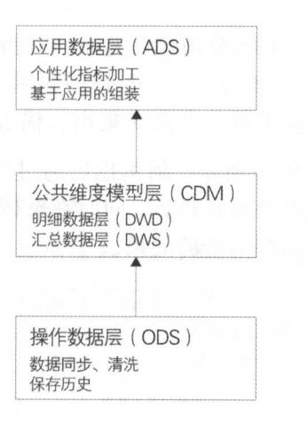

模型层次关系图

公共维度模型层( CDM ):存放明细事实数据、维表数据及公共指 标汇总数据 其中明细事实数据、维表数 一般根据 层数据加工 :公共指标汇总数据 般根据维表数据和明细事实数据加工生成。

层又细分为 层和 层,分别是明细数据层和汇总数 据层,采用维度模型方法作为理论基础 更多地采用 些维度退化手法, 将维度退化至事实表中,减少事实表和维表的关联 ,提高明细数据 易用性 :同时在汇总数据层, 加强指标的维度退化, 采取更多的宽表 手段构建公共指标数据层,提升公共指标的复用性,减少重复加工。其 主要功能如下。

- ·组合相关和相似数据:采用明细宽表,复用关联计算,减少数据 扫描。
- ·公共指标统 加工:基于 体系构建命名规范、口径 和算法统 的统计指标,为上层数据产品、应用和服务提供公共 指标 立逻辑汇总宽表。
- 建立 致性维度:建立 致的数据分析维表,降低数据计算口径、 算法不统一的风险。

应用数据层( ADS ):存放数据产品个性化的统计指标数据,根据 层与 层加工生成

- ·个性化指标加工:不公用性、复杂性(指数型、比值型、排名型 指标)。
- .基于应用的数据组装 大宽表集市、横表转纵表、趋势指标串。

其模型架构如图 9.10 所示。阿里巴巴通过构建全域的公共层数据, 极大地控制了数据规模的增长趋势,同时在整体的数据研发效率、成本 节约、性能改进方面都有不错的效果。

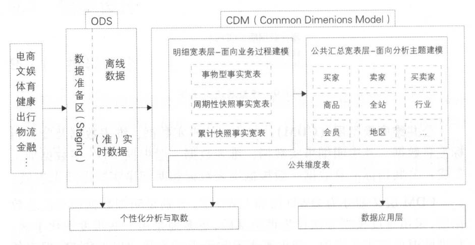

9.10 美型架构图

数据调用服务优先使用公共维度模型层( CDM )数据,当公共层 没有数据时,需评估是否需要创建公共层数据,当不需要建设公用的公 共层时,方可直接使用操作数据层( ODS )数据。应用数据层( ADS) 作为产品特有的个性化数据 般不对外提供数据服务,但是 ADS 作为 被服务方也需要遵守这个约定。

# 9.3.3 基本原则

# 1 高内聚和低辑合

一个逻辑或者物理模型由哪些记录和字段组成,应该遵循最基本的 软件设计方法论的高内聚和低藕合原则。主要从数据业务特性和访问特 性两个角度来考虑 :将业务相近或者相 关、粒度相同的数据设计为一个 逻辑或者物理模型:将高概率同 时访问的数据放一起 ,将低概率同时访 问的数据分开存储。

# 核心模型与扩展模型分离

建立核心模型与扩展模型体系,核心模型包括的宇段支持常用的核 心业务,扩展模型包括的字段支持个性化或少量应用的需要 ,不能让扩 展模型的宇段过度侵人核心模型,以免破坏核心模型的架构简洁性与可 维护性。

# 公共处理逻辑下沉及单一

越是底层公用的处理逻辑越应该在数据调度依赖的底层进行封装 与实现,不要让公用的处理逻辑暴露给应用层实现,不要让公共逻辑多 处同时存在。

# 成本与性能平衡

适当的数据冗余可换取查询和刷新性能,不宜过度冗余与数据复

# 数据可回滚

处理逻辑不变,在不同时间多次运行数据结果确定不变。

# 一致性

具有相同含义的字段在不同表中的命名必须相同,必须使用规范定 义中的名称。

# 命名清晰、可理解

表命名需清晰、一致,表名需易于消费者理解和使用。

# 9.4 模型实施

如何从具体的需求或项目转换为可实施的解决方案,如何进行需求 分析、架构设计、详细模型设计等,则是模型实施过程中讨论的内容。 本节先简单介绍业界常用的模型实施过程,然后重点讲解阿里巴巴 On at 模型设计理论及实施过程。

# 9.4.1 业界常用的模型实施过程

### 1. Kimball 模型实施过程

Kimball 维度建模主要探讨需求分析、高层模型、详细模型和模 审查整个过程。

构建维度模型一般要经历三个阶段:第一个阶段是高层设计时期 定义业务过程维度模型的范围,提供每种星形模式的技术和功能描述; 第二个阶段是详细模型设计时期,对每个星形模型添加属性和度量信 息;第 个阶段是进行模型的审查、再设计和验证等工作,第四个阶段 是产生详细设计文档,提交 ETL 设计和开发。

( 1 )高层模型

高层模型设计阶段的直接产出目标是创建高层维度模型图,它是对 业务过程中的维表和事实表的图形描述。确定维表创建初始属性列表, 为每个事实表 建提议度量。

(2 )详细模型

详细的维度建模过程是为高层模型填补缺失的信息,解决设计问 题,并不断测试模型能否满足业务需求,确保模型的完备性。确定每个 维表的属性和每个事实表的度量,并确定信息来源的位置、定义,确 属性和度量如何填人模型的初步业务规则。

(3 )模型审查、再设计和验证

本阶段主要召集相关人员进行模型的审查和验证,根据审查结果对 详细维度进行再设计。

(4 )提交 设计和开发

最后,完成模型详细设计文档,提交 开发人员,进入 计和开发阶段,由 人员完成物理模型的设计和开发。

上述内容主要引用自 lph 等的 *Lifecycle* Toolkit ,具体细节请参考原著作。

### 2. Inmon 模型实施过程

对数据模型的定位是:扮演着通往数据仓库其他部分的智能 路线图的角色。由于数据仓库的建设不是一蹦而就的,为了协调不同人 员的工作以及适应不同类型的用户,非常有必要建立 个路线图一一- 据模型,描述数据仓库各部分是如何结合在一起的。

将模型划分为三个层次,分别是 ERD (Entity Relationship Diagram ,实体关系图)层、 DIS (Data Item Set 数据项集)层和物理 Physical Model ,物理模型)。

层是数据模型的最高层,该层描述了公司业务中的实体或主 题域以及它们之间的关系; 层是中间层,该层描述了数据模型中 的关键字、属性以及细节数据之间的关系;物理层是数据建模的最底层 该层描述了数据模型的物理特性。

对于构建数据仓库模型建议采用螺旋式开发方法,采用迭代 方式完成多次需求。但需要采用统一的 模型,才能够将每次迭代 的结果整合在一起。 模型是高度抽象的数据模型,描述了企业完 整的数据。而每次迭代则是完成 模型的子集,通过 和物理数 据模型实现。

上述内容主要引用自 Building *the* Data 具体 细节请参考原著作。

# 其他模型实施过程

在实践中经常会用到如下数据仓库模型层次的划分,和 的模型实施理论有一定的相通性,但不涉及具体的模型表达。

·业务建模,生成业务模型,主要解决业务层面的分解和程序化。

- ·领域建模,生成领域模型,主要是对业务模型进行抽象处理, 成领域概念模型。
- .逻辑建模,生成逻辑模型,主要是将领域模型的概念实体以及 体之间的关系进行数据库层次的逻辑化。
- ·物理建模,生成物理模型,主要解决逻辑模型针对不同关系数据 库的物理化以及性能等 些具体的技术问题。

# 9.4.2 OneData 实施过程

本节重点讲解怎么使用 OneData 这套体系和相配套的工具实施 数据系统的模型建设,在讲解中会以阿里巴巴的具体业务进行说明

# 1 指导方针

首先,在建设大数据数据仓库时,要进行充分的业务调研和 求分 析。这是数据仓库建设的基石,业务调研和需求分析做得是否充分直接 决定了数据仓库建设是否成功。其次,进行数据总体架构设计,主要 根据数据域对数据进行划分;按照维度建模理论,构建总线矩阵、抽 出业务过程和维度。再次,对报表需求进行抽象整理出相关指标体系, 使用 OneData 工具完成指标规范定义和模型设计。最后,就是代码研 和运维。本文将会重点讲解物理模型设计之前(含)步骤的内容

# 2. 实施工作流

实施工作流如图 9.1 所示。

(1 )数据调研

·业务调研

整个阿里集团涉及的业务涵盖电商、数 娱乐、导航(高德)、 动互联网服务等领域。各个领域又涵盖多个业务线,如电商领域就涵盖 类(淘宝、天猫、天猫国际)与 类(阿里巴巴中文站、国际站 速卖通)业务。数据仓库是要涵盖所有业务领域,还是各个业务领域独 自建设,业务领域内的业务线也同样面临着这个问题。所以要构建大数 据数据仓库,就需要了解各个业务领域、业务线的业务有什么共同

不同点 ,以及各个业务线可以细分为哪几个业务模块,每个业务模块具 体的业务流程又是怎样的。业务调研是否充分,将会直接决定数据仓库 建设是否成功

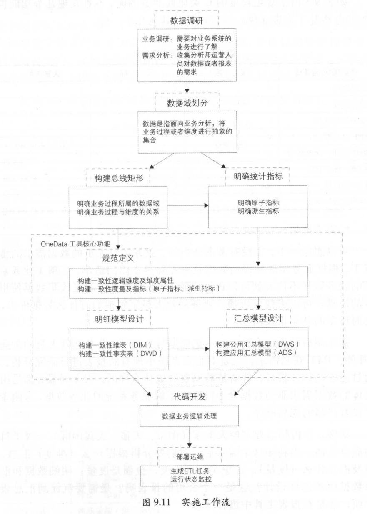

一寸大数据之路一一阿里巴巴大数据实践

在阿里巴巴, 般各个业务领域独自建设数据仓库,业务领域内的 业务线由于业务相似、业务相关性较大,进行统一集 中建设。

如表 9.3 所示是粗粒度的 类电商业务调研,不难发现几个功能 块/业务线除了淘宝无供应链管理外,其他几乎 样。

| 功能模块/业务线           |    |   | 天猫国际 |
|--------------------|----|---|------|
| 商品管理               | J  | J | J    |
| ~ι贝口供<br>立坦        | J  | J | J    |
| 交易流程管理             | J  | J | J    |
| 用户行为跟踪             | J  | J | J    |
| 好中差评、<br>DSR<br>平分 | J  | J | J    |
| 物流、库存管理            | J  | J | J    |
| 供应链管理              | NA | J | J    |
| 客户投诉与举报            | J  | J | J    |

类电商业务调研

·需求调

可以想象一下,在没有考虑分析师、业务运营人员的数据需求的情 况下,根据业务调研建设的数据仓库无疑等于闭 门造车。了解了业务 统的业务后并不代表就可以进行实施了,此刻要做的就是收集数据使用 者的需求,可以去找分析师、业务运营人员了解他们有什么数据诉求, 此时更多的就是报表需求。

需求调研的途径有两种: 是根据与分析师、业务运营人员的沟通 (邮件、 IM )获知需求: 是对报表系统中现有的报表进行研究分析 通过需求调研分析后,就清楚数据要做成什么样的。很多时候,都是由 具体的数据需求驱动数据仓库团队去了解业务系统的业务数据,这两者 并没有严格的先后顺序。

举例 分析师需要了解大淘宝(淘宝、天猫、天猫国际) 级类目 的成交金额。当获知这个需求后,我们要分析根据什么(维度)汇总, 以及汇总什么(度量),这里类目是维度,金额是度量:明细数据和汇 总数据应该怎样设计?这是一个公用的报表吗?是需要沉淀到汇总 里面,还是在报表工具中进行汇总?

(2 )架构设计

·数据域划分

示例)。

数据域是指面向业务分析,将业务过程或者维度进行抽象的集合。 业务过程可以概括为 个个不可拆分的行为事件,如下单、支付、退款。 为保障整个体系 的生命力,数据域需要抽象提炼,并且长期维护和更新, 但不轻易变动。在划分数据域时,既能涵盖当前所有的业务需求,又能在 新业务进入时无影响地被包含进已有的数据域中或者扩展新的数据域。

如表 9.4 所示是功能模块/业务线的业务动作(部分示例)。

| 功能模块/业务线        | 业务动作                    |  |  |  |  |
|-----------------|-------------------------|--|--|--|--|
| 商品管理            | 商品类目修<br>商品上架、下架、商品名称修改 |  |  |  |  |
| 会员管理            | 新增会员、会员登录、会员信息修改        |  |  |  |  |
| 交易流程管理          | 下单、订单支付、确认收货、退货、退款      |  |  |  |  |
| 用户行为跟踪          | 商品浏览、店铺浏览、网页区块点击        |  |  |  |  |
| DSR 评分<br>好巾差评、 | 好评改差评,给订单打分<br>做出评价     |  |  |  |  |
| 物流、库存管理         | 入库、出库、发货、签收             |  |  |  |  |
| 供应链管理           | 采购、发货、入库                |  |  |  |  |
| 客户投诉与举报         | 投诉、举报                   |  |  |  |  |

9.4 功能模块/业务线的业务动作

如表 9.5 所示是根据业务过程进行归纳,抽象出的数据域(部分

9.5 数据域

| 数据     | 业务过程举例                            |  |  |  |  |  |  |
|--------|-----------------------------------|--|--|--|--|--|--|
| 会员和店铺域 | 注册、登录、装修、开店、关店等                   |  |  |  |  |  |  |
| 商品域    | 发布、上架、下架、重发<br>SKU                |  |  |  |  |  |  |
| 日志域    | 曝光、浏览、点击等                         |  |  |  |  |  |  |
| 交易域    | 加购、下单、支付、退款、确认收货等                 |  |  |  |  |  |  |
| 客服和销售域 | leads 管理等<br>拜访、培训                |  |  |  |  |  |  |
| 工具和服务域 | 优惠券领用、服务市场订购<br>领用、<br>商品<br>藏、淘金 |  |  |  |  |  |  |
| 互动域    | 回帖、评论等<br>发帖                      |  |  |  |  |  |  |
| 信用风控域  | 评价、申诉、投诉、纠纷、买家保障、<br>认证           |  |  |  |  |  |  |
| 采购分销域  | 商品采购(供应链管理)                       |  |  |  |  |  |  |

·构建总线矩阵

在进行充分的业务调研和需求调研后,就要构建总线矩阵了。需要 做两件事情 :明确每个数据域下有哪些业务过程;业务过程与哪些维度 相关,并定义每个数据域下的业务过程和维度。

如表 9.6 所示是供应链管理业务过程示例

供应链管理业务过程示例

| 数据域<br>业务过程 |          | 一致性维度 |      |     |     |     |     |             |      |
|-------------|----------|-------|------|-----|-----|-----|-----|-------------|------|
|             |          | 供应商   | 业务类型 | 地区  | 仓库  | 类目  |     | 采购单 发货单 入库单 |      |
| 采购<br>分销域   | 采购       | -,/   | -,/  | -,/ | -,/ | -,/ | -,/ |             |      |
|             |          | -,/   | -,/  | -,/ | -,/ | -,/ |     |             |      |
|             | 发货<br>入库 | -,/   | -,/  | -,/ | -,/ | -,/ |     |             | 1-.J |

(3 )规范定义

规范定义主要定义指标体系,包括原子指标、修饰词、时间周期和 派生指标。

(4 )模型设计

模型设计主要包括维度及属性的规范定义,维表、明细事实表和汇 总事实表的模型设计。相关实践详解请参考后续章节。

(5 )总结

OneData 的实施过程是一个高度迭代和动态的过程, 般采用螺旋 式实施方法。在总体架构设计完成之后,开始根据数据域进行迭代式模 型设计和评审。在架构设计、规范定义和模型设计等模型实施过程中, 都会引人评审机制,以确保模型实施过程的正确性。

# 维度设计

# 10.1 维度设计基础

# 10.1.1 维度的基本概念

维度是维度建模的基础和灵魂。在维度建模中,将度量称为"事实" 将环境描述为"维度",维度是用于分析事实所需要的多样环境。例如, 在分析交易过程时,可以通过买家、卖家、商品和时间等维度描述交易 发生的环境。

维度所包含的表示维度的列,称为维度属性。维度属性是查询约束 条件、分组和报表标签生成的基本来源,是数据易用性的关键。例如, 在查询请求中,获取某类目的商品、正常状态的商品等,是通过约束商 品类目属性和商品状态属性来实现的;统计淘宝不同商品类目的每日成 交金额,是通过商品维度的类目属性进行分组的;我们在报表中看到的 类目、 BC 类型( 指天猫, 指集市)等,都是维度属性。所以维度 的作用一般是查询约束、分类汇总以及排序等。

如何获取维度或维度属性?如上面所提到的,一方面,可以在报表 中获取;另一方面,可以在和业务人员的交谈中发现维度或维度属性。 因为它们经常出现在查询或报表请求中的"按照"( by )语句内。例如, 用户要"按照"月份和产品来查看销售情况,那么用来描述其业务的自 然方法应该作为维度或维度属性包括在维度模型中。

维度使用主键标识其唯一性,主键也是确保与之相连的任何事实表 之间存在引用完整性的基础。主键有两种:代理键和自然键,它们都是 用于标识某维度的具体值。但代理键是不具有业务含义的键, 般用于 处理缓慢变化维;自然键是具有业务含义的键。比如商品,在 程中,对于商品维表的每一行,可以生成一个唯一的代理键与之对应; 商品本身的自然键可能是商品 等。其实对于前台应用系统来说,商 是代理键:而对于数据仓库系统来说,商品 则属于自然键。

# 10.1.2 维度的基本设计方法

维度的设计过程就是确定维度属性的过程,如何生成维度属性,以 及所生成的维度属性的优劣,决定了维度使用的方便性,成为数据仓库 易用性的关键。正如 所说的,数据仓库的能力直接与维度属性 的质量和深度成正比。

下面以淘宝的商品维度为例对维度设计方法进行详细说明。

第一步:选择维度或新建维度。作为维度建模的核心,在企业级数 据仓库中必须保证维度的唯一性。以淘宝商品维度为例,有且只允许有 一个维度定义。

第二步:确定主维表。此处的主维表一般是 表,直接与业务 系统同步。以淘宝商品维度为例, \_<sup>a</sup>uction\_ auctions 是与前台商品中心 系统同步的商品表,此表即是主维表。

第三步:确定相关维表。数据仓库是业务源系统的数据整合,不同 业务系统或者同 业务系统中的表之间存在关联性。根据对业务的梳 理,确定哪些表和主维表存在关联关系,并选择其中的某些表用于生成 维度属性。以淘宝商品维度为例,根据对业务逻辑的梳理,可以得到商

~ 160

些牛

品与类目、 SPU 卖家、店铺等维度存在关联关系。

第四步 :确定维度属性。本步骤主要包括两个阶段,其中第 个阶 段是从主维表 中选择维度属性或生成新的维度属性;第 个阶段是从相 关维表中选择维度属性或生成新的维度属性。以淘宝商品维度为例,从 主维表 s\_auction\_auctions )和类目、 SPU 、卖家、店铺等相关维表中 选择维度属性或生成新的维度属性。

确定维度属性的几点提示:

( 1 )尽可能生成丰富的维度属性

比如淘宝商品维度有近百个维度属性,为下游的数据统计、分析、 探查提供了良好的基础。

(2 )尽可能多地给出包括一些富有意义的文字性描述

属性不应该是编码,而应该是真正 的文字。在间里巴巴维度建模中, 般是编码和文字同时存在,比如商品维度中的商品 ID 和商品标题、 类目 ID 类目名称等。 ID 般用于不同表之间的关联,而名称一般用 于报表标签。

( )区分数值型属性和事实

数值型宇段是作为事实还是维度属性,可以参考字段的一般用途。 如果通常用于查询约束条件或分组统计,则是作为维度属性;如果通常 用于参与度量的计算, 则是作为事实。比如商品价格,可以用于查询约 束条件或统计价格区间 的商品数量,此时是作为维度属性使用的;也可 以用于统计某类目 下商品的平均价格,此时是作为事实使用的。另外, 如果数值型字段是离散值,则作为维度属性存在的可能性较大;如果数 值型宇段是连续值 ,则作为度量存在的可能性较大,但并不绝对,需要 同时参考宇段的具体用途。

(4 )尽量沉淀出通用的维度属性

有些维度属性获取需要进行比较复杂的逻辑处理,有些需要通过多 表关联得到,或者通过单表的不同宇段混合处理得到,或者通过对单表 的某个字段进行解析得到。此时,需要将尽可能多的通用的维度属性进 行沉淀。一方面,可以提高下游使用的方便性,减少复杂度;另 一方面,

可以避免下游使用解析时由于各自逻辑不同而导致口径不一致。例如, 淘宝商品的 property 字段,使用 key:value 方式存储多个商品属性。 品品牌就存存储在此字段中,而商品品牌是重要的分组统计和查询约 的条件,所以需要将品牌解析出来,作为品牌属性存在。例如,商品 否在线,即在淘宝网站是否可以查看到此商品,是重要的查询约束的条 件,但是无法直接获取,需要进行加工 ,加 工逻辑是:商品状态为 且商品上架时间小于或等于当前时间,则是在线商品 否则是非在 商品。所以需要封装商品是否在线的逻辑作为 个单独的属性字段。

# 10.1.3 维度的层次结构

维度中的一些描述属性以层次方式或一对多的方式相互关联,可以 被理解为包含连续主从关系的属性层次。层次的最底层代表维度中描述 最低级别的详细信息,最高层代表最高级别的概要信息。维度常常有多 个这样的嵌入式层次结构。比如淘宝商品维度,有卖家、类目、品牌等。 商品属于类目,类目属于行业,其中类目的最低级别是叶子类目,叶子 类目属于二级类目,二级类目属于一级类目。

在属性的层次结构中进行钻取是数据钻取的方法之一。关于钻取的 定义,这里不做介绍,读者可以参考相关书籍。下面通过具体的例子, 看看如何在层次结构中进行钻取。

假设己有一个淘宝交易订单,创建事实表。现在统计 <sup>2015</sup> 年" l "的下 GMV 得到一行记录;沿着层次向下钻取,添加行业,得 到行业实例个数的记录数;继续沿着层次向下钻取,添加 级类目,得 一级类 目实例个数的记录数。可以看到,通过向报表中添加连续的维 度细节级别,实现在层次结构中进行钻取。

·最高层次的统计,如表 0.1 所示。

| 日期       | 行业  | 一级类自 | 下单 GMV |
|----------|-----|------|--------|
| 20151111 | ALL | ALL  | 912    |

10.1 最高层次统计

·钻取至行业层次,统计如表 10.2 所示。

|           |    | 一级类目 | 下单 GMV         |
|-----------|----|------|----------------|
|           | 行业 | ALL  | mdustryl _gmv  |
|           | 行业 | ALL  | industry2_gmv  |
| 20151 111 |    |      |                |
|           | 行业 | ALL  | industryN _gmv |

<sup>10</sup> 钻取至行业层次统计

·钻取至一级类目层次 ,统计如表 10.3 所示。

|           |    | 一级类目 | 下单 GMV                 |
|-----------|----|------|------------------------|
|           | 行业 | catl | industry I_ cat 1 _gmv |
|           |    |      |                        |
|           | 行业 | catM | industry 1 _ catM _gmv |
| 20151 111 | 行业 | catX | industry2 _ catX _gmv  |
|           |    |      |                        |
|           | 行业 | catY | industry2_catY _gmv    |
|           |    |      |                        |

<sup>10</sup> 钻取至一级类目层次统计

类目、行业、品牌等属性层次是被实例化为多个维度,还是作为维 度属性存在于商品维度中?如何设计,我们在下一节中详细讨论。

# 10.1.4 规范化和反规范化

当属性层次被实例化为一系列维度,而不是单一的维度时,被称为 花模式。大多数联机事务处理系统( OLTP )的底层数据结构在设计 时采用此种规范化技术,通过规范化处理将重复属性移至其自身所属的 表中,删除冗余数据。

这种方法用在 OLTP 系统中可以有效避免数据冗余导致的不一致 性。比如在 OLTP 系统中,存在商品 和类目表,且商品表中有冗余的

# 一寸大数据之路一一阿里巴巴大数据实践

类目表的属性字段,假设对某类目进行更新,则必须更新商品表和类目 表,且由于商品和类目是一对多的关系,商品表可能每次需要更新几十 万甚至上百万条记录,这是不合理的。而对于联机分析处理系统( OLAP) 来说,数据是稳定的,不存在 OLTP 系统中所存在的问题。

对于淘系商品维度,如果采用雪花模式进行规范化处理,将表现为 如图 10.1 所示的形式。

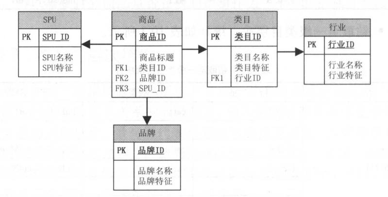

10.l 规范化处理沟宝商品维度所农观的形式

将维度的属性层次合并到单个维度中的操作称为反规范化。分析系 统的主要目的是用于数据分析和统计,如何更方便用户进行统计分析决 定了分析系统的优劣。采用雪花模式,用户在统计分析的过程中需要 量的关联操作,使用复杂度高,同时查询性能很差;而采用反规范化处 理,则方便、易用且性能好。

对于淘宝商品维度,如果采用反规范化处理,将表现为如图 <sup>10</sup> 所示的形式。

如上所述,从用户角度来看简化了模型,并且使数据库查询优化器 的连接路径比完全规范化的模型简化许多。反规范化的维度仍包含与规 范化模型同样的信息和关系,从分析角度来看,没有丢失任何信息,但 复杂性降低了。

# 维度设计 丁一

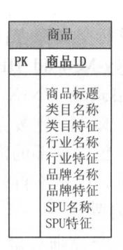

10.2 反规范化处理沟宝商品维度所求观的形式

花模式,除了可以节约 部分存储外,对于 OL 系统来说 没有其他效用 而现阶段存储的成本非常低。出于易用性和性能的考虑, 维表一般是很不规范化的 在实际应用中,几乎总是使用维表的空间来 取简明性和 询性能。

# 10.1.5 一致性维度和交叉探查

构建企业级数据仓库不可能 蹦而就, 般采用迭代式的构建过 程。 而单独构建存在的问题是形成独立型数据集市,导致严重的不 性。 Kim ll 的数据仓库总线架构提供了 种分解企 级数据仓库规划任 务的合理方法,通过构建企业范围内 致性维度和事实来构建总线架构。

数据仓库总线架构的重要基石之 就是 致性维度。在针对不同数 据域进行迭代构建或并行构建时,存在很多需求是对于不同数据域的业 过程或者同 数据域的不同业务过程合并在 起观察。比如对于日志 数据域,统计了商品维度的最近 天的 PV 对于交易数据域, 统计了商品维度的最近一天的下单 GMV 。现在将不同数据域的商品的 事实合并在 起进行数据探 ,如计算转化率等,称为交叉探查。

如果不同数据域的计算过程使用的维度不 致,就会导致交叉探查 存在 问题 当存在 复的维度,但维度属性或维度属性 值不 致时, 会导 叉探查无法进行或 叉探查结果错误。接上个例子,假设对于 日志数据域,统计使用的是商品维度 ;对于交易数据域,统计使用的 是商品维度 商品维度 包含维度属性 类型 而商品维度

属性,则无法在 BC 类型上进行交叉探查;商品维度 的商品上架时间 这一维度属性时间格式是 yyyy-MM-dd HH:mm:ss ,商品维度 的商品 上架时间这一维度属性时间格式是 UNIX timestamp ,进行交叉探查时 如果需要根据商品上架时间做限制,则复杂性较高;商品维度 不包 阿里旅行的商品,商品维度 包含全部的淘系商品,交叉探查也无法进 行。还有很多种形式的不一致,这里不再一一列举,但基本可以划分为 维度格式和内容不一致两种类型。

上面对维度不一致性进行了详细分析,下面总结维度一致性的几种 表现形式。

- ·共享维表。 比如在阿里巴巴的数据仓库中,商品、卖家、买家、 类目等维度有且只有一个。所以基于这些公共维度进行的交叉探 查不会存在任何问题。
- ·一致性上卷,其中一个维度的维度属性是另 一个维度的维度属性 的子集,且两个维度的公共维度属性结构和内容相同。比如在阿 里巴巴的商品体系中,有商品维度和类目维度,其中类目维度的 维度属性是商品维度的维度属性的子集,且有相同的维度属性和 维度属性值。这样基于类目维度进行不同业务过程的交叉探查也 不会存在任何问题。
- ·交叉属性 ,两个维度具有部分相同的维度属性。比如在商品维度 中具有类目属性,在卖家维度中具有主营类目属性,两个维度具 有相同的类目属性,则可以在相同的类目属性上进行不同业务过 程的交叉探查。

# 10.2 维度设计高级主题

# 10.2.1 维度整合

我们先来看数据仓库的定义:数据仓库是一个面向主题的、集成的、 非易失的且随时间变化的数据集合,用来支持管理人员的决策。其中集 成是数据仓库的四个特性中最重要的一个。

数据仓库的重要数据来源是大量的、分散的面向应用的操作型环 境。不同的应用在设计过程中,可以自由决策 ,主要满足本应用的需求, 很少会考虑和其他系统进行数据集成。应用之间的差异具体表现在如下

- ·应用在编码、命名习惯、度量单位等方面会存在很大的差异。比 如不同应用对于用户的性别编码不同,有 等;不 同应用的用户 ID 含义相同,但字段名称不同,有 user user\_id 等;不同应用对于金额的度量单位不同,有元、分等。
- ·应用出于性能和扩展性的考虑,或者随技术架构的演变,以及业 务的发展,采用不同的物理实现。拆分至不同类型数据库中,部 分数据采用关系型数据库存储(如 Oracle MySQL 等),部分数 据采用 NoSQL 数据库存储(如 HBase Tair 等)。拆分成同 型数据库中的多个物理表,比如对于淘宝商品,有商品主表和商 品扩展表,商品主表存储商品基本信息,商品扩展表存储商品特 殊信息,如不同产品线的定制化信息等;对于淘宝会员,有会员 主表和会员扩展表,会员主表存储用户基本信息,会员扩展表存 储用户扩展信息,如用户的各种标签信息等。

所以数据由面向应用的操作型环境进人数据仓库后,需要进行数据 成。将面向应用的数据转换为面向主题的数据仓库数据,本身就是一 种集成。具体体现在如下几个方面:

- ·命名规范的统一。表名 字段名等统一。
- ·字段类型的统一。 相同和相似字段的字段类型统一。
- ·公共代码及代码值的统一。公共代码及标志性宇段的数据类型、 命名方式等统一。
- 业务含义相同的表的统 。主要依据高内聚、低稠合的理念,在 物理实现中,将业务关系大、源系统影响差异小的表进行整合: 将业务关系小、游、系统影响差异大 的表进行分而置之。通常有如 下几种集成方式:
  - 〉采用主从表的设计方式,将两个表或多个表都有的字段放在

## 一寸大数据之路一一阿里巴巴大数据实践

主表中(主要基本信息),从属信息分别放在各自的从表中。 对于主表中的主键,要么采用复合主键、源主键和系统或表 区别标志:要么采用唯一主键、"游、主键和系统或表区别标志" 生成新的主键。通常建议采用复合主键的方式。

- 》直接合并,共有信息和个性信息都放在同一个表中。如果表 字段的重合度较低,则会出现大量空值,对于存储和易用性 会有影响,需谨慎选择。
- 》不合并,因为源表的表结构及主键等差异很大,无法合并, 使用数据仓库里的多个表存放各自的数据。

维表的整合涉及的内容和上面介绍的几个方面相同,下面重点看表 级别的整合,有两种表现形式。

第一种是垂直整合,即不同的来源表包含相同的数据集,只是存储 的信息不同。比如淘宝会员在源系统中有多个表,如会员基础信息表、 会员扩展信息表、淘宝会员等级信息表、天猫会员等级信息表,这些表 都属于会员相关信息表,依据维度设计方法,尽量整合至会员维度模型 中,丰富其维度属性。

第二种是水平整合,即不同的来源表包含不同的数据集,不同子集 之间无交叉,也可以存在部分交叉。比如针对蚂蚁金服的数据仓库,其 采集的会员数据有淘宝会员、 <sup>1688</sup> 会员、国际站会员、支付宝会员等, 是否需要将所有的会员整合到一个会员表中呢?如果进行整合,首先需 要考虑各个会员体系是否有交叉,如果存在交叉,则需要去重;如果不 存在交叉,则需要考虑不同子集的自然键是否存在冲突,如果不冲突, 则可以考虑将各子集的自然键作为整合后的表的自然键;另一种方式是 设置超自然键,将来源表各子集的自然键加工成 个字段作为超自然 键。在阿里巴巴,通常采用将来源表各子集的自然键作为联合主键的方 式,并且在物理实现时将来源字段作为分区字段。

有整合就有拆分,到底是整合还是拆分,由多种因素决定。下面两 节讨论维度的水平拆分和垂直拆分。

# 10.2.2 水平拆分

维度通常可以按照类别或类型进行细分。比如淘系商品表,根据业 务线或行业等可以对商品进行细分,如淘宝的商品、天猫的商品、 <sup>1688</sup> 的商品、飞猪旅行的商品、淘宝海外的商品、天猫国际的商品等。不同 分类的商品,其维度属性可能相同,也可能不同。比如航旅的商品和普 通的淘系商品,都属于商品,都有商品价格、标题、类型、上架时间、 目等维度属性,但是航旅的商品除了有这些公共属性外,还有酒店、 点、门票、旅行等自己独特的维度属性。

如何设计维度?针对此问题,主要有两种解决方案:方案 是将维 的不同分类 例化为不同的维度,同时在主维度中保存公共属性 是维护单 维度,包含所有可能的属性。

选择哪种方案?在数据模型设计过程中需要考虑的因素有很多,基 本不可能满足各个特性指标的最优化。在设计过程中需要重点考虑以下 个原则。

- 扩展性:当源系统、业务逻辑变化时,能通过较少的成本快速扩 展模型,保持核心模型的相对稳定性。软件工程中的高内聚、低 稠合的思想是重要的指导方针之
- 效能 在性能和成本方面取得平衡。通过牺牲一定的存储成本, 达到性能和逻辑的优化。
- 易用性:模型可理解性高、访问复杂度低。用户能够方便地从模 型中找到对应的数据表,并能够方便地查询和分析。

根据数据模型设计思想,在对维度进行水平拆分时,主要考虑如下 两个依据。

个依据是维度的不同分类的属性差异情况。当维度属性随类型 化较大时,将所有可能的属性建立在 个表中是不切合实际的,也没 有必要这样做,此时建议采用方案 。定义一个主维度用于存放公共属 性;同时定义多个子维度,其中除了包含公共属性外,还包含各自的特 殊属性。比如在阿里巴巴数据仓库维度体系中,依据此方法,构建了商 品维度、航旅商品维度等。公共属性 般比较稳定,通过核心的商品维 一寸大数据之路一一阿里巴巴大数据实践

度,保证了核心维度的稳定性;通过扩展子维度的方式,保证了模型的 扩展性。

第二个依据是业务的关联程度。两个相关性较低的业务,稠合在 起弊大于利,对模型的稳定性和易用性影响较大。比如在阿里巴巴数据 仓库维度体系中,对淘系商品和 <sup>1688</sup> 商品构建两个维度。虽然淘系和 <sup>1688</sup> 在底层技术实现上是统 的,但属于不同的 BU ,业务各自发展 在数据仓库层面,淘系和 <sup>688</sup> 属于不同的数据集市, 般不会相互调 用,业务分析人员 般只针对本数据集市进行统计分析。如果设计成 个维度,由于不同 业务各自发展, <sup>1688</sup> 业务变更,此维度需要变更, 淘宝业务变更亦然,稳定性很差;在易用性方面,会给数据使用方造成 困扰。

# 10.2.3 垂直拆分

在维度设计内容中,我们提到维度是维度建模的基础和灵魂,维度 属性的丰富程度直接决定了数据仓库的能力。在进行维度设计时,依据 维度设计的原则,尽可能丰富维度属性,同时进行反规范化处理。对于 具体实现时可能存在的问题,一是在"水平拆分"中提到的,由于维度分 类的不同而存在特殊的维度属性,可以通过水平拆分的方式解决此问题。

二是某些维度属性的来源表产出时间较早,而某些维度属性的来 表产出时间较晚;或者某些维度属性的热度高、使用频繁,而某些维度 属性的热度低、较少使用 或者某些维度属性经常变化,而某些维度属 性比较稳定。在"水平拆分"中提到的模型设计的三个原则同样适合解 决此问题。

出于扩展性、产出时间、易用性等方面的考虑,设计主从维度。主 维表存放稳定 产出时间早、热度高的属性;从维表存放变化较快、产 出时间晚、热度低的属性。比如在阿里巴巴数据仓库中,设计了商品 维度和商品扩展维度。其中商品主维度在每日的 :30 左右产出,而商 品扩展维度由于有冗余的产出时间较晚的商品品牌和标签信息 ,在每 3:00 左右产出。另外,由于商品扩展维度有冗余的库存等变化较快 的数据,对于主维度进行缓慢变化的处理较为重要。通过存储的冗余和

计算成本的增加,实现了商品主模型的稳定和产出时间的提前,对于整 个数据仓库的稳定和下游应用的产出都有较大意义。

# 10.2.4 历史归档

阿里巴巴历史截至当前的淘系(含淘宝、天猫和聚划算)商品有几 百亿条记录,在 Max Compute 中,一天的全量数据占用约 6TB 的存储。 面对如此庞大的数据量,如何设计模型、如何降低存储、如何让下游方 便获取数据,成为必须要解决的问题。对于历史数据,是否存在前台已 经不再使用的情况?答案是肯定的,对于如此庞大的数据量,现有的技 术架构也很难处理。前台有一套数据归档策略,比如将商品状态为下架 或删除的且最近 <sup>31</sup> 天未更新的商品归档至历史库 具体逻辑根据不同 BU 有不同的算法,且有特殊的规则。

在数据仓库中,可以借用前台数据库的归档策略 定期将历史数据 归档至历史维表。在实践中,网里巴巴数据仓库设计了商品维表和历史 商品维表,每天将历史数据归档至历史商品维表。关于归档策略,有以 下几种方式。

归档策略 :同前台归档策略,在数据仓库中实现前台归档算法, 定期对历史数据进行归档。但存在一些问题,一是前台归档策略复杂, 实现成本较高 二是前台归档策略可能会经常变化 导致数据仓库归档 算法也要随之变化,维护和沟通成本较高。此方式适用于前台归档策略 逻辑较为简单,且变更不频繁的情况。

归档策略 :同前台归档策略,但采用数据库变更日志的方式。对 于如此庞大的数据量,阿里巴巴采用的数据抽取策略一般是通过数据库 bin log 日志解析获取每日增量,通过增量 erge 全量的方式获取最新的 全量数据。可以使用增量日志的删除标志 作为前台数据归档的标志。 通过此标志对数据仓库的数据进行归档。此方式不需要关注前台归档策 略,简单易行。但对前台应用的要求是数据库的物理删除只有在归档时 才执行,应用中的删除只是逻辑删除。

归档策略 :数据仓库自定义归档策略。可以将归档算法用简单、

一寸大数据之路一一阿里巴巴大数据实践

直接的方式实现,但原则是尽量比前台应用晚归档、少归档。避免出现 数据仓库中已经归档的数据再次更新的情况。

如果技术条件允许,能够解析数据库 log 志,建议使用归档策 ,规避前台归档算法。具体可以根据自身数据仓库的实际情况进行

# 10.3 维度变化

### 10.3.1 缓慢变化维

数据仓库的重要特点之一是反映历史变化,所以如何处理维度的 化是维度设计的重要工作之一。缓慢变化维的提出是因为在现实世界 中,维度的属性并不是静态的,它会随着时间的流逝发生缓慢的变化 与数据增长较为快速的事实表相比,维度变化相对缓慢。

些情况下,保留历史数据没有什么分析价值;而在另 些情况 下,保留历史数据将会起到至关重要的作用。在 的理论中, 种处理缓慢变化维的方式,下面通过简单的实例进行说明,具体细节 请翻阅 的相关书籍。

第一种处理方式 写维度值。采用此种方式,不保留历史数据, 始终取最新数据。比如,商品所属的类目于 日由 类目 变成类目 ,采用第 种处理方式,变化前后的数据记录分别如表 0.4 和表 所示

| 商品<br>Key | 商品<br>ID | 商品标题    | 所属类目 | 其他维度属性 |
|-----------|----------|---------|------|--------|
| 1000      | item!    | titilel | 类自   |        |

变化前商品表和订单表

| 订单<br>Key | 日期<br>Key  | 商品<br>Key | 交易金额   | 其他事实 |
|-----------|------------|-----------|--------|------|
| 9000      | 2015-11-11 | 1000      | 103.00 |      |

| 商品 Key | 商品 ID  | 商品标题    | 所属类目 | 其他维度属性 |
|--------|--------|---------|------|--------|
| 1000   | item I | titilel | 类目   |        |

10.5 变化后商品表和订单表

| 订单 Key | 商品 Key<br>日期 Key |      | 交易金额   | 其他事实 |  |
|--------|------------------|------|--------|------|--|
| 9000   | 2015-11-11       | 1000 | 103.00 |      |  |
| 9001   | 2015-11-16       | 1000 | 89.00  |      |  |

种处理方式:插人新的维度行。采用此种方式,保留历史数据, 维度值变化前的事实和过去的维度值关联,维度值变化后的事实和当前 的维度值关联。同上面的例子,采用第 种处理方式,变化前的数据记 同表 10.4 '变化后的数据记录如表 10.6 所示。

10.6 变化后商品表和订单表

| 商品 Key         | 商品 ID  | 商品标题    | 所属类目 | 其他维度属性 |  |
|----------------|--------|---------|------|--------|--|
| Item I<br>1000 |        | titilel | 类目   |        |  |
| 1001           | Item I | titilel | 类目   |        |  |

| 订单 Key | 日期 Key     | 商品 Key | 交易金额   | 其他事实 |  |
|--------|------------|--------|--------|------|--|
| 9000   | 2015-11-11 | 1000   | 103.00 |      |  |
| 9001   | 2015-11-16 | 1001   | 89.00  |      |  |

种处理方式:添加维度列。采用第 种处理方式不能将变化前 后记录的事实归 为变化前的维度或者归 为变化后的维度。比如根据 业务需求,需要将 月份的交易金额全部统计到类目 上,采用第二 种处理方式无法实现。针对此问题,采用第三种处理方式,保留历史数 据,可以使用任何 个属性列。同上面的例子,采用第三种处理方式, 变化前后的数据记录分别如表 10.7 和表 <sup>10</sup> .8 所示。通过变化后的商品 和订单表关联,可以根据不同的业务需求,将 份的交易金额全 部统计到类目 或类目 上。

<sup>10</sup> 变化前商品表和订单表

| 商品 Key | 商品 ID  | 商品标题    |    | 所属新类目 所属旧类目 | 其他维度属性 |
|--------|--------|---------|----|-------------|--------|
| 1000   | item I | titilel | 类自 | 类自          |        |

一寸大数据之路一一阿里巴巴大数据

| 订单<br>Key | 日期<br>Key   | 商品<br>Key | 交易金额   | 其他事实 |  |
|-----------|-------------|-----------|--------|------|--|
| 9000      | 2015-11-1 I | 1000      | 103.00 |      |  |

变化后商品表和订单表

| 商品<br>Key | 商品<br>ID | 商品标题    | 所属新类目 | 所属旧类目 | 其他维度属性 |
|-----------|----------|---------|-------|-------|--------|
| 1000      | item I   | titilel | 类目    | 类目    |        |

| 订单<br>Key | 日期<br>Key      | 商品<br>Key | 交易金额   | 其他事实 |
|-----------|----------------|-----------|--------|------|
| 9000      | 2015- 11 - 1 I | 1000      | 103.00 |      |
| 9001      | 2015-11- 16    | 1000      | 89.00  |      |

对于选择哪种方式处理缓慢变化维,并没有 个完全正确的答案, 可以根据业务需求来进行选择。比如根据商品所属的类目统计淘宝 月的成交额,商品所属的类目于 日由 类目 变成 类目 ,假设业务需求方不关心历史数据,将所有的成交额都统计到最 新的类目 ,则 不需要保存历史数据:假设类目 属于某个业务部门 类目 属于另一个业务部门,不同业务部门需要统计各自的业绩,则 要保留历史数据。

# 10.3.2 快照维表

在"维度的基本概念"中,介绍了自然键和代理键的定义,在 的维度建模中,必须使用代理键作为每个维表的主键,用于处理缓慢变 化维。

但在阿里巴巴数据仓库建设的实践过程中,虽然使用的是 的维度建模理论,但实际并未使用代理键。那么为什么不使用代理键? 如何处理缓慢变化维?

首先看"为什么不使用代理键"这个问题。第一个原因是,阿里巴 巴数据量庞大,使用的是阿里巴巴自助知识产权的分布式计算平台 Max Compute 。对于分布式计算系统,不存在事务的概念,对于每个 的记录生成稳定的全局唯 的代理键难度很大,此处稳定指某条记录每

次生成的代理键都相同。第 个原因是,使用代理键会大大增加 ETL 的复杂性,对 TL 任务的开发和维护成本很高。

接下来讨论不使用代理键如何处理缓慢变化维的问题。在阿里巴巴 数据仓库实践中,处理缓慢变化维的方法是采用快照方式。数据仓库的 计算周期 般是每天 次,基于此周期,处理维度变化的方式就是每天 保留一份全量快照数据。比如商品维度,每天保留一份全量商品快照数 据。任意一天的事实均可以获取到当天的商品信息 ,也可以获取到最新 的商品信息,通过限定日期,采用自然键进行关联即可。此方法既有优 ,也有弊端。

优点主要有以下两点:

简单而有效,开发和维护成本低。

使用方便,理解性好。数据使用方只需要限定日期,即可获取到 当天的快照数据。任意一天的事实快照和维度快照通过维度的自 然键进行关联即可。

弊端主要体现在存储的极大浪费上。比如某维度,每天的变化量占 总体数据量的比例很低,在极端情况下,每天无变化,使得存储浪费很 严重。此方法主要就是实现了牺牲存储获取 TL 效率的优化和逻辑上 的简化。但是 定要杜绝过度使用这种方法,而且必须要有对应的数据 命周期制度,清除无用的历史数据。

综合来看,由于现在存储成本远低于 CPU 、内存等的成本,此方 法弊大于利。那么是否有方法既可以实现上面的优点,同时又可以很好 地降低存储呢?答案是肯定的,那就是阿里巴巴的极限存储。

# 10. 3.3 极限存储

首先来看历史拉链存储。历史拉链存储是指利用维度模型中缓慢变 化维的第二种处理方式。这种处理方式是通过新增两个时间戳字段 (sta rt\_dt end\_dt ),将所有以天为粒度的变更数据都记录下来。通常 分区字段也是时间戳字段。

一寸大数据之路一一间里巴巴大数据实践

例如, 日,卖家 在淘宝网发布了 两个商前端商品表将生成两条记录 日,卖家 商品下架了, 同时又发布了商品 ,前端商品表将更新记录 ,又新生成记录 用全量存储方式,在 日这个分区中存储 两条记录: 日这个分区中存储更新后的 以及 记录。数据存储记 所示。

| 商品 | dt       | 卖家 | 状态 | 其他字段 |
|----|----------|----|----|------|
| B  | 20160101 | A  | 上架 |      |
| c  | 20160101 | A  | 上架 |      |
| B  | 20160102 | A  | 下架 | ·    |
| c  | 20160102 | A  | 上架 |      |
| D  | 20160102 | A  | 上架 |      |

如果采用历史拉链存储,数据存储记录如表 示。对于不变 的数据,不再重复存储。

| 商品 | start dt | end<br>dt | 卖家 | 状态 | 其他字段 |
|----|----------|-----------|----|----|------|
| B  | 20160101 | 20160102  | A  | 上架 |      |
| c  | 20160101 | 30001231  | A  | 上架 |      |
| B  | 20160102 | 30001231  | A  | 下架 | ·    |
| D  | 20160102 | 30001231  | A  | 上架 | ·    |

数据存储记录

这样下游应用可以通过限制时间戳字段来获取历史数据。例如,用 访问 日的数据,只需要限制 stat\_dt<=20160 I 0 即可。

但是这种存储方式对于下游使用方存在一定 的理解障碍,特别 数据面向的下游用户包括数据分析师、前端开发人员等,他们不 怎么理解维度模型的概念,因此会存在较高的解释成本。另外,这种 储方式用 做分区,随 时间的推移,分区数量会极度 膨胀,而现行的数据库系统都有分区数 限制

为了解决上述两个问题,阿里巴巴提出来用极限存储的方式来处理。

## 1 透明化

底层的数据还是历史拉链存储,但是上层做一个视图操作或者在 Hive 里做 hook ,通过分析语句的语法树,把对极限存储前的表的 询转换成对极限存储表的查询。对于下游用户来说,极限存储表和全 存储方式是 样的:

Select \* from A where ds =20160101

价于

Select \* from A EXST where start dt <=20160101 and end dt >20 160101 ;

# 2. 分月做历史拉链表

假设用 start\_ end dt 做分区,并且不做限制,那么可以计算出 年历史拉链表最多可能产生的分区数是 <sup>365</sup> <sup>36</sup> /2=66 <sup>430</sup> 。如果 每个月月初重新开始做历史拉链表,目录结构如下

```
[-- 2 01410/ #每月一个周期
|一一 20141001/ 201410 INFINITY #每月 日的全量数据
|一一 20141001/20141002 # 1001 产生且 1002 死亡记录
|一一 20141001/20141003 # 1001 产生且 1003 死亡记录
|一一- 20141001/20141031 # 1001 产生且 1031 死亡记录
|一一- 20141002/ 201410 INFINITY # 1002 产生新增记录
|一一-20141002/20141003 # 1002 产生且 1003 死亡记录
[---- 20141002 /20141031/ 
|---』- 20141003/ 201410 INFINITY 
                             # 1002 产生且 1031 死亡记录
                             # 1003 产生新增记录
!---- 20141031/ 201410 INFINITY 
[-- 2 01411/ 
                             # 1031 产生新增记录
```

再计算一年最多可能产生的分区数是: <sup>12</sup> ×( 1 +(30+29)/2)=5232

个。

采用极限存储的处理方式,极大地压缩了全量存储的成本,又可以 达到对下游用户透明的效果,是一种比较理想的存储方式。但是其本身 也有一定 的局限性,首先,其产出效率很低,大部分极限存储通常需要 其次,对于变化频率高的数据并不能达到节约成本的效果。因此 在实际生产中,做极限存储需要进行一些额外的处理。

- ·在做极限存储前有一个全量存储表 ,全量存储表仅保留最近一段 时间的全量分区数据,历史数据通过映射的方式关联到极限存储 表。即用户只访问全量存储表,所以对用户来说极限存储是不可
- ·对于部分变化频率频繁的宇段需要过滤。例如,用 户表中存在用 户积分宇段,这种宇段的值每天都在发生变化,如果不过滤的话, 极限存储就相当于每个分区存储一份全量数据,起不到节约存储 成本的效果。

# 10.3.4 微型维度

采用极限存储,需要避免维度的过度增长。比如对于商品维表,每 多亿条数据,如果在设计商品维度时,将值变化频繁的属性加入 到商品维度中,极限情况是每天所有商品数据都发生变化,此时,极限 存储没有意义;反之,每天所有商品数据都不发生变化,此时,只需要 存储一天的数据即可。

通过将一些属性从维表中移出,放置到全新的维表中,可以解决维 度的过度增长导致极限存储效果大打折扣的问题。其中一种解决方法就 是上一节提到的垂直拆分,保持主维度的稳定性;另一种解决方式是采 用微型维度。

微型维度的创建是通过将一部分不稳定的属性从主维度中移出,并 将它们放置到拥有自己代理键的新表中来实现的。这些属性相互之间没 有直接关联,不存在自然键。通过为每个组合创建新行的一次性过程来 加载数据。比如淘宝用户维度,用户的注册日期、年龄、 性别、身份信

.... 178

# <sup>10</sup> 章维度设计寸一

息等基本不会发生变化,但用户 VI 等级、用户信用评价等级会随着用 户的行为不断发生变化。其中 VIP 等级共有 个值,即一 ;用户信 用评价等级共有 <sup>18</sup> 个值。假设基于 VI 等级和用户信用评价等级构建 微型维度,则在此微型维度中共有 8x18 个组合,即 <sup>144</sup> 条记录,代理 键可能是 <sup>1440</sup>

这里以淘宝交易事实表为例,其他维度忽略,星形模式可能表示如 10.3 所示。

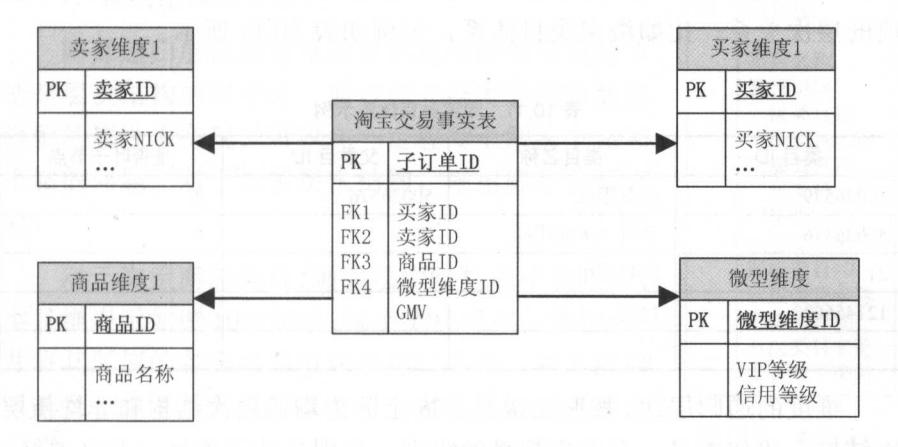

10.3 沟宝交易事实表维度

但在阿里巴巴数据仓库实践中,并未使用此技术,主要有以下几点 原因:

- 微型维度的局限性。微型维度是事先用所有可能值的组合加载 的,需要考虑每个属性的基数,且必须是枚举值。很多属性可能 是非枚举型,比如数值类型,如 VIP 分数、信用分数等;时间类 型,如上架时间、下架时间、变更时间等。
- ETL 逻辑复杂。对于分布式系统,生成代理键和使用代理键进行 ETL 加工都非常复杂, ETL 开发和维护成本过高。
- 破坏了维度的可浏览性。买家维度和微型维度通过事实表建立联 系,无法基于 VIP 等级、信用等级进行浏览和统计。可以通过在 买家维度中添加引用微型维度的外键部分来解决此问题,但带来 的问题是微型维度未维护历史信息。

# 10.4 特殊维度

# 10.4.1 递归层次

上面我们学习了维度的层次结构,即维度属性以层次方式或 对多 的方式相互关联;或者描述为不同维度之间的主从关系 ,比如商品和 目的关系、商品和品牌的关系等。本节的递归层次指的是某维度的实例 值的层次关系,比如淘宝类目体系,示例如表 10.1 示。

| 类目 ID     | 类目名称    | 父类目 ID   | 是否叶子节点 |
|-----------|---------|----------|--------|
| 50026579  | 圣诞服饰    | 50026576 |        |
| 50026576  | 节日/庆典用品 | 21       | 手丰     |
| 21        | 家具日用    |          | 手手     |
| 121456022 | 台历      | 21       |        |
|           |         |          |        |

10.11 淘宝类目体系示例

维度的递归层次,按照层级是否固定分为均衡层次结构和非均衡层 次结构。比如类目,有固定数量的级别,分别是叶子类目、五级类 目、 四级类目、三级类目、二级类目、 级类曰:地区,分别是乡镇/街道 区县、城市、省份、国家。对于这种具有固定数量级别的递归层次,称 为"均衡层次结构"。比如公司之间的关系,每个公司可能存在 个母 公司,但可能没有固定的 级、 级等层级关系。对于这种数量级别不 固定的递归层次,称为"非均衡层次结构"。

淘宝交易事实表通过叶子类目和类目维表关联,如何统计类目 ID <sup>21</sup> 的最近一天的 GMV ?第一步,获取父类目 ID 等于 <sup>20</sup> 的所有类目 称为子类目。第二步,对于每个子类目,如果为叶子类目,则终止;如 果非叶子类目,则此类目 ID 作为父类目 ID 执行第 步,直到找到所有 叶子类目,如圣诞服饰( <sup>50026579</sup> )、台历( <sup>121456022</sup> 等。将所有叶 子类目和交易事实表关联进行统计汇总,即可得到类目 ID 等于 <sup>21</sup> 近一天的 GMV ,也就是家具日用类目的最近一天 GMV 。在物理实现 时,可以使用递归 SQL 实现,如 Oracle 中的 connect by 语句。

丁一

通过数据探查得知 等于 的类目属于一级类 目(父类目 ),统计其最近一天的 的过程,称为上钻 在递归层次中进行 上钻和下钻是很常见的。由于很多数据仓库系统和商业智能工具不支持 SQL ,且用户使用递归 SQL 的成本较高,所以在维度模型中,需 要对此层次结构进行处理

# 层次结构扁平化

降低递归层次使用复杂度的最简单和有效的方 法是层次结构的扁平化,通过建立维度 的固定数 级别的属性来实现,可以在一定程度上解决上钻和 下钻的问题。对于均衡层次结构,采用扁平化最有

对于淘宝商品类目,通过层次结构扁平化之后, 类目维表示如图 示。每个类目保存一条记录 并将其所属的各类目层级属性化。其中,对于高层 级类目,由于其无低层级类日,则低层级类 目置为 值。 <sup>10</sup> 类目维度

具体数据存储示例如表 示,其 中四级和五级类目省略。

| 类目<br>ID  | 类目级别 | 是否叶子节点 | 一级类目 | 二级类目      | 三级类目     |
|-----------|------|--------|------|-----------|----------|
| 21        |      | N      | 21   |           |          |
| 50026576  | 2    | N      | 2 1  | 50026576  |          |
| 50026579  | 3    | y      | 21   | 50026576  | 50026579 |
| 121456022 | 2    | y      | 21   | 121456022 |          |
|           |      |        |      |           |          |

数据存储实例

如何统计类目 的最近一天的 GMV ?将淘宝交易事实表通 过叶子类目和类目维表的类目 关联之后 ,限制 级类目 等于 之后进行汇总统计,即可以得到类目 等于 最近一天的 其使用方便性得到大大提高 ,但存在如下三个方面的问题:

|    | Fl                                                                                                                                        |
|----|-------------------------------------------------------------------------------------------------------------------------------------------|
| PK | 签且旦                                                                                                                                       |
|    | 类目名称<br>类目层级<br>级类问<br>ID<br>级类同名称<br>级类问 ID<br>级类目名称<br>ID<br>级类<br>级类<br>名称<br>四级类日<br>ID<br>四级类曰名称<br>ID<br>五级类<br>五级类<br>名称<br>是否叶子类日 |

级类目仍为空,则取一级类目。

- ·针对某类目上钻或下钻之前,必须知道其所属的类目层级,然后才 能决定限制哪一级类目。如上述示例,限制 级类目 ID 等于 <sup>21</sup>
- ·假设分三级类目统计最近一天的 GMV ,由于某些叶子类目直接 是一级类目或二级类目(比如类目 ID 等于 <sup>121456022</sup> 的类目, 其是叶子类目),和交易事实表关联之后,其对应的三级类目为 空,导致根据三级类目统计最近一天的 GMV 时,类目 ID 等于 <sup>121456022</sup> 的交易无法被统计到。下游数据统计时,为了规避此 问题,如果此类目对应的三级类目为空 ,则取 级类目:如果

所以针对此问题,下游数据统计时,类目层次结构扁平化的另 方式是回填,将类目向下虚拟,具体数据存储示例如表 10.13 所示,其 中粗体部分为回填内容。阿里巴巴中文站的类目体系使用此种方式

| 类目 ID     | 类目级别 | 是否肘子 | 一级类目 | 二级类自      | 三级类目      |
|-----------|------|------|------|-----------|-----------|
| 21        |      | N    | 21   | 21        | 21        |
| 50026576  | 2    | N    | 21   | 50026576  | 50026576  |
| 50026579  | 3    | y    | 21   | 50026576  | 50026579  |
| 121456022 | 2    | y    | 21   | 121456022 | 121456022 |
|           |      |      |      |           |           |

10.13 数据存储示例

·扁平化仅包含固定数量的级别,对于非平衡层次结构,可以通过 预留级别的方式来解决,但扩展性较差。

# 2. 层次桥接表

针对层次结构扁平化所存在的问题,可以采用桥接表的方式来解 决,不需要预先知道所属层级,不需要回填,也可解决非均衡层次结构 的问题。与扁平化方法相比,该方法适合解决更宽泛的分析问题,灵活 性好;但复杂性高,使用成本高。

仍然以类目为例,模型设计如图 10.5 示。

对于上面提到的类目,使用树形结构表示如图 10.6 所示。

章维度设计寸一

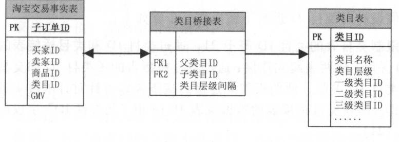

类日

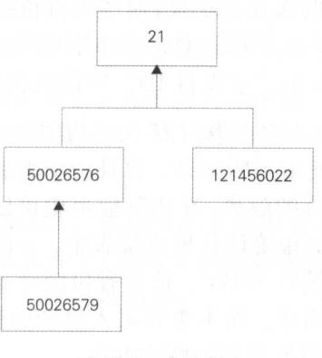

类目树

针对此类目树,类目桥接表的内容如表 所示。

| 父类目<br>ID | 子类目<br>ID | 类目层级间隔 |
|-----------|-----------|--------|
| 21        | 21        |        |
| 21        | 50026576  |        |
| 21        | 121456022 |        |
| 21        | 50026579  | 2      |
| 50026576  | 50026576  |        |
| 50026576  | 50026579  |        |
| 121456022 | 121456022 |        |

类目桥接表

假设针对类目 <sup>21</sup> 进行下钻操作,步骤如下:

限制类目表的类目 ID 等于 <sup>21</sup> ,通过类目 ID 类目桥接表的父类 ID 关联,使两表建立连接;通过类目桥接表的子类目 ID 交易事实 表的类目 ID 关联,使两表建立连接;接下来即可针对订单事实进行下 钻操作。涉及类目桥接表的数据见表 <sup>10</sup> .14 中"父类目 ID "字段的粗体 部分( 21)

假设针对类目 <sup>0026579</sup> 进行上钻操作,步骤如下:

限制类目表的类目 ID 等于 <sup>50026579</sup> ,通过类目 ID 类目桥接表 的子类目 ID 关联,使两表建立连接 :通过类目桥接表的父类目 ID 关联, 使两表建立连接 接下来即可针对订单事实进行上钻操作。涉及类目桥 接表的数据见表 10.14 "子类目 ID "字段的粗体部分( <sup>50026579</sup> )。

可以看到,层次桥接表解决了层次结构扁平化带来的 些问题:但 是其加工逻辑复杂,使用逻辑复杂,而且由于事实表和桥接表的多对 关系 而带来了双重计算的隐患 。在实际应用中可以根据具体的业务需求 来选择技术方案,比如在统计分析或报表中, 般都是按照固定级别进 行,如按照 级类目统计 GMV 、按照省份统计 GMV 等,现在的扁 化设计完全可以满足需求 ,而不需要引人复杂的桥接表。很多时候,简 单、直接的技术方案却是最好的解决方案。

# 10.4.2 行为维度

在阿里巴巴的数据仓库中,存在很多维表,如卖家主营类目维度、 卖家主营 品牌维度、用户常用地址维度等。其中卖家主营类目和主营品 牌通过卖家的商品分布和交易分布情况,采用算法计算得到;卖家常用 地址通过最近 段时间内物流中卖家的发货地址和买家的收货地址进 行统计得到。类似的维度,都和事实相关,如交易、物流等,称之为"行 为维度",或"事实衍生的维度"。

按照加工方式,行为维度可以划分为以下几种:

·另一个维度 的过去行为,如买家最近一次访问淘宝的时间、 买家 最近 次发生淘宝交易的时间等。

章维度设计寸一

- ·快照事实行为维度,如买家从年初截至当前的淘宝交易金额、买 家信用分值 、卖家信用分值等。
- ·分组事实行为维度 ,将数值型事实转换为枚举值。如买家从年初 截至当前的淘宝交易金额按照金额划分的等级 买家信用分值按 照分数划分得到的信用等级等。
- ·复杂逻辑事实行为维度,通过复杂算法加工或多个事实综合加工 得到。如前面提到的卖家主营类目,商品热度根据访问、收藏、 加人购物车、交易等情况综合计算得到。

对于行为维度,有两种处理方式,其中一种是将其冗余至现有的维 表中,如将卖家信用等级冗余至卖家维表中 另一种是 工成单独的行 为维表,如卖家主营类目。具体采用哪种方式主要参考如下两个原则:

第一 ,避免维度过快增长。比如对商品表进行了极限存储,如果将 商品热度加入现有的商品维表中,则可能会使每日商品变更占比过高, 从而导致极限存储效果较差。

第二,避免稠合度过高。 比如卖家主营类目,加工逻辑异常复杂, 如果融合进现有的卖家维表中,那么过多的业务稠合会导致卖家维表刷 新逻辑复杂、维护性差、产出延迟等。

# 10.4.3 多值维度

对于多值维度, 种情况是事实表的 条记录在某维表中有多条记 录与之对应。比如对于淘宝交易订单,买家一次购买了多种商品,如 件毛衣和两双袜子,称为交易父订单 对于每种商品的交易,称为交易 子订单:此交易父订单有两个子订单与之对应。假设设计交易父订单事 实表,则对于此事实表的每一条记录,在商品表中都有 到多条记录与 之对应。

针对多值维度,常见的处理方式有三种,可以根据业务的表现形式 和统计分析需求进行选择。

第一种处理方式是降低事实表的粒度。在淘宝交易 中,前台业务和 商业智能关注交易子订单 ,所以在数据仓库模型设计中,将交易订单设 一寸大数据之路一一阿里巴巴大数据实践

计为子订单粒度,对于每个子订单,只有 种商品与之对应。对于其中 的事实,则采用分摊到子订单的方式来解决。但很多时候,事实表的 度是不能降低的,多值维度的出现是无法避免的。

第二种处理方式是采用多字段。比如在房地产销售中,每次合同 订都可能存在多个买受方的情况,如夫妻合买等。对于合同签订事实表, 每条记录可能对应多个买受方,而合同已经是此事实中的最细粒度 ,无 法通过降低粒度的方式来解决。由于合同签订的买受人 般不会太多, 所以 般采用多字段方式。考虑到扩展性,可以通过预留宇段的方式, 如超过三个买受方时,其余买受方填写至"其他买受方"字段。模型 计如图 10.7 所示。

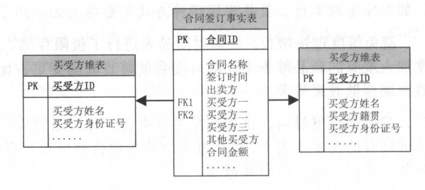

<sup>10</sup> 采用多字段方式处理多位维皮

第三种处理方式是采用较为通用的桥接表。桥接表方式更加灵活、 扩展性更好,但逻辑复杂、开发和维护成本较高,可能带来双重计算的 风险,选择此方式需慎重。通过在事实表和维表之间开发 个分组表, 通过此分组表建立连接。模型设计如图 0.8 所示,其中桥接表包含和 事实表关联的分组 KEY ,以及作为买受方维 外键的买受方 ID 。如果 事实表的一条记录对应两个买受方,则桥接表针对这两个买受方建 条记录,分组 KEY 相同。

假设根据买受方籍贯统计 <sup>2015</sup> 年的合同总金额,如果某合同有两 个买受方,籍贯分别是浙江和山东,那么此合同总金额将会分别统计浙 江和山东的,造成双重计算。双重计算不一定是错误,对于 些业务需 求是合理的;但对于另一些业务需求,则需要规避。

## <sup>10</sup> 章维度设计寸一

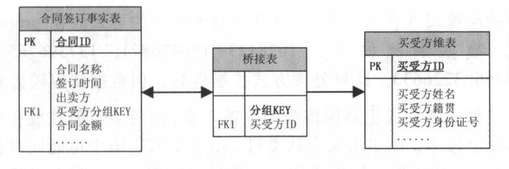

10.8 采用桥接求方式多理多值维度

# 10.4.4 多值属性

维表中的某个属性字段同时有多个值,称之为"多值属性"。它是多 值维度的另一种表现形式。在阿里巴巴的数据仓库中,存在很多维表, 如商品 SKU 维表、商品属性维表、商品标签维表等。每个商品均有一到 多个 SKU 到多个属性和 到多个标签,所以商品和 SKU 、属性、标 签都是多对多的关系。淘宝商品 SKU 和属性信息示例如图 10.9 所示。

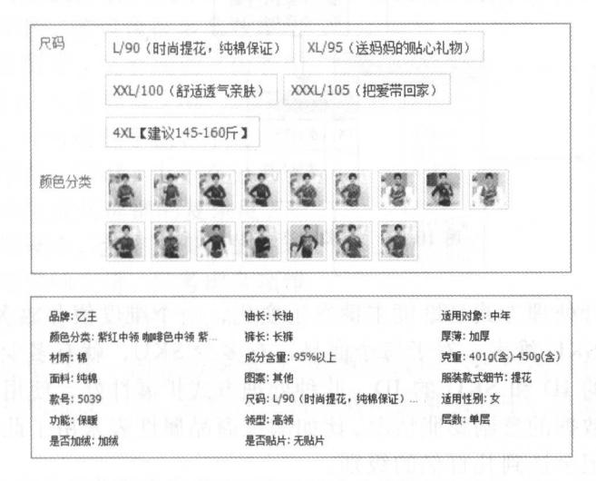

10.9 沟宝商品 SKU 和属性信息示例

对于多值属性,常见的处理方式有三种,可以根据具体情况进行选择。 第一种处理方式是保持维度主键不变,将多值属性放在维度的一个 属性字段 中。比如对于商品属性(注:此属性是业务上的含义,和维度

建模中的维度属性含义不同),可以通过 k-v 对的形式放在 property 段中,数据示例如下: 10281239: 156426871; 137396765:29229; 137400766: <sup>3226633</sup> 。此种处理方式扩展性好,但数据使用较为麻烦

第二种处理方式也是保持维度主键不变,但将多值属性放在维度的 多个属性字段中。比如卖家主营类目,由于卖家店铺中可能同时会销售 男装、女装、内衣等,所以卖家主营类目可能有多个,但业务需求是只 取根据算法计算得到的 TOP3 。针对此种情况,维度的多值属性字段具 体值的数量固定,可以采用多个属性字段进行存储,方便数据统计分析 和报表展示。如果多值属性字段具体值的数量不固定,则可以采用预留 字段的方式,但扩展性较差。卖家主营类目维度设计如图 10.10 所示。

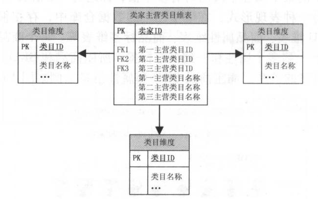

卖家主营类目维皮设计

第三种处理方式是维度主键发生变化, 个维度值存放多条记录。 比如商品 SKU 维表,对于每个商品,有多少 SKU ,就有多少记录,主 键是商品的 ID 。此种处理方式扩展性好,使用方便,但 需要考虑数据的急剧膨胀情况。比如淘宝商品属性表采用了此种处理方 式,数据记录达到几百亿的级别。

# 10.4.5 杂项维度

在维度建模中,有 种维度叫 Junk Dimension ,中 文一般翻译为"杂

## <sup>10</sup> 章维度设计寸一

项维度\杂项维度是由操作型系统中的指示符或者标志宇段组合而成 的,一般不在一致性维度之列。比如淘宝交易订单的交易类型宇段,包 括话费充值、司法拍卖、航旅等类型 :支付状态、物流状态等,它们在 源系统中直接保存在交易表中。

个事实表中可能会存在多个类似的字段,如果作为事实存放在事 实表 中,则会导致事实表占用空间过大 如果单独建立维表,外键关联 到事实表,则会出现维度过多的情况;如果将这些字段删除,则会有人 不同意。

这时,通常的解决方案就是建立杂项维度 ,将这些字段建立到 维表中,在事实表中只需保存一个外键 即可。多个字段的不同取值组成 一条记录,生成代理键,存人维表中,并将该代理键保存到相应的事实 表字段下。建议不要直接使用所有的组合生成完整 的杂项维表,在抽取 遇到新的组合时生成相应的记录即可。杂项维度 ETL 过程比一般 维度略微复杂些。

但在阿里巴巴的实践中,杂项维度不仅包含上述指示符、状态或分

段,如交易留言、交易属性(由若干 k-v 对组成)、交易标签(由 进制位 PK, FKI 圣且应 PK 王立垦II! 表示)等。针对这些字段,不可能生 成所有的组合 ;同时,由 于在分布式 计算系统中生成代理键的复杂度,一 般在逻辑建模中 ,会使用实体的主键 作为杂项维度的主键。只考虑杂项维 度,忽略其他维度,如图 10. l 所示 10.11 杂项维反

类等枚举宇段,还包含很多非枚举字

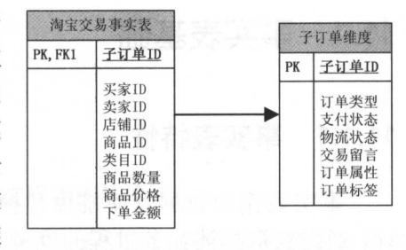

但子订单维度一般是逻辑模型,物理实现时不进行物理化,订单杂 项维度和其他维度一起,会将维度属性退化至事实表中,详情在事实表

注:本章节部分理论来自于 Christopher Adamson Star Schema -The Complete Reference Ralph Kimball The Data Warehouse Toolkit-The Definitive Guide to Dimensional Modeling 本书结合阿里的实践进行讲解,细节 内容请参考各自著作进行学习

# 事实表设计

# 11.1 事实表基础

# 11.1.1 事实表特性

事实表作为数据仓库维度建模的核心,紧紧围绕着业务过程来设 计,通过获取描述业务过程的度量来表达业务过程,包含了引用的维度 和与业务过程有关的度量。

事实表中一条记录所表达的业务细节程度被称为粒度。通常粒度可 以通过两种方式来表述:一种是维度属性组合所表示的细节程度:一种 是所表示的具体业务含义。

作为度量业务过程的事实,一般为整型或浮点型的十进制数值,有 可加性、半可加性和不可加性三种类型。可加性事实是指可以按照与事 实表关联的任意维度进行汇总。半可加性事实只能按照特定维度汇总, 不能对所有维度汇总,比如库存可以按照地点和商品进行汇总,而按时 间维度把一年中每个月的库存累 加起来则毫无意义。还有 种度量完全 不具备可加性,比如比率型事实。对于不可加性事实可分解为可加的组 件来实现聚集。

相对维表来说,通常事实表要细长得多,行的增加速度也比维表快 很多。

维度属性也可以存储到事实表中,这种存储到事实表中的维度列被 称为"退 维度"。与其他存储在维表中的维度一样 ,退化维度也可以 用来进行事实表的过滤查询、实现聚合操作等。

事实表有三 类型 事务事实表、周期快照事实表和累积快照事实 表,具体内容后面章节会详细介绍。事务事实表用来描述业务过程,眼 踪空间或时间上某点的度量事件,保存的是最原子的数据,也称为"原 子事实表\周期快照事实表以具有规律性的、可预见的时间间隔记录 事实 ,时间间隔如每天、每月、每年等。累积快照事实表用来表述过程 开始和结束之间 关键步骤事件 ,覆盖过程的整个生命周期,通常具有 多个日期字段来记录关键时间点, 当过程随着生命周期不断变化时,记 录也会随着过程的变化而被修改。

# 11.1.2 事实表设计原则

# 原则 :尽可能包含所有与业务过程相关的事实

事实表设计的目的是为了度量业务过程,所以分析哪些事实与业务 过程有关是设计中非常重要的关注点。在事实表 中应该尽量包含所有与 业务过程相关的事实,即使存在冗余,但是因为事实通常为数字型,带 来的存储开销也不会很大。

# 原则 :只选择与业务过程相关的事实

在选择事实时,应该注意只选择与业务过程有关的事实。比如在订 单的下单这个业务过程的事实表设计中 ,不应该存在支付金额这个表示 支付业务过程的事实。

### 原则 分解不可加性事实为可加的组件

对于不具备可加性条件的事实,需要分解为可加的组件。比如订单 的优惠率,应该分解为订单原价金额与订单优惠金额两个事实存储在事

### 原则 :在选择维度和事实之前必须先声明粒度

粒度的声明是事实表设计中不可忽视的重要一步,粒度用于确定 实表中一行所表示业务的细节层次,决定了维度模型的扩展性,在选择 维度和事实之前必须先声明粒度,且每个维度和事实必须与所定义的粒 度保持一致。在设计事实表的过程中,粒度定义得越细越好,建议从最 低级别的原子粒度开始,因为原子粒度提供了最大限度的灵活性,可以 支持无法预期的各种细节层次的用户需求。在事实表中,通常通过业务 描述来表述粒度,但对于聚集性事实表的粒度描述,可采用维度或维度 属性组合的方式。

### 原则 在同一个事实表中不能有多种不同粒度的事实

事实表中的所有事实需要与表定义的粒度保持一致,在同 个事 表中不能有多种不同粒度的事实。

如表 所示为机票支付成功事务事实表,粒度为票一级的,而 在实际业务中,一个订单可以同时支付多张票,如 的订单 包含三张机票, 的订单包含两张机票, 的订 单包含一张机票。在该事实表的设计中,票支付金额和票折扣金额两个 事实与表定义的粒度一致,并且支持按表的任意维度汇总,可以添加进 该事实表中。而订单支付金额和订单票数作为上 层粒度的订单级事 实,与该票级事实表的粒度不一致,且不能进行汇总。比如订单 的订单支付金额为 元,订单票数为 张,如果这两个度量 在该表进行汇总计算总订单金额和总票数,则会造成重复计算的问题 所以不能作为该表的度量选人。

| 机票 ID    | 订单 ID  | 票支付金额   | 票折扣金额  | 订单支付金额  | 订单票数 |
|----------|--------|---------|--------|---------|------|
| 23459801 | 100901 | 1000.00 | 100.00 | 3700.00 | 3    |
| 23459802 | 100901 | 1200.00 | 120.00 | 3700.00 | 3    |
| 23459803 | 100901 | 1500.00 | 150.00 | 3700.00 | 3    |
| 23459804 | 100902 | 1600.00 | 160.00 | 2600.00 | 2    |
| 23459805 | 100902 | 1000.00 | 100.00 | 2600.00 | 2    |
| 23459806 | 100903 | 1500.00 | 150.00 | 1500.00 |      |

# 原则 :事实的单位要保持一致

对于同 个事实表中事实的单位,应该保持一致。比如原订单金额、 订单优惠金额、订单运费金额这三个事实,应该采用一致的计量单位, 为元或分,以方便使用。

# 原则 对事实的 null 值要处理

对于事实表中事实度量为 ull 值的处理,因为在数据库中 null 对常用数字型字段的 SQL 过滤条件都不生效,比如大于、小于、等于、 大于或等于、小于或等于,建议用零值填充。

# 原则 :使用退化维度提高事实表的易用性

Kimbal 维度建模中,通常按照星形模型的方式来设计,对于 维度的获取采用的是通过事实表的外键关联专门的维表的方式,谨慎使 用退化维度。而在大数据领域的事实表设计中,则大量采用退化维度的 方式,在事实表中存储各种类型的常用维度信息。这样设计的目的主要 是为了减少下游用户使用时关联多个表的操作,直接通过退化维度实现 对事实表的过滤查询、控制聚合层次、排序数据以及定义主从关系等。 通过增加冗余存储的方式减少计算开销,提高使用效率。

# 11.1.3 事实表设计方法

Kimbal 著的 The Data rehouse *Toolkit-The* lnitive *Guide* 

一寸大数据之路一一阿里巴巴大数据实践

*toDimensional* Modeling 一书中,对于维度模型设计采用四步设计方法: 选择业务过程、声明粒度、确定维度、确定事实。

在当前的互联网大数据环境下,面对复杂的业务场景,为了更有效、 准确地进行维度模型建设,基于 的四步维度建模方法,我们进 行了更进一步的改进。

第一步 选择业务过程及确定 实表类型。

在明确了业务需求以后,接下来需要进行详细的需求分析,对业务 的整个生命周期进行分析,明确关键的业务步骤,从而选择与需求有关 的业务过程。

以淘宝的正向订单流转为例,如图 所示。

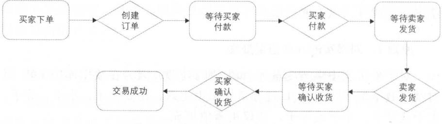

沟宝交易订单的流转过程

业务过程通常使用行为动词表示业务执行的活动。比如图 的淘宝订单流转的业务过程有四个:创建订单、买家付款、卖家发货、 买家确认收货。在明确了流程所包含的业务过程后,需要根据具体的业 务需求来选择与维度建模有关的业务过程。比如是选择买家付款这个业 务过程,还是选择创建订单和买家付款这两个业务过程,具体根据业务 情况来确定。

在选择了业务过程以后,相应的事实表类型也随之确定了。比如选 择买家付款这个业务过程,那么事实表应为只包含买家付款这 个业务 过程的单事务事实表;如果选择的是所有四个业务过程,并且需要分析 各个业务过程之间的时间间隔,那么所建立的事实表应为包含了所有四 个业务过程的累积快照事实表。

# 第门章事实表设计丁一

# 二步:声明粒度

粒度的声明是事实表建模非常重要的一步,意味着精确定义事实表 的每一行所表示的业务含义,粒度传递的是与事实表度量有关的细节层 次。明确的粒度能确保对事实表中行的意思的理解不会产生混淆,保证 所有的事实按照同样的细节层次记录。

应该尽量选择最细级别的原子粒度,以确保事实表的应用具有最大 的灵活性。同时对于订单过程而言,粒度可以被定义为最细的订单级别。 比如在淘宝订单中有父子订单的概念,即一个子订单对应一种商品,如 果拍下了多种商品,则每种商品对应一个子订单:这些子订单一同结算 的话,则会生成一个父订单。那么在这个例子中,事实表的粒度应该选 择为子订单级别。

# 确定维度

完成粒度声明以后,也就意味着确定了主键,对应的维度组合以及 相关的维度字段就可以确定了,应该选择能够描述清楚业务过程所处的 环境的维度信息。比如在淘宝订单付款事务事实表中,粒度为子订单, 相关的维度有买家、卖家、商品、收货人信息 业务类型、订单时间等 维度。

# 第四步 确定事实

事实可以通过回答"过程的度量是什么"来确定。应该选择与业务 过程有关的所有事实,且事实的粒度要与所声明的事实表的粒度一致。 事实有可加性、半可加性、非可加性三种类型 需要将不可加性事实分 解为可加的组件。

比如在淘宝订单付款事务事实表中,同粒度的事实有子订单分摊的 支付金额、邮费、优惠金额等。

# 第五步 冗余维度

在传统的维度建模的星形模型中,对维度的处理是需要单独存放在

专门的维表中的,通过事实表的外键获取维度。这样做的目的是为了减 少事实表的维度冗余,从而减少存储消耗。而在大数据的事实表模型设 计中,考虑更多的是提高下游用户的使用效率,降低数据获取的复杂性, 减少关联的表数量。所以通常事实表中会冗余方便下游用户使用的常用 维度,以实现对事实表的过滤查询、控制聚合层次、排序数据以及定义 主从关系等操作。

比如在淘宝订单付款事务事实表中,通常会冗余大量的常用维度字 段,以及商品类目、卖家店铺等维度信息。

# 11.2 事务事实表

订单作为交易行为的核心载体,直观反映了交易的状况。订单的 转会产生很多业务过程,而下单、支付和成功完结三个业务过程是整个 订单的关键节点。获取这三个业务过程的笔数、金额以及转化率是日常 数据统计分析的重点,事务事实表设计可以很好地满足这个需求。本节 将介绍三种不同事务事实表的设计方式,以及在淘宝交易订单中关于邮 费和折扣分摊到子订单的算法。

# 11.2.1 设计过程

任何类型的事件都可以被理解为 种事务。比如交易过程中的创 订单、买家付款,物流过程中的揽货、发货、签收,退款中的申请退款、 申请小 介入等,都可以被理解为 种事务。事务事实表, 即针对这些 过程构建的一类事实表,用以跟踪定义业务过程的个体行为,提供丰富 的分析能力,作为数据仓库原子的明细数据。下面以淘宝交易事务事实 表为例,阐述事务事实表的一般设计过程。

( I )选择业务过程

给出了淘宝交易订单的流转过程,其中介绍了四个重要过

程:创建订单、买家付款、 卖家发货、买家确认收货,即下单、支付 发货和成功完结四个业务过程。这四个业务过程不仅是交易过程中的重 要时间节点 ,而且也是下游统计分析的重点,因此淘宝交易事务事实表 设计着重从这四个业务过程进行展开

Kimball 维度建模理论认为,为了便于进行独立的分析研究,应该 为每个业务过程建立一个事实表。 对于是否将不同业务过程放到同 事实表 中,将在下一节 中详细介绍。

(2 )确定粒度

业务过程选定以后,就要针对每个业务过程确定一个粒度,即确定 事务事实表每一行所表达的细节层次。下面先介绍淘宝订单的产生过程。

淘宝出售商品主要分两类卖家 一类是个人性质的闲置卖家,主要 出售 闲置的或者二手商品 一类是拥有店铺的卖家,以出售新商品为主。 接下来主要以店铺类交易订单为例进行介绍。在淘宝下单交易时,有两 种方式:一种是选定商品后直接购买,这样会产生一个交易订单;一种 是将多种商品加入到购物车中,然后 起结算,此时对于每 种商品都会 产生一个订单 ,同时对于同 个店铺会额外产生 个订单,即父订单;由 于是在同一个店铺购买的,所以父订单会承载订单物流、店铺优惠等信息。 而对于每一种商品产生的订单就称为子订单,子订单记录了父订单的订单 号,并且有子订单标志。 如果在同一个店铺只购买了-种商品,则会将父 子订单进行合并 ,只保留一条订单记录。如图 1.2 和图 1.3 所示示例。

了解了淘宝交易订单的产生过程后,现在为淘宝交易事务事实表确 定粒度。 步所述,在淘宝交易过程中有四个重要业务过程,需要 为每个业务过程确定一个粒度。其 中下单、支付和成功完结 个业务过 程选择交易子订单粒度 ,即每个子订单为事务事实表的 行,每个子订 单所表达的细节信息为: 交易 时间、卖家、买家、商品,即选择图 1.2 和图 11.3 中订单 ID 5' 8, 的子订单作为事务事实表 的每一行。卖家发货这个业务过程可以选择子订单粒度,即将每个子订 单作为卖家发货事实表 个细节。然而,在实际操作中发现,卖家发 货更多 的是物流单粒度而非子订单粒度,同 个子订单可以拆开成多个 物流单进行发货。在事务事实表设计过程中,秉承确定为最细粒度的原

一寸大数据之路一一阿里巴巴大数据实践

则,因此对于卖家发货确定为物流单粒度,和其他三个业务过程不同, 这样可以更好地给下游统计分析带来灵活性。

| 订单ID | 父订单ID | 创建时间                  |          | 买家 DI 卖家ID | 商局!DI               |  | 金额 蚊量 是否子订单 是否父订单 |   |
|------|-------|-----------------------|----------|------------|---------------------|--|-------------------|---|
| 1    | 1     | I 2016 01-01 00:00:00 | I<br>111 | I 222      | 111111 1100βI 1     |  | y                 | y |
| 9    | 9     | I 2016-01-03 00:00:00 | I 444    | I sss      | I 66666 I soo.o I 2 |  | y                 | y |

1.2 父子订单合并成一条记录

| 订单ID | 父订单ID | 创建时间                  | 买家ID | 卖家ID | 商品ID  | 金额    | 敛量 | 是否子订单 | 是否父订单 |
|------|-------|-----------------------|------|------|-------|-------|----|-------|-------|
| 2    |       | 2016-01-01 00:00:00   | 111  | 222  |       | 。。    | 3  | N     | y     |
| 4    | 2     | 2016-01-01 00:00:00   | 111  | 222  | 11111 | 100.0 | 1  | y     | N     |
| s    | 2     | 00:00:00<br>2016-01"。 | 111  | 222  | 22222 | so.o  | 2  | y     | N     |
| 3    |       | 2016-01-02 00:00:00   | 333  | 777  |       | 0.0   | 6  | N     | y     |
| 6    | 3     | 2016-01-02 00:00:00   | 333  | 777  | 33333 | 70.0  | 1  | y     | N     |
| 7    | 3     | 2016 01 02 00:00:00   | 333  | 777  | 44444 | 80.0  | 2  | y     | N     |
| 8    | 3     | 2016 01-02 00:00:00   | 333  | 777  | sssss | 90.0  | 3  | y     | N     |

## 1.3 父子订单拆开成多条记录

(3 )确定维度

选定好业务过程并且确定粒度后,就可以确定维度信息了。在淘 易事务事实表设计过程中,按照经常用于统计分析的场景,确定维度包含: 买家、卖家、商品、商品类目、发货地区、收货地区、父订单维度以及杂 项维度。由于订单的属性较多,比如订单的业务类型、是否无线交易、订 单的 attributes 属性等,对于这些使用较多却又无法归属到上述买卖家或商 品维度中的属性,则新建 个杂项维度进行存放,如图 1.4 所示。

(4 )确定事实

作为过程度量的核心,事实表应该包含与其描述过程有关的所有事 实。以淘宝交易事务事实表为例,选定 个业务过程一一下单、支付和 成功完结,不同的业务过程拥有不同的事实。比如在下单业务过程中, 需要包含下单金额、下单数量、下单分摊金额;在支付业务过程中,包 含支付金额、分摊邮费、折扣金额、红包金额、积分金额;在完结业务 过程中包含确认收货金额等。由于粒度是子订单,所以对于 些父订 上的金额需要分摊到子订单上,比如父订单邮费、父订单折扣等。具体 的分摊算法将在"父子事实的处理方式" 节中介绍。

根据 Kimball 维度建模理论,经过以上四步,淘宝交易事务事实表

已成型,可以满足下游分析统计的需要。然而,阿里巴巴数据仓库在建 模时,基于以上四步增加了一步一一退化维度,这个过程在 Kimball 度建模中也有所提及;但阿里巴巴数据仓库出于效率和资源的考虑,将 常用维度全部退化到事实表中,使下游分析使用模型更加方便。

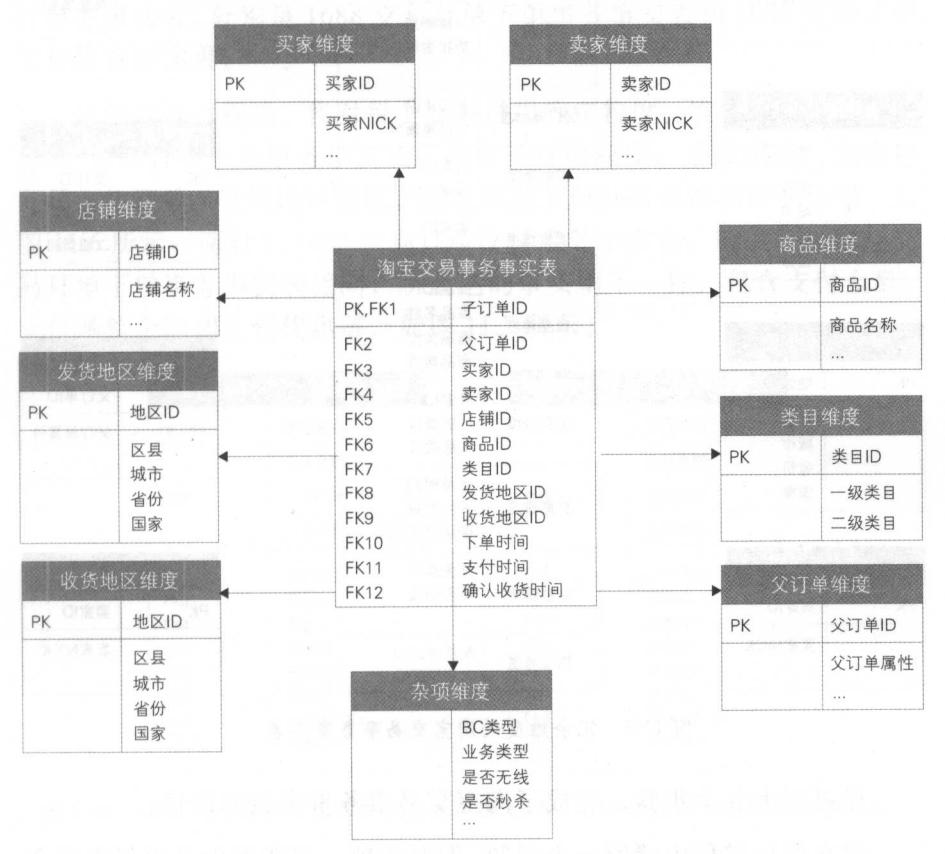

1.4 沟宝交易事务事实农(确定维皮)

# (5 )冗余维度

在确定维度时,包含了买卖家维度、商品维度、类目维度 、收发货 维度等, imball 维度建模理论建议在事实表中只保存这些维表的外键, 而淘宝交易事务事实表在 维度建模基础之上做了进 化,将买卖家星级、标签、店铺名称、商品类型、商品特征、商品属性、 目层级等维度属性都冗余到事实表中,提高对事实表进行过滤查询、

|      | . 噩噩噩噩噩噩疆.     |   | 父订单维度 | !<br>父订单ID<br>父订单属性            |  |     |
|------|----------------|---|-------|--------------------------------|--|-----|
| : PK | 地区ID<br>区县一一一「 | I | 买家维度  | 买家ID<br>买家Nick                 |  |     |
| I    | 城市<br>省份       |   | 卖家维度  | 卖家 ID<br>I 卖家Ni<br>ck          |  | ::: |
|      | 国家             |   | 商品维度  | 商品ID<br>  商品名称<br>商品类型<br>商品属性 |  |     |
|      |                |   |       | 类目<br>ID                       |  |     |
|      |                |   | 类目维度  | 一级类目<br>级类目                    |  |     |
|      |                |   | 日期维度  | 下单时间<br>支付时间<br>确认收货时间         |  |     |
|      |                |   |       | 业务类型                           |  |     |
|      |                |   | 杂项维度  | 是否无线                           |  |     |
|      |                |   | 物流维度  | 发货地区ID<br>!&货地区ID              |  |     |

统计聚合的效率,如图 所示

1.5 冗余维度的沟宝交易事务事实求

经过以上五个步骤,完成了淘宝交易事务事实表的设计。

但在设计过程中遗留一个问题,即对于单一事实表 中是否包含多个 业务过程,还没有给出定论。接下来将通过在淘宝和 交易过程 采用不同的设计方案来阐述两种设计方法。

# 11.2.2 单事务事实表

单事务事实表,顾名思义,即针对每个业务过程设计 个事实表。 这样设计的优点不言而喻,可以方便地对每个业务过程进行独立的分析

200

研究。 <sup>1688</sup> 交易流程则采用这种模式构建事务事实表。

<sup>1688</sup> 交易和淘宝交易相似,主要流程也是下单、支付、发货和完 结,而在这四个关键流程中 <sup>1688</sup> 交易选择下单和支付两个业务过程设 计事务事实表,分别是 <sup>1688</sup> 交易订单下单事务事实表 <sup>1688</sup> 交易订单 支付事务事实表。

选定业务过程后,将对每个业务过程确定粒度、维度和事实。对于 <sup>1688</sup> 交易订单下单事务事实表,确定子订单粒度,选择买家、卖家、 商品、父订单、收货地区维度,事实包含下单分摊金额和折扣金额,如 .6 所示:而对于 <sup>1688</sup> 交易订单支付事务事实表 ,粒度和维度与交 易订单下单事务事实表相同,所表达的事实则不一样 ,包含支付金额、 支付调整金额和支付优惠等, 如图 1.7 所示。

|      | 下单折扣<br>+         |     |        |  |  |
|------|-------------------|-----|--------|--|--|
| FK2  |                   | FK2 | 父订单ID  |  |  |
|      | 买东 ID             | FK3 | 买家ID   |  |  |
| FK4  | 卖京 ID             | FK4 | 卖东 ID  |  |  |
| FK5  | 店铺ID              | FK5 | 店铺ID   |  |  |
| FK6  | 商品ID              | FK6 | 商品ID   |  |  |
|      |                   | FK7 | 类目 ID  |  |  |
|      | _J<br>ID<br>类目 ID |     | 收货地区ID |  |  |
| FK10 | 帧地区<br>下单时间       |     |        |  |  |

1.6 <sup>1688</sup> 交易 订单下单事务事实表 1.7 <sup>1688</sup> 交易订单支付事务事实农

<sup>1688</sup> 交易针对下单和支付分别建立单事务事实表后,每天的下单 记录则进入当天的下单事务事实表 中,每天的支付记录进入当天的支付 事务事实表中,由于事实表具有稀疏性质 ,因此只有当天数据才会进入 当天的事实表中。下面以具体交易订单为例 ,展示单事务事实表的设计 实例。如图 1.8 所示, orderl 2016-01-01 下单并且在当天完成支付; order2 order3 2016-01-01 下单并且在 2016-01-02 完成支付。如图 11.9 和图 l. l 所示, order order2 order3 写人下单事务事实表中, 业务日期(下单日期)均为 2016-01-01; orderl order2 order3 也分 一-「大数据 一一阿里巴巴大数据实践

别写人支付事务事实表中,业务日期(支付日期)分别为

| 订单ID          | x: 订单ID                         | …--,-…一十一一一一一<br>时间                     | 耐时闹                                 | 完结时间                                                                                                                                                           | ID           | 嚣草               | 商品      | lr:-1t1.t•   | 直付1.t•  | ?一十一二         | 于订单矗否咒订 |
|---------------|---------------------------------|-----------------------------------------|-------------------------------------|----------------------------------------------------------------------------------------------------------------------------------------------------------------|--------------|------------------|---------|--------------|---------|---------------|---------|
| L. --<br>er1  | •<br>!                          | '<br>川-01<br>01<br>田些∞                  | 2oi6二川 -j 2"-01<br>r·<br>10:00:()() | -02·-<br>~ 1_0E <j:oo< td=""><td>111</td><td>!<br/>-「<br/>. ~22</td><td>••</td><td>'<br/>-<br/>.,</td><td>l<br/>+</td><td>I<br/>I<br/>y</td><td>y</td></j:oo<> | 111          | !<br>-「<br>. ~22 | ••      | '<br>-<br>., | l<br>+  | I<br>I<br>y   | y       |
| i<br>der2     | I<br>I<br>!<br>rd2              | I 2016-01-01 , 2016-01-02<br>I 09:00:00 | '<br>09:00:00                       | 2016-01-04<br>•<br>09:00:00 _j_                                                                                                                                | 333          | I<br>444<br>I    | O       |              | ,       | I<br>I N<br>I | y       |
| '<br>I order3 | •<br>I<br>! mord2<br>←--;-;:;:: | I 2016-01-01<br>I 4~ '.℃<br>γ '千千一<br>l |                                     | 2016-01-02 1 2016-01 -归---<br>一千一-<br>I                                                                                                                        | 一一-<br>~ 333 | I<br>1-          | '<br>bb | c<br>'       | •       | : y           |         |
|               |                                 | 一→卜-一-·--!if?~ ~o ,-                    | 2Z;~~i                              | 2h;;6~04                                                                                                                                                       |              | 一十一寸--           |         |              | +---斗,才 | J             | -       |

1.8 <sup>688</sup> 交易订单详情实例

| 业务日期     | 订单     | 父订单   | 下单时间                  | 买家  | 卖家ID | 商品 | 下单度量 |
|----------|--------|-------|-----------------------|-----|------|----|------|
| 20160101 | or de  | mo d1 | 2016-01-01 08:00:0(   | 111 | 222  | aa |      |
| 20160101 | 。「der3 | mord2 | 2016-01-01 09:00 0 [  | 333 | 444  | bb |      |
| 20160101 | order4 | mo d2 | 2016-01-01 09:00: 0 [ | 333 | 444  | cc |      |

1.9 <sup>688</sup> 交易订单下单事务事实农数据实例

| 业务日期     | 订单<br>父订单 |       | 支付时间                | 买家 ID |     | 商品ID | 支付度量 |
|----------|-----------|-------|---------------------|-------|-----|------|------|
| 20160101 | order1    | mord1 | 2016-01-01 08:00:0( | 111   | 222 | aa   |      |
| 20160102 | order3    | mo d2 | 2016-01-01 09:00:0[ | 333   | 444 | bb   |      |
| 20160102 | der4      | mo d2 | 2016-01-01 09 OO:OC | 333   | 444 | cc   |      |

图! 交易订单支付事务事实表数据实例

# 11.2.3 多事务事实表

多事务事实表 将不同的事实放到同 个事实表中,即同 个事 表包含不 同的业务过程。多事务事实表在设计时有两种方法进行事实的 处理 ①不同 务过程的事实使用不同的事实字段进行存放:①不同业 务过程的事实使用同一个事实字段进行存放,但增加 个业务过程标

签。接下来将通过淘宝交易事务事实表和淘宝收藏商品事务事实表分别 阐述其设计方法。

# 1 淘军交易事务事实表

淘宝交易事务事实表采取将不同业务过程的事实使用不同事实字 段进行存放的设计模式。淘宝交易事务事实表 中同时包含了下单、支付 和成功完结 个业务过程,这三个业务过程拥有相同的粒度,都是子订 单粒度,也比较适合放到同一个事实表中。选择业务过程时没有把发货 也加到此事务事实表中,原因是发货的粒度比子订单更细,属于不同粒 度上的业务过程,因此没有放到同一个事实表 中。

在确定好业务过程和粒度后,下一步就是确定维度和事实。对于不同 的业务过程和粒度, 般而言,维度也不完全一致。但是在设计淘宝交易 事务事实表时,根据分析统计 ,常用维度比较一致 ,因此在维度层面可以 保证这三个业务过程放到同一个事务事实表中。这里的维度也是在交易过 程中比较常见的,如包括买家、卖家、商品、类目、店铺、收发货地区等, 无论在哪一个业务过程中,都需要按照这些维度进行统计分析。

将多个业务过程放到同-个事实表中,将要面对的是如何处理多个 事实。淘宝交易事务事实表中包含了下单 、支付和成功完结三个业务过 程,则需要包含下单度量、支付度量和成功完结度量信息 ,这里的解决 方案是针对每个度量都使用一个字段进行保存 ,即不同的事实使用不同 的字段进行存放;如果不是当前业务过程的度量,则采取零值处理方式。 比如在下单业务过程中,对于支付度量和成功完结度量全部置为 ,其 他业务过程类似处理。

个事实表中包含了多个业务过程,在表中如何进行标记呢?淘 宝交易事务事实表采取了这样的解决方案,即针对每个业务过程打 标签,标记当天是否是这个业务过程,比如针对下单,则打一个是否当 天下单的标签;针对支付,打一个是否当天支付的标 针对成功完结, 打一个是否当天成功完结的标签 ,标签之间互不相干。淘宝交易事务事 实表如图 1.11 示。

同样以具体交易订单为例,展示多事务事实表的设计实例,如图 11.12 所示, order <sup>20</sup> 16-01-01 下单并且在当天完成支付 order2 or der <sup>20</sup> 16-01-01 下单并且在 2016-01-02 完成支付,在 016-01-04

成功完结。淘宝交易多事务事实表数据 例如图 ,同 一个事 实表中包含有多个业务过程数据。

|    | 自茵通前院理程医疆1j1,l温钮'捆     |                                 |
|----|------------------------|---------------------------------|
| PK | 子订单                    | 噩噩噩噩.<br>一-唱…                   |
| 度量 | 下单度最<br>支付度量<br>成功完结度量 | I<br>是否当天下单<br>是由支<br>是否当<br>完结 |
|    | 下单时间                   | I                               |
|    | 支付时间                   |                                 |
| 维度 | 成功完结时间                 |                                 |
|    | 卖家                     |                                 |
|    | 商品                     |                                 |

### 1.11 沟宝 易多 事实农

| 订单ID   | 芷?              | ?时<br>----~-                                            | 丰付时 ?                                                                | 丰丰可间                                                   | 巫草ID |                           |           |           |             |                |            |
|--------|-----------------|---------------------------------------------------------|----------------------------------------------------------------------|--------------------------------------------------------|------|---------------------------|-----------|-----------|-------------|----------------|------------|
| order1 | I<br>! mord1    | i 2016- 01-01<br>00<br>00                               | 10:00:00                                                             | 2016-01 01 : 2016 01-02<br>!<br>10:00:00               | 111  | I<br>I 222                | ••        | 下单踵量<br>' | 产匮          | 蛊哥平订<br>·<br>v | 屉哥芷i丁<br>v |
| order2 | l<br>一-…-一<br>I | / 09:00:00                                              | -<br>一一<br>2016-01 01 ! 2016-01-02 2016 01-04, 333<br>09<br>~:<br>oo | -<br><br>1 09:00:00                                    | I    | 」-                        | ·-<br>o   | ,         | 1           | I N            | Y          |
| order3 | 1<br>rr<br>rd2  | ;一: 2016-01-01 -<br>09<br>00<br>00                      | 01 :::02<br>'<br>2016<br>09:00:00<br>:                               | 01<br>6-01<br>-归<br>09:00:00                           | 333  | ,<br>I<br>, 444<br>'      | bb        | ,         | '           | y              | N          |
| order4 | ! mord2<br>I    | 一十一----一←币一一--一一--…---斗一一<br>j 2016-01-01<br>: o9:oo·oo | 09:00:00<br>:                                                        | 一一-?<br>2016-01-02 1 2016-01 -归<br>:<br>09<br>。。<br>00 | 333  | -+-<br>--<br>-<br>I<br>川剧 | '<br>' cc | '         | --唱一庐'一<br> | I v            | N          |

### 沟宝 易订单详情实例

| I<br>业费              | :T<br>ID              | ]<br>'.<br>立订单10                              | ,当<br>天下单        | 是否<br>当天主付            | j; ;f,<br>当天完结   | ·-…+<br>下单时                                  | '<br>…!<br>主付时间                                      | …- '<br>完结时间                   | - ·-,<br>虫草ID             | 卖草ID            | :<br>商品ID      | 下单擅量         | !<br>支付厦      | 宪结厦      |
|----------------------|-----------------------|-----------------------------------------------|------------------|-----------------------|------------------|----------------------------------------------|------------------------------------------------------|--------------------------------|---------------------------|-----------------|----------------|--------------|---------------|----------|
| 2~1'.'.° 10          | ?!                    | ''十…<br>°'                                    | _Y<br>-:<br>J    | y<br>__ ,             | φe<br>N          | ••<br>20<br>01<br>0~ 0000                    | ιi<br>0lz0<br>16<br>1-0<br>100000                    |                                | 11 1                      | l<br>I<br>222   | i<br>aa        | !            |               | 00<br>I  |
| '<br>201<br>101<br>- | rder:J<br>r           | . mord2 i                                     | I<br>Y           | '<br>N<br>:           | N<br>:           | 2016-0 1-0)<br>:o9 OO:OO                     | NULL                                                 | ,<br>1 NULL                    | I<br>333                  | ! 444           | bb             |              | ; 0.0         | 0 0      |
| 20160101<br>一一-一     | I<br>der4             | .→…--卡,,-←争斗"-·<br>I<br>i mord2 !<br>-一_,,一-- | I<br>Y<br>~-.←…… | :<br>!<br>N<br>,户一→牛' | N<br>,           | i()9:oo 00<br>2016<br>1- ~<br>,川」…合-,-…·-    | 」一号……卜+←→非<br>I<br>!'<br>NULL<br>,-                  | -<br>'<br>NULL<br>" ' -<br>,.- | I<br>…十<br>I<br>333<br>,一 | '<br>I 444<br>! | 卜,_<br>I<br>cc | --<br>I<br>i | i<br>o.o<br>, | 0.0      |
| 201<br>102<br>'      | i<br>•·…,             | ←--一<br>rder1 i mord1                         | :<br>!<br>N      | '<br>!<br>N           | i<br>Y           | →-.一一<br>2016-01-0<br>I 08:00:00 i 10:00:0<) | 016-01-0!1?                                          | 01<br>00 00                    | 111                       | ! 222 I         | -<br>aa        | i            | I             |          |
| ;2016'.1102          |                       | ~·(.J t mor~2                                 | 1                | '卜'争夺<br>~I--y …_     | N __             | ~~6~                                         | •<br>~<br>~<br>~'o6<br>o~                            | LL                             | ; -<br>333                | ~<br>刷出         | ~              | 1<br>;;      |               | l<br>0.0 |
|                      |                       | !201 601 02 ; order4 i mord2 !                | I<br>i i N :     | I<br>Y                | '<br>'<br>N<br>' | '<br>2016-01-01!<br>09:00:00 109.00.00       | '<br>016<br>01<br>"<br>02<br>i                       | NULL                           | I<br>1 333 i 444<br>'     | '               | !<br>cc        | '<br>,       | '<br>i.       | 0 0<br>' |
| 201                  | 104 ! order:J i mord2 |                                               | !<br>N           | i<br>N                | Y<br>:           | io1s-o i~oio16-01-o<br>: 09<br>00<br>~~      | 00<br>00                                             | 01 6-0l 。"<br>!og OD.OD        | 333                       | •44             | bb             |              | I             |          |
| :一-<br>'<br>201      | 104 i order4 i        | 一?-一←<br>t<br>rd2                             | '<br>N           | …斗'一一<br>I<br>:       |                  | …<br>09:00:00 ! 09                           | …,<br>2016-01-0f016-01-01'2016- 01 - D!I<br>00<br>00 | 0000                           | ;,•<br>33                 | ; 444           | •<br>l         | ;            | I             |          |

1.13 多事 事实农数 实仔

# 淘宝收藏商品事务事实表

收藏和加购物车是淘宝购物过程中比较常见的两个行为,当用户遇 到喜欢的商品或者店铺时可以选择收藏,然后下次继续浏览购买。这里 以收藏事务事实表阐述多事务事实表在处理不同业务过程时使用同 个字段保存事实的设计方式。

收藏业务较为简单,商品和店铺的收藏业务相似,这里仅以收藏商 品为例进行阐述。 用户可以直接收藏一个商品,也可以删除所收藏的商 品,所以在这个过程中包含了两个业务过程 收藏商品和删除商品。因 此收藏商品事务事实表的第一步就是选择收藏商品和删除商品两个业 务过程。 业务过程确定后,接下来就是确定粒度。无论是收藏商品还是 删除所收藏的商品,都是用户对商品的一个操作,因此这里确定为用户 加上商品的粒度。

确定好业务过程和粒度后,接下来是确定维度和事实。由于粒度是 用户加上商品,所以维度主要是用户维度和商品维度。为了使事实表信 息更丰富,冗余了商品类目维度和商品所属卖家维度,收藏商品和删除 商品业务过程所属的维度是一致的。

收藏商品和删除商品是两个不同的业务过程,但是确定了相同的粒 度和维度 ,所以考虑、设 多事务事实表 ,将这两个业务过程放到同 事实表中 ,只是在不同业务过程的事实上进行区分。在前面的"淘宝交 易事务事实表"中是使用不同字段存放不 同业务过程的事实,这里的解 决方案是使用同 一个字段存放不 同业务过程的事实,使用标签字段区分 不同 业务过程,比如收藏事务事实表使用 个"收藏事件类型"字段来 区分是收藏商品还是删除商品。收藏商品和删除商品的事实主要是商品 价格,不过收藏事务事实表更多的是无事实的事实表,一般用于统计收 藏或者删除的次数。

下面通过实例来说明收藏商品事务事实表的设计过程,如图 1. 1.15 所示。

### 一寸大数据之路一一阿里 巴大数据实践

| 雨雨i~                                            | …厂--::_~~际问一一r---y局面                                                                               | 一一广"                      | -----i               |                      |
|-------------------------------------------------|----------------------------------------------------------------------------------------------------|---------------------------|----------------------|----------------------|
| 2016-01 -01<br>08:00:00                         | 了一号一'<br>一--<br>I<br>NULL<br>!<br>'<br>'                                                           | 号一一'……一斗。「争'-一-一-<br>aa   | 一丁-<br>1<br>111      | …--<br>,             |
| 白--白--句一-- ------<br>2016-01-01<br>12:00<br>:00 | i<br>I<br>J. _一一一一一一-一----」』--一-一---一一→一-l---一一---一-一---」<br>2016-01-01<br>I<br>i<br>18:00:00<br>I | a                         | !<br>I<br>222<br>i   | I<br>I<br>!          |
| 2016-01-01<br>oa:oo:oo                          | !<br>_<br>2016-01-01<br>oa:oo:oo<br>:<br>1<br>------"                                              | _____j一---一-一一一___J<br>bb | !<br>,…-<br>i<br>333 | '<br>一一{一「←一一--<br>I |

1.14 收藏商品明细

| 业费日期          | L<br>收藏时                                    | I<br>:<br>删除时间                                   | 商品ID                              | _:. ·-<br>盎雪山 | 收藏删除盘型      |
|---------------|---------------------------------------------|--------------------------------------------------|-----------------------------------|---------------|-------------|
| 20160101      | 2016-01-01<br>:<br>i<br>,<br>oa:oo:oo       | I<br>I<br>I<br>NULL<br>I<br>!                    | aa<br>:<br>I<br>I                 | 111           | collact     |
| -<br>20160101 | …一一…一'寸<br>2016-01-01<br>:<br>12<br>00<br>- | 2016-01-01<br>'<br>;<br>I<br>L<br>_<br>10<br>()0 | 一一-一一十一一一一一一十-一一<br>aa<br>--<br>- | 222           | delete      |
| 20160101      |                                             | NULL                                             |                                   | 333           | llect       |
| 201<br>102    | i<br>i<br>2016-01-01<br>i<br>08<br>:00 :00  | 2016-01-02<br>,<br>i<br>08:00:00<br>I            | l<br>bb<br>!                      | 333           | i<br>delete |

1.15 收藏商品事务事实农数据实例

# 多事务事实表的选择

上面介绍了两种多事务事实表的设计方式,在实际应用中 要根据 业务过程进行选择。由于是多事务事实表,因此在事实表中包含多个业 务过程

- 当不同业务过程的度量比较相似、差异不大时,可以采用第 多事务事实表的设计方式,使用同 个字段来表示 数据。但 这种方式存在 个问题一一-在同 个周期内会存在 条记录。
- 当不同业务过程的度量差异较大时,可以选择第 事务事实 表的设计方式,将不同业务过程的度量使用不同 段冗余到 中,非当前业务过程则置零表示。这种方式所存在的问题是度 字段零值较多。

### 11.2.4 两种事实表对比

前面介绍了单事务事实表和多事务事实表的设计过程,同时给出 关于 和淘宝不同事务事实表的实例。目前两类事实表都有 际的

## <sup>11</sup> 章事实表设计寸一

应用,但具体哪 种设计方式更优,我们接下来进行分析。

# 1. 业务过程

对于单事务事实表,一个业务过程建立一个事实表,只反映一个业 务过程的事实 对于多事务事实表,在同一个事实表 中反映多个业务过 程。多个业务过程是否放到同一个事实表中,首先需要分析不同业务过 程之间的相似性和业务源系统。比如淘宝交易的下单、支付和成功完结 这三个业务过程是存在相似性的,都属于订单处理中的 环,并且都来 自于交易系统 ,因此适合放到同一个事务事实表 中。

# 粒度和维度

在考虑是采用单事务事实表还是多事务事实表时,另一个关键点就 是粒度和维度,在确定好业务过程后,需要基于不同的业务过程确定粒 度和维度,当不同业务过程的粒度相同,同时拥有相似的维度时,此时 就可以考虑采用多事务事实表。 如果粒度不同,则必定是不同的事实表。 比如交易中支付和发货有不同的粒度,则无法将发货业务过程放到淘宝 交易事务事实表 中。

# 3. 事实

对于不同的业务过程,事实往往是不同的,单事务事实表在处理事 实上 比较方便和灵活,仅仅体现同一个业务过程的事实即可 而多事务 事实表 由于有多个业务过程, 所以有更多的事实需要处理。如果单 务过程的事实较多,同时不同业务过程的事实又不相同,则可以考虑使 用单事务事实表,处理更加清晰 若使用多事务事实表, 会导致事实 表零值或空值字段较多。

# 下游业务使用

单事务事实表对于下游用户而言更容易理解 关注哪个 务过程就 使用相应的事务事实表;而多事务事实表包含多个 务过程,用户使用

大数据之路一一阿里巴巴大数据实践

时往往较为困惑。 和淘宝交易分别采用了这两种方式,从日常使 用来看,对于淘宝交易事务事实表下游用户确实有 定的学习成本

# 5. 计算存储成本

针对多个业务过程设计事务事实表,是采用单事务事实表还是 务事实表,对于数据仓库的计算存储成本也是参考点之 ,当业务过程 数据来源于同 个业务系统,具有相同的粒度和维度,且维度较多而事 实相对不多时,此时可以考虑使用多事务事实表,不仅其加工计算成本 较低,同时在存储上也相对节省,是 种较优的处理方式。

两种事务事实表的比较如表

|       | 单事务事实表                  | 多事务事实表                                                                     |
|-------|-------------------------|----------------------------------------------------------------------------|
|       |                         | 多个                                                                         |
| 粒度    |                         | 相同粒度                                                                       |
| 维度    | 互间不                     | 一致                                                                         |
|       | 当前<br>中的事               | 保留多个业务过程<br>的']\<br>非当前业务<br>过程<br>实需要'J!l<br>处理                           |
| 冗余维度  | 多个<br>务过程<br>则需要冗余多次    | 不同的业务过程只需要冗余一次                                                             |
| 程度    | 解,不会混淆                  | 难以<br>需要通过标签米                                                              |
| 计算存储成 | 较多<br>每个<br>务过程<br>需要计算 | 较少<br>不同业务过程融合到一起<br>降低了<br>存储计n:<br>111<br>但是<br>忙当前<br>务过程的度!在<br>存在大母苓值 |

单事务事实表和多事务事实袤的比较

所示。

# 11.2.5 父子事实的处理方式

淘宝交易父子订单的含义在前文确定粒度时有所说明,在同 个店 铺同时下单多种商品,不仅每种商品有 个子订单,而且这几个子订 会再单独产生 个父订单。下单和支付都是在父订单粒度上完成的,比 如拍下时的订单总额、支付总额、支付邮费,淘宝交易事务事实表在粒 度选择上,按照粒度最细原则,确定为子订单,因此需要将下单总额或

# <sup>11</sup> 章事实表设计丁一

者支付总额分摊到每个子订单上,当然只有一个子订单时是不需要进行 分摊的。下面以子订单分摊的有效下单金额和支付金额为例加以说明。

子订单下羊全额=丁羊商品数量×商品价格

- 子订单分摊的有效下羊全额=下羊商品数量 商品价格+义订单邮费 单分摊比例一子订单折扣一义订单折扣 下羊分摊比例
- 下单分摊比例=(下单商品数量×原价一子订 单折扣) um (下羊商品数量× 原价一子订单折扣)

子订单分摊的支付金额=父订单支付金额×支付分摊比例

支付分摊比例=(下单商品数量×原价一子订 单折扣+调价) sum (下单商品 数量×原价一子订单折扣+调价)

通过分摊父订单的金额将所有业务过程的度量全部带进淘宝交易 事务事实表中 ,包括下单数量、商品价格、子订单折扣、下单分摊比例、 父订单支付金额、父订单支付邮费、父订单折扣、子订单下单金额、子 订单下单有效金额、支付分摊比例、子订单支付金额等,将父子事实同 时冗余到事务表中。

# 11.2.6 事实的设计准则

# 事实完整性

事实表包含与其描述的过程有关的所有事实,即尽可能多地获取所 有的度量。在淘宝交易事务事实表中,比如支付业务过程,在子订单粒 度上的支付金额、支付邮费、支付红包、支付积分、支付折扣都有所包 ,覆盖全面。

# 2. 事实一致性

在确定事务事实表的事实时,明确存储每一个事实以确保度量 致性。以淘宝交易事务事实表为例 ,在下单业务过程中,有下单商品数 量和商品价格两个事实,但在事实表中计算了 下单金额和下单有效金

## -寸大数据之路一一阿里巴巴大数据实践

额,它们可以通过商品数量乘以商品价格进行计算。虽然下游在取数时 也可以通过这种方式完成计算,但是在事实表中统一计算可以保证度 致性,其他如支付过程中的分摊金额等也是类似的。

# 事实可加性

事实表确定事实时,往往会遇到非可加性度量 ,比如分摊 比例、 润率等,虽然它们也是下游分析的关键点,但往往在事务事实表中 关注 更多的是可加性事实,下游用户在聚合统计时更加方便。在淘宝交易 务事实表中,存储了分摊比例这样的度量,但更多的是存储各类金额的 度量。

# 11.3 周期快照事实表

前面章节对事务事实表进行了详细的阐述,同时给出了淘宝交易事 务事实表的设计过程。事务事实表可以很好地跟踪一个事件,并对其进 行度量,以提供丰富的分析能力。然而,当需要一些状态度量时,比如 账户余额、买卖家星级 商品库存、卖家累积交易额等,则需要聚集与 之相关的事务才能进行识别计 ;或者聚集事务无法识别 ,比如 温度 等。对于这些状态度量,事务事实表是无效率的,而这些度量也和度量 事务本身一样是有用的 ,因此, 维度建模理论给出了第二种常见的事实 表一一周期快照事实表,简称"快照事实表"。快照事实表在确定的问 隔内对实体的度量进行抽样,这样可以很容易地研究实体的度量值,而 不需要聚集长期 事务历史。接下来将以淘宝交易结束后的评价数据、 卖家的累积支 金额、买卖家星级等事实表的设计为例,介绍快照事实 表在阿里 巴巴数据仓库中的设计与应用。

# <sup>11</sup> 章事实表设计寸一-

# 11.3.1 特性

快照事实表的设计有一些 区别于事务事实表设计的性质。事务事实 表的粒度能以多 种方式表达,但快照事实表的粒度通常以维度形式声 明\$事务事实表是稀疏的,但快照事实表是稠密的 事务事实表中的事 实是完全可加的,但快照模型将至少包含一个用来展示半可加性质的事

# 1. 用快照 样状

快照事实表以预定的间隔采样状态度量。这种间隔联合一个或多个 维度,将被用来定义快照事实表的粒度,每行都将包含记录所涉及状态 的事实。

现在以淘宝交易卖家自然年汇总事实表为例进行介绍。淘宝活动运 营小二或者卖家经常都需要看 些交易状态数据,比如自然年至今或者 历史至今的下单金额、支付金额、支付买家数、支付商品件数等状态度 量,对于卖家而言 ,可能每天早上都想看 下截至昨天的成交情况;对 于小二 ,可能在频繁的活动周期就需要查看 次成交情况。这些状 态度量可以每天通过事务事实表进行聚集,但随着时间跨度变大聚集 效率会越来越低 ,因此需要设计快照事实表进行状态的度 £r.' 采样的周期间隔是每天,如图 11.16 所示的快照事实表记录了每个卖 的下单和支付情况。

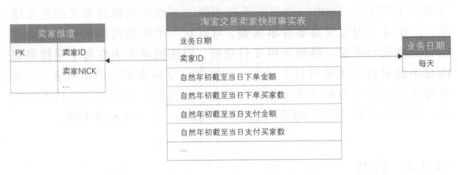

l.16 沟宝交易卖家快照事实表

# 快照粒度

事务事实表的粒度可以通过业务过程中所涉及的细节程度来描述, 但快照事实表的粒度通常总是被多维声明,可以简单地理解为快照需要 采样的周期以及什么将被采样。在淘宝交易卖家快照事实表中,粒度可 以被理解为每天针对卖家的历史截至当日的下单支付金额进行快照。

当然,快照周期不一定都按天来进行,也可以按照月或者季度来统 计。比如淘宝交易有针对卖家加类目的每月汇总事实表,每月统计一次, 同时维度也不仅一个,包含了卖家和类目。

# 3. 密度与稀疏性

快照事实表和事务事实表的 个关键区别在密度上。事务事实表是 稀疏的,只有当天发生的业务过程,事实表才会记录该业务过程的事实, 如下单、支付等;而快照事实表是稠密的,无论当天是否有业务过程发 生,都会记录 行,比如针对卖家的历史至今的下单和支付金额,无论 当天卖家是否有下单支付事实,都会给该卖家记录一行。稠密性是快照 事实表的重要特征,如果在每个快照周期内不记录行,比如和事务事实 表一样 ,那么确定状态将变得非常困难。

# 半可加性

在快照事实表中收集到的状态度量都是半可加的。与事务事实表的 可加性事实不同,半可加性事实不能根据时间维度获得有意义的汇总结 果。比如对于淘宝交易事务事实表,可以对 个周期内的下单金额或者 支付金额进行汇总,得到下单支付总额,但快照事实表在每个采样周期 内是不能对状态度量进行汇总的。比如淘宝交易卖家快照事实表,无法 对每天的历史至今的下单金额进行汇总,也没有汇总意义。虽然不能汇 总,但可以计算 些平均值,比如计算每天 个下单的平均值。

# 11.3.2 实例

阿里巴巴数据仓库建模时,针对不同的业务场景,事务事实表无

.... 212

# <sup>11</sup> 章事实表设计丁

足所有的 求。正如上 节所介绍的,在统计历史至今的卖家或者类 的下单金额和支付子订单数时,通过事务事实表聚集效率较低,而采 用周期快照事 表则是可行的方案。接下来主要介绍阿里巴 数据仓库 周期快照事实表的设计过程。

通过上 节对快照事实表的特性介绍,对于快照事实表的设计步骤 以归纳为:

确定快照事 表的快照粒度。

确定快照事实表采样的状态度量。

下面将依照该设计步骤介绍 类常见的快照事实表。

# 1. 单维度的每天快照事实表

(1 )确定粒度

采样周期为每天,针对卖家、买家、商品、类目 、地 区等维度的快 照事实表 ,比如淘宝卖家历史至今汇总事实表、淘宝商品自然月至今 汇总事实 ,不同的采样粒度确定了不同的快照事实表。

(2 )确定状态度量

确定好粒度以后,就要针对这个粒度确定需要采样的状态度量。比 如淘宝卖家历史至今汇总事实表,包含了历史截至当日 的下单金额、历 史截 当日的支付金额等度量,如图 1.17 示。

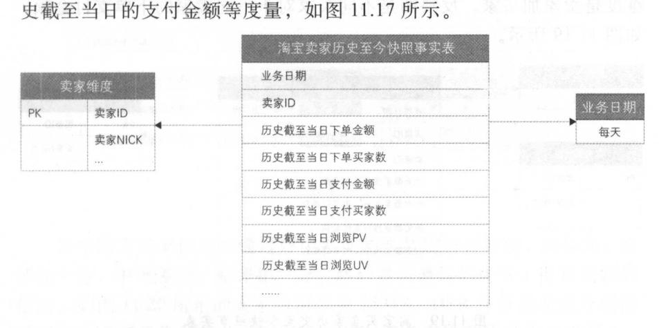

1.17 沟宝卖家历史至今快照事实表

一寸大数据之路一-阿里巴巴大数据实践

淘宝商品历史至今快照事实表,确定了商品维度和商品状态度量 如图 1.18 所示。

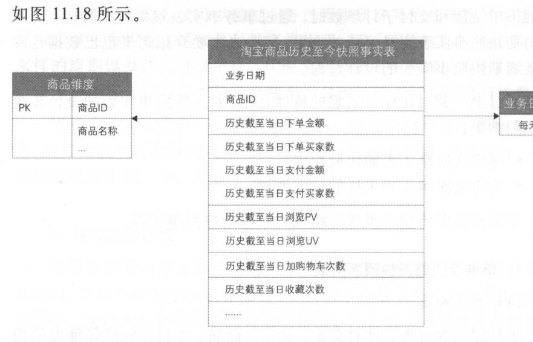

11.18 沟宝商品历史至今快照事实农

# 2. 混合维度的每天快照事实表

混合维度相对于单维度,只是在每天的采样周期上针对 个维度进 行采样。比如淘宝买卖家历史至今快照事实 ,采样周期依然是每 维度是卖家加买家,反映的是不同 家对于不同 卖家的下 支付金额 如图 1.19 所示。

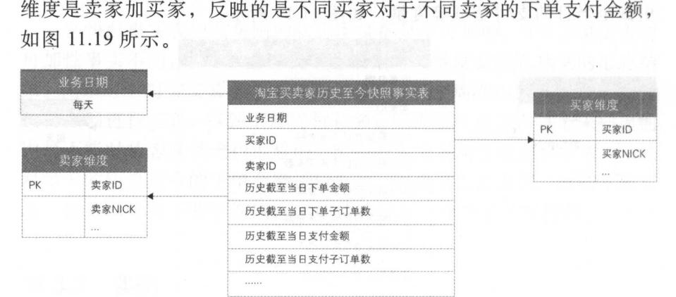

1.19 淘宝买卖家历史至今快照 事实

# <sup>11</sup> 章事实表设计丁一

以上两类快照事实表都有一个特点一一都可以从事务事实表进行 汇总产 出,这是周期快照事实表常见的 种产出模式。除此之外,还有 种产出模式,即直接使用操作型系统的数据作为周期快照事实表的数 据源进行加工,比如淘宝卖家星级、卖家 DSR 事实表等。下面介绍这 类事实表的设计过程。

·淘宝卖家信用分和 DSR 快照事实表

在介绍这类事实表之前,首先介绍淘宝卖家服务评价系统。在淘宝 店铺交易成功以后会进行 次好中差评以及 DSR 评价(包括物流服务、 描述相符和服务态度),淘宝卖家信用就是基于好中差评计算得出的, DSR 评分会累积计算 个综合分;天猫店铺交易完成以后仅有 DSR 价,默认都是好评,如图 .2 、图 11.21 所示。

| 震事馆   | 评价震示 奸诈草 | 98.       | 寞军历史信用向戚 |                              |  |
|-------|----------|-----------|----------|------------------------------|--|
| -周    | 最近一月     | 半每<br>半辈革 |          | -----o:;:T育障,<br>~i<br>534   |  |
|       |          |           | '6i !f   |                              |  |
|       |          |           |          |                              |  |
| 曹~··昌 | 4 77     |           |          |                              |  |
| 富行业   | 4        | 0         | I        | 卖草棚:<br>18 ⑩⑩<br>主富行业:潜蜡Ii呈费 |  |

1.20 卖家好中差件以及星级

| 店"丰茸内司5\$谛岱      |               |                                                |
|------------------|---------------|------------------------------------------------|
| 贝与描<br>笛寄' 4.9   | 捕他平均水平 r&11圈圈 | 俞食食禽食 4.9<br>152                               |
| 提篇由圈圈曹毫擅'<br>4.9 | 蛐币业平均解医圈圈'    | "…<br>;;-圃…… 15.39<br>29<br>……<br>卦'           |
|                  |               | …··禽<br>封回 66%<br>***'*'*<br>~····<br>曹无<br>IT |

1.21 卖家 DSR 许分

其中淘宝卖家信用是通过好中差评的次数进行计算的 ,具体为:好 分,中评零分,差评扣 然后累积最终的得分,得到卖家的 信用,如图 1.20 所示的卖家信用分是 <sup>25318</sup> DSR 评分是通过分项的 星级综合得到最终的评分,其中描述相符、服务态度和物流服务都是

一寸大数据之路一一阿里巴巴大数据实践

星的打分方式,综合每一个星级的买家数得到最终的一个平均分,具 体为:( 星× 星人数+ 星× 星人数+ 星× 星人数+ 星× 星人数 星× 星人数) /(1 星人数十 星人数+ 星人数+ 星人数+ 星人数)。

前面所述的卖家信用分和 DSR 评分都是在操作型系统中计算完成 的,阿里巴巴数据仓库关于淘宝卖家信用分和 DSR 快照事实表是直 采用操作型系统数据进行设计加工,采样周期是每天,针对卖家维度的 统计,状态度量就是卖家信用分和 DSR 评分,如图 1.22 所示。

|                        |                       | <br><br>运喃缸量结聋温<br>缅~""''.帽Hl!lillll理阴配咀      |    |
|------------------------|-----------------------|-----------------------------------------------|----|
|                        | 甲~                    | :<br>i<br>日期                                  |    |
| 1 PK<br>费章ID<br>•<br>! | !<br>i<br>•           | i<br>一…--<br>…•<br>-~<br>!<br>}<br>- ;<br>卖草旧 | 鹏因 |
|                        | !<br>茸茸 ICK<br>i<br>! | :<br>一一一一号'"一…一……-<br>i 翼象借用分<br>'            |    |
|                        | '                     | j<br>( 描述帽符DSA评分                              |    |
|                        |                       | 服务~噎DSR评份<br>!                                |    |
|                        |                       | 班服务DSR评分                                      |    |
|                        |                       |                                               |    |

11.22 沟宝卖家信用分和 DSR 快照事实表

# 3. 全量快照事实表

阿里巴巴数据仓库在设计快照事实表时,还有 类特殊的快照事实 表,即全量快照事实表,这类事实表的特性与前面所述的快照事实表有 些差异,但依然属于周期快照事实表范畴。下面还是以淘宝好中差评 快照事实表为例来阐述该类事实表的设计方法。

( 1 )确定粒度

淘宝好中差评每天都在变化,下游统计分析也是每天都在进行的,因 此确定采样周期是每天。这里的采样维度比较特殊,是针对评价本身,即 每天按照评价进行采样的,每一条好中差评价就是快照事实表的最细粒度。

(2 )确定状态度量

对于好中差评价的度量关注更多的是评价本身,即没有类似于金额、 商品数这样的度量,因此设计为无事实的事实表,更多关注评价的状态

对于全量快照事实表,这里再增加 步,即冗余维度。此如好中 评快照事实表,冗余了子订单维度、商品维度、评论者维度、被评论

|                                              | <br>…监噩噩噩噩噩鄙槛隘噩噩噩          |
|----------------------------------------------|----------------------------|
| 业费日期                                         | I                          |
|                                              | 三二                         |
| ;;                                           | ': =t-:主;                  |
| 于订单棚                                         | 子订单属性                      |
|                                              |                            |
| [·<br>评论者维度                                  | 评论者Nick                    |
| …蛐                                           | §<br>一一-+一一一一一一斗           |
|                                              | ID 被评论者Nick                |
| (<br>'…丁卢卢                                   | ……一一一-:                    |
| 翩翩                                           | 甲号叫                        |
|                                              | u.-                        |
|                                              | --- __ j<br>一--- --;~~~--- |
|                                              | 评论内事                       |
|                                              | i ::::                     |
| !<br>;\\ <tj:j td="" 雏度<=""><td></td></tj:j> |                            |
|                                              | i<br>豆豆运                   |

维度以及杂项维度 ,包括评论内容、是否匿名等信息,如图 11.23 所示。

1.23 沟宝好中差许快照事实农

# 11.3.3 注意事项

# 1. 事务与快照成对设计

数据仓库维度建模时,对于事务事实表和快照事实表往往都是成对 设计的 ,互相补充,以满足更 的下游统计分析需求,特别是在事务事 实表的基础上可以加工快照事实表,如前面所述的淘宝卖家历史至今快 照事实表,就是在事务事实表的基础上加工得到的,既丰富了星形模型, 又降低了下游分析的成本。

# 2. 附加事实

快照事实表在确定状态度量时, 般都是保存采样周期结束时的状 态度量。但是也有分析需求需要关注上 个采样周期结束时的状态度 ,而又不愿意多次使用快照事实表,因此一般在设计周期快照事实表 时会附加 些上 个采样周期的状态度量。

# 3. 周期到日期度量

在介绍淘宝卖家历史至今快照事实表时,指定了统计周期是卖家历 史至今的一些状态度量,比如历史截至当日的下单金额、成交金额等。然 而在实际应用中,也有需要关注自然年至今、季度至今、财年至今的一些 状态度量,因此在确定周期快照事实表的度量时,也要考虑类似的度量值, 以满足更多的统计分析需求。阿里巴巴数据仓库在设计周期快照事实表 时,就针对多种周期到日期的度量设计了不同的快照事实表,比如淘宝 卖家财年至今的下单金额、淘宝商品自然年至今的收藏次数等。

# 11.4 累积快照事实表

针对淘宝交易,设计了淘宝交易下单/支付/确认收货事务事实表, 用于统计下单/支付/确认收货的子订单数、 GMV 等。但仍然有很多需求, 此事务事实表很难满足,比如统计买家下单到支付的时长、买家支付到 卖家发货的 时长、买家从下单到确认收货的时长等。如果使用事务事实 表进行统计,则逻辑复杂且性能很差。对于类似于研究事件之间时间间 隔的需求,采用累积快照事实表可以很好地解决。

# 11.4.1 设计过程

对于累积快照事实表,其建模过程和事务事实表相同,适用于维度 建模的步骤。下面详述淘宝交易累积快照事实表的设计过程,并讨论和 事务事实表的设计差异。

第一步 选择业务过程。在"事实表基础"一节中讲解了淘宝交易 订单的流转过程,主要有四个事件,即买家下单、买家支付、卖家发货、 买家确认收货业务过程。对于这四个业务过程,在事务统计中只关注下 单、支付和确认收货三个业务过程;而在统计事件时间间隔的需求中, 卖家发货也是关键环节。所以针对淘宝交易累积快照事实表,我们选择 这四个业务过程。

步:确定粒度。在"事务事实表"中提到,对于淘宝交易,业 般是从子订单粒度进行统计分析,所以选择子订单粒度。淘宝 易事务事实表的粒度也是子订单,但通常对于子订单的每个事件都会 记录 行,对于多事件事实表,如果子订单同一周期发生多次事件则记 录一行;而对于累积快照事实表,用于考察实体的唯一实例,所以子订 单在此表中只有一行记录,事件发生时,对此实例进行更新。

步:确定维度。与事务事实表相同,维度主要有买家、卖家、 店铺、商品、类目、发货地区、收货地区等。四个业务过程对应的时间 段,格式为日期+时间,分别为下单时间、支付时间、发货时间、确 认收货时间,对应于日期维表,图 1.24 中未标识。在实际使用时会使 用视图或 SQL 别名的方式表示四个日期角色维度,类似于发货地区维 度和收货地区维度。

在交易订单表中,存在很多与订单相关的属性,如订单类型、子类 支付状态、物流状态、 attr ibutes ptions 等。对于类似的属性字段, 无法归属到已有的商品等维度中,所以新建杂项维度存放。在数据仓库 建模理论中,杂项维度无自然键,一般是枚举值的组合 ,对于每个组合 个代理键。但在实际建模中,存在很多非枚举值 ,且对于每个订 都不相同,如订单的 attributes options 属性。所以实际中杂项维度 设计时,也可以直接使用自然键标识具体的维度值,如图 .24 中所 订单维度和父订单维度。

第四步:确定事实。对于累积快照事实表,需要将各业务过程对应 的事实均放人事实表中。比如淘宝交易累积快照事实表,包含了各业务 过程对应的事实,如下单对应的下单金额,支付对应的折扣、邮费和支 付金额,确认收货对应的金额等。累积快照事实表解决的最重要的问题 是统计不同业务过程之间的时间间隔,建议将每个过程的时间间隔作为 事实放在事实表中。在淘宝交易累积快照事实表建模中,由于每个过程 的时间间隔计算逻辑简单,因此并未加人事实表中,如图 1.25 所示。

# 一寸大数据之路一一阿里巴巴大数据实践

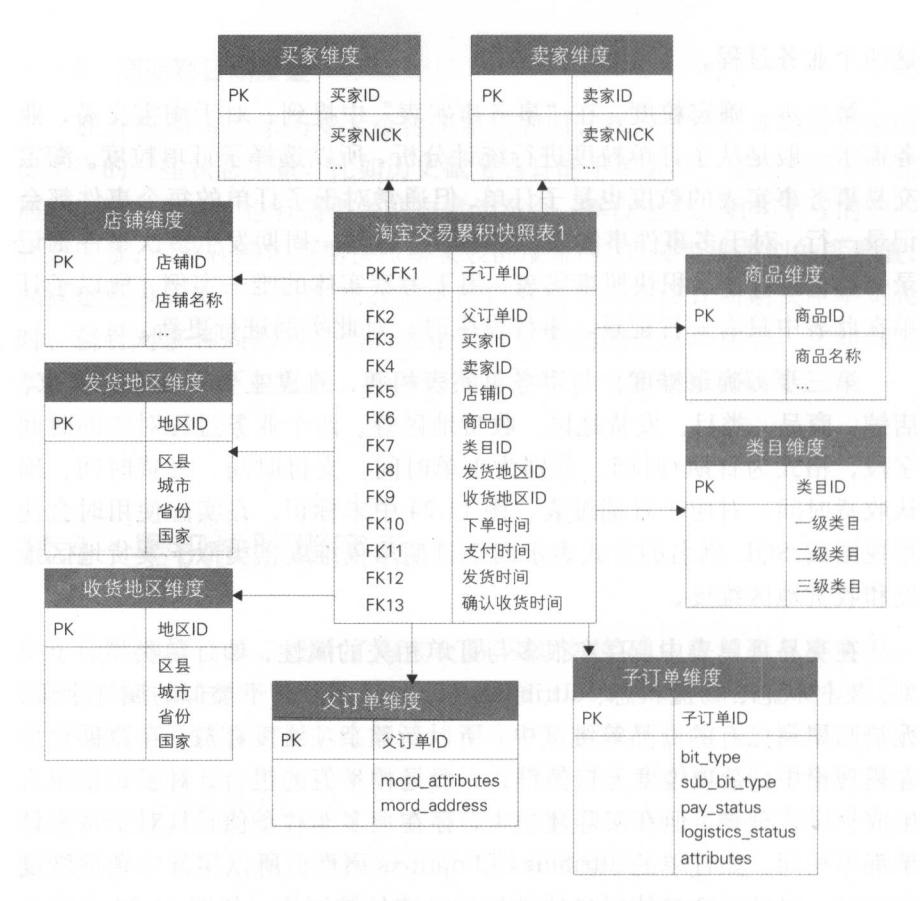

11.2 沟宝交易累积快照事实农(确定事实前)

第五步:退化维度。在大数据的事实表模型设计中,更多的是考虑 提高下游用户的使用效率,降低数据获取的复杂性,减少关联的表数量。 一方面,存储成本降低了,而相比之下 CPU 成本仍然较高;另一方面, 在大数据时代,很多维表比事实表还大,如淘宝几十亿的商品、几亿的 买家等,在分布式数据仓库系统中,事实表和维表关联的戚本很高。所 以在传统的维度模型设计完成之后,在物理实现中将各维度的常用属性 退化到事实表中,以大大提高对事实表的过滤查询、统计聚合等操作的 效率,具体详情不再赘述。

' 220


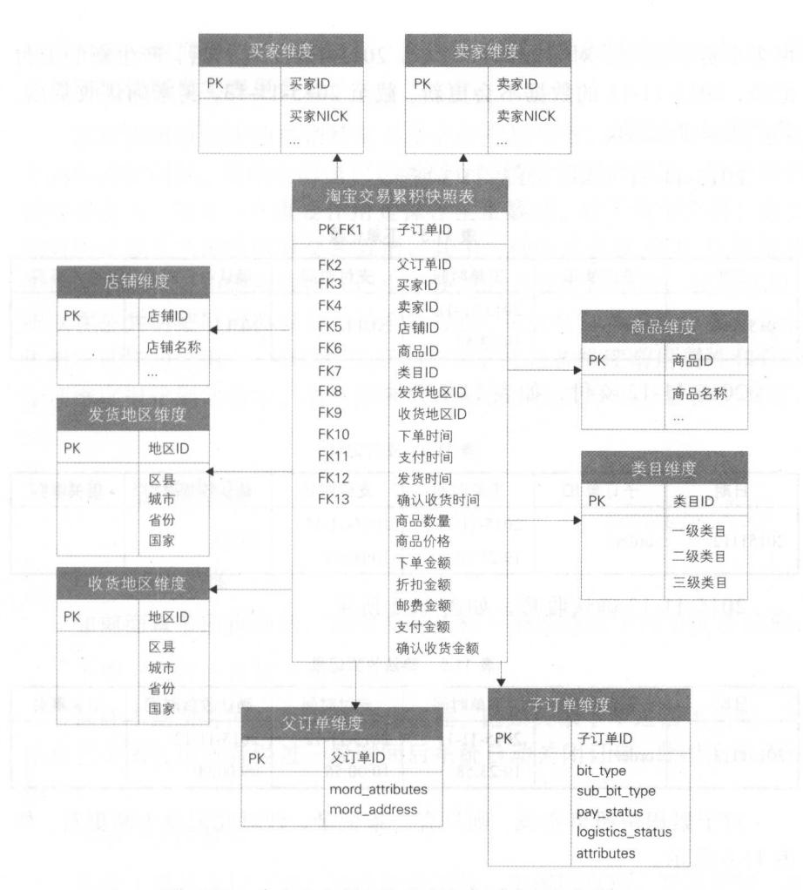

11.25 淘宝交易累积快照事实农(确定事实后)

# 11.4.2 特点

# 数据不断更新

事务事实表记录事务发生 时的状态,对于实体的某一实例不再更 而累积快照事实表则对实体的某一实例定期更新。以淘宝交易为例, 1.3 1.4 1.5 通过实例展示了事务事实表的情况,假设采

# 一寸大数据之路一一阿里巴巴大数据实践

用多事务事实表:对于 orderl 订单, 2015-11-12 支付后,产生新的支付 记录, 2015-11-1 的数据不会更新。截至 2015-11-13 ,买家确认收货后,

2015-11-1 下单,如表 1.3 所示。

11.3 下单记录

| 日期       | <br>子订单 ID | 下单时间                   | 支付时间 | 确认收货时间 | 相关事实 |
|----------|------------|------------------------|------|--------|------|
| 20151111 | I order!   | 2015-11-11<br>19:23:58 | NULL | NULL   |      |

2015-11-12 支付,如表 1.4 所示。

11.4 支付记录

| 日期       | <br>子订单 ID | 下单时间       | 支付时间       | 确认收货时间 | 相关事实 |
|----------|------------|------------|------------|--------|------|
|          |            | 2015-11-11 | 2015-11-12 | NULL   |      |
| 20151112 |            | 19:23:58   | 10:00:58   |        |      |

2015-11-13 确认收货,如表 1.5 所示。

11.5 确认收货记录

| 日期       | 子订单 ID   | 下单时间       | 支付时间       | 碗认收货时间     | 相关事实 |
|----------|----------|------------|------------|------------|------|
|          | I orderl | 2015-11-11 | 2015-11-12 | 2015-11-13 |      |
| 20151113 |          | 19:23:58   | 10:00:58   | 09:00:00   |      |

对于累积快照事实表,则只有一条记录,针对此记录不断更新,如 1.6 所示。

11.6 累积快照事实袤的记录

| 日期       | 子订单 ID   | 下单时间       | 支付时间       | 碗认收货时间       | 相关事实 |
|----------|----------|------------|------------|--------------|------|
|          | I order] | 2015-11-11 | 2015-11-12 | I 2015-11-13 |      |
| 20151113 |          | 19:23:58   | 10:00:58   | 09:00:00     |      |

# 2. 多业务过程日期

累积快照事实表适用于具有较明确起止时间的短生命周期的实体, 比如交易订单、物流订单等,对于实体的每 个实例,都会经历从诞生

..... 222

到消亡等一系列步骤。对于商品、 用户等具有长生命周期的实体, 采用周期快照事实表更合适。

累积快照事实表的典型特征是多业务过程日期,用于计算业务过程 之间的时间间隔 。但结合阿里 巴巴数据仓库模型建设的经验,对于累积 快照事实表,还有一个重要作用是保存全量数据。对于淘宝交易,需要 保留历史截至当前的所有交易数据,其中 种方式是在 ODS 层保留和 源系统结构完全相同 的数据 但由于使用时需要关联维度,较为麻烦, 所以在公共明细层需要保留一份全量数据,淘宝交易累积快照事实表就 承担了这样的作 一一存放加工后的事实,并将各维度常用属性和订单 杂项维度退化到此表中。通常用于数据探查、统计分析、数据挖掘等。

# 11.4.3 特殊处理

# 1 非线性过程

如前面章节所提到的,淘宝交易流程一般经过如下四个业务过程

但并不是所有的交易都会走此流程。比如买家下单之后不支付,可 以自己关闭订单或者经过一段时间后系统自动关闭订单。此时交易流程

下单→关闭订单

买家下单并支付之后,可以申请退款,卖家同意后,交易关闭。此 时交易流程如下:

下单→支付→关闭订单

下单→支付→发货→确认收货

在特殊情况下,流程可能会回转。比如在退款过程中,正常流程可

买家申请退款→卖家同意退款→退款达成 或者

买家 申请退款→卖家不同意退款→退款关

但由于买家和卖家之间未达成协议,卖家不同意买家的退款,此时 流程可能是

买家申请退款→卖家不同意退款→买家申请退款→卖家不同意退 …一直到退款达成或关闭

针对非线性过程,处理情况主要有以下几种

( 1 )业务过程的统

比如流程结束标志的统 ,最开始设计交易累积快照事实表时, 交易完成作为结束标志;进一步了解业务之后,发现交易关闭也是交易 结束的 个分支,所以将交易结束作为流程结束、实体消亡的标志, 括交易完成和交易结束两种情况。

(2 )针对业务关键里程碑构建全面的流程

比如淘宝交易,全流程可能是下单→支付→发货→确认收货。对于 没有支付或没有发货的交易订单,全流程仍然可以覆盖,相关业务过程 的时间字段和事实置空。

(3 )循环流程的处理

主要问题是解决一个业务过程存在多个里程碑日期的问题。使用业 务过程第 次发生的日期还是最后一次发生的日期,决定权在商业 户,而不是设计或开发人员。

# 多源过程

针对多业务过程建模时,业务过程可能来自于不同的系统或者来 于不同的表,其对于累积快照事实表的模型设计没有影响,但会影响 ETL 开发的复杂程度。对于淘宝交易累积快照事实表,除了上述提到的 下单→支付→发货→确认收货流程,假设需要关注交易子订单退款业务 或者物流业务, 时会涉及交易、售后、物流 个业务源系统。

退款业务流程如下

下单→支付→买家申请退款→卖家同意退款 退款达成→交易关闭

# <sup>11</sup> 章事实表设计丁一

或者

下单 →支 发货 →买家 申请退款→卖家同意退款→退款达成→ 交易关

或者

下单 →支 →发货→买家申请退款 卖家不同意退款→退款取消 →交易成功

针对多源业务建模,主要考虑事实表的粒度问题。对于淘宝交易累 积快照事实表,其粒度是交易子订单。对于退款,由于每个子订单可能 存在多次退款,此时如果要将退款相关业务过程加入模型中,则需要和 商业用户确定存在多次退款时如何取舍,确保模型粒度不变。

# 业务过程取舍

节提到的退款业务流程是简化的,比较完整的业务流程如下:

:, L,.f 7G 申请退款→申请小二介入→小二实际介入→卖家同意退款→退款

将退款相关业务流程设计进入交易累积快照事实表时 ,是否需要所 有的业务过程?答案是否定的。当拥有大量的业务过程时,模型的实现 复杂度会增加,特别是对于多源业务过程,模型的精合度过高,此时需 根据商业用户需求,选取关键的里程碑。

# 11.4.4 物理实现

逻辑模型和物理模型密不可分,针对累积快照事实表模型设计,其 有不同的实现方式。

第一种方式是全量表的形式。 此全量表一般为日期分区表 ,每天的 分区存储昨天的全量数据和当天的增量数据合并的结果,保证每条记录 的状态最新。 此种方式适用于全量数据较少的情况。如果数据量很大, 此全量表数据量不断膨胀,存储了大量永远不再更新的历史数据,对 ETL 和分析统计性能影响较大。

第二种方式是全量表的变化形式。此种方式主要针对事实表数据量 很大的情况。较短生命周期的业务实体 般从产生到消亡都有一定的时 间间隔,可以测算此时间间隔,或者根据商业用户的需求确定一个相对 较大的时间间隔。比如针对交易订单,我们以 <sup>200</sup> 天作为订单从产生到 消亡的最大间隔。设计最近 <sup>200</sup> 天的交易订单累积快照事实 ,每 的分 区存储最近 <sup>200</sup> 天的交易订单 <sup>200</sup> 天之前的订单则按照 gmt\_create 建分区存储在归档表中。此方式存在的 个问题是 <sup>200</sup> 天的全量表根据商 业需求需要保留多天的分区数据,而由于数据量较大,存储消耗较大。

种方式是以业务实体的结束时间分区。每天的分区存放当天 束的数据,设计一个时间非常大的分区,比如 3000-12-31 ,存放截至当 前未结束的数据。由于每天将当天结束的数据归档至当天分区中,时间 非常大的分区数据量不会很大, ETL 性能较好;并且无存储的浪费, 于业务实体的某具体实例,在该表的全量数据中唯一。 比如对于交易订 单,在交易累积快照事实表中唯一。

针对第 种方式,可能存在极特殊情况,即业务系统无法标识业 实体的结束时间。比如业务系统调用接口很多,依赖的系统复杂,最终 无法判断业务实体是否已经消亡。 如菜鸟的物流订单, 由于其依赖物 公司的数据,和大量的物流公司存在接口,按照约定,物流公司会向 鸟回传运单的流转信息,但无法保证 100% 准确;且 般为批 回传, 菜鸟订单系统根据批量数据更新物流订单的结束标志几乎无法实现。前 台业务系统没有物流订单的结束时间,那么如何设计物流订单累积快 事实表昵?针对此问题,可以有两种处理方式。

第一种方式 ,使用相 关业务系统的业务实体的结束标志作为此业务 系统的结束标志。比如针对物流订单,可以使用 交易 单。理论上 易订单完结了,则物流订单已经完结。

第二种方式 ,和前端业务系统确定口径或使用前端归档策略。累积 快照事实表针对业务实体 般是具有较短生命周期的,和前端业务系 确定口径,确定从业务实体的产生到消亡的最大 间隔。另外,针对大量 的事实数据,前端系统会定期对历史数据进行归档,避免业务库性能的 下降,对于这种情况,可以使用前端系统的归档时间作为业务实体的结 束日期。

... 226

# 11.5 三种事实表的比较

通过前面章节的介绍,我们对数据仓库三种事实表有了详细的了 解。一些业务过程可能只需要一种事实表,而另外一些业务过程可能需 要两种或三种事实表。 种事实表相互补充,给出业务的完整描述。 1.7 种事实表进行了比较。

|          | 事务事实表           | 周期快照事实表              | 累积快照事实表                |  |  |
|----------|-----------------|----------------------|------------------------|--|--|
| 时期/时间    | 离散TjJ 务时间点      | 以有规律的、可预测的<br>间隔产生快照 | 用于时间跨度不确定的不断变化<br>的工作流 |  |  |
| 日期维度     | 扫务日期            | 快照日期                 | 相关业务过程涉及的多个日期          |  |  |
| 粒度       | 每行代表实体的<br>一个事务 | 每行代表某时间周期<br>的一个实体   | 实体的生命周期<br>每行代表一       |  |  |
| ljJ      | TjJ 务事实         | 累积事实                 | 相关业务过程事实和时间间隔事         |  |  |
| 'JJ 实表加载 | 插入              | 捅入                   | 捅入与更新                  |  |  |
| rJJ 实表更新 | 不更新             | 不更新                  | 业务过程变更时更新              |  |  |

<sup>11</sup> 三种事实表的比较

事务事实表记录的事务层面的事实,用于跟踪业务过程的行为,并 支持几种描述行为的事实,保存的是最原子的数据,也称为"原子事实 表"。事务事实表 中的数据在事务事件发生后产生,数据的粒度通常是 每个事务一条记录。 一旦事务被提交,事实表数据被插人,数据就不能 更改,其更新方式为增量更新。

周期快照事实表以具有规律性的、可预见的时间间隔来记录事实, 如余额、库存、层级、温度等,时间间隔为每天、每月、每年等,典型 的例子如库存日快照表等。周期快照事实表的日期维度通常记录时间段 的终止日,记录的事实是这个时间段内一些聚集事实值或状态度量。事 实表的数据一旦插人就不能更改,其更新方式为增量更新。

累积快照事实表被用来跟踪实体的一系列业务过程的进展情况 ,它 通常具有多 个日期字段,用于研究业务过程中的里程碑过程的时间间 隔。另外,它还会有一个用于指示最后更新日期的附加日期宇段。由于

# 一-「大数据之路一一阿里巴巴大数据实践

事实表中许多日期在首次加载时是不知道的,而且这类事实表在数据加 载完成后,可以对其数据进行更新,来补充业务状态变更时的日期信息 和事实。

# 11.6 无事实的事实表

在维度模型中,事实表用事实来度量业务过程,不包含事实或度 的事实表称为"无事实的事实表\虽然没有明确的事实,但可以用来 支持业务过程的度量。

常见的无事实的事实表主要有如下两种:

第一种是事件类的,记录事件的发生。在阿里巴巴数据仓库中,最 常见的是日志类事实表。比如用户的浏览日志,某会员某时间点浏览了 淘宝首页、某会员某时间点浏览了某卖家的店铺中的某商品详情页等 对于每次点击,其事实为 ,但 般不会保存此事实。

种是条件、范围或资格类的,记录维度与维度多对多之 间的 系。比如客户和销售人员的分配情况、产品的促销范围等。

### 11.7 聚集型事实表

数据仓库的性能是数据仓库建设是否成功的重要标准之一。聚集主 要是通过汇总明细粒度数据来获得改进查询性能的效果。通过访问聚集 数据,可以减少数据库在响应查询时必须执行的工作量,能够快速响应 用户的查询,同时有利于减少不同用户访问明细数据带来的结果不一致 问题。尽管聚集能带来良好的收益,但需要事先对其进行加载和维护 这将会对给 带来更多的挑战。

阿里巴巴将使用频繁的公用数据,通过聚集进行沉淀,比如卖家最

天的交易汇总表、卖家最近 天的交易汇总表、卖家自然年交易 总表等。这类聚集汇总数据,被叫作"公共汇总层"。

在本节中,前半部分将会介绍聚集的基本原 和通用步骤,这些都 是在建设聚集型事实表时必须明白的事情 后半部分将会介绍阿里巴巴 建设公共汇总层的 些实践。

# 11.7.1 聚集的基本原则

- .-致性。聚集表必须提供与查询明细粒度数据 致的查询结果。 从设计角度来看,确保 致性,最简单的方法是确保聚集星形模 型中的维度和度量与原始模型中的维度和度量保持一致。
- 避免单 表设计。不要在同 个表中存储不同层次的聚集数据 否则将会导致双重计算或出现更糟糕的事情。在聚集表中有些行 存放按天汇总的交易额,有些行存放按月汇总的交易额 这将会 让使用者产生误用导致重复计算。为了避免 类问题,通用的做 法是在聚集时显式地加人数据层级列以示区别,但是这样会加大 使用者的使用成本。行之有效的另 种方法是把按天与按月汇总
- 聚集粒度可不同。聚集并不需要保持与原始明细粒度数据 样的 粒度,聚集只关心所需要查询的维度。订单涉及的维度有商品、 买家、卖家、地域等,比如可以按照商品汇总 天的交易额,可 以按照卖家汇总 天的营业额(交易额) 可以按照商品与地域 汇总 月的交易额。

的交易额用两列存放,但是需要在列名或者列注释上能分辨出来。

# 11.7.2 聚集的基本步骤

# 第一步:确定聚集维度。

在原始明细模型中会存在多个描述事实的维度 ,如 日期、商品类 卖家等,这时候需要确定根据什么维度聚集 ,如果只关 商品的交易额 情况,那么就可以根据商品维度聚集数据。

# 第二步:确定一致性上钻。

这时候要关心是按月汇总还是按天汇总,是按照商品汇总还是按照 类目汇总,如果按照类目汇总,还需要关心是按照大类汇总还是小类汇 总。当然,我们要做的只是了解用户需要什么,然后按照他们想要的进 行聚集。

# 第三步:确定聚集事实。

在原始明细模型中可能会有多个事实的度量,比如在交易中有交易 额、交易数量等,这时候要明确是按照交易额汇总还是按照成交数量汇总。

# 11.7.3 阿里公共汇总层

# 1 .基本原则

除了聚集的基本原则外,阿里巴巴建设公共汇总层还必须遵循以下

- ·数据公用性。汇总的聚集会有第三者使用吗?基于某个维度的聚 集是不是经常用于数据分析中?如果答案是肯定的,那么就有必 要把明细数据经过汇总沉淀到聚集表中。
- ·不跨数据域。数据域是在较高层次上对数据进行分类聚集的抽 象。阿里巴巴以业务过程进行分类,如交易统一划到交易域下, 商品的新增、修改放到商品域下。
- .区分统计周期。在表的命名上要能说明数据的统计周期,如 表示最近 天, 表示截至当天,

表示最近

天。

# 交易汇总表设计

聚集是指针对原始明细粒度的数据进行汇总。假定已有的交易订单明 细模型如图 所示,可以看出事实和商品、卖家、买家等维度关联

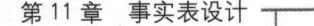

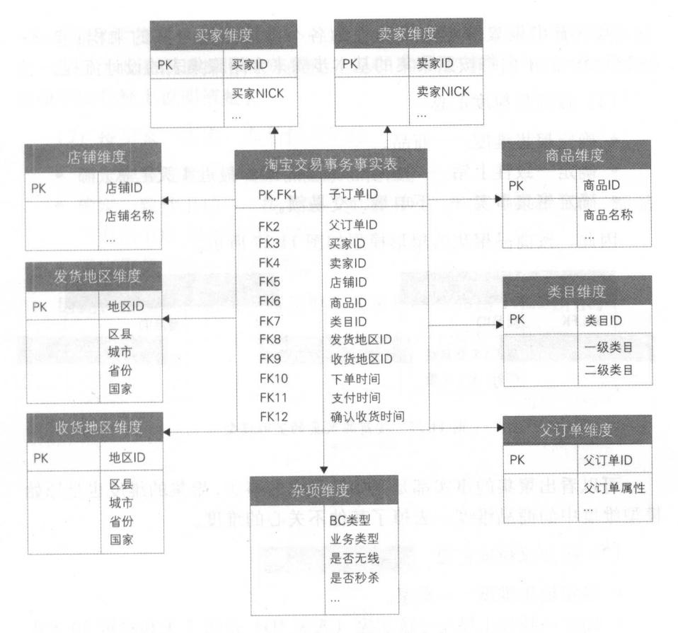

1.26 沟宝交易事务事实农

潜在 聚集 1.8 所示

11.8 潜在的聚集

| 买家维度          | 卖家维度          | 商品维度          | 店铺维度       | 类目维度                | 发货地区                 | …· |
|---------------|---------------|---------------|------------|---------------------|----------------------|----|
| ( 2 )         | ( 2 )         | ( 2 )         | ( 2 )      | ( 3 )               | 维度                   |    |
| 买家 ID<br>买家性别 | 卖家 ID<br>卖家性别 | 商品 ID<br>商品类型 | 店铺<br>店铺类型 | 类目 ID<br>级类目<br>级类目 | ID<br>区县<br>城市<br>省份 |    |

可以看出聚集的组合可能性为各个维度属性个数的乘积: 2× <sup>2</sup> <sup>×</sup> …。下面将按照聚集的基本步骤来介绍聚集表的设计流程。

( l )按商品粒度汇总

确定聚集维度一一商品。

确定一致性上钻一一按商品(商品 天汇总。

确定聚集事实一一下单量、交易额。

因此,按商品聚集的星形模型如图 所示。

| 最近1天商品粒度汇总表 |                    | 商品维度     |  |  |
|-------------|--------------------|----------|--|--|
| PK FK       | 商品ID               | 商品ID     |  |  |
|             | 最近1天交易额<br>最近1天下单量 | 商品名称<br> |  |  |

1.27 按商品聚集的圣形模型

可以看出聚集的事实都是原始模型中的事实,聚集的维度也是原始 模型维度中的商品维度,去掉了其他不关心的维度。

(2 )按卖家粒度汇总

确定聚集维度 卖家。

- 确定一致性上钻一 按卖家(卖家 )最近 天和最近
- 确定聚集事实一一交易额。

因此,按卖家聚集的星形模型如图 所示。

| 家门     |
|--------|
| 卖家NICK |
|        |

# 1.28 按卖家聚集的主形模型

# <sup>11</sup> 章事实表设计丁一

前面在"聚集的基本原则"中说过,应该避免将不同层级的数据放 ,为此我们选择用两列存放 天和 <sup>30</sup> 天的事实,但是需要在列 名和字段注释上说 清楚。

(3 )按卖家、买家、商品粒度汇总

- 确定聚集维度一一卖家、买家、商品。
- 确定 致性上钻一一按卖家(卖家 ID 、买家(买家 ID )、 商品 (商品 ID )最近 天汇总。
- 确定聚集事实一→交易额。

因此,按卖家、买家、商品聚集的星形模型如图 1.29 所示。

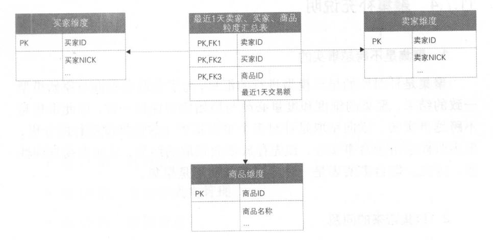

1.29 按卖家、买家、商品聚集的星形模型

可以看出聚集的粒度越细,记录的条数越多,就会越接近原始明细 模型的粒度。

(4 )按 级类目汇总

- 确定聚集维度一一类目。
- 确定 致性上钻-一按最近 天类目维度的 级维度属性汇总。
- .确定聚集事实一一交易额。

因此,按 级类目聚集的星形模型如图 1.30 示。

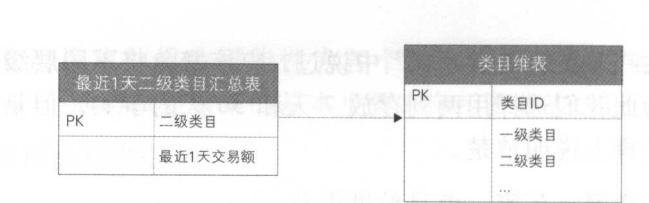

按二级类日聚集的主形模型

与之前的三个聚集表不同的是,这个聚集模型不是根据维度主键属 性进行的聚集,而是根据类目的层次维度属性进行的上钻聚集。

### 11.7.4 聚集补充说明

一寸大数据之路一一阿里巴巴大数据实践

# 1 .聚集是不跨越事实的

聚集是针对原始星形模型进行的汇总,为了获取和查询与原始模型 一致的结果,聚集的维度和度量必须与原始模型保持一致,因 此聚集 不跨越事实的。横向钻取是针对多个事实基于一致性维度进行的分析, 很多时候采用融合事实表,预先存放横向钻取的结果,从而提高查询性 能。因此,融合事实表是 种导出模式而不是聚集。

# 聚集带来的问题

聚集会带来查询性能的提升,但聚集也会增加 维护的难度。 当子类目对应的一级类目发生变更时,先前存在的、已经被汇总到聚集 表中的数据需要被重新调整。这一额外工作随着业务复杂性的增加,会 导致多数 人员选择简单强力的方法,删除并重新聚集数据。

注:本章节部分理论来自于 Christopher Star Schema -The Complete Reference Ralph Kimball The Data Warehouse Toolkit-The Definitive Guide to Dimensional Modeling 本书结合阿里的实践进行讲解,细节 内容请参考各自著作进行学习


# 数据管理篇

| 12 章元数据 |  |
|---------|--|
|---------|--|

- 章计算管理
- 章存储和成本管理
- 章数据质量

# 元数据

# 12.1 元数据概述

# 12.1.1 元数据定义

按照传统的定义,元数据( Metadata )是关于数据的数据。元数据 打通了源数据、数据仓库、数据应用,记录了数据从产生到消费的全过 程。元数据主要记录数据仓库中模型的定义、各层级间的映射关系、监 控数据仓库的数据状态及 的任务运行状态。在数据仓库系统中, 元数据可以帮助数据仓库管理员和开发人员非常方便地找到他们所 心的数据,用于指导其进行数据管理和开发工作,提高工作效率。

将元数据按用途的不同分为两类:技术元数据( Technical Metadata) 和业务元数据( Business Metadata )。

技术元数据是存储关于数据仓库系统技术细节的数据,是用于开 和管理数据仓库使用的数据。阿里巴巴常见的技术元数据有:

- 分布式计算系统存储元数据,如 MaxCo te 表、列、分区等信 息。记录了表的表名。分区信息、责任人信息、文件大小、表类 型,生命周期,以及列的字段名、字段类型、字段备注、是否是 分区 段等信息。
- 分布式计算系统运行元数据,如 MaxCompute 上所有作业运行等 信息:类似于 Hive Job 日志,包括作业类型、实例名称、输 入输出、 SQL 、运行参数、执行时间、最细粒度的 Instance (Max Compute MR 执行的最小单元)执行信息等。
- 数据开发平台中数据同步、计算任务、任务调度等信息,包括数 据同步的输入输出表和字段,以及同步任务本身的节点信息:计 算任务主要有输入输出、任务本身的节点信息 任务调度主要有 任务的依赖类型、依赖关系等,以及不同类型调度任务的运行日 志等。
- 数据质量和运维相关元数据,如任务监控、运维报警、数据质量、 故障等信息,包括任务监控运行日志、告警配置及运行日志、故 障信息等。

业务元数据从业务角度描述了数据仓库中的数据,它提供了介于使 用者和实际系统之间的语义层,使得不懂计算机技术的业务人员也能够 懂"数据仓库中的数据。阿里巴巴常见的业务元数据有

- OneData 元数据,如维度及属性、业务过程、指标等的规范化定 义,用于更好地管理和使用数据。
- 数据应用元数据,如数据报表、数据产品等的配置和运行元数据。

# 12.1.2 元数据价值

元数据有重要的应用价值,是数据管理、数据内容、数据应用的基 础,在数据管理方面为集团数据提供在计算、存储、成本、质量、安全、 治理领域上的数据支持。例如在计算上可以利用元数据查找超长 行节点,对这些节点进行专项治理,保障基线产出时间。在数据内容 面为集团数据进行数据域、数据主题、业务属性等的提取和分析提供 数据素材。例如可以利用元数据构建知识图谱,给数据打标签,清楚地 知道现在有哪些数据。在数据应用方面打通产品及应用链路,保障产品 数据准确、及时产出。例如打通 Max Compute 和应用数据,明确数据 产等级,更有效地保障产品数据。

### 统一元数据体系建设 12.1.3

元数据的质量直接影响到数据管理的准确性,如何把元数据建设好 将起到至关重要的作用。元数据建设的目标是打通数据接入到加 ,再 到数据消费整个链路,规范元数据体系与模型,提供统 的元数据服 出口,保障元数据产出的稳定性和质量。

元数据体系建设思路如图 12.1 所示。

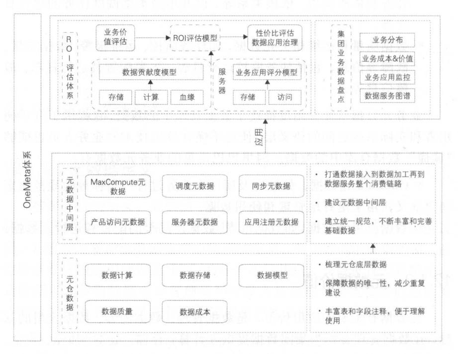

统一元数据体系建设思路图 12.1

首先梳理清楚元仓底层数据,对元数据做分类,如计算元数据、 储元数据、质量元数据等,减少数据重复建设,保障数据的唯一性。另

' 238

<sup>12</sup> 章元数据丁一

要丰富表和字段使用说明,方便使用和理解。根据元仓底层数据构 建元仓中间层,依据 OneData 规范,建设元数据基础宽表,也就是元数 据中间层,打通从数据产生到消费整个链路 ,不断丰富中间层数据,如 MaxCompute 元数据、调度元数据、同步元数据、产品访问元数据、服 务元数据等。基于元数据中间层,对外提供标准统一的元数据服务出口, 保障元数据产出的质量。丰富的元数据 中间层不仅能够为集团数据提供 在计算、存储、成本、质量、安全、模型等治理领域上的数据支持,形 成一套完整的 ROI 数据体系,而且为集团数据进行数据内容、数据域、 数据主题、业务属性等的提取和分析提供了数据素材。

# 12.2 元数据应用

数据的真正价值在于数据驱动决策,通过数据指导运营。通过数据 驱动的方法,我们能够判断趋势 ,从而展开有效行动,帮助自己发现问 题,推动创新或解决方案的产生。这就是数据化运营。同样,对于元数 据,可以用于指导数据相关人员进行日常工作,实现数据化"运营"。 比如对于数据使用者,可以通过元数据让其快速找到所需要的数据;对 ETL 工程师,可以通过元数据指导其进行模型设计、任务优化和任 务下线等各种日常 TL 工作;对于运维工程师,可以通过元数据指导 其进行整个集群的存储、计算和系统优化等运维工作。

# 12.2.1 Data Profile

由于阿里巴巴拥有的数据体量实在难以估量,我们很难精确地说清 楚到底拥有哪些数据,这些数据存储在哪里, 如何使用它们等。过去, 数据研发人员在寻找数据、确认口径算法等工序上 ,花费了大量的人力 和时间。

Data Profi le 的出现,很好地解决了在研发初期数据处理的繁杂 困境,既节约了时间成本,同时也缩减了相当一部分人力资源。它的核 心思路是为纷繁复杂的数据建立一个脉络清晰的血缘图谱。通过图计 算、标签传播算法等技术 ,系统化、自动化地对计算与存储平台上的数 据进行打标、整理、归档。形象地说, Data Profile 实际承担的是为 数据"画像"的任务。

Data Profile 共有四类标签,就像我们可以为用户的网购行为打上 不同的行为标签 样。如果我们也用同样的思维来看待数据本身,那 原本冷冰冰的僵硬数据,实际上也变得有血有肉、个性鲜明。

数据之间的个性化,除了应用场景的不同之外,实际上在数据的研 发流程、保障登记、数据质量要求、安全 级、运维策略、告警设置上 都会有 异。根据这种差异化, Data Profile 开发出了四类标签,如 12.2 示。

- 基础标签 :针对数据的存储情况、访问情况、安全等级等进行打 标。
- 数仓标签:针对数据是增量还是全量、是否可再生、数据的生命 周期来进行标签化处理。
- 业务标签:根据数据归属的主题域、产品线、业务类型为数据打 上不同的标签。
- 潜在标签:这类标签主要是为了说明数据潜在的应用场景, 比如 社交、媒体、广告、电商、金融等。

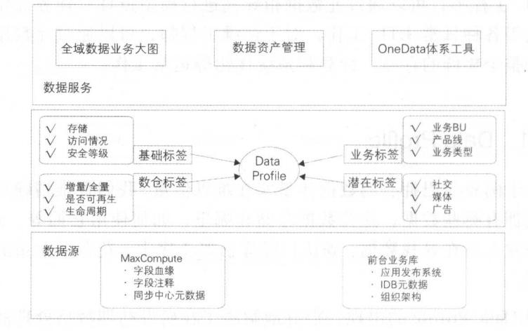

12.2 Data Profile

# <sup>12</sup> 章无数据丁一

利用 Data Profile 不仅可以节约研发人员的时间成本,同时对阿 里巴巴内部的非研发人员来说,也可以更直观地理解数据、利用数据, 从而提升数据的研发效率。

# 12.2.2 元数据门户

阿里巴巴基于元数据产出的最重要的产品是元数据门户。元数据门 户致力 打造一站式 的数据管理平台、高效的 体化数据市场。包括"前 台"和 "后台","前台"产品为数据地图,定位消费市场,实现检索数 理解数据等"找数据"需求 "后台"产品为数据管理,定位于 站式数据管理,实现成本管理、安全管理、质量管理等。

数据地图围绕数据搜索,服务于数据分析、数据开发、数据挖掘、 算法工程师、数据运营等数据表的使用者和拥有者,提供方便快捷的数 据搜索服务,拥有功能强大的血缘信息及影响分析,利用表使用说明、 评价反馈 、表收藏及精品表机制,为用户浮现高质量、高保障的目标数 据。 比如在进行数据分析前,使用数据地图进行关键词搜索,帮助快速 缩小范围,找到对应的数据;比如使用数据地图根据表名直接查看表详 情,快速查阅明细信息,掌握使用规则:比如通过数据地图的血缘分析 可以查看每个数据表的来源、去向,并查看每个表及字段的加工逻辑。

数据管理平台围绕数据管理,服务于个人开发者 BU 管理者、系 统管理员等用户,提供个人和 BU 全局资产管理、成本管理和质量管理 等。针对个人开发者,主要包括计算费用和健康分管理、存储费用和健 康分管理 ,并提供优化建议和优化接口:针对 BU 管理者和管理员,主 要提 BU 、应用、集群等全局资产消耗概览、分析和预测。

# 12.2.3 应用链路分析

对于某个数据计算任务或表,其重要程度如何,是否还有下游在使 用,是否可以下线;阿里巴巴有这么多数据产品,都依赖哪些 MaxCompute 表,对这些 MaxCompute 表是否需要根据应用的重要程度 进行资源 、运维保障……对于这些问题,我们都可以通过元数据血缘来

一寸大数据之路一一阿里巴巴大数据实践

分析产品及应用的链路,通过血缘链路可以清楚地统计到某个产品所用 到的数据在计算、存储、质量上存在哪些问题,通过治理优化保障产品 数据的稳定性。

通过应用链路分析,产出表级血缘、字段血缘和表的应用血缘。其 中表级血缘主要有两种计算方式:一种是通过 MaxCompute 任务日志进 行解析;一种是根据任务依赖进行解析。

其中难度最大的是表的应用血缘解析,其依赖不同的应用。按照应 用和物理表的配置关系,可以分为配置型和无配置型。对于数据报表、 集市等应用,其数据源直接或间接使用 MaxCompute 数据且有元数据配 置依赖关系,通过配置元数据,可以获取 MaxCompute 物理表和具体的 报表、集市等应用的血缘关系。对于生意参谋等数据产品,其数据摞通 过数据同步方式同步至 MySQL HBase 等数据库,间接使用 MaxCompute 数据且无配置产品和 MySQL HBase 等物理数据源的依赖关系,导致无 法通过配置元数据解析 MaxCompute 数据和数据产品的关系。主要通过 统一的应用日志打点 SDK 来解决此问题,可以做到配置化、应用无痕化。

常见的应用链路分析应用主要有影响分析、重要性分析、下线分析、 链路分析、寻根溯源、故障排查等。

# 12.2.4 数据建模

传统的数据仓库建模一般采用经验建模的方式,效率较低且不准 确。基于现有底层数据已经有下游使用的情况,我们可以通过下游所使 用的元数据指导数据参考建模。通过元数据驱动的数据仓库模型建设, 可以在 定程度上解决此问题,提高数据仓库建模的数据化指导,提升 建模效率。

所使用的元数据主要有

- ·表的基础元数据,包括下游情况、查询次数、关联次数、聚合 数、产出时间等。
- ·表的关联关系元数据,包括关联表、关联类型、关联字段、关

llii. 242

表的字段的基础元数据,包括字段名称、字段注释、查询次数、 关联次数、聚合次数、过滤次数等。

其中查询指 QL SELECT 关联指 SQL JOIN ,聚合指 SQL GROU BY 过滤指 SQL WHERE

在星形模型设计过程中,可能类似于如下使用元数据。

- 基于下游使用中关联次数大于某个阔值的表或查询次数大于某 个阐值的表等元数据信息,筛选用于数据模型建设的表。
- 基于表的字段元数据,如字段中的时间字段、字段在下游使用中 的过滤次数 ,选择业务过程标识字段。
- 基于主从表的关联关系、关联次数,确定和主表关联的从表。
- 基于 从表的 段使用情况,如字段的查询次数、过滤次数、关 联次数、聚合次数等,确定哪些字段进入目标模型。

# 12.2.5 驱动 ETL 开发

通过元数据,指导 ETL 工作,提高 ETL 的效率。在"数据同步" 节中,我们提到了通过元数据驱动 键、批量高效数据同步的 OneClick OneClick 覆盖的另 个场景是存量数据日常维护,其主要功 能如图 12.3 中的"数据运维"部分所示。

| 流程管理                    | 一键同步<br>叫量同步<br>小时增量时<br>增全量附<br>州童量时<br>全量附<br>增量附 |                 |        |    |      |         |             |
|-------------------------|-----------------------------------------------------|-----------------|--------|----|------|---------|-------------|
| 流程设计                    |                                                     |                 |        |    |      |         | I<br>M<br>' |
| '<br>流程<br>实例管理         | 数据运维                                                |                 |        |    |      | s<br>'* |             |
| 流程                      | 任务置由芷监                                              | 加字段             | 同步提型转娘 |    | 数据压缩 | 装备恤     | !           |
| 运行管理<br>'<br>流程<br>变量绑定 | …                                                   | l<br>L<br>~till |        | 删除 | 王删除  | 自动通扭    |             |

12.3 驱动 ETL 开发示意图

我们可以通过 得到数据的下游任务依赖情况、最近被 读写的次数、数据是否可再生、每天消耗的存储计算等,这些信息足以 让我们判断数据是否可以下线;如果根据 些规则判断可以下线,则 通过 个数据下线的工作任务流,数据 可能只 要点击提交按钮,删除数据、删除元数据、下线调度任务、下线 DQC 监控等 系列操作就会自动在后台执行完成

# 计算管理

目前内部 MaxCompute 集群上有 <sup>200</sup> 多万个任务,每天存储资源、 计算资源消耗都很大。 如何降低计算资源的消耗,提高任务执行的性能, 提升任务产出 的时间,是计算平台和 ETL 开发工程师孜孜追求的目标。 本章分别从系统优化和任务优化 面介绍计算优化。

# 13.1 系统优化

Hadoop 等分布式计算系统评估资源的方式, 般是根据输入数据 量进行静态评估, Map 任务用于处理输入,对于普通的 Map 任务,评 估一般符合预期 :而对于 Reduce 任务,其输入来自于 Map 的输出,但 般只能根据 Map 任务的输入进行评估,经常和实际需要的资源数相 差很大 ,所以在任务稳定的情况下,可以考虑基于任务的历史执行情况 进行资源评估, 采用 HBO (History-Based Optimiz町, 基于历史的优 化器)。

提到 CBO (Cost-Based Optimizer 基于代价的优化器),首先会想

Oracle CBO Oracle 会根据收集到的表、分区、索引等统计信息 来计算每种执行方式的代价( Cost ),进而选择其中最优的执行方式。 般来说,对于更多的、更准确的统计信息, CBO 则可能生成代价更 小的执行计划。但对表和列上统计信息的收集也是有代价的,尤其是在 大数据环境下,表的体量巨大,消耗大量资源收集的统计信息利用率很 低。 MaxCompute 采用各种抽样统计算法,通过较少的资源获得大量的 统计信息,基于先进的优化模型,具备了完善的 CBO 能力,与传统的 大数据计算系统相比,性能提升明显。

# 13.1.1 HBO

HBO 是根据任务历史执行情况为任务分配更合理的资源,包括内 存、 CPU 以及 Instance 个数。 HBO 是对集群资源分配的 种优化,概 括起来就是:任务执行历史+集群状态信息+优化规则→更优的 执行配置。

# 1 背景

( 1) MaxCompute 原资源分配策略

首先看一下 MaxCompute 最初是如何分配 MR 执行过程的 nstance 个数的。默认的 Instance 分配算法如 13.1 示。

|  | 13.1 |  | 默认的 Instance 分配算法 |  |  |
|--|------|--|-------------------|--|--|
|--|------|--|-------------------|--|--|

| Task 类型             | 最大<br>ice 个蚊 | In 阳臼分配算                      |
|---------------------|--------------|-------------------------------|
| Ma                  |              |                               |
| ReduceTask/JoinTask | I 1111       | 主要依掘父 Ta业的 Instance<br>数虽进行评估 |

在这个分配算法的基础上,根据历史数据统计,各个 Instance 处理 的数据量分布如下:

# • Map Instance

>fiven um(r ound (rt map input bytes/1024/1024 , 2))

[l) 0. 00 4 . 11 16 . 59 ' 60.66 4921.94

# • Reduce Instance

>fivenum (round(rt\$reduce input bytes/1024/1024,2)) [l] 0.00 0.00 0.75 24.87 192721.83

• Join Instance

>fivenum (round(rt\$j oin input bytes/1024/1024,2))

[l] 0 . 00 0.02 1.82 22.15 101640 . 31

注解: fivenum 言中统计数据分布的函数,统计值有 个, 分别是最小值、下四分位数、 中位数、上四分位数、最大值。 \$map \_input\_ bytes \$reduce\_input\_ bytes \$j in\_input\_bytes 分别表示 Map Reduce Join 三种 Task 的输入数据量( ytes )。

从上面内容可以看出,大部分 Instance 处理的数据量远远没有达到 预期,即一个 Instance 处理 256MB 的数据。同时有些 Instance 处理的 数据量很大,很容易导致任务长尾。

假如把处理数据量小的任务称作小任务,处理数据量大的任务称作 大任务,总结 :在默认的 Instance 算法下,小任务存在资源浪费,而大 任务却资源不足。综上所述,需要有更合理的方法来进行资源分配, HBO 应运而生。

(2) HBO 的提出

通过数据分析,发现在系统中存在大量的周期性调度的脚本(物理 计划稳定),且这些脚本的输入 般比较稳定,如果能对这部分脚本进 行优化,那么对整个集群的计算资源的使用率将会得到显著提升。由此, 我们想到了 HBO ,根据任务的执行历史为其分配更合理的计算资源。 HBO 般通过自造应调整系统参数来达到控制计算资源的目的。

# 2. HBO

HBO 分配资源的步骤如下:

- ·前提 :最近 天内任务代码没有发生变更且任务运行 次。
- Instance 分配逻辑:基础资源估算值+加权资源估算值。

一寸大数据之路一一阿里巴巴大数据实践

)基础资源数量的逻辑

- ·对于 Map Task ,系统需要初始化不同的输入数据 ,根据期的每个 Map 能处理的数据量,再结合用户提交任务的输入数据量,就可以估算出用户提交的任务所需要的 Map 量。为了保证集群上任务的整体吞吐量,保证集群的资源不会被 些超大任务占有,我们采用分层的方式,提供平均每个 Map 能处理的数据量。
- ·对于 Reduce ,比较 Hive 使用 Map 输入数据量, MaxCompute使用最近 Reduce 对应 Map 的平均输出数据量作为 Reduce的输入数据 ,用于计算 Instance 的数量。对于 Reduce 个数的估算与 Map估算基本相同,不再赘述
- )加权资源数量的逻辑
- ·对于 Map Task ,系统需要初始化期望的每个 Map 能处理的数据量。通过该 Map 在最近一段时间内的平均处理速度与系统设定的期望值做比较,如果平均处理速度小于期望值,则按照同等比例对基础资源数量进行加权,估算出该 Map的加权资源数量。
- ·对于 Reduce,方法同上。

最终的 Instance个数为:基础资源估算值+加权资源估算值。

• CPU/内存分配逻辑:类似于 Instance 分配逻辑,也是采用基础资源估算值+加权资源估算值的方法。

3. HBO效果

)提高 CPU利用率

通过适当降低每个 Instance CPU 资源数,集群利用率从 40%升到 80% 。其中早上 4:00-7 节省的 CPU 资源可以供 万个 Instance并发使用。

)提高内存利用率

在保障并行度,同时又能提高执行效率的基础上,合理分配内存,早上 4:00 7:00 节省的内存资源可以供 万个 Instance并发使用。

Iii.. 248

( )提高 Instance 并发数

合理设置 Task Instance 个数, Instance 峰值并发数提升了 57%

(4 降低执行时长

在某机器上测试效果很明显。该集群有 <sup>700</sup> 台机器,任务数约 <sup>16</sup> 万个 ,总执行时长减少 <sup>4472</sup> 小时(没有开启 HBO 时总执行时长是 <sup>8356</sup> 小时,开启 HBO 后总执行时长为 <sup>3884</sup> 小时)。

# 4. HBO 改进与优化

HBO 是基于执行历史来设置计划的,对于日常来说,数据量波动 不大,工作良好。但是某些任务在特定场合下依旧有数据量暴涨的情况 发生,尤其是在大促"双 "和"双 <sup>12</sup> "期间,这个日常生成的 HBO 计划就不适用了。针对这个问题, HBO 也增加了根据数据量动态调整 Instance 数的功能,主要依据 Map 的数据量增长情况进行调整。

# 13.1.2 CBO

MaxCompute 2.0 引人了基于代价的优化器( CBO ),根据收集的统 计信息来计算每种执行方式的代价,进而选择最优的执行方式。该优化 器对性能提升做出了卓越改进。通过性能评测, MaxCompute 2.0 离线 计算 比同类产品 Hive 2.0 on Tez 90% 以上。

# 1 .优化器原理

优化器( Optimizer )引人了 Volcano 模型(请参考论文 The *Volcano Optimizer* Gener tor: *Extensibility and* fficient Search ,该模型是基于 代价的优化器( CBO ),并且引人了重新排序 Join (Join Reorder )和 MapJoin (Auto MapJoin )优化规则等,同时基于 Volcano 模型的优 化器会尽最大的搜索宽度来获取最优计划。

优化器有多个模块相互组合协调工作,包括 Meta Manager (元数 据)、 Statistics (统计信息)、 Rule Set (优化规则集)、 Volcano Planner Core :::二 Meta Manager Volcano Planner Core Statistics '

(核心计划器)等,如图 13.1 所示。

13. l 优化器各模块协调工作图

# ( 1 ) Meta Manager

Meta 模块主要提供元数据信息,包括表的元数据、统计信息元数 据等。当优化器在选择计划时,需要根据元数据的 些信息进行优化。 比如表分区裁剪( TableScan Part on Prunning )优化时, 需要通过 Meta 信息获取表数据有哪些分区,然后根据过滤条件来裁剪分区。同时还有 些基本的元数据,如表是否是分区表、表有哪些列等。

对于 Meta 的管理, MaxCompute 提供了 Meta Manager 与优化器 行交互。 Meta Manager 与底层的 Meta 部分对接 ,提供了优化器所需要 的信息。

( 2) Statistics

Statistics 主要是帮助优化器选择计划时,提供准确的统计信息,如 表的 Count 值、列的 Distinct 值、 TopN 值等。优化器只有拥有准确的 统计信息,才能计算出真正最优的计划。比如 Join 是选择 Hash Join Merge Join ,优化器会根据 Join 的输入数据量( Count 值)来进行

优化器提供了 UDF 来收集统计信息,包括 Distinct 值、 TopN 等, Count 值等统计信息是由底层 Meta 直接提供的。

( 3) Rule Set

优化规则是根据不同情况选择不同的优化点,然后由优化器根据代 价模型( Cost Model )来选择启用哪些优化规则。比如工程合并规则 (Project Merge Rule ), 将临近的两个 Project 合并成一个 Project ;过滤 条件下推规则( Fi lter Push Down ),将过滤条件尽量下推,使得数据先 进行过滤,然后再进行其他计算,以减少其他操作的数据量。这些所有 的优化都放置在优化规则集中。

Max Compute 优化器提供了大量的优化规则,用户也可以通过 set 等命令来控制所使用的规则。规则被分为 Substitute Rule (被认为是优 化了肯定好的规则)、 Explore Rule (优化后需要考虑多种优化结果)、 Build Rule (可以认为优化后的结果不能再次使用规则进行优化)。

( 4) Volcano Planner Core

Volcano Planner 是整个优化器的灵魂,它会将所有信息( Meta 息、统计信息、规则)统一起来处理,然后根据代价模型的计算,获得 一个最优计划。

代价模型。代价模型会根据不同操作符(如 Join Pr ect 等)计 算不同的代价,然后计算出整个计划中最小代价的计划。 MaxCompt 代价模型目前提供的 Cost 由三个维度组成 ,即行数、 1/0 开销、 CPU 销,通过这三个维度来衡量每一个操作符的代价。

②工作原理。假设 Planner 的输入是一棵由 ompiler 解析好的计划 树,简称 RelNode 树,每个节点简称 Re!Node

• Volcanno Planner

Planner 的创建主要是将 Planner 在优化过程中要用到的信息传递给执 行计划器,比如规则集,用户指定要使用的规划 Meta Provider ,每个 Re IN ode Meta 计算,如 RowCount 值计算、 Distinct 值计算等;代价模型, 计算每个 RelNode 的代价等。这些都是为以后 Planner 提供的必要信息。

• Planner 优化

规则匹配( Rule Match ):是指 RelNode 满足规则的优化条件而建

# 一寸大数据之路一一阿里巴巴大数据实践

立的一种匹配关系。 Planner 首先将整个 Re!Node 树的每一个 Re IN ode 注册到 Planner 内部,同时在注册过程中,会在规则集中找到与每个 Re!Node 匹配的规则,然后加入到规则应用( Rule Apply )的队列中。 所以整个注册过程处理结束后,所有与 RelNode 可以匹配的规则全部加 入到队列中,以后应用时只要从队列中取出来就可以了。

规则应用( Rule Apply ):是指从规则队列( Rule Queue )中弹出( Pop) 个已经匹配成功的规则进行优化。当获取到一个已经匹配的规则进行 处理时,如果规则优化成功,则肯定会产生至少 个新的 Re!Node ,因 为进行了优化,所以与之前未优化时的 Re IN ode 有差异。这时需要再次 进行注册以及规则匹配操作,把与新产生的 Re!Node 匹配的规则加入到 规则队列中,然后接着下次规则应用。

Planner 会一直应用所有的规则,包括后来叠加的规则,直到不会有 新的规则匹配到。至此,整个优化结束,这时就可以找到 个最优计划。

代价计算( Cost Compute ): 每当规则应用之后,如果规则优化成 功,则会产生新的 ReIN ode 。在新的 ReIN ode 注册过程中,有 个步骤 是计算 RelNode 的代价。

代价计算由代价模型对每个 Re!Node 的代价进行估算。

- 》如果不存在代价,或者 Child 的代价还没有估算(默认是最大 值),则忽略。
- 》如果存在代价,则会将本身的代价和 Child (即输入的所有 RelNode )的代价进行累加, 若小于 Best ,则认为优化后的 Re IN ode 是当前最优的 。并且会对其 Parent 进行递归估算代 价,即传播代价计算( Propagate Calculate Cost )。

比如计划: Project->TableScan ,当 TableScan 计算代价为 时,则 会继续估算 Project 的代价,假设为 ,则整个 Project 的代价就是 1+1=2

也就是说,当 Re IN ode 本身的代价估算出来后,会递归地对 Parent 进行代价估算,这样就可以对整条链路的计划进行估算。在这个估算过 程中借助了 Meta Manager Statistics 提供的信息(见图 13.2 )。

## <sup>13</sup> 章计算管理寸一

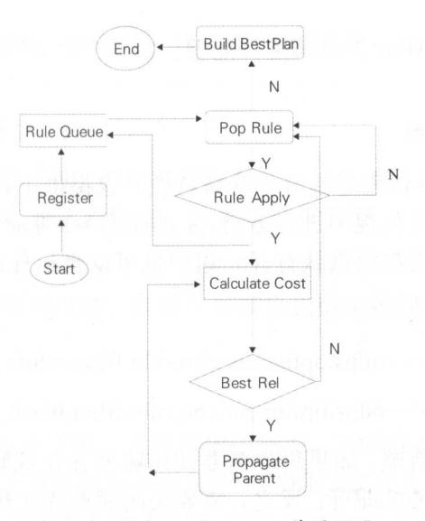

13.2 Volcano Planner 工作原理图

# 2. 优化器新特性

优化器具有一些新特性,主要是重新排序 Join (Join Reorder )和自 MapJoin (Auto MapJoin )。

( 1 )重新排序 Join

Join 可以认为是关系数据库中最重要的操作符之一。 Join 的性能也 直接关系到整个 SQL 的性能。

重新排序 Join 可以认为是将 Join 的所有不同输入进行一个全排列, 然后找到代价最小的一个排列。之前仅仅保持了用户书写 SQL 语句的 Join 顺序,这样的 Join 顺序不一定是最优的,所以通过重新排序 Join 规则可以实现更好的选择,提供更优的性能。

(2 )自动 MapJoin

Join 实现算法有多种,目前主要有 Merge Join MapJoin 。对于小 数据量, MapJoin Merge Join 性能更优。之前是通过 Hint 方式来指定 是否使用 MapJoin ,这样对用户不是很友好,且使用不方便。自动 MapJoin 充分利用优化器的代价模型进行估算,获得更优的 MapJoin

一寸大数据之路一一阿里巴巴大数据实践

式,而不是通过 Hint 方式来进行处理。

# 优化器使用

Max Compute 优化器具有一些新特性 ,也提供了许多优化规则, 内部已经实现的优化规则进行分类,并且提供 set 等命令方便用户使用。 些基础优化规则都会默认打开,用户也可以自己任意搭配使用

优化器提供的 Flag 有:

规则白名单一一odps.optimizer.cbo.rule. filter.white

规则黑名单一-odps.optimizer.cbo.rule.filter.black

使用方法很简单,如果用户需要使用哪些优化规则,只要将规则 缩写名称加人白名单即可;反之,需要关闭哪些优化规则,只要将名称 加入黑名单即可。比如 set odps.optimizer.cbo.rule.filter.black=xxx,yyy;, 就表示将 xxx,yyy 对应的优化规则关闭。

对于重新排序 Join 和自动 MapJoin ,对应的标记分别是 porj 即如果想使用上述优化,则可以进行如下设置:

set odps. optimizer . cbo. rule.filter.white <sup>=</sup> poj r, hj;

注:优化规则之间请使用","分隔


下面列举 TPC-H 些测试结果,如图 13.3 示。

<sup>13</sup> .3 TPC-H 测试对比图

优化前: 5129s ,优化后: 3814s ,性能提升 25.7%

# 注意事

由于用户书写 SQL 语句时可能存在一些不确定因素,所以应尽量 避免这些因素带来 的性能影响,甚至结果非预期。

Optimizer 会提供谓词下推( Predicate Push Down )优化 ,主要目的 是尽量早地进行谓词过滤,以减少后续操作的数据量,提高性能。但需 要注意的是:

(1) UDF

对于 UDF 是否下推,优化器做了限制,不会任意下推这种带有用 户意图 的函数,主要是因为不同用户书写的函数含义不 样,不可以 概而论。如果用户需要下推 UDF ,则要自己改动 QL ,这样做主要的 好处是用户自己控制 UDF 执行的逻辑,最了解自己的 UDF 使用在 SQL 的哪个部分,而不是优化器任意下推等。例如 DF 可能和数据顺序有 关,下推和不下推会导致出现不同的结果。理论上,过滤条件可以下推 Exchange 之后,但不是所有 DF 都是这样的 否则会导致结果违背 了用户书写 SQL 语句的本意。

(2 )不确定函数

对于不确定函数,优化器也不会任意下推,比如 sample 函数,如 果用户将其写在 where 子句中,同时语句存在 Join ,则优化器是不会下 推到 TableScan 的,因为这样可能改变了原意。

例如:

```
SELECT * 
FROM tl 
JOIN t2 
ON tl. cl=t2 . dl 
WHERE sample(4, 1) =true ;
```

sample 函数在 Join 之后执行,而不会直接在 TableScan 后执行。

一寸大数据之路一一阿里巴巴大数据实践

如果用户需要对 Tab le Scan 进行抽样,则需要自己修改 SQL 来达到 目的;否则优化器进行下推可能会错误地理解用户的意图。

对上述 SQL 语句修改如下:

```
SELECT * 
FROM 
    SELECT * 
    FROM t1 
    WHERE sample(4 , 1) =true 
) t1 
JOIN t2 
ON tl. cl=t2 . dl ;
```

(3 )隐式类型转换

书写 SQL 语句时 应尽量避免 Jo in Key 存在隐式类型转换。例 String = Bigint ,在这种情况下会转换为 ToDouble(String) ToDouble igint ),这是不是用户原本的意图,数据库本身不得而知。这样可能 引发的后果有两种: 种是转换失败,报错:另 种是虽然执行成功了, 但结果与用户期望的不 致。

# 13.2 任务优化

本节主要从数据倾斜方面讨论数据优化。下面给出 SQL/MR 从提交到最后执行在 MaxCompute 中的细分步骤,如图 13.4 所示。

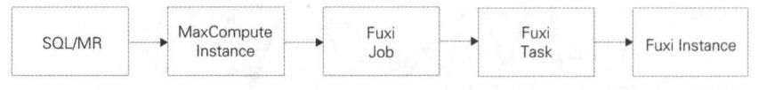

13-4 SQUMR MaxComput 中的细分步骤

SQL/MR 作业 般会生成 MapReduce 任务,在 MaxCompute 中则 会生成 MaxCompute Instance ,通过唯 ID 进行标识。

- Fuxi Job :对于 MaxCompute Instance ,则会生成 个或多个由 Fuxi Task 组成的有向无环图,即 Fuxi Job MaxCompute Instance Fuxi Job 类似于 Hive Job 的概念。
- Fuxi Task :主要包含三种类型,分别是 Map Re duce Join 类似于 Hive Task 的概念。
- Fuxi Instance 真正的计算单元,和 Hive 中的概念类似, 般和 槽位( slot )对应。

# 13.2.1 Map 倾斜

# 1. 背景

Map 端是 MR 任务的起始阶段, Map 端的主要功能是从磁盘中将 数据读人内存, Map 端的两个主要过程如图 13.5 所示。

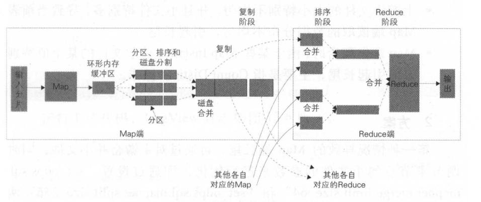

13.5 Map 梢的两个主妥过程示意图

·每个输入分片会让一个 Map Instance 来处理,在默认情况下,以 Pangu 文件系统的一个文件块的大小(默认为 256MB )为一个分 片。 Map Instance 输出的结果会暂时放在 个环形内存缓冲区中, 当该缓冲区快要溢出 会在本地文件系统中创建 个溢出文件,

Write Dump Map 读数据阶段,可以通过" set odps.mapper.split.size=256 "来调节 Map Instance 的个数,提高数 据读人的效率,同时也可以通过" set odps.mapper.merge. limit.size=64 "来控制 Map Instance 读取文件的个数。如果输 数据的文件大小差异比较大,那么每个 Map Instance 读取的数据 量和读取时间差异也会很大。

·在写人磁盘之前,线程首先根据 Reduce Instance 的个数划分分 区,数据将会根据 Key Hash 到不同的分区上,一个 Reduce Instance 对应一个分区的数据。 Map 端也会做部分聚合操作,以 减少输入 Reduce 端的数据量。由于数据是根据 Hash 分配的,因 此也会导致有些 Reduce Instance 会分配到大量数据,而有些 Reduce Instance 却分配到很少数据,甚至没有分配到数据。

Map 端读数据时,由于读人数据的文件大小分布不均匀,因此 会导致有些 Map Instance 读取并且处理的数据特别 多,而有些 Map Instance 处理的数据特别少,造成 Map 端长尾。以下两种情况可能会导 Map 端长尾:

- ·上游表文件的大小特别不均匀,并且小文件特别多,导致当前表 Map 端读取的数据分布不均匀,引起长尾。
- Map 端做聚合时,由于某些 Map Instance 读取文件的某个值特别 多而引起长尾,主要是指 Count Distinct 操作

### 2. 方案

第一种情况导致的 Map 端长尾,可通过对上游合并小文件,同时 调节本节点的小文件的参数来进行优化,即通过设置" set odps.sql. mapper.merge.limit.size <sup>64</sup> "和" set odps .s ql.mapper.s plit.size=256 个参数来调节,其中第一个参数用于调节 Map 任务的 Map Instance 个数:第二个参数用于调节单个 Map Instance 读取的小文件个数,防止 由于小文件过多导致 Map Instance 读取的数据量很不均匀;两个参数配 合调整。下面主要讨论第二种情况的处理方式。

如下代码的作用是获取手机 APP 日志明细中的前 个页面的页面

组信息,其中 re\_page 是前 个页面的页面标识, page\_ut 表是存储的 PP 的页面组, pre\_page 只能通过匹配正则或者所属的页面组信 ,进行笛 儿积 Join

原始代码

```
SELECT 
FROM 
    SELECT ds 
                              u 14 14 
                           et } 
                    Ket
                      aA14
                     -出
                      q 
                      uzs 
                     a
                     -UP
                 ' qA
                  p
                  {
                e e 
                 cvq
                 d 
                nr-
               up
              =p 
             p
             - 
          tr 
         RLP
         ' 
       nMR puhu
    UMU
    FWA 
) a 
LEFT OUTER JO IN 
    SELECT 
             , length(t . page_type_rule ) rule_length 
     FROM page ut t
     WHERE ds=' ${ bizdate }' 
     AND is enable = ' Y ' 
) b 
ON l=l 
WHERE a . prepage rlike b . page type rule
```

运行上述代码, LogView 日志如图 13.6 所示。

| <b>Fuxi Jobs</b><br>Summar | <br><b>JSONSummary</b>                    |        |             |                    |                         |        |                     |                                |                     |                     |            |          |                                                  |
|----------------------------|-------------------------------------------|--------|-------------|--------------------|-------------------------|--------|---------------------|--------------------------------|---------------------|---------------------|------------|----------|--------------------------------------------------|
| <b>Fuyl Joh Name</b>       |                                           |        |             |                    |                         |        |                     |                                |                     |                     |            |          |                                                  |
| TaskName                   | Fatal/Finished/TotalInstCoun I/O Records  |        |             |                    | FinishedPercentage      | Status |                     | StartTime                      | EndTime             | Latency(s)          | TimeLine   |          | 微板<br>                                           |
| 1 L1 Stg4                  | 0/11                                      |        | 448/447     |                    |                         |        |                     | Terminated 2015-10-12 14:09:14 | 2015-10-12 14:09:22 |                     |            |          |                                                  |
| Fuxi Job Name              |                                           |        |             |                    |                         |        |                     |                                |                     |                     |            |          |                                                  |
| TaskName                   | Fatal/Finished/TotalInstCoun: I/O Records |        |             |                    | FinishedPercentage      |        | <b>Status</b>       | <b>StartTime</b>               |                     | EndTime             | Latency(s) | TimeLine | 查看                                               |
| M3 Stal                    | $0/$ /SO                                  |        | 197612626/0 |                    |                         |        | танична             | 2015-10-12 14:09:42            |                     |                     | 41:17      |          | PTh on<br>us                                     |
| 2 R5 3 Stg2                | 01/51                                     |        | 0/0         |                    |                         |        | Rizrecino           | 2015-10-12 14:09:42            |                     |                     | 41:17      |          | EV:                                              |
|                            |                                           |        |             |                    |                         |        |                     |                                |                     |                     |            |          |                                                  |
| M3_Stg1                    |                                           |        |             |                    |                         |        |                     |                                |                     |                     |            |          | Latency: {"min":"1","avg":"11:38","max":"41:14"] |
| Runnino(14                 | Terminatad(36                             | AIM SO |             |                    | <b>BL Latency chart</b> |        | StartTime -         |                                | EndTime             | Latency(s) TimeLine |            |          |                                                  |
| FuxilnstanceID             | IP & Path                                 | StdOut | StdEr       | <b>Status</b>      | FinishedPercentage      |        | 2015-10-12 14:09:47 |                                |                     | 41:14               |            |          |                                                  |
| Odps/                      | 10.182.143.11.                            |        |             | Running            |                         |        | 2015-10-12 14:09:47 |                                |                     | 41:14               |            |          |                                                  |
| Odps/                      | 10.182.111.18.                            |        |             | Running            |                         |        | 2015-10-12 14:09:47 |                                |                     | 41:14               |            |          |                                                  |
| Odgs/                      | 10.182.133.12                             |        |             | Running<br>Rumning |                         |        | 2015-10-12 14:09:47 |                                |                     | 41:14               |            |          |                                                  |
| Odos/<br>Orins/            | 10.182.105.76.<br>10.182.105.21.          |        |             | Running            |                         |        | 2015-10-12 14:09:47 |                                |                     | 41:14               |            |          |                                                  |

<sup>13</sup> LogV 志(一)

一寸大数据之路一一阿里巴巴大数据实践

Ll\_Stg4 MapJoin 表的分发阶段: M3\_Stg 是读取明细日 志表 Map 阶段,与 MapJoin 小表的 操作也发生在这个阶段: Stg2 是进行分组排序的阶段。

通过日志发现, M3\_Stgl 阶段单个 的处理时间达到了 分钟,而且长尾的 个数比较固定,应是不同的 Map 读人的 件块分布不均匀导致的,文件块大的 Map 数据量比较大,在与小表进 行笛卡儿积操作时,非常耗时,造成 Map 端长尾。针对这种情况,可 以使用" distribute by rand ()"来打乱数据分布,使数据尽可能分布均匀。

修改后代码如下:

```
TLMEM C mp
   (
  ER 
    SELECT ds 
             ,unique id 
                            u 14 1l
                         et}) 
                         t 
                    一汩p auzsr qdtcE 
                   &-
                 -pby ep汀归rad一,aE
             P
             =PT 
            ns
            -U deB
          4VE
          - 
         EPR 
    FWAD RHNI nunLhMQU MRT 
) a 
LEFT OUTER JOIN 
    SELECT t.
            ,length(t.page_type_rule) rule_length 
    FROM page ut t 
   WHERE ds='${ bizdate }' 
          工 s enable ='Y ' 
) b 
ON l=l 
WHERE a.pre page rlike b.page type rule
```

执行上述代码, LogView 志如图 所示。

'-'幡 .. 阳' ~T->015 1• "回;31-.JO 2D且'10.17Ql坦坦 惜'lltall OIS/5 圃'~T 唰帽.....,~,。,'"付" 201510-1703刑。

3.7 LogView 日志(二)

通过"distribute by rand ()"会将 Map 端分发后的数据重新按照随 机值再进行一次分发。原先不加随机分发函数时, Map 阶段需要与使用 MapJoin 的小表进行笛卡儿积操作, Map 端完成了大小表的分发和笛卡 儿积操作。使用随机分布函数后, Map 端只负责数据的分发,不再有复 杂的聚合或者笛卡儿积操作,因此不会导致 Map 端长尾。

# 3. 思考

Map 长尾的根本原因是由于读人的文件块的数据分布不均匀,再 加上 DF 函数性能、 Join 、聚合操作等,导致读人数据量大的 Map lnstance 耗时较长。在开发过程中如果遇到 Map 端长尾的情况,首先考 虑如何让 Map Instance 读取的数据量足够均匀,然后判断是哪些操作导 Map Instance 比较慢 ,最后考虑这些操作是否必须在 Map 完成 在其他阶段是否会做得更好。

# 13.2.2 Join 倾斜

# 背景

Join 操作需要参与 Map Reduce 的整个阶段。首先通过一段 Join SQL 来看整个 Map Reduce 阶段的执行过程以及数据的变化,进 而对 Join 的执行原理有所了解。

<sup>13</sup> 章计算管理 丁一

### 假设有下面一段 SQL:

course id LEFT JOIN student course ON student .student id = student course .student id; SELECT student id, student name, FROM student

通过上面的执行过程可以看出, MaxCompute SQL 执行阶 会将 Key 相同的数据分发到同一个执行 上处理 。如果某个 Key 上的数据量比较大,则会导致该 执行时间较长。其表现为: 在执行日志中该 的大部分 都已执行完成,但少数几 一直处于执行中(这种现象称之为长尾)。

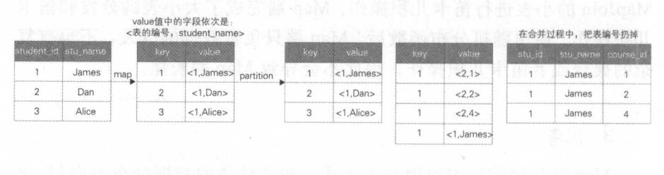

|  |  |  |  | ~ffle | reduce • |                                                       |   |
|--|--|--|--|-------|----------|-------------------------------------------------------|---|
|  |  |  |  |       |          |                                                       |   |
|  |  |  |  |       | 2        | --四"'帽'四"'回<br>-----一--寸一-一---一-一一---一--「 NULL<br>Dan |   |
|  |  |  |  |       | 3        | Ali<br>ce                                             | 1 |
|  |  |  |  |       |          |                                                       |   |
|  |  |  |  |       |          |                                                       |   |
|  |  |  |  |       |          |                                                       |   |

Map ;f" Reduce 阶段的执行过程

因为数据倾斜导致长尾的现象比较普遍,严重影响任务的执行时 间,尤其是在"双 <sup>l</sup> <sup>l</sup> "等大型活动期间,长尾程度比平时更严重。比 如某些大型店铺的 远远超过一般店铺的 PV ,当用浏览日志数据和 卖家维表关联时,会按照卖家 进行分发,导致某些大卖家所在 处理的数据量远远超过其他 Instance ,而整个任务会因为这个 长尾的 迟迟无法结束。

本文的目的就是对 MaxCompute SQL 执行中 Join 阶段的数据倾斜 情况进行分析总结,根据不同的倾斜原因给出对应的解决方案。这里主 要讲述三种常见的倾斜场景。

- Join 的某路输入比较小,可以采用 MapJoin ,避免分发引起长尾。
- Join 的每路输入都较大,且长尾是空值导致的,可以将空值处理 成随机值,避免聚集。
- Join 的每路输入都较大,且长尾是热点值导致的,可以对热点值 和非热点值分别进行处理,再合并数据。

下面会针对这 种场景给出具体的解决方案。首先我们了解 下如 何确认 Join 是否发生数据倾斜。

打开 MaxCompute SQL 执行时产生的 LogView 日志,点开日志会 到每个 Fuxi Task 的详细执行信息,如图 13.9 所示。

| ""惕"                     | 问。"'"协""邸"咱<br>,_            |         | 阳白阳划怆""""旬,. _,                     | 裂,ffn                                                             |                                                   |    |   |  |
|--------------------------|------------------------------|---------|-------------------------------------|-------------------------------------------------------------------|---------------------------------------------------|----|---|--|
| ""-问                     | 0/1674111174                 | .。'"。   | …  固…"'鞠刷栩栩16-04-2103:.2            |                                                                   | 16-042103:5<br>却, 21                              |    |   |  |
| 阳-'"'                    | 3/3                          | ·四嗣     | …- 阳帽啕t.2016-( ·21 旧忘<br>,,.,._" …- |                                                                   |                                                   |    |   |  |
| 3 Ml _舷窗                 | ··"                          |         | s"··" …回国- T•"协棍' 2016-( ·2103:2    | '酬'甸、." 2016-桐创"''                                                | 划胁。·Hllll:l                                       |    |   |  |
| '",._,坷 II               | 锄'                           | ,,,."'  |                                     |                                                                   | 2016-制拟的<br>2016-1)421                            |    |   |  |
| ,旧。坷                     | 锁阐                           |         | 圃,                                  | ,,,酬vt. 2016-舶旧&                                                  | 20 16-0' 21 01:3                                  |    |   |  |
| ·"'-""                   |                              | ?"f9l7  | 701 …- …四 '"回响 2103:2               | -T-  20胁" 210]:3                                                  |                                                   |    |   |  |
| 1 J3 '-'-'咽              | 。; "阳"'                      |         | …                                   |                                                                   | 20 崎啊刮目<br>2016-04-210):4                         |    |   |  |
| • Jl0_3J_St<br>'m.J•-1"- | '"睛"'"帽"'                    | 8508021 | …- '""""'"'"胁。4-2103:3<br>…回国…      | 幅幅 2016-042                                                       | 2016。' 2103: </td <td>47</td> <td></td> <td></td> | 47 |   |  |
| '<br>10_] 平民,,           | 刷锅19/1 "'                    |         |                                     |                                                                   |                                                   |    |   |  |
|                          |                              |         |                                     |                                                                   |                                                   |    |   |  |
| '呻霄, FitfdO)             | T•惰'肉也um」闹闹"   刷刷 』凶"""'""   |         |                                     |                                                                   | 「时-~-民-""'<•! 币丽                                  |    |   |  |
| 咄咄                       |                              |         | 阳也幽幽可有o;r-喃响。,"'«咽-                 | 5a <tt~ td="" ·<=""><td></td><td>""</td><td>-</td><td></td></tt~> |                                                   | "" | - |  |
| _)J_st                   | J.j<br>L.;<br>I0.112         |         | 阳"··.  圃,. ,. 桐也回                   |                                                                   | 剧。榈剖''"                                           | "" | - |  |
| I<br>I•<br>JIO_)」 _st    | 0<br>u<br>"·'"刷<br>.::J<br>C | ,&,     | T  _回…. ,创 6-04-210l:l              | 唰刷 …- 刷刷 2103~                                                    | 2016-0吨盹<br>2016"&4·210 )均拥                       |    |   |  |

13.9 Fuxi Ta 的详细执行信息

从图 13.9 中可以看到每一个 Map Joi Reduce Fuxi Task 任务, 点击其中一个 Join 任务,可以看到有 <sup>15</sup> Instance 长尾:再点击 Std Out ,可以查看 Instance 读人的数据量,如图 13.10 所示。

ad from 川: <sup>5274</sup>

13.10 In tance 读入的数据量

13. l 中显示 Join 路输入读取的数据量是 <sup>1389941257</sup> 行。 如果 Long-Tails Instance 读人的数据量远超过其他 Instance 读取的数 据量,则表示某个 Instance 处理的数据量超大导致长尾。

# 方案

针对上面提到的三种倾斜场景,给出以下三种对应的解决方案。

(1) MapJoin 方案

倾斜时,如果某路输入比较小,则可以采用 MapJoin 避免倾 MapJoin 的原理是将 操作提前到 Map 端执行, 将小表读人内存, 顺序扫描大表完成 Join 。这样可以避免因为分发 key 不均匀导致数据倾 斜。但是 MapJoin 的使用有限制,必须是 中的从表比较小才可用 所谓从表,即左外连接中的右表,或者右外连接中的左表。

MapJoin 的使用方法非常简单,在代码中 后加上"/\* oin(a) \*/"即可,其中 代表小表(或者子查询)的别名。现在 Max Compute 已经可以自动选择是否使用 MapJoin ,可以不使用显式 Hint 。例如:

| SELECT |                 | /*+MAPJOIN (b) * / |
|--------|-----------------|--------------------|
|        | a.c2            |                    |
|        | ,b.<br>c3       |                    |
| FROM   |                 |                    |
|        |                 |                    |
|        | SELECT          | cl                 |
|        |                 | , c2               |
|        | FROM            | t1                 |
| )<br>a |                 |                    |
|        | LEFT OUTER JOIN |                    |
|        |                 |                    |
|        | SELECT          | cl                 |
|        |                 | ,c3                |
|        | FROM            | t2                 |
| )<br>b |                 |                    |
| on     | a.cl<br>=       | b.cl;              |

另外,使用 MapJoin 时对小表的大小有限制,默认小表读人内存后 的大小不能超过 ,但是用户可以通过设置" set odps.sql.mapjoin. memory.max=2048 "加大内存,最大为

(2) Join 因为空值导致长尾

另外,数据表中经常出现空值的数据,如果关联 key 为空值且数据 量比较大, oin 时就会因为空值的聚集导致长尾 ,针对这种情况可以将 空值处理成随机值。因为空值无法关联上,只是分发到一处 成随机值既不会影响关联结果,也能很好地避免聚焦导致长尾。例如

| SELECT          |                                                         |    |
|-----------------|---------------------------------------------------------|----|
| FROM            | table a                                                 |    |
| LEFT OUTER JOIN | table b                                                 |    |
| ON·             | coalesce(table a . key,rand()*9999}=table<br>b.key<br>_ | -- |
|                 |                                                         |    |

( 3) Join 因为热点值导致长尾

key 为空值时用随机值替代

如果是因为热点值导致的长尾,并且 MapJoin ,则可以先将热点 key 取出,对于主表数据用热点 key 切分成 热点数据和非热点数据两部分分别处理,最后合并。这里以淘宝的 日志表关联商品维表取商品属性为例进行介绍。

·取热点 key :将 PV 大于 <sup>50000</sup> 的商品 ID 取出到临时表中。

```
INSERT OVERWRITE TABLE topk_item 
SELECT i tern id 
FROM 
       SELECT i tern id 
                ,count(l) as cnt 
       FROM pv --pv
       WHERE ds = ' ${ bizdate } ' 
       AND url type = ' ipv ' 
       AND item id is not null 
       GROUP BY item id 
) a 
WHERE cnt >= 50000
```

·取出非热点数据。

将主表( pv 表)和热点 key 表( topk\_item 表)外关联后,通过条 件" bl .item\_id is null ,,取 关联不到的数据即非热点商品的日志数据 ,此 时需要使用 MapJoin 。再用非热点数据关联商品维表,因为已经排除了 热点数据,所以不会存在长尾。

```
SELECT ... 
   FROM 
           SELECT * 
           FROM item WHERE ds ='♀{ bizdate }' 
   ) a 
   RIGHT OUTER JOIN 
           SELECT /*+MAPJOIN(bl)*/ 
                   b2 . * 
           FROM 
                   SELECT item
                   FROM topk item 一热点表
                   WHERE ds = ' ${ bizdate }' 
           ) bl 
           RIGHT OUTER JOIN 
                   SELECT
                   FROM pv --pv
                   WHERE ds = ' ${ bizdate } ' 
                   AND url_type = ' ipv ' 
           ) b2 
           ON bl.item id= coalesce(b2.item id, concat (" tbcdm" , 
rand() ) 
           WHERE bl. item id is null 
   ) 1 
   ON a . item id= coalesce(l . item id, concat (" tbcdm", rand() )
```

将主表( pv 表)和热点 key 表( topk\_item 表)内关联,此时需要 使用 MapJoin ,取 到热点商品的日志数据。同时,需要将商品维表( item

取出热点数据。

表)和热点 key topk item )内 联,取到热 商品的维 数据 然后将第一部分数据外 第二部分数据,因为第 部分数据只有热点 商品的维表 数据量 小,可以使用 MapJoin 避免 尾。

```
SELECT /*+MAPJOIN (a ) */ 
FROM 
       SELECT /*+MAPJOIN (bl)*/ 
               b2 . * 
       FROM 
               SELECT tern id 
               FROM topk_item 
               WHERE ds = ' ${ bizdate } ' 
        ) bl 
        JOIN 
               SELECT * 
               FROM pv -- pv
               WHERE ds = ' ${ bizdate } ' 
               AND url type pv
               AND item id is not null 
        ) b2 
        ON (bl . item_id = b2.item_id) 
) 1 
LEFT OUTER JOIN 
        SELECT /*+MAPJOIN (al ) */ 
        FROM 
                SELECT item id 
                FROM t opk item 
                WHERE ds ♀{ bizda }' 
        ) al 
        JOIN
```

一寸大数据之路一一阿里巴巴大数据实践

|        |         | SELECT          | *         |                             |
|--------|---------|-----------------|-----------|-----------------------------|
|        |         | FROM            | item      | --商品表                       |
|        |         | WHERE           | ds z      | ' \${ bizdate } '           |
|        | )<br>a2 |                 |           |                             |
|        | ON      |                 |           | (al. item id = a2. item id) |
| l<br>a |         |                 |           |                             |
| ON     |         | a . item id = l | . item id |                             |

·将上面取到的非热点数据和热点数据通过"union all "合并后即 得到完整的日志数据,并且关联了商品信息。

针对倾斜问题, MaxCompute 系统也提供了专门的参数用来解决长 尾问题,如下所示。

·开启功能

```
set odps.sql .skewjoin=true/false
```

·设置倾斜的 key 及对应的值:

```
set odps . sql . skewinfo=skewed_src: (skewed_key)
```

[(" skewed value " )]

其中 \_key 代表倾斜的列, 代表倾斜列上的倾 斜值。

设置参数的好处很明显,简单方便 坏处是如果倾斜值发生变化需 要修改代码 而且一般无法提前知道变化。另外,如果倾斜值比较多也 不方便在参数中设置。需要根据实际情况选择拆分代码或者设置参数。

# 思考

当大表和大表 因为热点值发生倾斜时,虽然可以通过修改代 码来解决,但是修改起来很麻烦,代码改动也很大,且影响阅读。而 Max Compute 现有的参数设置使用不够灵活,倾斜值多的时候不可能将 所有值都列在参数中,且倾斜值可能经常变动。因此,我们还一直在探 索和思考,期望有更好的、更智能的解决方案,如生成统计信息, Max Compute 内部根据统计信息来自动生成解决倾斜的代码,避免投 过多的人力。

# 13.2.3 Reduce 倾斜

背景

Reduce 端负责的是对 Map 端梳理后的有 key-value 键值对进行聚 合,即进行 Count Sum Avg 等聚合操作,得到最终聚合的结果。

Distinct MaxCompute SQL 中支持的语法,用于对字段去重。比 如计算在某个时间段内支付买家数、访问 UV 等,都是需要用 Distinct 进行去重的。 MaxCompute Distinct 的执行原理是将需要去重的宇段 以及 Gro up By 宇段联合作为 key 将数据分发到 Reduce 端。

因为 Distinct 操作,数据无法在 Map 端的 Shuffle 阶段根据 Group By 先做一次聚合操作,以减少传输的数据量,而是将所有的数据都传输到 Reduce 端,当 key 的数据分发不均匀时,就会导致 Reduce 端长尾。

Reduce 端产生长尾的主要原因就是 key 的数据分布不均匀。比如 有些 Reduce 任务 Instance 处理的数据记录多,有些处理的数据记录少, 造成 Reduce 端长尾 。如下几种情况会造成 Reduce 端长尾:

- 对同 个表按照维度对不同的列进行 Count Distinct 操作,造成 Map 端数据膨胀,从而使得下游的 Join Reduce 出现链路上的 长尾。
- Map 端直接做聚合时出现 key 值分布不均匀,造成 Reduce 端长尾。
- .动态分区数过多时可能造成小文件过多,从而引起 Reduce 端长尾。
- .多个 Distinct 同时出现在 SQL 代码中时,数据会被分发多次, 不仅会造成数据膨胀 倍,还会把长尾现象放大 倍。

# 2. 方案

对于上面提到的第 种情况,可以对热点 key 进行单独处理,然后通 过" nion All "合并。这种解决方案已经在"Join 倾斜"一节中介绍过。

对于上面提到的第 种情况,可以把符合不同条件的数据放到不同 的分区,避免通过多次"Insert Overwrite ,,写人表中,特别是分区数比 较多时,能够很好地简化代码。但是动态分区也有可能会带来小文件过

# 一寸大数据之路一一阿里巴巴大数据实践

多的困扰。以最简 SQL 为例

```
INSERT OVERWRITE TABLE part test PARTITION(ds) 
SELECT *
```

<sup>×</sup> ds=3

FROM part test;

假设有 Map Instance, 个目标分区:

cfilel ds=2

cfilek

ds=n

ds=l

那么在最坏的情况下,可能产生 KxN 个小文件,而过多的小文件 会对文件系统造成巨大的管理压力,因此 MaxCompute 对动态分区的处 理是引人额外一级的 Reduce Task ,把相同的目标分区交由同 个(或 少量几个) Reduce Instance 来写人,避免小文件过多,并且这个 Reduce 肯定是最后一个 Reduce Task 操作。 MaxCompute 是默认开启这个功能 的,也就是将下面参数设置为 true

set odps.sql reshuffle.dynam cpt=true;

设置这个参数引人额外一级的 Reduce Task 的初衷是为了解决小 件过多的问题,那么如果目标分区数比较少,根本就不会造成小文件过 多,这时候默认开启这个功能不仅浪费了计算资源,而且还降低了性能。 因此,在此种情况下关闭这个功能:

set odps.sql . reshuffle .dynamicpt=false

上面几种情况相对比较简单,这里重点介绍第四种情况。

如图 13.1 所示这段代码是在 天、 <sup>30</sup> 天等时间范围内,分 PC 端、 无线端、所有终端,计算支付买家数和支付商品数,其中支付买家数和 支付商品数指标需要去重。因为需要根据日期、终端等多种条件组合对 买家和商品进行去重计算,因此有 <sup>12</sup> Count Distinct 计算。在计算过 程中会根据 <sup>12</sup> 个组合 key 分发数据来统计支付买家数和支付商品数。 这样做使得节点运行效率变低。

## <sup>13</sup> 章计算管理丁一

| "CONTROL MICH TE AR AN INCOMULMANLINE MOSTAME L. DOSAMAN SLAN, "OR D. LADAMAN L MA ISCHOLERAS D. M. IUR ALE DOSCANE LEUE AN DAN AS DOSCALES AN AREA ANCHOR<br>,COUN@[COISTINCT CAME WHEN t1.ds >= TO_OHARCOATEADD(TO_DATE('\${bizdote}', 'yyyymmdd'), -6, 'dd'), 'yyyymmdd') THEN buyer_id ELSE HULL END) AS poy_ord_byr_cnt_1w_001 --\$<br>.COUNICOISTINCT CASE WHEN t1.ds >= TO_OHAR(DATEADO(TO_DATE('\${bizdate)', 'yyyyamdd'), -6, 'dd'), 'yyyyamdd') THEN t1.item.id ELSE NIAL ENO) AS pay_ord.itm_cnt_1w_001 {<br>.COUNT(DISTINCT CASE WHEN t1.ds >> TO_CHAR(DATEADD(TO_DATE('S{bizdote}', 'yyyynndd'), -6, 'dd'), 'yyyynndd') AND is_wireless = 'N' THEN buyer_id ELSE NULL END) AS pay<br>(COUNTCOISTINCT CARE WHEN t1.ds >= TO_CHAR(DATEADO(TO_DATE('S{bizdate}', 'yyyywmdd'), -6, 'dd'), 'yyyywmdd') ANO (s_wireless = 'N' THEN t1.item_ld ELSE NULL END) AS pl<br>.COUNT(DISTINCT CARE WHEN t1.ds >= TO_OHAR(OATEAOD(TO_DATE('S{bizdate}', 'yyyynmdd'), -6, 'dd'), 'yyyynmdd') ANO is_wireless = 'Y' THEN buyer_id ELSE NULL END) AS pd<br>,COUN@(DISTINCY CASE WHEN t1.ds >= TO_CHAR(DATEADD(TO_DATE('S{bizdate}', 'yyyymmdd'), -0, 'dd'), 'yyyymmdd') AND is wireless = 'Y' THEN t1.item_id ELSE NULL END) AS g<br>.COUNT(DISTINCT CARE WHEN t1.ds >= TD_CHAR(DATEADO(TD_DATE('\${bizdate}', 'yyyymmdd'), -29, 'dd'), 'yyyymmdd') THEN buyer id ELSE NULL END) AS pay_ord_byr_cnt_1m_002 -{<br>COUNCOISTINCT CASE WHEN t1.ds >> TO_CHAR(DATEADD(TO_DATE('S{bizdate}', 'yyyymmdd'), -29, 'dd'), 'yyyymmdd') THEN t1.item_id ELSE NULL END) AS pay_ord_itm_cnt_im_001<br>.COUNTCOISTINCY CATE WHEN t1.ds >= TO_CHARCOAYEADOCTO_DATE('\${btzdate}', 'yyyymmdd'), -29, 'dd'), 'yyyymndd') AND is_wireless < 'N' THEN buyer_id ELSE MUSL END) AS pay<br>,COLON@COISTINCY CANE NOEM t1.ds >= TO_CHAR(DATEADD(TD_DATE('\${bizdate}', 'yyyyomnds'), -29, 'dd'), 'yyyyomndd') AND is_wireless = 'N' THEN t1.iton_id ELSE NULL END) AS p<br>.COUNT(UISTINCT CARE WHEN t1.ds >= TO_CHAR(DATEAOO(TO_DATE('\${bizdate}', 'yyyymmdd'), -29, 'dd'), 'yyyymmdd') AND is_wireless = 'Y' THEN buyer_id ELSE NOLL END) AS pay_<br>.COUNT(DISTINCT CASE WHEN t1.ds >= TO_CHAR(DATEADD(TO_DATE('S{bizdoxe}', 'yyyyemada'), -29, 'da'), 'yyyymmdd') AND is_wireless = 'Y' THEN t1.item_id ELSE NULL END) AS p |
|------------------------------------------------------------------------------------------------------------------------------------------------------------------------------------------------------------------------------------------------------------------------------------------------------------------------------------------------------------------------------------------------------------------------------------------------------------------------------------------------------------------------------------------------------------------------------------------------------------------------------------------------------------------------------------------------------------------------------------------------------------------------------------------------------------------------------------------------------------------------------------------------------------------------------------------------------------------------------------------------------------------------------------------------------------------------------------------------------------------------------------------------------------------------------------------------------------------------------------------------------------------------------------------------------------------------------------------------------------------------------------------------------------------------------------------------------------------------------------------------------------------------------------------------------------------------------------------------------------------------------------------------------------------------------------------------------------------------------------------------------------------------------------------------------------------------------------------------------------------------------------------------------------------------------------------------------------------------------------------------------------------------------------------------------------------------------------------------------------------------------------------------------------------------------------------------------------------------------------------------------------------------------------------------------|
| 图 13.11 在多种时间范围内分终端统计买家数和商品数代码                                                                                                                                                                                                                                                                                                                                                                                                                                                                                                                                                                                                                                                                                                                                                                                                                                                                                                                                                                                                                                                                                                                                                                                                                                                                                                                                                                                                                                                                                                                                                                                                                                                                                                                                                                                                                                                                                                                                                                                                                                                                                                                                                                                                                                                                       |
| 如图 13.12 所示是该代码的运行 LogView 日志, 节点运行时长为<br>1h14min, 数据膨胀。                                                                                                                                                                                                                                                                                                                                                                                                                                                                                                                                                                                                                                                                                                                                                                                                                                                                                                                                                                                                                                                                                                                                                                                                                                                                                                                                                                                                                                                                                                                                                                                                                                                                                                                                                                                                                                                                                                                                                                                                                                                                                                                                                                                                                                             |
| 针对上面的问题, 可以先分别进行查询, 执行 Group By 原表粒度                                                                                                                                                                                                                                                                                                                                                                                                                                                                                                                                                                                                                                                                                                                                                                                                                                                                                                                                                                                                                                                                                                                                                                                                                                                                                                                                                                                                                                                                                                                                                                                                                                                                                                                                                                                                                                                                                                                                                                                                                                                                                                                                                                                                                                                                 |

<sup>13</sup> .1 在多种时间范围内分终将统计买家数和商品数代码

……………………阴阳 针对上面的问题,可以先分别进行查询,执行 Gro up By 原表粒度 + buyer\_id ,计算出 PC 端、无线端、所有终端以及在 天、 <sup>30</sup> 天等统 计口径下的 buyer\_id (这里可以理解为买家支付的次数),然后在子查 询外 Group By 原表粒度,当上一步的 Count 值大于 时,说明这一买 家在这个统计口径下有过支付 ,计人支付买家数,否则不计人。计算支 付商品数采用同样的处理方式。最后对支付商品数和支付买家数进行 Join 操作。

| M2_Stg1     | 0/75    | 1768566100/1768566100  |  |
|-------------|---------|------------------------|--|
| M9 Stg4     | 0/2     | 12185738/7647679       |  |
| M1_Stg1     | 0/19826 | 3556968737/1759617640  |  |
| J3 1 2 Stg1 | 0/1111  | 3528183740/18633242208 |  |
| R5 3 Stg2   | 0/1111  | 18633242208/12308850   |  |

13.12 1ρgView 日,忘

按上述方案修改后的代码如下(仅示例支付买家数的计算):

SELECT t2 . seller id

, t2.price\_seg\_id

, SUM (case when pay ord byr cnt lw 001>0 then 1 else 0 d) AS pay ord byr cnt lw <sup>001</sup> 一最近 天支付买家数

, SUM (case when pay ord byr cnt lw 002>0 then 1 else 0 end) AS pay\_ord\_byr\_cnt\_lw\_002 一最近 PC 端支付买家数

, SUM (case when pay ord byr cnt lw 003>0 then 1 else 0 eηd) AS pay\_ord\_byr\_cnt\_lw\_003 最近 天无线端支付买家数

, SUM (case when pay ord byr cnt lm 002>0 then 1 else 0 end)

# 一寸大数据之路一一阿里巴 大数据实践

AS pay ord byr cnt lm <sup>002</sup> 一最近 <sup>30</sup> 天支付买家数

, SUM (case when pay ord byr cnt lm 003>0 then 1 else 0 end) AS pay ord byr lm <sup>003</sup> 一最近 <sup>30</sup> PC 端支付买家数

, SUM (case when pay ord byr cnt lm 004>0 then 1 else 0 end) AS pay ord byr cnt lm <sup>004</sup> 最近 <sup>30</sup> 天无线端支付买家数

FROM

SELECT al . seller id

, a2 . price seg id

```
,buyer
```

, COUNT(buyer\_id) AS pay\_ord\_byr\_cnt\_lm\_002 一最近

<sup>30</sup> 天支付买家数

,COUNT(CASE WHEN is\_wireless = ' N ' THEN buyer\_id ELSE NULL END) AS pay ord\_byr\_cnt\_lm\_003 一最近 <sup>30</sup> PC 端支付买家

, COUNT(CASE WHEN 工 S wireless = ' <sup>Y</sup> ' THEN buyer id ELSE NULL END) AS pay ord byr cnt lm <sup>004</sup> 一最近 <sup>30</sup> 天无线端支付买家

, COUNT(case

when al.ds>=TO CHAR(DATEADD(TO DATE

('\${ bizdate }',' yyyymmdd ') , - <sup>6</sup>,'dd ' ),' yyyymmdd ' ) then buyer id else null

end) AS pay\_ord\_byr\_cηt\_lw <sup>001</sup> 一最近 天支

付买家数

, COUNT(CASE WHEN al . ds>=TO CHAR (DATEADD(TO DATE

```
('♀{ bizdate }',' yyyymmdd ') , - 6, ' dd '),' yyyymmdd ') and
```

is wireless ='N ' THEN buyer id

ELSE NULL

END) AS pay ord byr cnt lw <sup>002</sup> 一最近 PC

端支付买家数

```
, COUNT(CASE WHEN al . ds>=TO CHAR(DATEADD(TO DATE 
('${bizdate }勺' yyyymmdd ') , - 6, ' dd '),' yyyymmdd ' ) and
```

# 章计算管理 寸一

is wireless <sup>=</sup> ' <sup>Y</sup>' THEN buyer\_id

ELSE NULL

END) AS pay ord byr cnt lw <sup>003</sup> 最近 天无

线端支付买家数

) t2

FROM

```
select * 
            from table pay 
         )al 
     JOIN ( SELECT item id 
                 , price_seg_id 
           FROM tag itm 
           WHERE ds = ' ${ bizdate ) ' 
         ) a2 
                                     --
                                     商品 tag
     ON ( al. item id = a2. item id ) 
     GROUP BY al . seller id 一原表粒度
             , a2 . price seg id 原表粒度
             , buyer id 
GROUP BY t2 . seller id 原表粒度
```

,t2 . price seg id; 原表粒度 经测试,修改后的运行时间为 13min 后的效果还是非常

的。整体运行的 Vi ew 日志 <sup>13</sup> <sup>13</sup> 所示,可以看到和 Count Distinct 计算方式相比数据没有膨胀,约为原方式的 1/ <sup>10</sup>

| M10_Stg4      | 。/        | 12185738/ 7M7679        |  |
|---------------|-----------|-------------------------|--|
| "<br>2_Stol   | 0 / 75    | 1768566100/3537132200   |  |
| "<br>l_Stol   | 0 / 19826 | 3556968737 / 3519235280 |  |
| J14_ 1_2_StQ7 | 。/ 1111   | 3528183740/ l 5259口的31  |  |
| J3_1_2_Stol   | 0 / 1111  | 352818 3740/ 91935869   |  |
| R5_3_Sto2     | 。/ 1111   | 91935869/ 88120790      |  |
|               |           |                         |  |

<sup>13</sup> 整体运行的 LogView

# 思考

Multi stinct 的思考如下:

- 上述方案中如果出现多个需要去重的指标,那么在把不同指 Join 一起之前, 一定要确保指标的粒度是原始表的数据粒度。 比如支付买家数和支付商品数,在子查询中指标粒度分别是: 始表的数据粒度+ buyer\_id 和原始表的数据粒度 item\_id ,这时 两个指标不是同一数据粒度,所以不能 Join ,需要再套一层代码, 分别把指标 Group By 到"原始表的数据粒度",然后再进行 Jo in 操作。
- ·修改前 Multi Distinct 代码的可读性比较强,代码简洁,便 维护;修改后的代码较为复杂。当出现的 Distinct 个数不多、表 的数据量也不是很大、表的数据分布较均匀时,不使用 Multi Distinct 的计算效果也是可以接受的。所以,在性能和代码简洁、 可维护之间需要根据具体情况进行权衡。另外,这种代码改动还 是比较大的,需要投入一定的时间成本,因此可以考虑做成自动 化,通过检测代码、优化代码自动生成将会更加方便。
- ·当代码 比较膝肿时,也可以将上述子查询落到中间表里,这样数 据模型更合理、复用性更强、层次更清晰。当需要去除类似的多 Distinct 时,也可以查一下是否有更细粒度的表可用,避免重 复计算。

目前 Reduce 端数据倾斜很多是由 Count Distinct 问题引起的,因 ETL 开发工作中应该予以重视 Count Distinct 问题,避免数据膨胀。 对于一些表的 Join 阶段的 Null 值问题,应该对表的数据分布要有清楚 的认识,在开发时解决这个问题。

# 存储和成本管理

在大数据时代,移动互联、社交网络、数据分析 云服务等应用迅 速普及, 对数据中心提出了革命性的需求,存储管理已经成为 IT 核心 。对于数据爆炸式的增长,存储管理也将面临着 系列挑战。如何 有效地降低存储资源的消耗,节省存储成本,将是存储管理孜孜追求的 目标。本章主要从数据压缩、数据重分布、存储治理项优化、生命周期 管理等的角度介绍存储管理优化。

# 14.1 数据压缩

在分布式文件系统中,为了提高数据的可用性与性能 ,通常会将数 据存储 份,这就 着存储 lTB 的逻辑数据, 实际上会占用 TB 物理空间。目前 MaxCompute 中提供了 archive 压缩方法,它采用了具 有更高压缩 比的压缩算法,可以将数据保存为 RAID file 的形式,数据 不再简单地保存为 份,而是使用盘古 RAID file 的默认值( ,3 )格式 的文件,即 份数据+ 份校验块的方式,这样能够有效地将存储比约

:3 提高到 1: 1.5 ,大约能够省下一半的物理空间。当然,使用 rch ive 压缩方式也有一定的风险,如果某个数据块出现 了损坏或者某台机器着 机损坏了,恢复数据块的时间将要比原来的方式更长,读的性能会有 定的损失。因此,目前一般将 archive 压缩方法应用在冷备数据与日 数据的压缩存储上。例如, 些非常大的淘系日志数据,底层数据超过 定的时间期限后使用的频率非常低,但是又是属于不可恢复的重要数 据,对于这部分数据就可以考虑对历史数据的分区进行 archive 压缩, 使用 RAID file 来存储,以此来节省存储空间。示例如下:

alter table A partition(ds<sup>=</sup> ' <sup>20130101</sup> ') archive ;

其输出信息如表 14. 示。

|                 | File<br>count | File<br>size | File<br>physical<br>size |
|-----------------|---------------|--------------|--------------------------|
| Before<br>merge |               | 456          | 1366                     |
| After<br>merge  |               | 512          | 765                      |

在输出信息中可以看到 archive 前后的逻辑存储( File size )和物 存储( Fi le physical size )的 化情况,而且在这个过程中会将多个小文 件自动合并。

# 14.2 数据重分布

MaxCompute 主要采用基于列存储的方式,由于每个表的数据 分布不同,插人数据的顺序不 样,会导致压缩效果有很大的差异, 此通过修改表的数据重分布,避免列热点,将会节省一定的存储空间。 目前我们主要通过修改 distribute by sort by 字段的方法进行数据重分 布,如图 14.1 所示。

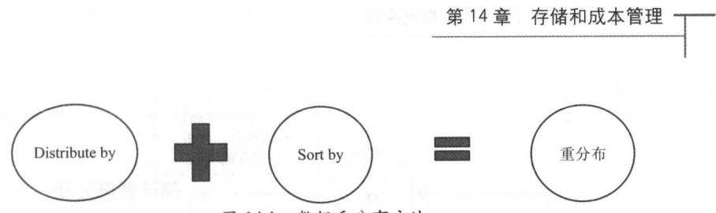

14.1 数据重分布方法

数据重分布效果的波动比较大,这主要眼数据表中宇段的重复值、 字段本身的大小、其他宇段的具体分布有一定 的关系, 般我们会筛选 出重分布效果高于 15% 表进行优化处理。

重分布前后一些底层大表的效果对比如表 14.2 所示。

| 表名      | 重分布前      | <br>重分布后     | <br>节约存储     | <br>节约比例    |
|---------|-----------|--------------|--------------|-------------|
| Table A | I 7.6TB   | I<br>12.52TB | I<br>TB      | I<br>28.8%  |
| Table B | 10.7TB    | I<br>4.4TB   | I<br>6.3TB   | I"<br>03    |
| Table C | I I .54TB | I<br>8.645TB | I<br>2.898TB | I<br>23. I% |

# 14.3 存储泊理顶优化

阿里巴巴数据仓库在资源管理的过程中,经过不断地实践,慢慢摸 索出一套适合大数据的存储优化方法,在元数据的基础上,诊断、加工 成多个存储治理优化项。目前已有的存储治理优化项有未管理表、 空表 最近 <sup>62</sup> 天未访问表、数据无更新无任务表 、数据无更新有任务表、开 发库数据大于 lOOGB 且无访问表、长周期表等。通过对该优化项的数 据诊断 形成治理项,治理项通过流程的方式进行运转、管理,最终推 动各个 TL 发人员进行操作,优化存储管理,并及时回收优化的存 储效果。在这个体系下,形成现状分析、 问题诊断、管理优化、效果反 馈的存储治理项优化的闭环。通过这个闭环,可以有效地推进数据存储 的优化,降低存储管理的成本。

存储治理项优化的主要流程如图 14.2 所示。

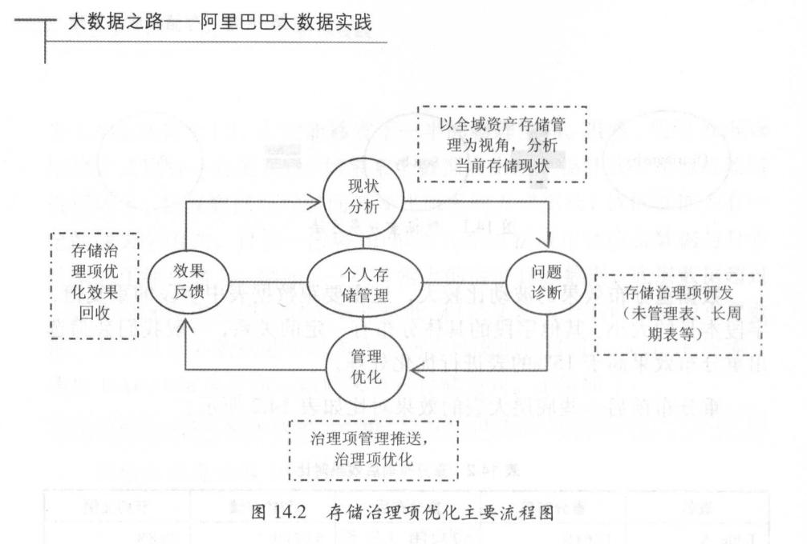

### 14.4 生命周期管理

Max Compute 作为阿里巴巴集团的大数据计算及服务引擎,存储着 阿里系大量且非常重要的数据,从数据价值及数据使用性方面综合考虑, 数据的生命周期管理是存储管理的 项重要手段。生命周期管理的根本 目的就是用最少的存储成本来满足最大的业务需求,使数据价值最大化。

# 14.4.1 生命周期管理策略

# 1 .周期性删除策略

所存储的数据都有 定的有效期,从数据创建开始到过时,可以周 期性删除 天前的数据。例如对于 MySQL 业务库同步到 MaxCompute 的全量数据,或者 过程产生的结果数据,其中某些历史数据可能 已经没有价值,且占用存储成本,那么针对无效的历史数据就可以进

# <sup>14</sup> 章存储和成本管 寸一

定期清理。

# 彻底删除策略

无用表数据或者 ETL 过程产生的临时数据,以及不需要保留的数 据,可以进行及时删除,包括删除元数据。

# 永久保留策略

重要且不可恢复的底层数据和应用数据需要永久保留。比如底层交 易的增量数据,出于存储成本与数据价值平衡的考虑,需要永久保留, 用于历史数据的恢复与核查。

# 极限存储策略

极限存储可以超高压缩重复镜像数据,通过平台化配置手段实现透明 访问:缺点是对数据质量要求非常高,配置与维护成本比较高,建议一个 分区有超过 5G 的镜像数据(如商品维表、用户维表)就使用极限存储。

# 冷数据管理策略

冷数据管理是永久保留策略的扩展。永久保留的数据需要迁移到冷 数据中心进行永久保存,同时将 MaxCompute 中对应的数据删除。一般 将重要且不可恢复的、占用存储空间大于 lOOTB ,且访问频次较低的数 据进行冷备,例如 年以上的日志数据。

# merge 表策略

对于某些特定的数据,极限存储在使用性与存储成本方面的优势不 是很明显,需要改成增量同步与全量 erge 的方式,对于对应的 delt 增量表的保留策略,目前默认保留 <sup>93</sup> 天。例如,交易增量数据,使用 订单创建日期或者订单结束日期作为分区,同时将未完结订单放在最大 分区中,对于存储,一个订单在表里只保留一份;对于用户使用,通过 分区条件就能查询某一段时间的数据。

# 14.4.2 通用的生命周期管理矩阵

随着业务的发展和不断的数据实践,我们慢慢摸索出 套适合大数 据生命周期管理的规范,主要通过对历史数据的等级划分与对表类型的 划分生成相应的生命周期管理矩阵。

# 历史数据等级划分

目前我们对历史数据进行了重要等级的划分,主要将历史数据划分 PO Pl P2 P3 四个等级,其具体定义如下。

- PO :非常重要的主题域数据和非常重要的应用数据,具有不可恢 复性,如交易、日志、集团 KPI 数据、 IPO 关联表。
- Pl :重要的业务数据和重要的应用数据,具有不可恢复性,如 要的业务产品数据。
- P2 :重要的业务数据和重要的应用数据,具有可恢复性,如交易 ETL 产生的中间过程数据。
- P3 不重要的业务数据和不重要的应用数据,具有可恢复性,如 某些 SNS 产品报表。

# 表类型划分

( 1) 事件型流水表(增量表)

事件型流水表(增量表)指数据无重复或者无主键数据,如日 志。

(2 )事件型镜像表(增量表)

事件型镜像表(增量表)指业务过程性数据,有主键,但是对于同 样主键的属性会发生缓慢变化,如交易、订单状态与时间会根据业务发 生变更。

(3 )维表

维表包括维度与维度属性数据,如用户表、商品表。

(4) Merge 全量表

Merge 全量表包括业务过程性数据或者维表数据。由于数据本身有

新增的或者发生状态变更,对于同样主键的数据可能会保留多份,因此 可以对这些数据根据主键进行 Merge 操作,主键对应的属性只会保留最 新状态 ,历史状态保留在前一天分区 中。例如,用户表、交易表等都可 以进行 Merge 操作。

( 5) ETL 临时表

ETL 临时表是指 ETL 处理过程中产生的临时表数据,一般不建议 保留,最多 天。

(6) TT 临时数据

TT 拉取的数据和 DbSync 产生的临时数据最终会流转到 DS 层, ODS 层数据作为原始数据保留下来,从而使得 TT&DbSync 上游数据成 为临时数据。这类数据不建议保留很长时间,生命周期默认设置为 <sup>93</sup> ,可以根据实际情况适当减少保留天数。

(7 )普通全量表

很多小业务数据或者产品数据, BI 般是直接全量拉取 ,这种方 式效 快,对存储压力也不是很大,而且表保留很长时间,可以根据历 史数据 级确定保留策略。

通过上述历史数据等级划分与表类型划分,生成相应的生命周期管 理矩阵 ,如 14.3 示。

|     |                   | PO             | P1              | P2              | P3            |
|-----|-------------------|----------------|-----------------|-----------------|---------------|
|     | 件型流水表(增<br>fl± 表) | 永久保留           |                 | 365             | 180           |
|     | 件型镜像表(增<br>表)     | 永久保留           |                 | 365             | 80            |
| ODS | 维表(全              | +极<br>33<br>存储 | +极限<br>33<br>存储 | +极限<br>33<br>存储 | 33<br>+极<br>存 |
|     | :L<br>Merge       |                |                 |                 |               |
|     | 普通全盘表             |                | 365             | 365             | 180           |
|     | 新同步全显表            |                |                 |                 |               |

<sup>14</sup> 生命周期管理矩阵

|       |                 |                |                  |                  | 续表         |
|-------|-----------------|----------------|------------------|------------------|------------|
|       |                 | PO             | P1               | P2               | P3         |
|       | 事件型流水表(增<br>量表) | 永久保留           |                  | 365              | 80         |
| DWD   | 事件型镜像表(增<br>量表  | 永久保留           |                  | 365              |            |
|       | 维表<br>全量表)      | 33<br>极限<br>存储 | 33<br>天+极限<br>存储 | 33<br>天+极限<br>存储 | 天+极限<br>存储 |
|       | 普通全盘表           |                | 365              | 365              | 80         |
| WS    | 各粒度数据           | 永久保留           |                  |                  |            |
|       | ET<br>临时表       |                |                  |                  |            |
| 临时存储区 | 临时数据            |                |                  |                  |            |
|       | 运营报表            | 永久保留           |                  |                  |            |
| 应用层   | 对外数据            |                |                  |                  |            |
|       | 内部产品            |                |                  |                  |            |

Ma<sup>x</sup>Compute 集群中海量数据的存储和大 计算任务每 巨额戚本,并且随着数据量的不断增长,这个成本还在逐步增加 在服务好业务 前提下,更好地管控数据成本,提升 源利用 已成 为数据资产管理工作中非常重要的

在阿里巴巴集团内部,大部分数据都会存储在 pute 集群 上,数据以数据表的形式存在,并且数据 之间存在比较复 上下游依赖关系。可以把数据表之间的依赖 系用树形结 形象化地 如图 所示。图中的 代表 同的数据 ,带箭头 连线代表数据表之间的依赖和关联 比如数据 都依 数据表 ,数据表 依赖数据表

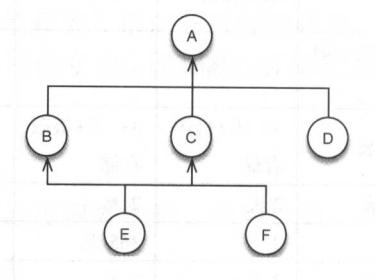

MaxComput 据农依赖关系示

Iii.. 282

Max Compute 中的任何 个计算任务都会涉及计算和存储资源的消 耗,其中计算资源的消耗主要考虑 PU 消耗。为了下面更好地描述数 据计量计费的算法和规则,特做如下定义 CPU 消耗的单位定义为 CU, 代表 PU 个核心( Core )运行一天的消耗量。存储资源的消耗主 要考虑磁盘存储的消耗,这里采用国际通用的存储单位 PB 来衡量。例 如:计算资源的单价为 元/CU ,存储资源的单价为 PB 天。

# 14.5 数据成本计量

对数据成本的计量,可以采用最简单的方式,将一个数据表的成本 分为存储成本和计算成本。存储成本是为了计量数据表消耗的存储资 源,计算成本是为了计量数据计算过程中的 PU 消耗。但是,对这样 的数据成本计量方式会存在较大的质疑和挑战。例如,如图 14.4 示, 是业务方的一个数据表 ,表 依赖表 ,但是为了产生表 ,往 往上面存在一个较长的数据刷新链路。表 的成本可能是 <sup>10</sup> 元,但是 可能会是 <sup>100</sup> 元。像这样的情况,如果表 的成本仅仅用 数据 自身 的存储和计算成本衡量显然是不合理、不准确的。

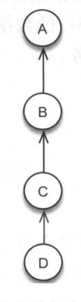

14.4 数据刷新链路示意图

因此,在计量数据表的成本时,除考虑数据表本身的计算成本、存 储成本外,还要考虑对上游数据表的扫描带来的扫描成本。我们将数据 成本定义为存储成本、计算成本和扫描成本 个部分。

通过在数据成本计量中引人扫描成本的概念,可以避免仅仅将表自 身硬件资源的消耗作为数据表的成本,以及对数据表成本进行分析时, 孤立地分析单独的一个数据表,能够很好地体现出数据在加工链路中的 上下游依赖关系,使得成本的评估尽量准确、公平、合理

# 14.6 数据使用计费

在上 节中,已经清楚地将数据成本分为:存储成本、计算成本和 扫描成本。那么对于数据表的使用计费,在阿里巴巴集团内部,分别 据这 部分成本进行收费,称为:计算付费、存储付费和扫描付费

我们把数据资产的成本管理分为数据成本计 和数据使用计费 个步骤。通过成本计量,可以比较合理地评估出数据加工链路中的成 从成本的角度反映出在数据加工链路中是否存在加工复杂、链路过长、 依赖不合理等问题,间接辅助数据模型优化,提升数据整合效 ;通 数据使用计费,可以规范下游用户的数据使用方法,提升数据使用 效率, 从而为业务提供优质的数据服务。

# 数据质量

随着 IT DT 时代的转变,数据的重要性不言而喻,数据的应用 也日趋繁茂,数据正扮演着一个极其重要的角色。而对于被日益重视的 数据,如何保障其质量也是间里巴巴乃至业界都普遍关注的一个话题。 本章将介绍阿里巴巴如何保障数据仓库的数据质量。

数据质量是数据分析结论有效性和准确性的基础,也是这一切的前 提。如何保障数据质量,确保数据可用性是阿里巴巴数据仓库建设不容 忽视的环节。接下来将通过数据质量原则逐一展开介绍阿里巴巴对数据 仓库数据质量建设的方法。

# 15.1 数据质量保障原则

如何评估数据质量的好坏,业界有不同的标准,而阿里巴巴对数据 仓库主要从四个方面进行评估,即完整性、准确性、一致性和及时性, 如图 15.1 所示。


数据质量保障原则

### 1 完整性

一一「大数据之路一一阿里巴巴大数据实践

完整性是指数据的记录和信息是否完整,是否存在缺失的情况。数 据的缺失主要包括记录的缺失和记录中某个字段信息的缺失,两者都 造成统计结果不准确,所以说完整性是数据质量最基础的保障。比如 易中每天支付订单数都在 万笔左右,如果某天支付订单数突然下降 万笔,那么很可能就是记录缺失了。对于记录中某个 段信息的缺 失,比如订单的商品 、卖家 都是必然存在的,这些 段的 数肯定是 旦大于 就必然违背了完整性约束。

# 准确性

准确性是指数据中记录的信息和数据是否准确,是否 在异常或 错误的信息。比如 笔订单如果出现确认收货金额为负值,或者下单时 间在公司成立之前,或者订单没有买家信息 ,这些必然都 有问题的 如何确保记录的准确性,也是保障数据质 必不可少的 个原则

一致性

致性 般体现在跨度很大的数据仓库体系中,比如阿里巴巴数据 仓库,内部有很 业务数据仓库分支,对于同 份数据,必须保证一致 性。例如用户 ,从在线业务库加 到数据仓库,再到各个消费节点,

<sup>15</sup> 章数据 量丁一

必须都是同 种类型,长度也需要保持一致。所以,在建设阿里巴 据仓库时,才有了公共层的加工,以确保数据的一致性。

# 及时性

在确保数据的完整性、准确性和一致性后,接下来就要保障数据能 够及时产出,这样才能体现数据的价值。一般决策支持分析师都希望当 天就能够看到前一天的数据,而不是等 五天才能看到某 个数据分析 结果 :否则就已经失去了数据及时性的价值,分析工作变得毫无意义。 现在对时间要求更高了,越来越多的应用都希望数据是小时级别或者实 时级别的。比如阿里巴巴"双 "的交易大屏数据,就做到了秒级, 及时性同样是保障数据质量的一个重要原则。

# 15.2 数据质量万法概述

在间里巴巴数据仓库建设过程中,经过不断的实践,慢慢摸索出一 套适合大数据的数据质量方法,在满足以上四个原则的基础上,为阿里 巴巴数据做基础保障。

阿里巴巴业务复杂,种类繁多的产品每天产生数以亿计的数据,每 天的数据量都在 PB 级以上,而数据消费端的应用又层出不穷,各类数 据产品如雨后春笋般出现。为了不断满足这些数据应用的需要,数据仓 的规模在不断膨胀,同时数据质量的保障也越来越复杂。基于这些背 景,我们提出了一套数据质量建设方法,如图 5.2 所示。

这套方法主要包括如下几个方面。

# 1 消费场景知晓

消费场景知晓部分主要通过数据资产等级和基于元数据的应用链 路分析解决消费场景知晓的问题。根据应用的影响程度 确定资产等级

# 一寸大数据之路一一阿里巴巴大数据实践

根据数据链路血缘,将资产等级上推至各数据生产加工的各个环节,确 定链路上所涉及数据的资产等级和在各加工环节上根据资产等级的不 同所采取的不同处理方式。

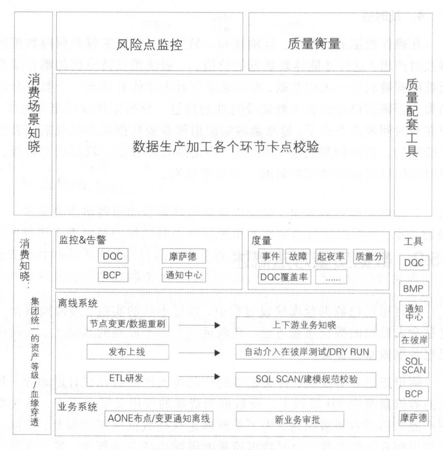

数据质量建设方法

# 数据生产加工各个环节卡点校验

数据生产加工各个环节卡点校验部分主要包括在线系统和离线 统数据生产加工各个环节的卡点校验。其中在线系统指 OLT (On-Line Transaction rocessi ,联机事务处理)系统;离线系统指 OLA (On-Line Analytical Pro cess ng ,联机分析处理)系统。

## <sup>15</sup> 章数据质量丁一

在线系统生产加工各环节卡点校验主要包括两个方面 :根据资产等 级的不同,当对应的业务系统变更时,决定是否将变更通知下游;对于 高资产等级的业务, 当出现新业务数据时,是否纳入统计中,需要卡点 审批。

离线系统生产加工各环节卡点校验主要包括代码开发、测试、发布 和历史或错误数据回刷等环节的卡点校验,针对数据资产等级的不同, 对校验的要求有所不同。

## 风险点监控

风险点监控部分主要是针对在数据日常运行过程中可能出现的数 据质量和 时效等问题进行监控,包括在线数据和离线数据的风险点监控 两个方面。在线数据的风险点监控主要是针对在线系统日常运行产出的 数据进行业务规则的校验 ,以保证数据质量,其主要使用实时业务检测 平台 BCP (Biz Check Platform ); 离线数据的风险点监控主要是针对离 线系统日常运行产出的数据进行数据质量监控和时效性监控,其中数据 质量监控主要使用 DQC 时效性监控主要使用摩萨德。

## 4. 质量衡量

对质量的衡量既有事前的衡量,如 DQC 覆盖率;又有事后的衡量, 主要用于眼进质量问题,确定质量问题原因、责任人、解决情况等,并 用于数据质量的复盘,避免类似事件再次发生。根据质量问题对不同 级资产的影响程度,确定其是属于低影响的事件还是具有较大影响的故 障。质量分则是综合事前和事后的衡量数据进行打分。

# 质量配套工具

针对数据质量的各个方面,都有相关的工具进行保证,以提高效能。 接下来将对数据质量保障的各个方面进行介绍。

# 15.2.1 消费场景知晓

在数据快速增长的情况下,数据类产品和日常决策支持系统也应运

而生,且层出不穷,而对于数据不断增加的需求,数据仓库已经应接不 暇,数据研发工程师已经难以确认几百 的数据到底是否都是重要的, 是否都要进行保障 是否有一些数据已经过期了,是否所有需要都要精 确地进行质量保障,上述数据质量保障的四个原则是否还适用于所有的 数据……这些疑问伴随着每一个数据开发人员。数据规模的膨胀考验数 据质量的原 ,同时也是对数据加工的考验。基于不断膨胀的数据和对 数据类的应用,间里巴巴内部提出了数据资产等级的方案,旨在解决消 费场景知晓的问题。

# 1 .数据资产等级定义

什么是数据资产等级?针对阿里巴巴庞大的数据仓库,数据的规模 已经达到 级别,对于这么大的数据量,如果 概而论势必会造成精 力无法集中、保障无法精确,因此给数据划分等级势在必行。经过不断 地地讨论和研究,最终将数据分为五个等级,即毁灭性质、全局性质、 局部性质、 般性质和未知性质,不同性质的重要性依次降低,具体定 义如下。

- 毁灭性质,即数据 旦出错,将会引起重大资产损失,面临收益损失,造成重大公关风险。
- 全局性质,即数据直接或者间接用于集团级业务和效果的评估、 重要平台的运维、对外数据产品的透露、影响用户在阿里系网站 的行为等。
- 局部性质,即数据直接或间接用于内部一般数据产品或者运营/ 产品报告,如果出现问题会给事业部或业务线造成影响,或者造 成工作效率损失。
- ·一般性质,即数据主要用于小 的日常数据分析,出现问题几 不会带来影响或者带来的影响极小。
- 未知性质,不能明确说出数据的应用场景,则标注为未知。

对于不同的数据资产等级使用英文 进行标记,毁灭性质标记 等级,全局性质标记为 等级,局部性质标记为 等级, 性质标记为 等级,未知性质则标记为 等级。在重要程度上,

<sup>15</sup> 章数据质量丁一

A A2>A3>A4 Ax 。另外,如果一份数据 出现在多个应用场景中,则 遵循就高原则。

# 2. 数据资产等级落地方法

前面已经给出了数据资产等级的定义,但是对于如此庞大的数据 量, 如何给峰 份数据都打上 个等级标签呢?这里首先介绍数据的简 单流转过程。

数据是从业务系统中产生的,经过同步工具进入数据仓库系统中 在数据仓库中进行 般意义上的清洗、加工、整合、算法、模型等 列运算后,再通过同步工具输出到数据产品 中进行消费。而从业务系统 到数据仓库再到数据产品都是以表的形式体现的,其流转过程如图 15.3 所示。


同步到数据仓库(对应到阿里巴巴就是 MaxCompute 平台)中的都 是业务数据库的原始表,这些表主要用于承载业务需求,往往不能直接用 在数据产品 中,在数据产品中使用的都是经过数据仓库加工后的产出表。

有了数据产品或者数据应用的概念,同 时也知道了哪些表是为哪个 数据产 品或者 用服务的,就可以借助强大的元数据知道整个数据仓库 中的哪些表服务于这个数据产品,因 此通过给不同的数据产品或者应用 划分数据资产等级,再依托元数据的上下游血缘,就可以将整个消费链 路打上某一类数据资产的标签 ,这样就可以将数以亿计的数据进行分类 了。关于元数据的加工计算详见第 <sup>12</sup> 章"元数据"。

这里以阿里巴巴生意参谋产品(见"数据应用篇 "介绍)为例,简 单介绍数据资产等级打标的过程。生意参谋是一款为商家提供服务的数 据类产品,完全依托数据,为商家进行决策支持。 它每天零点开始同步, 计算前一天的数据, :00 给到商家,提供服务。产品每一个页面的每

个模块基本上都是通过数据表输出展现的,不同模块数据的重要等级也 就决定了相关表的重要等级,决定了这个导出表的重要等级。比如生意 参谋为 A2 等级的业务,那么对应这个导出表的资产等级就是 A2 ,所 有加工这个表的上游链路上的所有表都将会打上 A2 资产等级的标签, 同时会标注为生意参谋产品使用。如图 15.4 所示,生意参谋打上了 A2 的标记 直接服务于生意参谋的表 Tabl el Table2 Table3 进行 A2 意参谋标记,根据血缘上溯,这 个表的上游都将打上 A2 的标记, 直标记到前台业务系统,将血缘贯通。

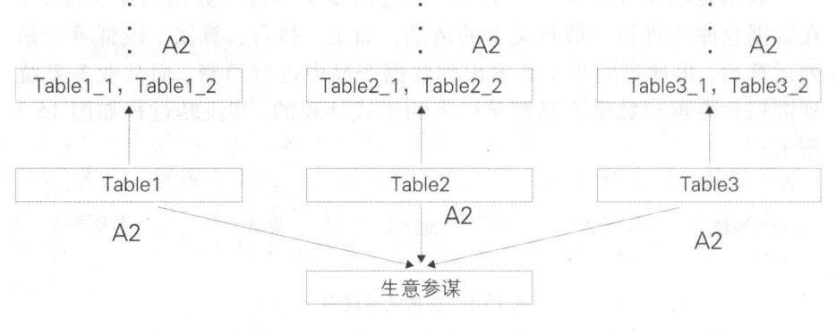

A2

15.4 生意参谋产品打标过程

通过如上步骤,就完成了数据资产等级的确认,给不同的数据定义 了不同的重要程度,当然这里是需要元数据支撑的。

解决了消费场景知晓的问题,就知道了数据的重要等级,针对不同 的等级 也将采取不同的保障措施。接下来将介绍阿里巴巴在数据仓库 中针对不同资产等级的数据的保障方法。

# 15.2.2 数据加工过程卡点校验

# 1 .在线系统卡点校验

在线系统数据加工过程卡点校验,主要是指在在线业务系统的数据

<sup>15</sup> 章数据质量丁一

生成过程中进行的卡点校验。阿里巴巴 OLTP 系统比较丰富,也比较 复杂, 比如交易、会员、商品、营销、评价、 退款、客服等,这些服务 于用户购物 的在线业务系统,既满足了用户日常需求,也是数据仓库的 数据来源,因此既要保障数据的准确性 ,同时也要保障和离线数据的

关于对数据准确性的保障 ,主要以数据监控为主,在 <sup>15</sup> 2.3 节"风 险点监控"中进行介绍。本节主要介绍在线数据和离线数据一致性的保 障问题。

在线业务复杂多变,总是在不断地变更,每一次变更都会带来数据 的变化,数据仓库需要适应这多变的业务发展,及时做到数据的准确性。 基于此,在线业务的变更如何高效地通知到离线数据仓库,同样也是需 要考虑的问题。为了保障在线数据和离线数据的一致性,阿里巴巴在使 用数据仓库的不断摸索中总结出两个行之有效的方法:工具和人员双管 齐下。既要在工具上自动捕捉每一次业务的变化,同时也要求开发人员 在意识上自动进行业务变更通知。

工具,首先是发布平台。在业务进行重大变更时,订阅这个发布过 然后给到离线开发人员,使其知晓此次变更的内容。业务系统繁杂, 日常发布变更数不胜数,如果每一次变更都要知会离线业务,那势必会 造成不必要的浪费 ,同时会影响在线业务迭代的效率。因此这里充分发 挥了数据资产等级的作用,针对全集团重要的高等级数据资产,整理出 哪些变更会影响数据的加工。比如财报,这个自然是 Al 等级的资产, 如果业务系统的改造会影响财报的计算,如约定好的计算口径被业务系 统发布变更修改了 ,那么务必要告知离线业务,作为离线开发人员也必 须主动关注这类发布变更信息。所以发布平台集成了通知功能,针对重 要的场景发布会进行卡点,确认通知后才能完成发布。

其次是数据库表的变化感知。无论是随着业务发展而做的数据库扩 容还是表的 DDL 变化,都需要主动通知到离线开发人员。数据仓库在 进行数据抽取时,采用的是 DataX 工具,可能限制了某个数据库表,如 果发生数据库扩容或者迁移, DataX 工具是感知不到的,结果可能就会 导致数据抽取错漏,影响一系列的下游应用。对此,阿里巴巴是通过数 据库平台进行库表变更通知发送的。

有了好的工具的辅助,而操作工具的开发人员更是核心。数据资产 等级的上下游打通,同样也要将这个过程给到在线开发人员,使其知晓 哪些是重要的核心数据资产,哪些暂时还只是作为内部分析数据使用 要提高在线开发人员的意识,通过培训,将离线数据的诉求、离线数据 的加工过程、数据产品的应用方式告诉在线业务开发人员,使其意识到 数据的重要性,了解数据的价值,同时也告知出错后果,使在线开发人 员在完成业务目标时,也要注重数据的目标,做到业务端和数据端

阿里巴巴的数据仓库通过这种机制,在很大程度上保障了第 手数 据的准确性。但是业务、技术都在不断快速地发展着,我们也在不断地 摸索更高效、更准确的在线业务保障方案,为在线数据质量保驾护航。

# 离线系统卡点校验

前文己有介绍,数据从在线业务系统到数据仓库再到数据产品的过 程中,需要在数据仓库这 层完成数据的清洗、加工。正是有了数据的 加工,才有了数据仓库模型和数据仓库代码的建设。如何保障数据加 过程中的质量,是离线数据仓库保障数据质量的一个重要环节。

首先是代码提交时的卡点校验。数据研发人员素质不同,代码能力 也有差异,代码质量也就难以得到高效保障。在此背景下,我们上线了 代码扫描工具 QLS CA ,针对每一次提交上线的代码进行扫描,将风 险点提示出来。具体规则已经在第 章"离线数据开发"中进行了介绍。

其次是任务发布上线时的卡点校验。为了保障线上数据的准确性, 每一次变更都需要线下完成测试后再发布到线上环境中,线上测试通过 后才算发布成功。发布上线前的测试主要包括 Co Review 和回归测 试,对于资产等级较高的任务变更发布,则采取强阻塞的形式,必须通 过在彼岸完成回归测试之后才允许发布。回归测试一方面要保证新逻辑 的正确:另一方面要保证不影响非此次变更的逻辑。发布上线后可以在 线上做 Dr Run 测试或真实环境运行测试,其中 ry 测试,不执行 代码,仅运行执行计划,避免线上和线下环境不 致导致语法错误; 实环境的运行测试,则使用真实数据进行测试。

最后是节点变更或数据重刷前的变更通知。一般建议使用通知中心 的将变更原因、变更逻辑、变更测试报告和变更时间等自动通知下游, 下游对此次变更没有异议后 ,再按照约定时间执行发布变更,将变更对 下游的影响降至最低。

# <sup>15</sup> 2.3 风险点监控

风险点监控主要是针对数据在日常运行过程中容易出现的风险进 行监控并设置报警机制,主要包括在线数据和离线数据运行风险点监 控。

# 1. 在线数据风险点监控

在线业务系统的数据生产过程需要保证数据质量,主要根据业务规 则对数据进行监控。阿里巴 主要采用实时业务检测平台 BCP ,用于保 障在线系统的数据质量。

BCP 针对数据库表的记录进行规则校验。在每一个业务系统中,当 完成业务过程进行数据落库时, BCP 同时订阅 份相同的数据,在 BCP 系统中进行逻辑校验,当校验不通过时,以报警的形式披露出来给到规 则订阅人,以完成数据的校对。所以,采用 BCP 进行校验的过程是, 首先,用户在 BCP 平台进行数据源订阅,以获取需要校验的数据源: 然后 ,针对所订阅的数据源进行规则的编写,即校验的逻辑,这些规则 是至关重要的,也是校验的核心,只要这些规则通过了,即认为这条记 录是对的 :最后,配置告警,针对不同的规则配置不同的告警形式。有 了这样一套流程,就能够在第一时间发现脏数据并通知到订阅人,既减 少了用户数据错误的投诉,也减少了离线数据错误的回滚。 BCP 在很大 程度上减少了脏数据,为数据的准确性把了第一道关。

比如交易系统配置的一些监控规则,如订单拍下时间、订单完结时 间、订单支付金额、订单状态流转等都配置了校验规则。订单拍下时间 肯定不会大于当天时间,也不会小于淘宝创立时间,一旦出现异常的订 单创建时间,就会立刻报警,同时报警给到多人。通过这种机制,可以 及时发现并解决问题。 BCP 的配置和运行成本较 主要根据数据资产 等级进行监控。

# 2. 离线数据风险点监控

离线数据风险点监控主要包括对数据准确性和数据产出及时性的 监控。

(1 )数据准确性

数据准确性是数据质量的关键,因此数据准确成为数据质量的重中 之重,是所有离线系统加工时的第 保障要素。阿里巴巴主要使用 DQC 来保障数据的准确性,其具体功能说明和规则配置可以参考第 章"离 线数据开发"中的内容。

DQC 查其实也是运行 SQL 任务,只是这个任务是嵌套在主任务 中的, 旦检查点太多自然就会影响整体的性能,因此还是依赖数据 产等级来确定规则的配置情况。比如 Al A2 类数据监控率要达到 90% 以上,规则类型需要 种及以上,而不重要的数据资 则不强制要求。

类似的规则都是由离线开发人员进行配置来确保数据准确性的。当 然不同的业务还是会有业务规则的约束,这些规则来源于数据产品或者 说消费的业务需求,由消费节点进行配置,然后上推到离线系统的起点 进行监控,做到规则影响最小化。

(2 )数据及时'性

在确保数据准确性的前提下,需要进一步让数据能够及时地提供服 否则数据的价值将大幅度降低,甚至没有价值,所以确保数据及时 性也是保障数据质量重中之重的 环。

对于阿里巴巴大部分离线任务, 般是以天作为时间间隔的 。对于 天任务,数据产品或者管理层决策报表 般都要求在每天 9:00 至更 早的时间产出。为确保前一天的数据完整,天任务是从零点开始运行的 由于计算加工的任务都是在夜里运行的,而要确保每天的数据能够按时 产出,则需要进行一系列的报警和优先级设置,使得重要的任务优先且 正确产出。这里的重要性即前面所述的数据资产等级,资产等级高的业 务必定优先保障。

①任务优先级。如何确保重要任务获得高优先级,是调度平台需要 重点考虑的问题。如前文所述,调度是一个树形结构,当配置了叶子节 点的优先级后,这个优先级会传递到所有上游节点,所以优先级的设置 都是给到叶子节点,而叶子节点往往就是服务业务的消费节点。因此在 优先级的设置上,首先是确定业务的资产等级,等级高的业务所对应的 消费节点自然配置高优先级,一般业务则对应低优先级,确保高等级业

①任务报警。任务报警和优先级类似,也是通过叶子节点传递。任 务在运行过程中难免会出错,因此要确保任务能够高效、平稳地执行, 需要 个监控报警系统,对于高优先级的任务,一旦发现任务出错或 者可能出现产出延迟,就要报警给到任务和业务 Owner。阿里巴巴使用 自主开发的监控报警系统一一摩萨德来监控任务的实时运行状况,若发 现异常则执行不同等级的报警 ,根据不同的资产等级执行强保障或弱保 障。高资产等级的业务才会获得强保障 ,任务出错或可能延迟则执行电 话报警 般业务只会做到短信或者邮件告警。

③摩萨德。摩萨德是离线任务的监控报警系统,它会根据离线任务 的运行情况实时决策是否告警、 何时告 、告警方式、告警给谁等。摩 萨德经过几年的发展,目前已经 比较成熟,是数据运维不可或缺的保障 工具。摩萨德提供了两个最主要的功能:强保障监控和自定义告警。

强保障监控是摩萨德的核心功能,也是紧紧围绕运维目标即业务保 障而设计的,只要在业务的预警时间受到威胁,摩萨德就一定会告警出 来给到相关人员。强保障监控主要包括

- 监控范围一一设置了强保障业务的任务及其上游所有的任务都 会被监控。
- 监控的异常一一任务出错、任务变慢、预警业务延迟。
- ·告警对象一一默认是任务 Owner ,也可以设置值班表到某 个人。
- 何时告警一一根据业务设置的预警时间判断何时告警。
- ·告警方式一一根据任务的重要紧急程度,支持电话、短信、旺旺、 邮件告警。

比如生意参谋业务,定义的数据资产等级是 A2 ,要求早上 9:00 出数据给到商家,因此我们给生意参谋业务定义一个强保障监控,业务 产出时间是 9:00 ,业务预警时间是 7:00 。这里的预警时间是指一旦摩萨 德监控到当前业务的产出时间超出预警时间时就会打电话给到值班人 员进行预警,比如摩萨德推测生意参谋的产出时间要到 7:30 ,那么电话 告警就出来了,由值班人员来判断如何加速产出。那么是怎样判断当前 执行会超过预警时间的呢?摩萨德是根据当前业务上所有任务最近 天运行的平均时间来推算的,虽然有误判的可能性,但是总体还是非常 准的,可以接受。这个是预警判断,也就是产出延迟判断。

另外还有出错报警,当重要业务比如生意参谋产出路径上有个任务 运行出错了,此时摩萨德依然会根据预警时间判断要不要马上报警给到 值班人员。这里注意,出错报警的时机也是根据产出预警时间来判断的, 对于生意参谋而言,夜里一旦任务出错肯定是要立即报警的,因为产出 要求早,容不得推迟:而对于不重要的业务即资产等级低的业务或者 出时间要求晚的业务,摩萨德则会根据预警时间来判断合适的报警时间 点,比如算法类的业务需求,可能当天产出即可,那么摩萨德会根据预 警时间,将出错报警时间推迟到 9:00 以后,即上班了再报警,以减轻 值班人员的夜里负担。

除了针对业务的强保障监控,还有自定义监控。自定义监控是摩萨 德比较轻量的监控功能,用户可以根据自己的需要进行配置,主要包括:

- 出错告警一一可根据应用、业务、任务三个监控对象进行出错告 警配置,监控对象出错即告警给到人/Owner/值班表。
- ·完成告警一一可根据应用、业务、任务三个监控对象进行完成情 况告警配置,监控对象完成即告警给到 Owner/值班表。
- ·未完成告警一一可根据应用、业务、任务三个监控对象进行未完 成情况告警配置,监控对象未完成即告警给到人/Owner/值班衰。
- 周期性告警一一针对某个周期的小时任务,如果在某个时间未完 成, ep 告警给到人/Owner 值班表。
- 超时告警一 根据任务运行时长进行超时告警配置,任务运行超 过指定时间即告警给到人 Owner/值班表。

# <sup>15</sup> 章数据质量寸一

有时候是非重要业务的某个任务,但任务 Owner 还是想看一下产 出情况,此时就可以设置自定义告警。比如生意参谋业务,因为预警时 间都是定在业务上的,如果其中某个表 Owner 希望每天都能监控产出 时间,此时就可以自定义一个监控,监控这个任务的产出时间,当然如 Owner 认为这个表一定要 2:00 产出, :00 没有产出则电话告警,也 是可以的,灵活性比较大。

另外,摩萨德提供了甘特图的服务,针对业务的运行情况,摩萨德 会提供一条关键路径 ,即完成业务的最慢任务链路图。因为每个业务上 游可能有成千上万个任务,所以这条关键路径对于业务链路优化来说非 常重要。

通过这一系列的报警监控机制,摩萨德能够很好地服务于业务产 出,保障业务产出的及时性。

# 15.2.4 质量衡量

前面章节中已经给出了阿里巴巴对保障数据仓库数据质量的各种 方案 ,但是如何评价这些方案的优劣,需要 套度量指标。

# 数据质量起夜率

前文在介绍数据及时性时已经提到,数据产品或者管理层决策日报 般都要求在上午 9:00 之前提供,数据仓库的作业任务都是在凌晨运 行的 一旦数据出现问题就需要开发人员起夜进行处理。因此,每个月 的起夜次数将是衡量数据质量建设完善度的一个关键指标。如果频繁起 夜, 则说明数据质量的建设不够完善,所以在阿里巴巴数据仓库数据质 量度量体系里 ,起夜率是一个首先要考虑的指标。

对于数据质量本身,将通过数据质量事件和数据质量故障来衡量。

# 数据质量事件

针对每一个数据质量问题,都记录一个数据质量事件。

数据质量事件,首先,用来眼进数据质量问题的处理过程;其次, 用来归纳分析数据质量原因 第三,根据数据质量原因来查缺补漏,既 要找到数据出现问题的原因,也要针对类似问题给出后续预防方案。

因此,数据质量事件既用来衡量数据本身的质量,也用来衡量数据 链路上下游的质量,是数据质量的一个重要度量指针。

# 数据质量故障体系

对于严重的数据质量事件,将升级为故障。故障,是指问题造成的 影响比较严重,已经给公司带来资产损失或者公关风险。比如财报计算 错误、卖家结算数据错误、微贷信用数据错误、高管报表错误或者延迟 等都将带来恶劣的影响。此类数据质量问题 ,已经不仅仅是一个事件, 而是升级为故障。当然,数据质量故障对于开发人员和部门来讲,都是 一个重要考核点,因 此也是数据质量度量最严的 个指标。

数据从采集到最后的消费,整个链路要经过几十个系统,任何 环节出现问题,都会影响数据的产出,因此需要 种机制,能够将各团 队绑在一起,目标一致,形成合力,故障体系在这个背景下应运而生。 一旦出现故障,就会通过故障体系,要求相关团队第 时间眼进解决问 题,消除影响。

( 1) 故障定义

首先识别出重要的业务数据,并注册到系统中,填写相关的业务情 况,如技术负责人、业务负责人、数据应用场景、延迟或错误带来的影 响、是否会发生资产损失等,完成后,会将这部分数据的任务挂到平台 基线上,一旦延迟或错误即自动生成故障单,形成故障。

(2 )故障等级

故障发生后,会根据一定的标准判断故障等级,如故障时长、客户 投诉量、资金损失等,将故障按 pl p4 定级,各团队会有故障分的概 念,到年底会根据故障分情况来判断本年度的运维效果。

(3 )故障处理

故障发生后,需要快速地识别故障原因,并迅速解决,消除影响。

i.. 300

在处理故障的过程中 会尽快将故障的处理进度通知到相关方,尽可能 减少对业务的影响。

(4 )故障 Review

对于故障会进行 Review ,即分析故障的原因、处理过程的复盘、形 成后续解决的 Action ,并且都会以文字的形式详细记录,对故障的责任 进行归属,一般会到具体的责任人。注意,对故障责任的判定,不是为 了惩罚个人,而是通过对故障的复盘形成解决方案,避免问题再次发生。


# 数据应用篇

·第 <sup>16</sup> 章数据应用

# 数据应用

全球知名咨询公司麦肯锡称:"数据,已经 透到当今每 个行业 和业务职能领域,成为重要的生产要素。人们对于海 数据的挖掘和 用,预示着新 波生产率增长和消费者盈余浪潮的到来。"

本书在前面的章节中已经深人介绍了大数据建设与管理的方法 和实践,"生产要素"已经准备好,需要通过合适的方式提供给不同 型的用户,让数据最大化地发挥价值。阿里巴巴作为 家天然的大数据 公司,对数据的应用表现在各个方面,如搜索、推荐、广告、金融、 用、保险、文娱、物流等业务。将数据提供给商家,可以用于指导商 的数据化运营,为商家提供多样化、普惠性的数据赋能;将数据提供 阿里巴巴内部的搜索、推荐、广告、金融等平台,可以用于实现更好的 搜索体验、更精准的个性化推荐,优化购物体验,更精准地进行广告技 放、更普惠的金融服务等;将数据提供给阿里巴巴内部员工,如客服、 运营、产品经理和管理人员等,可以用于数据化运营和决策:同时,阿 里巴巴也将多年来的数据技术能力对外赋能, ISV 、研究机构和社会组 织可以利用阿里巴巴开放的数据能力和技术,进行经济发展、国内外打 假、工业制造等议题的研究和实践,从而促进社会经济、民生的发展等。

本章主要介绍两个应用:提供给外部商家使用的数据产品平台 生意参谋和服务于阿里巴巴内部的数据产品平台。

# 16.1 生意参谋

作为大数据公司,阿里巴巴在推动业务数据化的同时,也在不断地 帮助商家实现数据业务化。在对外产品方面,阿里巴巴主要以"生意参 谋"作为官方统一的数据产品平台,为商家提供多样化、普惠性的数据

截至 <sup>20</sup> 财年,生意参谋累计服务商家已超 <sup>000</sup> 万,月服务商家 <sup>500</sup> 万。在月成交额 <sup>30</sup> 万元以上的商家中,逾 在使用生意参谋; 在月成交额 <sup>00</sup> 万元以上的商家中,逾 每月登录天次超 次。

本节主要介绍生意参谋是什么,它主要为阿里生态下的商家提供哪 些数据服务,以及随着 时代全面来临,它将如何驱动商家重视数据 化运营,进而实现"数据赋能商家"这一重要理念。

# 16.1.1 背景概述

生意参谋诞生于 <sup>2011</sup> 年,最早是应用于阿里巴巴 市场的数据 工具, <sup>20</sup> <sup>10</sup> 月才正式进入淘系。

当时阿里淘系的数据产品曾一度多达到个,不同产品的统计方式 不同,相同指标在不同产品中的数据也有所差异,这给商家带来不少的 困扰。

为了保证用户体验,从 <sup>2014</sup> 年起,依托阿里巴巴内部的 On Dat 体系建设的、在数据一致性方面更具优势的生意参谋陆续整合量子恒 道、数据魔方等其他数据产品,并在 <sup>015</sup> 年年底升级为官方统一的商 家数据产品平台。由此,商家只要通过生意参谋一个平台,就能体验统 、稳定、准确的官方数据服务。

当然,长达两年的整合升级并不是简单地对多个数据产品进行功能 整合,而是在保留其核心功能的同时,对其进行优化,同时不断拓展新 平台的服务能力和服务范围。

在整合量子恒道时,同步推出大促活动看板、实时直播大屏、自助

取数等重要功能;在整合数据魔方时,推出功能定位相似的"市场行情", 还同步上线数据作战室这款风靡众多高端商家的大促直播利器·..

经过不断拓展,目前平台的数据巳覆盖淘宝、天猫等阿里系所有 台和 、无线等终端,涉及指标上千个。在产品功能方面,己拥有店 铺自有分析、店铺行业分析、店铺竞争分析三大基础业务模块。另外, 它还支持多个专题工具的使用和自助取数等个性化需求。

生意参谋产品理念如图 16.1 所示。

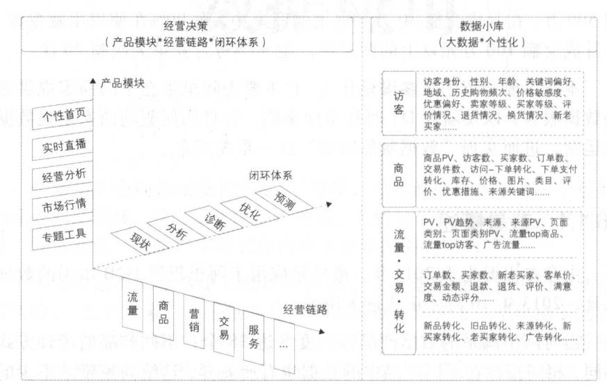

生意参谋产品理念图 16.1

<sup>2016</sup> 年,为进一步满足商家数据需求,阿里巴巴在门户、数据内 容、产品形态三个方面对生意参谋进行全新升级。

在门户方面,首页支持多岗多面、多店融合,商家可根据不同岗 需求,选择页面中出现哪些数据;在数据内容方面,加强商家中后台数 据突破,新增服务、物流等环节的数据服务,进一步满足商家全渠道 全链路的数据需求:在产品形态方面,更注重深度分析、诊断、建议 优化和预测。

随着网红经济的爆发,这 年,生意参谋还尝试了布局电商外领域

.... 306

## 意数据应用寸一

一一-与新浪微博、优酷等自媒体平台合作,推出生意参谋 版(含微 博版、优酷版)。网红或达人通过生意参谋,可了解自己的内容影响力、 粉丝用户画像、商家合作效果,商家也可通过平台了解网红引流效果, 从而更好地制定推广策略。

# 16.1.2 功能架构与技术能力

如上所述,生意参谋发展到今天,已经不是一个简单的数据产品或数 据工具,而是集合了此前集团的多个数据产品,同时包含数据作战室、市 场行情、装修分析、流量纵横、竞争情报等多个产晶在内的数据产品平台。

目前平台共有七个板块,除首页外,还有实时直播、经营分析、市 场行情、自助取数、专题工具、数据学院,如图 <sup>16</sup> .2 所示。不同板块 的数据不尽相同,但又彼此联系。从商家实际应用场景来看,这些数据 服务可以划分为三个维度,即看我情、看行情和看敌情。

| 首页   | <br>专属用户的个性化首页,可定串IJ<br>常用功能模块~合入口    |
|------|---------------------------------------|
|      |                                       |
| 实时直播 | <br>以店铺实时动态数据为切人点,提供实时数据的查询与分析;如数据作战室 |
| 经营分析 | <br>结合大环境,对经营全链路的各个环节进行分析、诊断等!如装修分析等  |
| 市场行  | 以行正以~入平'才些变哩哇二丁_                      |
|      |                                       |
| 自助取数 | 提供数据定制、查询、导出等离端数据服务、灵活可配置,周期可定制       |
| 专题工具 | 着重专细分析和一站式优化工具,含竞争情报、流量纵横等            |
|      |                                       |
|      |                                       |

<sup>16</sup> 生意参谋功能架构图

## 1 看我情

不管是哪一层级的商家,看数据 般都是优先关注自身店铺。如果

连自身数据都不关注,那么了解再多的行业数据和对手数据也无济 事。在一定程度上,分析"我情"是店铺数据化运营的根本。

在生意参谋上, 我情"的数据主要基于店铺经营全链路的各个环 节进行设计。以"经营分析"为例,这个板块依次为商家提供流量、商 品、交易、服务、物流、营销等不同环节的数据服务,不同服务还能再 往下细分,如在"流量分析"下,还会再提供流量地图、访客分析、 修分析等更细粒度的数据。基本上, 个访客从未进店到进店,再到 内流转,最终交易转化,转化后的评价和物流情况都可以通过"经 析" 站式获取。

### 2. 看行情

在线上零售环境竞争程度还不十分激烈的时候,店铺埋头苦干, 好内功,或许就能独辟蹊径,脱颖而出。但现在,随着线上线下不断融 合,有实力者不断人局,线上竞争日益加剧。在这个过程中,店铺要 运营好,就不得不经常关注行业动态了。只有知道外界在 注什么 、在 发生什么变化,才有可能把握市场动态,挖掘先机。

,生意参谋通过市场行情,为商家提供了行业维度的大盘 析,包括行业洞察、搜索词分析、人群画像等。其中,行业洞察可以 品牌、产品、属性、商品、店铺等粒度对本行业数据进行分析:通过 索词分析可以了解不同关键词的近日表现,从而反推消费者偏好;人群 画像能从人群维度人手,直接提供买家人群、卖家人群 搜索人群三大 人群的数据洞察信息。

# 看敌情

大家都知道 商场如战场,只有知己知彼,才能百战百胜,因此 注"敌情"十分重要,这也是很多店铺发展到 定阶段后的迫切

但是,竞争对手 数据十分敏感,生意参谋的产品设计原则之一又 是确保商家数据安全,要如何权衡两者的关系呢?我们的解决方案 出"竞争情报"这 专题工具 在保障商家隐私和数据安全的前提下提

供竞争分析。需要强调的是,我们不作无原则的数据披露,在这个产品 只要涉及其他商家核心数据,均作指数化处理(这一方法同样被应 用在整个生意参谋平台中),而非赤裸裸地呈现 :在分析竞争群体时, 则以群体均值的形式进行呈现,且"群体"一般是 <sup>10</sup> 个店铺以上,不 是少量几个店铺,以此解决商家了解竞争环境的需求,也避免店铺核心 数据被"窥探"。

从我情,到行情,再到敌情,这三个层次、三个维度的数据披露和 分析,在一定程度上可以满足大多数商家对店铺经营数据的基本诉求。 其实数据服务并不是提供得越多越好,还要注重数据的统一性、及时性 和准确性;否则,数据提供越多,给商家带来的困扰可能就越大。

在这点上,平台背后看不见的"数据中台"给生意参谋提供了大量 技术保障。例如,在体验方面,生意参谋的数据来自阿里巴巴大数据公 共层 neData neData 可以对集团内外数量繁多的数据进行规范化和 数据建模,从根本上避免数据指标定义不一致、重复建设的问题,从而 确保生意参谋对外数据口径标准统一,计算全面、精确。商家不用再纠 结从多个数据产品看到的数据不一致,也不会再遇到小二看到的数据和 自己看到的不一样的情况。

在技术层面,数据中台的实时数据计算技术也可以保障生意参谋众 多数据指标的实时性和准确性。商家这一秒就能看到上一秒的数据 旦店铺出现异常,可以马上发现并进行处理。

在用户洞察方面,基于阿里大数据团队全力打造的 OneID 体系, 商家可以在生意参谋上更好地洞察消费者画像。

以真人识别为例,顾客 白天在电脑上打开了某旗舰店的店铺页, 浏览并看中店内某款商品,加了购物车 ;晚上躺在床上用手机打开淘宝, 把购物车中的商品支付了。在这个案例中,顾客 分别使用电脑和手 机浏览了某旗舰店,这在很多数据工具中 ,顾客 可能会被识别成两 个人,而生意参谋会将这个访客的行为轨迹(包括跨屏的行为)串联起 来,识别出独立用户个体,而非简单的用户行为次数。

阿里数据中台顶层设计如图 16.3 所示。 OneData 体系、 OneID 技术 等在其中为生意参谋等数据产品提供了稳定的技术支持。

\ 生态外数据服务 i I // 飞/\ 生态内数据服务 \ \ / 全域大数据 藕线、实时数据公共层 \/ \/ 数据技术 / \ \/ / /

16.3 阿里数据中台顶层设计图

诸如以上技术,在生意参谋上的体现还有很多,此处就不一一赘述 了。可以说,作为阿里巴巴大数据在商家端的重要体现,生意参谋不仅 仅是商家统一的数据产品平台,更是 系列数据产品技术能力组件、业 务分析方法论、运营服务体系的整体构成。

# 16.1.3 商家应用实践

一寸大数据之路一一阿里 巴大数据实践

一方面,生意参谋不断开放阿里巴巴的大数据能力;另一方面,其 服务对象正受益于大数据,基于数据不断提升自身运营效率和获客能力

比如周黑鸭食品旗舰店经营的商品以短保商品为主, 这类商品的 特点是保质期短,对储存温度、包裹温度都有特殊要求。如果备货太多, 商品容易过期;如果备货过少,又影响发货速度,进而影响客户体验

在使用生意参谋之前,周黑鸭备货主要靠经验,几百盒甚至上千 产品报废的情况经常发生。但通过生意参谋,周黑鸭可以实时监控店铺 商品被加人购物车的数量明细,从而精准预测销量。 <sup>2015</sup> 年"双 l " 期间,周黑鸭通过平台预测的大促销售额是 <sup>2000</sup> 万,与实际销售额 <sup>21</sup> 万高度吻合。大促 天之内, <sup>2000</sup> 多万商品全部发货完毕,没有出现 任何因定量不精准而导致的产品过期问题。

烟花烫是天猫平台上的原创设计女装品牌,每季度会推出新品大 <sup>300</sup> 款,但因为资源所限,新款开发完毕后,还需要对其进行再区分 进而确定优、良、中、差等级来搭配不同的运营策略。

鉴于此,烟花烫基于生意参谋和相关数据,独创了一套"赛马"机 制。首先 ,新品上线后,运营团队会通过生意参谋了解不同宝贝的访客、 成交、加购、收藏和页面停留情况,然后将对应指标数据标准化,再进 行加权计算 ,从而形成初步的"成绩单"。对"成绩单"内访客数高且 综合分高 的商品,运营团队逐步提高访客数:对访客数高但综合分低的 商品 ,则逐步降低访客数,同时考虑更大优惠/搭配调整,提高转化率。 "赛马"机制启动后,通过半年 的调整优化,烟花烫天猫旗舰店的销售 额同 比增长了 100%

需要注意的是,当前商家对数据的应用已经不局限在运营层面,还 延伸到团队激励、品牌传播等层面。近两年"双 1 1 "期间, 三只松鼠、 太平鸟、马克华菲等商家还会基于生意参谋数据作战室搭建舞台,并邀 请媒体 、合作伙伴等前来观战,和员工 同感受"双 <sup>11</sup> "期间数字跳 动的气氛,进而展示自身品牌实力。

类似的案例其实不少,从这些商家的应用实践来看,数据对商家的 作用是毋庸置疑的。随着数据逐渐成为阿里巴巴赋能商家的新能源,掌 握数据并基于数据驱动运营,是商家保持市场竞争力的关键。未来,只 有把数据同商业实践、消费者行为结合起来,并利用其洞察消费者画像, 挖掘市场潜在需求,才有可能触发更高层次的消费场景。

未来,生意参谋在全渠道、全链路、个性化和智能化等方面还会不 断探索 ,包括打通阿里巴巴内多店数据、阿里巴巴外电商数据、线下商 业数据,做好全渠道数据的采集计算;除了现有的经营数据外,还将提 供财务分析、会员画像等更多环节的数据服务,进一步丰富全链路服务 监测;同时,还会尝试打造更个性化的数据分析门户,建立可视化组件 库,建立智能化业务数据预警监测体系等。

而在电商外领域,也会加速布局,力求阿里巴 巴的业务走到哪里,数 据服务就眼到哪里。我们希望,未来生意参谋能基于数据打通,建立各个 业态商业群体之间的连接,使得商业价值最大化。同时,面向不同业态、 不同群体 ,提供持续、分层次、分场景、快速、低成本的数据赋能。

阿里数据中台视角的生意参谋全景如图 16.4 所示。

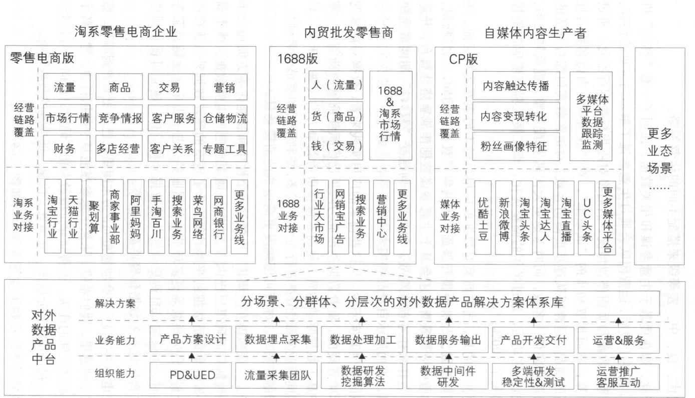

阿里数据中台视角的生意参谋全景图

ωAN

兴辫躏忖阳回阳升辫满刑黑

-tZ

# 16.2 对内数据产昂平台

在阿里巴巴内部,数据分析基本上是所有员工必备的技能。本节主 要介绍阿里巴巴对内数据产品的由来、整体架构,以及它是如何有效支 持内部员工的日常工作的。

# 16.2.1

DT 时代,数据作为商业的"水、电、煤",需要通过各种各样 的"管道"将"水、电、煤"输出给商业、赋能商业,其中数据产品就 类非常重要的"通道",通过数据产品将数据转化为用户更优做决 策和行动的依据。数据产品有多种形态,包括最简单常见的报表(如静 态报表、 Dashboard 等简单统计分析)、多维分析( OLAP 、即席查询分 析等工具型数据产品)、专题分析型数据产品(面向某一类业务场景, 沉淀分析思路)、智能型数据应用产品 (如个性化搜索、推荐、广告定 向推送、精准营销等,这类数据应用产品的发展较为成熟,且大都在数 据外面穿了一层外衣,使非专业的用户并不能直观地感受到它是数据产 品)。本节会重点介绍阿里巴巴赋能企业内部高管和小二的自助报表产 品和商业分析产品。

数据产品的本质是产品,既然是产品,那么首先要回答用户是谁, 用户的痛点是什么,产品要解决用户的哪些痛点,即产品给用户带来的 价值是什么。对于企业内部数据产品,它的用户是公司的员工,包括销 售、 BD 、运营、产品、技术、客服、管理者等多种角色 解决的痛点 是用户对业务发展中的数据监控、问题分析、机会洞察、决策支持等诉 求,提供给用户高效率获取数据、合理分析框架、数据辅助业务决策的 价值。在阿里巴巴内部,针对不同业务、不同层级的用户、不同的使用 场景,会有不同的数据需求,需要对不同业务、不同使用场景的数据需 求进行高度抽象,同时又要深入业务场景,规划设计出既要拓展性强, 又要贴合业务,还要开发效率高的数据产品。

# 16.2.2 产品建设历程

阿里巴巴对数据产品建设不是一蹦而就的,而是伴随着业务、 大数 据行业的高速发展一起成长起来的,整个对内数据产品建设大概经历了 四个阶段。

### 1 临时需求阶段

时间回溯到 左右,当时大数据的概念还未兴起,数据化运 营还未被提及,用户对数据的诉求也很简单,即获取业务现状的基本数 据。当时还没有数据产品的概念,用户诉求主要以临时取数方式满足, 用户需要了解业务基本数据时,提交需求给数据仓库团队,数据工程师 通过编写代码,将数据跑好,再给到用户,基本靠人力在做支持。这个 阶段逐渐积累了数据和业务经验,为后续数据产品的思考和规划积累了 丰富的原始需求。

# 2 . V2.0 自动化报表阶段

到了 <sup>2006</sup> 年,随着业务的不断发展壮大,业务对数据的需求越来 越强烈,数据工程师"人肉"支持效率太低,已经眼不上业务和时代的 发展。基于之前在数据仓库技术、业务支撑方面的经验积累,数据仓库 团队将相似的需求合并同类项的同时总结提炼,并且引人 BI 工具,通 过报表和 Dashboard 的方式将数据需求固化下来,进而实现了自动化。 一次开发可以满足更多的用户,除了表格之外,还有简单的可视化, 但减少了数据仓库团队的重复建设,提高了用户获取数据的效率,还增 强了数据的可读性,让更多人学会使用和分析数据。

当然,严格来说,这个阶段还不算有真正的数据产品,从当时的成 本、效益方面考虑,阿里巴巴数据仓库选择购买微策略的 MSTR 工具, 后来又升级为 BIEE 工具,用于报表和集市的制作。为了方便用户找到 报表,搭建了数据门户,将报表和集市以业务主题的方式进行组织,数 据门户雏形在这个阶段开始出现;发展到后面,用户不断加深对数据价 值的认知,需求越来越精细化和多元化,对数据化运营的期待越来越高,

单纯的报表监控分析已经无法高效满足当时的用户诉求,而且受限于 BIEE 工具,拓展性和报表体验难以提升……但是在这个阶段,建设团 队积累了更丰富的技术和业务经验。基于 ,阿里巴巴数据人已经开始 思考数据产品化之路。

# 自主研发 Bl 工具阶段

<sup>2012</sup> 年年底开始,我们有了真正意义上的数据产品。随着业务 的高速发展,数据维度和数据量增长迅猛,数据需求越来越繁杂和参差 不齐,同时不能靠增加人力来满足,所以急需强大、易用的 BI 工具来

受限于第三方 BI 工具, MST IEE 主要面向的是专业数据人员, 而我们需要能有工具可以面向普通的数据使用人员,满足其自身不同的 需求:当时阿里巴巴已经将大部分数据迁移上云,经典的第三方 具无法直接接人云上的数据。基于上述两个考虑,我们最早构思了一个 "取数机器人"的工具,目的就是想让这个"机器人"帮大家建数据和 获取数据,降低大家对数据需求的成本。围绕这个构思,我们规划落地 了"快门"和"小站"("快门"和"小站"均为内部数据产品名称,仅 限于在阿里巴巴内部使用)。

"快门"的寓意是获取数据可以像相机的快门一样快速、便捷:"小 站"的寓意是方便用户搭建出自己或部门的数据站点。"快门"和"小站" 的定位是间里巴巴内部的 BI 工具。快门端同时支持用户标准模式和 SQL 模式,其中标准模式是拖拉拽的方式,主要针对开发好的集市宽表,支 持"亿级数据,秒级响应",用户只需要拖拉拽,再配置一下简单的 COUNT SUM 就可以获取到自己的数据: SQL 模式更灵活,将 SQ 代码代人 进去,即可生成一张报表,同第二阶段的自动化报表功能类似。小站则 是把快门的报表和外部的数据或页面,以整体的分析思路、可视化(表 格、图表等)和解读(富文本)的方式更好地组织和展示出来。

这个阶段,是真正意义上自主研发数据产品或工具的阶段,是不断 积累业务需求及产品规划和技术的过程,为后续做数据平台打下了坚实 的基础。

### 4 . 数据产品平台

年前后,"快门"和"小站"经过两年时间的打磨,在产品功 能、体验方面都有很好的提升,不仅为淘宝业务提供服务,同时还为 个阿里巴巴电商业务提供服务,在整个阿里巴巴集团都有一定

的影响力

随着业务的发展,很多垂直业务的数据团队合并,规避重复建设, 更好地形成合力,提升效能:同时业务对数据的诉求越来越精细化和多 元化,除了使用 工具方便获取数据,做数据日常监控之外,还需要 将特定业务场景的分析思路固化下来,沉淀在产品里,以自动化来替换 分析师的"人肉"分析,同时需要把业务数据应用到线上。比如众所周 知的个性化搜索和推荐、精准营销、选晶选商、搭建专场、数据效果跟 踪等一整套闭环分析需求……所以对平台化的思考越来越清晰,"阿里 数据平台"应运而生,目的是为阿里巴巴内部用户打造 站式数据获取、 数据分析、数据应用的数据产品平台。同时随着无线发展的大趋势,随 时随地掌握数据的需求也越来越明显,所以阿里数据平台在 开始就布 局了 版和 版的规划。

年开始,数据产品可谓百花齐放。例如,"双门"大促,需要 实时数据监控分析,不仅仅是对大盘的监控,还要有对各个会场、商家 商品的实时流量和成交的监控,以便调整资源和调配流量分配。对于这 需求,传统的数据仓库离线计算是满足不了的。为了更好地解决这类需求, 我们突破传统数据仓库的边界,研究业界前沿的流计算技术,同时规划 设计直播类产品,不仅覆盖了实时交易,还有实时流量,从大盘到行业 再到会场、商家、商品各个维度:同时产品从淘宝业务逐步拓宽到阿 巴巴电商的所有业务,实时指导大促各个层级用户的数据化运营。

再如,互联网公司对网站流量分析是运营最基本的诉求,运营需要 了解当日访问页面的流量、何时访问量最高、每个位置的点击效果与引 流效果等。针对流量分析,我们规划设计了类似于 的流量分析产品, 但定位眼 不同,其不只是流量分析的通用分析产品,覆盖了 流量基础统计分析的功能,同时还是阿里巴巴电商流 引导转化深度 析的产品,将流量数据同交易引导转化数据打通,让运营更有抓手。

在这个阶段,我们根据不同的业务场景,规划落地了较多场景化或

专题类的分析型数据产品,这类产品的适用场景和用户非常聚焦,除了 解决数据获取效率之外,还提供了特定业务场景的分析思路,使数据价 值更加突显。

针对众所周知的个性化搜索和推荐、精准营销、选品选商、搭建专 场、数据效果眼踪等一整套闭环分析需求,我们规划设计了对内使用的 应用分析产品,不仅能够通过勾选条件筛选出目标数据,同时还能够做 自助分析,调整条件满足需求后直接对接前台应用系统,实现个性化、 精准营销、选品选商、搭建专场的需求。

这个阶段还在继续探索中,日渐丰富和复杂的业务场景也对产品提 出了更高的要求,产品之间如何打通,是当前我们在设计和规划数据产 品中着重思考和突破的地方。

# 16.2.3 整体架构介绍

16.2.2 节中,介绍了阿里巴巴对内数据产品的四个发展阶段,本 节会详细介绍第四阶段(也是当前阶段)的平台和产品架构,以让读者 对阿里巴巴对内数据产品有更深入的认识。

对于数据产品,数据一直都是产品的核心和生命力,数据质量和数 据安全是数据产品最基础的要求,如果一款数据产品提供的数据不准, 那么对使用产品的用户来说是灾难性的,甚至会根据数据产品得出完全 错误的结论,进而影响业务决策。

数据安全管理在阿里巴巴内部是非常严格的,所以数据权限管控的 重要性不言而喻。阿里巴巴对内数据产品基于阿里数据公共层,数据公 共层在数据准确性方面投人了很多精力,同时有一整套指标算法统一和 研发工具来保障,取得了非常不错的成果。这部分内容在数据模型建设、 数据加工处理环节已经详细阐述,这里也不再赘述。

阿里巴巴对内数据产品平台,即阿里数据平台,包括 版和 PP 版,共有四个层次,即数据监控、专题分析、应用分析和数据决策,如 16.5 所示。

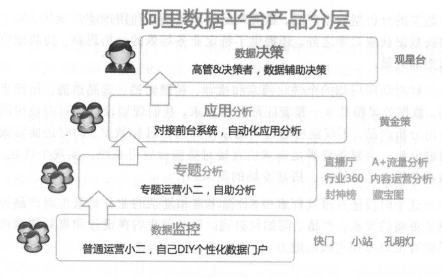

阿里数据予台整体架构图

### 1 数据监控

对于所有内部普通运营小二,都有查看或分析业务数据的需求,阿 里数据平台提供最基础的报表工具,供用户自助取数、多维分析、 个性化数据门户。这块对应的产品主要是我们自主研发的 工具,同 时我们还在研发一款基于 工具 一孔明灯,除了服务 内部之外,还可以将内部的 工具能力对外输出给阿里巴巴的商家和 合作伙伴使用。

# 专题分析

对于专题运营小二,如行业运营小二,对类目有强烈的分析诉求, 按照分析师沉淀的成熟分析思路组织数据,实现行业运营小 自助分析 行业异动原因,发现行业潜在机会,实现"人人都是分析师",提高数 据化运营的效率和质量。这块对应的产品主要有实时直播分析产品,可 以根据实时数据调整资源及流量分配:行业 体化分析产品,从行业视 角提供行业 度的数据,同时沉淀行业分析思路 流量分析产品,从 流量的角度提供流量相关数据,包括对站点、页面、区块、位置的浏览,

些~

曝光、点击分布,以及获得资源位的活动技放等数据。

# 3. 应用分析

对于很多业务系统的流程,数据是其中不可缺少的一环,通过对接 前台系统,实现数据的自动化。比如日常营销活动运营,需要选品选商、 搭建专场,那么如何选商选品,以及选择什么样的商家和商品,对整个 活动非常重要,完全人工筛选在效率上会受到很大制约。为解决此问题, 我们提供了专门产品来完成系统对接,不只是数据的对接,同时也包含 产品交互间的打通。这一产品不仅能够通过勾选条件筛选出目标数据, 同时还能够做自助分析,调整条件满足需求后直接对接前台应用系统 实现个性化、精准营销、选品选商、搭建专场的需求。

# 数据决策

对于高管和决策者,既需要宏观的业务数据,又需要可下沉的数据 还需要丰富的趋势数据来辅助决策,需要通过数据了解业务进展、当前 进展是否合理、接下来的业务方向等,针对此类需求提供定制化的数据 产品供决策参考,为高管提供宏观决策分析支撑平台 ,分析历史数据规 律,预测未来发展趋势,洞察全行业动态。

随着阿里巴巴业务的发展、新技术的引人,对内数据产品势必会不 断迭代,去探索更多、更新的数据价值,更高效地开发数据产品。未来, 对内数据产品平台的发展会重点在两个方面进行突破: 一方面,把 BI 工具等工具型产品功能做强做大,不仅可以做报表,还可以做出专题分 析型产品,在有限的研发资源下,更高效地实现数据产品;另一方面, 在应用型数据产品上做更多的探索,赋能业务数据化的运营。

# 本书插图案引

|     | 章总述·                             |
|-----|----------------------------------|
|     | 阿里巴巴大数据系统体系架构图…                  |
|     | 篇数据技术篇                           |
|     | ……… g<br>…<br>章日志采集              |
| 2.  | 次典型的互联网页 面请求-                    |
|     | 10<br>•<br>…<br>响应过程……           |
| 2.2 | 阿里巴巴页面浏览日志采集                     |
|     | 13<br>-… …<br>方案流程框架…·           |
| 2.3 | ·2 1<br>Native<br>HS<br>日志桥接示意图  |
| 2.4 | 数据处理全链路…………········27            |
|     |                                  |
|     | ……·················29<br>章数据同步·· |
| 3.1 | …· ·30<br>直连同步示意图……··            |
| 3.2 | …… 31<br>数据文件同步示意图               |
| 3.3 | 数据库日志解析同步示意国…<br>········32      |
| .4  | DataX 可接入的数据源 … ••36             |
| 3.5 | ·37<br>…·<br>…<br>DataX 架构设计图    |
| 3.6 | ·3g<br>TimeTunne<br>实时数据传输示意图    |
|     | … ··40<br>•<br>…<br>分库分表处理       |
|     | TDDL<br>布式数据库访问引擎… 40            |

|      | ………············48<br>章离线搬据开发·   |
|------|---------------------------------|
| 4.1  | … 50<br>MaxCompute 体系架构图·       |
|      | 53<br>…<br>…<br>开发工作流囱…………·     |
| 4.3  | 对应于开发工作流的产品和工具 54               |
| .4   | ……… 55<br>SQLSCAN 工作流程阁 ··      |
| 4.5  | ………·…56<br>DQ<br>工作流程阁··        |
| 4.6  | 使用在彼岸进行国归测试流程图… 58              |
| 4.7  | "<br>调度任务关系依赖阁··                |
| 4.8  | 数据开发流程与调度系统                     |
|      | ……. 60<br><br><br><br>的关系阁,     |
| 4.9  | 任务状态机模型关系阁,…… 61                |
| 4.   | 工作流状态机模型关系囱……… 62               |
| 4.11 | 调度引嗦工作原理示意国…············63      |
| 4.   | 执行引喂迦辅架构 到…···63                |
|      | •68<br>•<br>…<br>…<br>章实时技术·    |
| .1   | 数据丘捕大屏 ………… … ··········69      |
| 5.2  | -…·  •72<br>-<br>流式技术架构阁·       |
| 5.3  | 消息系统与数据中 faH牛、                  |
|      | .  ·74<br><br>数据斥之间的关系…         |
| 5.4  | ll·t<br>HJ 的整个拓扑约构阁…·········75 |
| 5.5  | 82<br>……··-…···········<br>数仰流向 |

# 5.6 多流关联示j7rj …· …… "'83 强保障数据多链路冗余示意图 •8 房容灾示意图· • ……<sup>89</sup> 章蚊据服务.......... .. ... .. .... .. .. .. .... …… 6. 阿里数据服务架构演进过程·· ··归 6.2 DWSO 架构示意图…· ... "" 92 6.3 OpenAPl 架构示意图 ………" 6.4 martD 架构示意图............. .. .… 6.5 的数据服务层( OneService) 架构示意图……........ ............ .. .. …"' 96 6.6 martD 的元数据模型架构 示意阁 , .... .. . … <sup>97</sup> 6.7 Sm rtD 架构示意图 … ·•· ... •98 6.8 iPu 应用架构示意图 •• …" <sup>100</sup> 6.9 eg 应用架构示意图 ….. .. .. .….... IOI 6. <sup>10</sup> uT mi ng 应用架构示意图 …"" <sup>102</sup> 场景 .. .. . . . …" <sup>104</sup> 6. 场景 .... . .. .. …... <sup>104</sup> 查询拆分 - … … … <sup>105</sup> 6. 14 主处理模块处理步骤............ .....… 107 6. <sup>15</sup> 使用级存流程图 ........…… …· 108 .1 REPLACE 语法 ……......… ·· 109 |到 .1 不同应用环境下的 套元数据 112 章搬据挖掘'............….........…........ .. ..…· JI 6 7. MaxCompute MP 处理流程图·· 118 阿里巴巴数据挖掘中台- … · 121 7.3 常见的数据挖掘应用 … "" 123 篇数据模型篇 章大数据领域建模综述 … … 130 8. Data ult 模型实例,............ .... .. ... 135 8.2 Anchor 模型阁.........………....... .. ....... 136 阿里巴巴数据整合及管理体系 ·· 138 9. 体系架构阁 …… "" <sup>139</sup> 9.2 规范定义实例………· <sup>140</sup> 9.3 l~ 生指标........ .….. .. .………· "142 9.4 业务过程命名示例….......... ... "143

# 附录 本书插图索引寸

|  |       | 原子指标详<br>…<br>143                     |
|--|-------|---------------------------------------|
|  |       | 派生指标命名示例…·<br>"" "' 144               |
|  |       | …………147<br>派生指标示                      |
|  |       | 派生指标示<br>·· ·· ···· ·· ·· ·· ………… 147 |
|  |       | 模型层次关系图 ………<br>"" 149<br>             |
|  | 9.10  | ……<br>. 150<br>模型架构图 ··               |
|  | 9.11  | ………"<br>实施工作流 ··<br>155               |
|  |       | ………… 159<br>10 章维度设计-                 |
|  | IO    | 规范化处理淘宝商品维度                           |
|  |       | "" 164<br>现的形式 ……   .…·               |
|  | 10    | 反规范化处理淘宝商品维度                          |
|  |       | 形式<br>""<br><br>所表现<br>165            |
|  | 10.3  | ………<br>淘宝交易事实表维度<br>179               |
|  | 10.4  | 类目维度  ……<br><br>181                   |
|  | 10.5  | 类自   .…………<br>183<br>……<br>·山··       |
|  | 10    | ……·<br>类目 树…………<br>183                |
|  | 10.   | 采用多字段方式<br>理多值维度<br>186               |
|  | 10.8  | 采用桥接表方式多现多值维度<br>"1 87                |
|  | 10    | 信息示例<br>淘宝商品 SKU<br>187               |
|  | IO.IO | 卖家主营类目维度设计      I88                   |
|  | 10.   | 杂项维度 …· …          I89                |
|  |       | ……<br>11 章事实表设计<br>I90<br>            |
|  | I. I  | 淘宝交易订单的流转过程 ………· I94                  |
|  |       | "' 198<br>父子订单合并成一条记录 …·              |
|  | 1.3   | "" 198<br>父子<br>开成多条记录                |
|  | 11.4  | 淘宝交易事务事实表                             |
|  |       | •<br>…<br>199<br>(确定维度)               |
|  | 1.5   | 冗余维度的淘宝交易                             |
|  |       | 事务事实表            …·200                |
|  | 1.6   | I688 交易订单下单事务事实'表<br>20I              |
|  |       | 1688 交易<br>单支付事务事实表"<br>20I           |
|  | 1.8   | …"<br>' 202<br>I688 交易订单详情实           |
|  | 11.9  | 1688 交易订单下单事务                         |
|  |       | 事实表数据实例 ……""<br>"""<br>202            |
|  | I.IO  | 单支付事务<br>交易<br>I68                    |
|  |       | 事实表数据实例<br>· 202<br><br>              |
|  | I. II | "" ·204<br>淘宝交易多事务事实'表-               |

-寸大数据之路一一阿里巴巴大数据实践

|    | 1.12   | 淘宝交易订单详情实例··<br>•204                      |
|----|--------|-------------------------------------------|
|    | 1.13   | 淘宝交易多事务事实表                                |
|    |        | ……<br>…<br>数据实例<br>········ 204           |
|    | 1.14   | … ·206<br>…<br>收藏商品明细-                    |
|    | 阁门 .15 | 收藏商品事务事实表数据实例 ·206                        |
|    | 1.16   | 淘宝交易卖家快照事实表<br>·211                       |
|    | 17     | 淘宝卖家历史至今快照事实表 ·2 13                       |
|    | 1.18   | 淘宝商品历史至今快!照事实表… 214                       |
|    | 1.19   | 淘宝买卖家历史至今快照                               |
|    |        | ……<br>… ···· ·················2 14<br>事实表 |
|    | 1.20   | 卖家好中差评以及星级 …·<br>·215                     |
|    | 1.21   | …·<br>••<br>卖家 DSR i!平分<br>·215           |
|    | 1.22   | 淘宝卖家信用分和 DSR                              |
|    |        | …·<br>快照事实表…<br>·216                      |
|    | 1.23   | 淘宝好中差评快照事实表<br>217                        |
|    | 1.24   | 淘宝交易累积快照事实表                               |
|    |        | ··220<br>(确定事实前)… …                       |
|    | .25    | 沟宝交易累积快照事实表                               |
|    |        | ••<br>…<br>…<br>·22 1<br>(确定事实后)          |
|    | 1.26   | …<br>淘宝交易事务事实表·<br>231                    |
|    | .27    | 按商品聚集的星形模型… 232                           |
|    | .28    | 232<br>按卖家聚集的星形模型                         |
|    | .29    | 按卖家、买家、商品聚集                               |
|    |        | 的星形模型…<br>…<br>233                        |
|    | 1.30   | 级类目聚集的星形模型<br>·234                        |
|    |        | 篇数据管理篇                                    |
|    |        | -……<br>章元数据…<br>236                       |
| 12 |        |                                           |
|    | 12     | …<br>元数据体系建设思路图<br>•238                   |
|    | 12 2   | …<br>Data Profile<br>240                  |
|    | 12.3   | 驱动 ETL 开发示意图……<br>•243                    |
| 13 |        | …<br>·245<br>董计算管理                        |
|    | 13.1   | 优化器各模块协调工作图<br><br>·250                   |
|    | 13 .2  | Volcano Planner 工作原理图 ·253                |

|  | 13 .3  | TPC-H 测试对比图…<br><br>····255           |
|--|--------|---------------------------------------|
|  | 13.4   | SQνMR tE MaxCompute 中的                |
|  |        | …………256<br>细分步骤                       |
|  | 13.5   | Map 端的两个主要过程示意图… 257                  |
|  | 13.6   | )………<br>LogView 日志(<br>···· 259       |
|  | 13     | ……  261<br>LogView 日志(                |
|  | 13.    | Reduce 阶段的执行过程 •262<br>Map            |
|  | 13.9   | Fuxi Task 的详细执行信息…… 263               |
|  | 13.10  | Instance 读入的数据盎<br>·· ············263 |
|  | 13.1 [ | 在多种时间范围内分终端                           |
|  |        | 统计买家数和商品数代码…… 271                     |
|  | 13.12  | LogView 日志<br>•<br>•271<br>…          |
|  |        | 13 日整体运行的<br>·273<br>LogView 日志·      |
|  |        | 14 章存储和成本管理-<br>…<br>…<br>275         |
|  | 14.    | 数据霆分布方法…<br>…<br>· 277                |
|  | 14 .2  | 要流程囱  •278<br>存储治理项优化                 |
|  | 14 .3  | MaxCompute 数据表依赖                      |
|  |        | 意图…<br>•<br>…<br>…<br>关系<br>··282     |
|  | 14.4   | 意图<br>·283<br>数据刷新链路                  |
|  |        | 15 章数据质<br>….<br>··········285        |
|  | 15. I  | 数据质量保障原则-<br>…<br>··286               |
|  | 15.2   | 数据质量建设方法·<br>…<br>••288               |
|  | 15.3   | 数据流转过程<br>……··················291     |
|  | 5.4    | ··292<br>生意参谋产品打标过程…·                 |
|  |        | 篇数据应用篇                                |
|  |        | 16 章数据应用<br>••304<br><br><br>         |
|  | 16.    | 品理念图·<br><br>生意参谋<br>····306          |
|  | 6.2    | 生意参谋功能架构图…<br>•307                    |
|  |        |                                       |

| 16 .3 | 阿里数据中台顶层设计阁……·······310 |
|-------|-------------------------|
| 16.4  | 阿里数据中台视角的生意             |
|       | …<br>…<br>参谋全景图<br>312  |
| 16.   | 阿里数据平台整体架构图··  318      |

# 吁书分享


《尽在双竹·阿里巴巴技术演进与超越》 ISBN 978-7-才 才- 30917-5 阿里巴巴集团双 技术团队着 精炼揭秘双 八年技术演进夫


《技术之踵阿里巴巴技术笔试心得》 ISBN 978-7-121-29933-9 阿里巴巴集团校园招聘笔试项目组著 进击阿里巴巴技术岗的精准指南


《机器学习在线.解析阿里云机器学习平台》 ISBN 978-7-12 -3 869-6

永不掉线的机器学习实践库,助你快速掌握


《大数据之路·阿里巴巴大数据实践》 ISBN 978-7-121-3 438-4 阿里巴巴数据技术及产昂部着

阿里巴巴分享对大数据的认知、与世界共创 数据智能的重要基石。


本书策划编辑:张彦红(出版喜洋洋) 邮箱: zhanghong@phei com cn 欢迎准作者咨询写书、出版事宜 欢迎读者反馈、交流

BIOadview 博文视点· IT 出版旗舰晶牌

www.l>roodvle com.en 技术凝聚实力 专业创新出版


数据技术篇 曰志采集 离线数据开发 数据服务

数据模型篇 大数据领域建模综述 维度设计

实时技术 数据拮据

数据同步

阿里巴巴数据整合及管理体系 事实表设计

数据管理篇 元数据 存{诸军口成本管理

计算管理 数据质

数据应用篇 生意

对内数据产昂平台

眩'昆主岳重知识点目录+插图索引 '翩翩础理精1e.\绘制139张流程与架构示意插图


眩目lj 堕骂一~~博文视点Broadv ew

|      | 寸策划编辑:张彦红   |  |
|------|-------------|--|
| 昌亘:; | 责任编辑:葛娜     |  |
|      | ===¥封面设计:李玲 |  |


